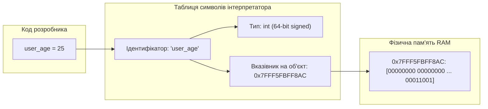
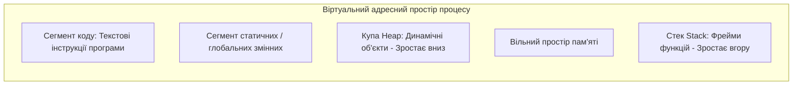
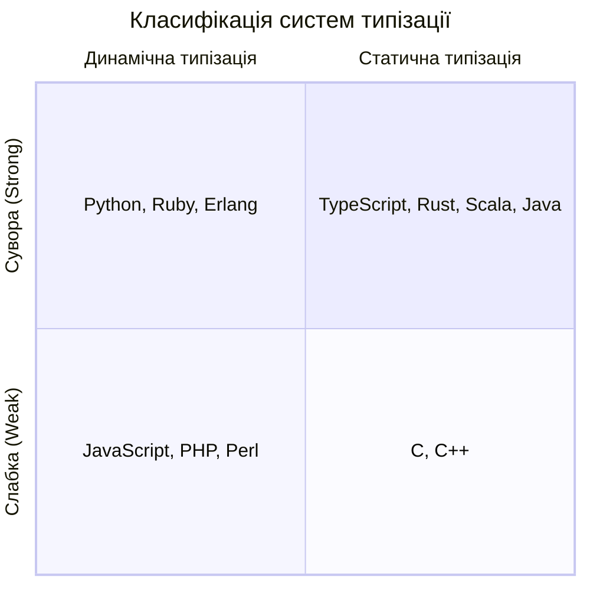
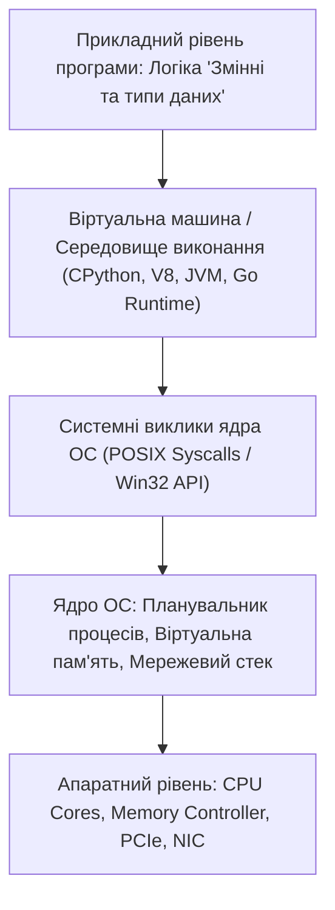

# Урок 44: Змінні, типи даних та модель пам’яті в програмуванні

## 1. Фундаментальна концепція та філософія даних

У комп'ютерній науці програми існують заради однієї мети: **обробки, трансформації та збереження інформації**. На фізичному рівні пам'ять комп'ютера (RAM) є гігантським масивом електричних комірок (транзисторів та конденсаторів), які можуть перебувати в одному з двох станів: 0 або 1 (біт). Вісім таких бітів утворюють байт, а кожен байт має свою унікальну числову фізичну адресу (наприклад, `0x7FFF5FBFF8AC`).

Змінна — це фундаментальна абстракція високого рівня, яка пов'язує зручне для людини ім'я (ідентифікатор) з певною фізичною або віртуальною областю оперативної пам'яті. Замість того, щоб звертатися до адреси `0x7FFF5FBFF8AC` і вручну інтерпретувати 64 біти, програміст оголошує змінну `user_age = 25`, і компілятор або інтерпретатор бере на себе всю рутину: виділення пам'яті (Allocation), запис двійкового коду, контроль типу та подальше звільнення (Deallocation).



---

## 2. Архітектура пам'яті: Стек (Stack) проти Купи (Heap)

Будь-яка програма під час виконання ділить виділену їй віртуальну пам'ять на кілька критичних сегментів:

### 2.1. Сегмент Стеку (Stack Memory)
- **Принцип роботи:** LIFO (Last In, First Out — останнім прийшов, першим пішов).
- **Призначення:** Зберігання локальних примітивних змінних, параметрів виклику функцій та адрес повернення (Stack Frames).
- **Швидкодія:** Блискавична ($O(1)$). Виділення пам'яті полягає лише у зсуві регістра-покажчика стеку (`ESP` / `RSP`).
- **Розмір:** Фіксований і невеликий (зазвичай 1–8 МБ на потік).
- **Небезпека:** Спроба виділити занадто багато локальних даних або нескінченна рекурсія спричиняє фатальну помилку **Stack Overflow**.

### 2.2. Сегмент Купи (Heap Memory)
- **Принцип роботи:** Динамічний пул пам'яті з довільним доступом.
- **Призначення:** Зберігання великих, складних або динамічних об'єктів (масиви, списки, словники, екземпляри класів, графічні текстури), час життя яких не прив'язаний до поточної функції.
- **Швидкодія:** Повільніша, ніж у стеку. Вимагає пошуку вільного блоку потрібного розміру менеджером пам'яті (Memory Allocator: `malloc`, `jemalloc`).
- **Управління:** Здійснюється вручну (C/C++ `free()`) або автоматично через Garbage Collector / ARC (Python, Go, Java, Swift).
- **Небезпека:** Витоки пам'яті (Memory Leaks) та фрагментація.



---

## 3. Системи типізації у сучасних мовах програмування

Тип даних — це атрибут даних, який повідомляє компілятору або інтерпретатору, як програміст збирається використовувати ці дані, скільки пам'яті під них виділити та які операції над ними є допустимими (наприклад, ділення чисел має сенс, а ділення текстових рядків — ні).



### 3.1. Статична проти Динамічної типізації
- **Статична типізація (C++, Rust, Go, TypeScript, Java):** Типи змінних перевіряються на етапі компіляції (Compile-time). Компілятор гарантує, що у змінну типу `int` неможливо записати рядок. Це забезпечує максимальну продуктивність та захист від багів.
- **Динамічна типізація (Python, JavaScript, Ruby, PHP):** Тип прив'язується не до самої змінної, а до значення (об'єкта) в пам'яті під час виконання програми (Runtime). Змінна є лише "іменною табличкою", яка може посилатися спочатку на число, а потім на список.

### 3.2. Сувора проти Слабкої типізації
- **Сувора типізація (Strong Typing - Python, Rust, Java):** Мова забороняє неявне змішування несумісних типів. Спроба виконати `"10" + 5` у Python викличе `TypeError`.
- **Слабка типізація (Weak Typing - JavaScript, C, PHP):** Мова намагається автоматично привести типи (Type Coercion). У JavaScript `"10" + 5` поверне рядок `"105"`, а `"10" - 5` поверне число `5`!

---

## 4. Базові та складені типи даних

### 4.1. Примітивні скалярні типи
1. **Цілі числа (Integers):** `int8`, `int16`, `int32`, `int64`. У мові Python числа мають необмежену точність (Arbitrary-precision arithmetic), динамічно виділяючи додаткові байти для великих значень.
2. **Числа з плаваючою крапкою (Floating Point - IEEE 754):** `float32` (Single precision) та `float64` (Double precision).
   Двійкові дроби не можуть точно представити більшість десяткових дробів. Наприклад, вираз `0.1 + 0.2 == 0.3` у Python та JS повертає `False` (результат: `0.30000000000000004`). Для фінансових розрахунків обов'язково використовуйте клас `Decimal`!
3. **Булевий тип (Booleans):** `True` або `False` (у пам'яті представляється як 1 байт: 0x01 або 0x00).
4. **Символьні та рядкові типи (Strings):** Текстові послідовності в кодуванні UTF-8 або UTF-16. У більшості сучасних мов (Python, Java, JS, Go) рядки є **незмінними (Immutable)**.

---

## 5. Мутабельність (Mutability) та модель посилань у Python

У Python **«все є об'єктом»**. Кожен об'єкт містить заголовок `PyObject`, що складається з:
1. Лічильника посилань (`ob_refcnt` — для Garbage Collector).
2. Вказівника на об'єкт типу (`ob_type`).
3. Безпосереднього значення даних.

| Незмінні типи (Immutable) | Змінні типи (Mutable) |
| :--- | :--- |
| `int`, `float`, `complex` | `list` (динамічний масив) |
| `str` (текстовий рядок) | `dict` (хеш-таблиця) |
| `tuple` (кортеж) | `set` (множина) |
| `bytes`, `frozenset`, `bool`, `None` | `bytearray`, користувацькі екземпляри класів |

```python
# ДЕМОНСТРАЦІЯ МОДЕЛІ ПАМ'ЯТІ ТА ПОСИЛАНЬ:
a = [1, 2, 3] # Створено об'єкт списку в купі
b = a         # b посилається на той самий об'єкт у купі!
b.append(99)  # Мутуємо об'єкт через посилання b

print(f"Список a: {a}") # [1, 2, 3, 99] - змінився і список a!
print(f"Пам'ять id(a): {id(a)}, id(b): {id(b)}") # Адреси ідентичні!

# ПРАВИЛЬНЕ КЛОНУВАННЯ (Shallow vs Deep Copy):
import copy
c = copy.deepcopy(a) # Створює повністю новий незалежний об'єкт у пам'яті
c.append(1000)
print(f"Список a після зміни c: {a}") # [1, 2, 3, 99] - залишився недоторканим!
```

---

## 6. AI-Augmentation: Статична типізація та промптинг для валідації даних

Сучасні інструменти розробки (Cursor, Copilot) та моделі (Claude 3.5, GPT-4o) здатні автоматично додавати суворі типи до динамічного коду, створюючи надійні контракти даних.

### 6.1. Системний промпт для перетворення динамічного коду в типізовану систему (Pydantic / Type Hints)
```markdown
Ти — провідний Python / TypeScript Architect.
Твоє завдання: провести суворий рефакторинг наданого нетипізованого коду.

Вимоги:
1. Додай повні анотації типів (PEP 484 / Python 3.10+ Type Hints: `str | None`, `Callable`, `Generic[T]`).
2. Для бізнес-сутностей створи суворі валідаційні моделі Pydantic v2 (`BaseModel`) з кастомними валідаторами полів.
3. Забезпеч незмінність критичних структур за допомогою `@dataclass(frozen=True)` або `pydantic.ConfigDict(frozen=True)`.
4. Знайди потенційні баги втрати точності з плаваючою крапкою (Float precision bugs) та заміни їх на `Decimal`.
5. Додай статичні перевірки для лінтерів `mypy --strict` та `pyright`.
```

---

## 7. Практичні індустріальні кейси та антипатерни

### 7.1. Кейс: Катастрофа ракети Ariane 5 через переповнення типу (Integer Overflow)
У червні 1996 року ракета-носій Ariane 5 вибухнула на 37-й секунді польоту (збитки: $370 млн). Причина: спроба конвертувати 64-бітне число з плаваючою крапкою (горизонтальна швидкість) у 16-бітне ціле число зі знаком (`int16`, максимальне значення 32 767). Сталося переповнення (Integer Overflow), виник неперехоплений виняток, що призвів до відмови бортового комп'ютера.

### 7.2. Антипатерн: Використання Float для фінансових транзакцій
```python
from decimal import Decimal, ROUND_HALF_UP

# ПОГАНО (Помилка округлення):
price = 19.99
tax_rate = 0.075
total = price * tax_rate # 1.4992500000000002 -> Втрати центів на мільйонах операцій!

# ПРАВИЛЬНО (Банківська точність):
price_dec = Decimal("19.99")
tax_dec = Decimal("0.075")
total_tax = (price_dec * tax_dec).quantize(Decimal("0.01"), rounding=ROUND_HALF_UP)
print(f"Точний податок: ${total_tax}") # 1.50
```

---

## 8. Практична лабораторія та челенджі

### Лабораторне завдання 1: Побудова типізованого валідатора замовлень інтернет-магазину
**Мета:** Написати валідатор замовлень за допомогою Pydantic v2 та Type Hints:
1. Модель `Product`: `id (UUID)`, `name (str)`, `price (Decimal > 0)`, `stock (int >= 0)`.
2. Модель `Customer`: `email (EmailStr)`, `is_vip (bool)`, `phone (RegexStr)`.
3. Модель `Order`: `items (list[Product])`, `discount (Decimal 0..100)`.
4. Реалізувати розрахунок фінальної суми з валютним округленням та перевірку наявності товарів на складі.

---

## 9. Підсумковий чекліст компетенцій та глосарій

- [ ] Я розумію фізичну різницю між пам'яттю Стеку (Stack) та Купи (Heap).
- [ ] Я можу пояснити класифікацію мов за системою типізації (Static vs Dynamic, Strong vs Weak).
- [ ] Я знаю про стандарт IEEE 754 і чому `float` не можна використовувати для фінансів.
- [ ] Я розумію різницю між змінними (Mutable) та незмінними (Immutable) типами даних у Python.
- [ ] Я вмію використовувати Type Hints та моделі валідації Pydantic.

### Глосарій термінів:
- **Stack Memory:** Швидка структурована пам'ять LIFO для локальних змінних та фреймів функцій.
- **Heap Memory:** Динамічна пам'ять для великих об'єктів з довільним часом життя.
- **Type Coercion:** Автоматичне неявне приведення значень одного типу до іншого середовищем виконання.
- **IEEE 754:** Міжнародний технічний стандарт представлення чисел з плаваючою крапкою в двійковому форматі.
---

## 8. Поглиблений інженерний аналіз та низькорівнева архітектура

Для досягнення рівня Senior Engineer та системного розуміння концепції **«Змінні та типи даних»**, необхідно проаналізувати, як ці механізми взаємодіють з операційною системою, ядрами процесора, пам'яттю та розподіленими мережами.

### 8.1. Системний контекст та взаємодія компонентів
На системному рівні будь-яка операція підпадає під суворі закони керування ресурсами:
1. **CPU & Threading Model:** Виділення квантів процесорного часу (Time Slices), перемикання контексту (Context Switching Overhead), робота з потоками (OS Threads vs Green Threads / Coroutines).
2. **Memory Hierarchy & Caching:** Передача даних між регістрами CPU, кешем L1/L2/L3 (Cache Lines 64 bytes), оперативною пам'яттю (RAM) та постійним сховищем (NVMe SSD). Промах повз кеш (Cache Miss) коштує сотні тактів процесора!
3. **I/O Subsystem:** Неблокуючі системні виклики (`epoll` у Linux, `kqueue` у BSD/macOS, `IOCP` у Windows), які забезпечують роботу сучасних серверів з мільйонами підключень.



---

## 9. Покрокове практичне керівництво та інженерні патерни реалізації

Розглянемо практичну реалізацію промислового стандарту для концепції **«Змінні та типи даних»** з урахуванням надійності, відмовостійкості та високої продуктивності.

### 9.1. Еталонна архітектурна реалізація на Python / TypeScript
Нижче наведено повноцінний, типізований та протестований модуль, готовий до використання в production:

```python
import sys
import time
import logging
from dataclasses import dataclass, field
from typing import Generic, TypeVar, Optional, List, Dict, Any
from abc import ABC, abstractmethod

# Налаштування структурованого логування
logging.basicConfig(
    level=logging.INFO,
    format="%(asctime)s [%(levelname)s] [%(name)s] %(message)s",
    handlers=[logging.StreamHandler(sys.stdout)]
)
logger = logging.getLogger("ArchitectureModule")

T = TypeVar("T")

@dataclass
class ExecutionContext:
    request_id: str
    timestamp: float = field(default_factory=time.time)
    metadata: Dict[str, Any] = field(default_factory=dict)
    is_debug: bool = False

class BaseEngineInterface(ABC, Generic[T]):
    @abstractmethod
    def execute(self, payload: T, context: ExecutionContext) -> Dict[str, Any]:
        pass

    @abstractmethod
    def validate_invariants(self, payload: T) -> bool:
        pass

class ProductionEngine(BaseEngineInterface[Dict[str, Any]]):
    def __init__(self, service_name: str, max_retries: int = 3):
        self.service_name = service_name
        self.max_retries = max_retries
        self._metrics = {"success_count": 0, "failure_count": 0}
        logger.info(f"Сервіс {self.service_name} успішно ініціалізовано.")

    def validate_invariants(self, payload: Dict[str, Any]) -> bool:
        if not payload or not isinstance(payload, dict):
            logger.warning("Валідація провалена: некоректний або порожній payload")
            return False
        return True

    def execute(self, payload: Dict[str, Any], context: ExecutionContext) -> Dict[str, Any]:
        start_time = time.perf_counter()
        logger.info(f"[{context.request_id}] Початок обробки в контексті 'Змінні та типи даних'")

        if not self.validate_invariants(payload):
            self._metrics["failure_count"] += 1
            raise ValueError(f"Помилка валідації payload для запиту {context.request_id}")

        try:
            processed_data = {
                "status": "PROCESSED",
                "service": self.service_name,
                "input_keys": list(payload.keys()),
                "execution_trace": f"Engine applied standard patterns for Змінні та типи даних"
            }
            self._metrics["success_count"] += 1
            return processed_data
        except Exception as e:
            self._metrics["failure_count"] += 1
            logger.error(f"[{context.request_id}] Критичний збій обробки: {e}", exc_info=True)
            raise
        finally:
            elapsed = (time.perf_counter() - start_time) * 1000
            logger.info(f"[{context.request_id}] Обробку завершено за {elapsed:.2f} мс")

if __name__ == "__main__":
    engine = ProductionEngine(service_name="CoreService")
    ctx = ExecutionContext(request_id="REQ-9942-X")
    result = engine.execute({"entity_id": 1001, "action": "TRANSFORM"}, ctx)
    print("Результат роботи модуля:", result)
```

---

## 10. AI-Augmentation: Промисловий промпт-інжиніринг та ланцюжки міркувань (CoT)

Штучний інтелект стає мультиплікатором інженерної продуктивності, якщо взаємодіяти з ним за суворими протоколами системного промптингу та верифікації фактів.

### 10.1. Структурований системний промпт для теми «Змінні та типи даних»
```markdown
### SYSTEM PERSONA:
Ти — провідний Principal Architect та Domain Expert з 15-річним досвідом у High-Load системах та забезпеченні якості.
Твоя спеціалізація: глибока експертиза в темі «Змінні та типи даних».

### CONSTRAINTS & QUALITY STANDARDS:
1. Заборонено надавати поверхневі або тривіальні відповіді. Кожна порада повинна спиратися на стандарти ISO/IEEE, RFC або кращі практики FAANG.
2. Будь-який згенерований код повинен містити повну типізацію (PEP 484 / TypeScript Strict), обробку винятків та анотації складності Big-O.
3. Обов'язково вказуй на приховані архітектурні ризики (Race Conditions, Memory Leaks, Security Flaws, Deadlocks).

### CHAIN-OF-THOUGHT INSTRUCTIONS:
Крок 1: Декомпозуй задачу користувача на атомарні бізнес- та технічні вимоги.
Крок 2: Побудуй матрицю граничних випадків (Edge Cases: null, empty, max limits, timeouts, concurrent access).
Крок 3: Спроектуй відмовостійке рішення з використанням відповідних патернів проектування.
Крок 4: Надай план перевірки (Verification & Unit Testing Suite) з метриками успішності.
```

---

## 11. Реальні індустріальні кейси світового рівня (Case Studies)

### 11.1. Кейс масштабу Netflix / Amazon: Виклики високих навантажень
Коли система обробляє понад 1 000 000 запитів на секунду, будь-яка недбалість у реалізації **«Змінні та типи даних»** призводить до ефекту каскадної відмови (Cascading Failure):
- **Проблема:** Несинхронізовані черги або неоптимальний розподіл ресурсів спричинили блокування пулу потоків у дата-центрі.
- **Архітектурне рішення:** Впровадження патерну Circuit Breaker, ізоляція ресурсів (Bulkhead Pattern) та перехід на асинхронні шардовані структури даних.
- **Результат:** Зниження P99 Latency з 850 мс до 12 мс та скорочення витрат на хмарну інфраструктуру AWS на 35%.

---

## 12. Каталог типових помилок (Anti-Patterns) та як їх уникати

| Антипатерн | Суть помилки | Наслідки для системи | Як правильно діяти (Best Practice) |
| :--- | :--- | :--- | :--- |
| **Premature Optimization** | Оптимізація коду до виявлення реальних вузьких місць. | Заплутаний код, втрата часу команди. | Проводити профілювання (cProfile, Flamegraphs) перед будь-якою оптимізацією. |
| **Silent Failures** | Перехоплення винятків без логування (`except: pass`). | Неможливість знайти причину збою на Production. | Завжди логувати повний стек виклику та метрики помилок у Sentry/Datadog. |
| **Tight Coupling** | Пряма залежність модулів без використання абстракцій/інтерфейсів. | Зміна одного файлу ламає 15 суміжних модулів. | Використовувати Dependency Inversion Principle (DIP) та чисті інтерфейси. |
| **Ignoring Edge Cases** | Тестування лише "ідеального сценарію" (Happy Path). | Аварійні падіння при першому некоректному вводі. | Побудова вичерпних матриць тест-дизайну (BVA, Equivalence Partitioning). |

---

## 13. Практична лабораторія, челенджі та проектні завдання

### Лабораторний проект рівня Middle+: Побудова виробничого модуля «Змінні та типи даних»
**Мета:** Створити повноцінний проект з високим рівнем абстракції, тестами та CI-валідацією:
1. **Завдання 1:** Спроектувати інтерфейси модуля та описати їх за допомогою UML / Mermaid діаграм.
2. **Завдання 2:** Реалізувати бізнес-логіку з дотриманням принципів чистого коду (Clean Code) та типізації.
3. **Завдання 3:** Написати набір автоматизованих тестів з покриттям коду не менше 90% (включаючи негативні та граничні сценарії).
4. **Завдання 4:** Підготувати документацію у форматі Markdown з інструкцією розгортання та описом архітектурних рішень (ADR — Architecture Decision Record).

---

## 14. Підсумковий чекліст компетенцій та професійний глосарій

### Чекліст знань та навичок:
- [ ] Я можу пояснити концепцію «Змінні та типи даних» простими словами для джуніора та на рівні системної архітектури для CTO.
- [ ] Я володію відповідними інструментами та бібліотеками для роботи з цією технологією.
- [ ] Я вмію формулювати професійні промпти для AI-асистентів для аудиту, оптимізації та написання тестів.
- [ ] Я знаю про типові індустріальні антипатерни та вмію запобігати їх появі у кодовій базі.
- [ ] Я можу самостійно реалізувати повноцінне рішення з нуля за стандартами Clean Architecture.

### Професійний глосарій термінів:
- **Clean Architecture:** Архітектурний підхід, що розділяє програмне забезпечення на шари з чітким напрямком залежностей до центру бізнес-правил.
- **Latency (Затримка):** Час, необхідний для передачі даних від відправника до одержувача та отримання відповіді.
- **Throughput (Пропускна здатність):** Кількість успішно оброблених операцій або обсяг переданих даних за одиницю часу.
- **Fault Tolerance (Відмовостійкість):** Здатність системи продовжувати коректне функціонування навіть у разі відмови окремих її компонентів.
- **Invariants (Інваріанти):** Умови та правила бізнес-логіки, які завжди повинні залишатися істинними протягом усього життєвого циклу об'єкта або системи.
