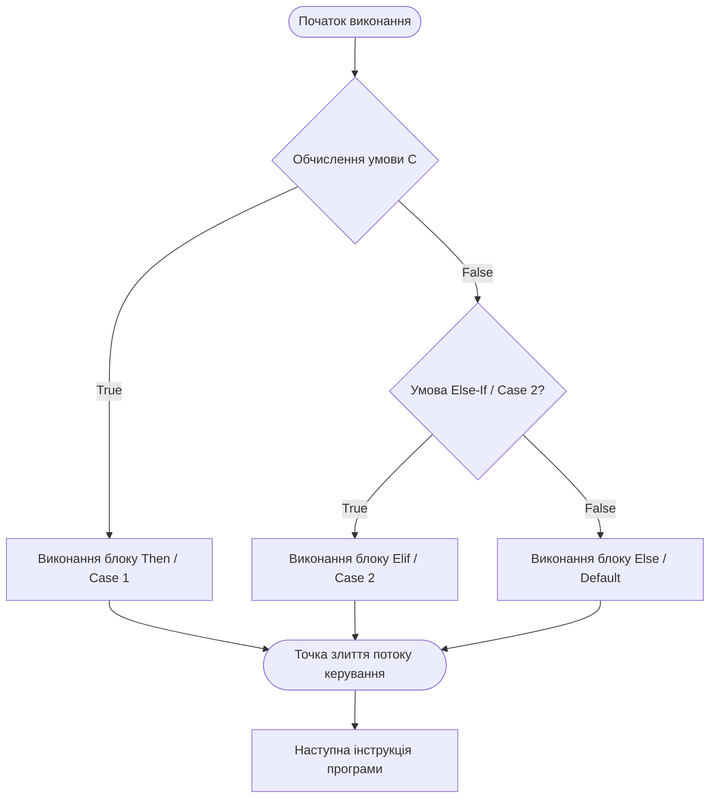

# Урок 45: Умовні конструкції та логіка розгалуження в програмуванні

## 1. Фундаментальна концепція та філософія розгалуження

Програмування за своєю суттю є процесом управління потоком виконання інструкцій (Control Flow). У класичній моделі фон Неймана процесор послідовно зчитує інструкції з пам'яті за лічильником команд (Program Counter / Instruction Pointer). Проте реальні бізнес-завдання, алгоритми штучного інтелекту, користувацькі інтерфейси та системні обробники не можуть існувати в лінійному світі. Будь-яка інтелектуальна поведінка програми виникає саме тоді, коли система отримує здатність аналізувати стан середовища або вхідні дані та приймати рішення: виконувати гілку дій $A$, гілку $B$ або ініціювати аварійний стан $C$.

Умовні конструкції (Conditional Statements / Branching) є первинним будівельним блоком алгоритмічної повноти за Тюрінгом. Без умовного переходу машина не здатна реалізувати складну логіку, цикли чи адаптивні алгоритми.

### 1.1. Історичний розвиток: від Jump та Goto до декларативного Pattern Matching
1. **Апаратний рівень (Асемблер):** Умовні переходи реалізуються через інструкції порівняння (`CMP`) та умовні стрибки (`JE` - Jump if Equal, `JNE`, `JG`, `JL`), які маніпулюють прапорами регістру процесора (Flags Register: Zero Flag `ZF`, Sign Flag `SF`, Overflow Flag `OF`).
2. **Неструктуроване процедурне програмування:** Оператори `IF ... GOTO` (ранній FORTRAN, BASIC). Програми страждали на проблему «спагеті-коду», оскільки переходи могли вести в будь-яку ділянку пам'яті, руйнуючи контекст і стек.
3. **Структурне програмування (Дейкстра, Вірт):** Концепція блокових конструкцій `if-then-else`, що гарантує єдину точку входу та виходу з блоку коду (Algol, Pascal, C).
4. **Табличні переходи та мульти-розгалуження:** Впровадження операторів `switch-case` для швидкого стрибка по таблиці адрес (Jump Table) з часовою складністю $O(1)$.
5. **Сучасна парадигма (Pattern Matching):** Зіставлення зі зразком у Rust, Scala, Python (3.10+ `match-case`), що дозволяє деструктурувати складні об'єкти, перевіряти типи, діапазони та форми даних на етапі оцінки умов.



---

## 2. Архітектурні засади та внутрішній устрій розгалуження

Щоб писати високопродуктивний код і розуміти, як штучний інтелект оптимізує або аналізує логіку, необхідно зазирнути під капот процесора та віртуальної машини.

### 2.1. Як працює умовний перехід на рівні процесора (Branch Prediction & Speculative Execution)
Сучасні процесори використовують конвеєрну архітектуру (Instruction Pipeline). Щоб не простоювати під час обчислення складної умови, процесор використовує **Branch Target Buffer (BTB)** та **Branch Predictor** (блок передбачення переходів).
- **Передбачення переходу:** Процесор вгадує, куди піде гілка (True або False), і починає *спекулятивне виконання* (Speculative Execution) інструкцій наступного блоку до того, як умова реально обчислиться.
- **Branch Misprediction Penalty:** Якщо передбачення виявилося хибним (наприклад, випадково невідсортовані дані в масиві), процесор змушений повністю скинути конвеєр (Pipeline Flush), очистити проміжні регістри та почати завантаження правильної гілки. Це коштує від 15 до 20 тактів процесора на кожен промах!
- **AI-оптимізація:** Сучасні компілятори (LLVM, GCC) та LLM-асистенти при генерації коду оптимізують порядок умов так, щоб найбільш імовірні гілки (`[[likely]]` / `[[unlikely]]` у C++20) виконувалися першими.

### 2.2. Базові типи умовних конструкцій у сучасних мовах
| Конструкція | Синтаксис (Python / JS / TS) | Призначення | Обчислювальна складність |
| :--- | :--- | :--- | :--- |
| **Одинарний `if`** | `if condition:` | Виконання дії лише за умови істинності предиката. | $O(1)$ |
| **Повний `if-else`** | `if c: ... else: ...` | Взаємовиключний вибір однієї з двох альтернатив. | $O(1)$ |
| **Каскадний `elif`** | `if c1: ... elif c2: ... else:` | Послідовна перевірка множини альтернативних умов. | $O(N)$ у гіршому випадку |
| **Тернарний оператор** | `val = a if c else b` (Py) <br> `c ? a : b` (JS/C) | Компактний вираз для обчислення значення. | $O(1)$ |
| **Табличний `switch-case`** | `switch(x) { case 1: ... }` | Розгалуження за значенням скаляра або енуму. | $O(1)$ через Jump Table |
| **Structural Pattern Matching** | `match val: case Pattern():` | Деструктуризація типів, об'єктів та глибоких структур. | $O(1) - O(K)$ залежно від оптимізатора |

---

## 3. Булева алгебра та коротке замикання (Short-Circuit Evaluation)

Умови в програмуванні базуються на математичній логіці Джорджа Буля. Предикат — це будь-який вираз, що обчислюється в булеве значення: `True` або `False`.

### 3.1. Логічні оператори та їх пріоритет
1. **Логічне НЕ (`NOT` / `!`):** Унарний оператор інверсії. Найвищий пріоритет.
2. **Логічне І (`AND` / `&&`):** Бінарний оператор кон'юнкції. Повертає True лише тоді, коли обидва операнди істинні.
3. **Логічне АБО (`OR` / `||`):** Бінарний оператор диз'юнкції. Повертає True, якщо хоча б один операнд істинний.
4. **Виключне АБО (`XOR` / `^`):** Повертає True, якщо операнди мають різне значення.

### 3.2. Закони де Моргана у рефакторингу коду
Закони де Моргана є ключовим інструментом розробника та AI для спрощення заплутаних умовних виразів:
$$
eg (A \land B) \iff 
eg A \lor 
eg B$$
$$
eg (A \lor B) \iff 
eg A \land 
eg B$$

**Приклад рефакторингу:**
```python
# Початковий заплутаний вираз:
if not (user.is_authenticated and not user.is_banned):
    deny_access()

# Спрощений за законом де Моргана:
if not user.is_authenticated or user.is_banned:
    deny_access()
```

### 3.3. Принцип короткого замикання (Short-Circuit Evaluation)
У виразах з `AND` та `OR` компілятор/інтерпретатор обчислює вирази зліва направо і припиняє обчислення, щойно кінцевий результат стає однозначно відомим:
- У виразі `A and B`: якщо `A` дорівнює `False`, вираз `B` **ніколи не буде викликаний/обчислений**.
- У виразі `A or B`: якщо `A` дорівнює `True`, вираз `B` **ніколи не буде викликаний/обчислений**.

**Ідіоматичне використання Short-Circuiting (Null-Safety Guards):**
```python
# Запобігання помилці AttributeError / NullPointerException
# Якщо client дорівнює None, client.get_account() навіть не спробує виконатися!
if client is not None and client.get_account() is not None and client.get_account().has_funds():
    process_payment(client)
```

---

## 4. Глибока практика та патерни проектування розгалужень

### 4.1. Патерн Guard Clauses (Захисні умови) та ліквідація "Arrow Anti-Pattern"
Антипатерн «Стріла» (Arrow Anti-pattern / Pyramid of Doom) виникає, коли вкладені блоки `if` утворюють глибоку вкладеність (трикутник відступів управо), роблячи код нечитабельним і вразливим до багів.

```python
# АНТИПАТЕРН: Глибока вкладеність (Pyramid of Doom)
def register_user(request):
    if request is not None:
        if request.user_data is not None:
            if request.user_data.email_valid():
                if not database.user_exists(request.user_data.email):
                    user = database.create_user(request.user_data)
                    email_service.send_welcome(user)
                    return {"status": "success", "id": user.id}
                else:
                    return {"error": "User already exists"}
            else:
                return {"error": "Invalid email"}
        else:
            return {"error": "Missing user data"}
    else:
        return {"error": "Empty request"}

# ПАТЕРН: Guard Clauses (Раннє повернення - Early Return)
def register_user_clean(request):
    # 1. Захисні перевірки (Fail Fast)
    if request is None:
        return {"error": "Empty request"}
    if request.user_data is None:
        return {"error": "Missing user data"}
    if not request.user_data.email_valid():
        return {"error": "Invalid email"}
    if database.user_exists(request.user_data.email):
        return {"error": "User already exists"}
        
    # 2. Основна бізнес-логіка (Happy Path) на нульовому рівні вкладеності
    user = database.create_user(request.user_data)
    email_service.send_welcome(user)
    return {"status": "success", "id": user.id}
```

### 4.2. Structural Pattern Matching (Python 3.10+, Rust, TypeScript)
Сучасне зіставлення зі зразком — це не просто аналог `switch-case`, а потужний механізм деструктуризації даних:

```python
from dataclasses import dataclass
from typing import Union

@dataclass
class HttpGet:
    url: str
    headers: dict

@dataclass
class HttpPost:
    url: str
    payload: dict
    headers: dict

@dataclass
class HttpError:
    status_code: int
    message: str

def handle_network_event(event: Union[HttpGet, HttpPost, HttpError]):
    match event:
        case HttpGet(url=u, headers={"Authorization": token}) if token.startswith("Bearer "):
            print(f"Авторизований GET-запит до {u}")
            
        case HttpGet(url=u):
            print(f"Анонімний GET-запит до {u} - вимагається авторизація")
            
        case HttpPost(url=u, payload={"action": "checkout", "items": items}) if len(items) > 0:
            print(f"Оформлення замовлення на {len(items)} товарів за адресою {u}")
            
        case HttpPost(url=u):
            print(f"Звичайний POST-запит до {u}")
            
        case HttpError(status_code=404):
            print("Помилка: Ресурс не знайдено (404)")
            
        case HttpError(status_code=code, message=msg) if code >= 500:
            print(f"Критична помилка сервера [{code}]: {msg}")
            
        case _:
            print("Невідомий тип мережевої події")
```

---

## 5. AI-Augmentation: Промптинг для побудови бездоганної логіки розгалужень

AI-асистенти (Claude 3.5 Sonnet, GPT-4o, Cursor) винятково ефективно виявляють приховані логічні дірки, невраховані стани (Edge Cases) та надлишкові перевірки в умовних конструкціях.

### 5.1. Системний промпт для логічного аудиту умовного коду
```markdown
Ти — провідний експерт з архітектури програмного забезпечення та верифікації алгоритмічної логіки.
Твоє завдання: провести глибокий аудит наданого блоку умовних конструкцій.

Вимоги до аналізу:
1. Побудуй таблицю істинності (Truth Table) для всіх вхідних комбінацій параметрів.
2. Знайди недосяжні гілки коду (Dead Code / Unreachable Branches).
3. Знайди взаємовиключні або суперечливі умови (Contradictions).
4. Перевір обробку граничних значень: `None`, `null`, `undefined`, порожні колекції, 0, від'ємні числа, переповнення типів.
5. Проведи рефакторинг коду за допомогою патерну Guard Clauses та законів де Моргана.
6. Надай оптимізований варіант коду та набір Unit-тестів, які покривають 100% гілок (100% Branch Coverage).
```

### 5.2. Приклад промпту для конвертації складної бізнес-політики в код
```markdown
Перетвори наступну текстову політику нарахування банківського кешбеку в чистий, типізований Python-код з використанням Pattern Matching:
- Якщо клієнт Premium і сума транзакції > 10 000 грн у категорії "Подорожі": кешбек 7% (але не більше 1500 грн).
- Якщо клієнт Premium у будь-якій іншій категорії: 3%.
- Якщо клієнт Standard і сума > 5 000 грн у категорії "Продукти" або "АЗС": 2%.
- Якщо клієнт має заборгованість по кредиту: кешбек завжди 0% незалежно від статусу.
- Якщо операція в іноземній валюті: додатковий бонус +1% до розрахованого кешбеку.
Обов'язково додай валідацію вхідних даних та обробку граничних значень.
```

---

## 6. Індустріальні кейси та практичні сценарії

### 6.1. Кейс: Система гейтування фіч (Feature Flag Evaluation Engine) у високонавантаженому сервісі
У таких компаніях, як Uber, Netflix чи Spotify, нові функції вмикаються динамічно на основі десятків умов: геолокація користувача, відсоток вибірки (Canary rollout), тип підписки, версія мобільного додатку, навантаження на дата-центр.

```python
from dataclasses import dataclass
from typing import Optional, Set
import hashlib

@dataclass
class UserContext:
    user_id: str
    country: str
    app_version: str
    is_beta_tester: bool
    risk_score: float

class FeatureFlagEvaluator:
    def __init__(self):
        self.blacklisted_countries: Set[str] = {"XX", "YY"}
        self.min_supported_version = (2, 4, 0)
        
    def _parse_version(self, v_str: str) -> tuple:
        return tuple(map(int, v_str.split(".")))
        
    def _is_in_percentage_bucket(self, user_id: str, percentage: int) -> bool:
        # Стабільний хеш-бакетинг для консистентного A/B тестування
        hash_val = int(hashlib.md5(user_id.encode()).hexdigest(), 16)
        return (hash_val % 100) < percentage

    def is_feature_enabled(self, feature_name: str, user: UserContext, rollout_pct: int) -> tuple[bool, str]:
        # 1. Захисні перевірки безпеки
        if user.country in self.blacklisted_countries:
            return False, "Country blocked due to compliance"
            
        if user.risk_score > 0.85:
            return False, "High fraud risk score"
            
        # 2. Перевірка сумісності версії клієнта
        try:
            if self._parse_version(user.app_version) < self.min_supported_version:
                return False, "Outdated client version"
        except (ValueError, AttributeError):
            return False, "Malformed app version string"
            
        # 3. Привілейовані групи (Beta Testers)
        if user.is_beta_tester:
            return True, "Enabled via Beta Program"
            
        # 4. Градуальний процентний реліз
        if self._is_in_percentage_bucket(user.user_id, rollout_pct):
            return True, f"Enabled via {rollout_pct}% Canary Rollout"
            
        return False, "Not selected in rollout cohort"
```

---

## 7. Типові помилки (Anti-Patterns) та способи їх ліквідації

### 7.1. Помилка: Небезпечне порівняння на рівність з `None` та `Boolean`
```python
# ПОГАНО:
if is_valid == True:   # Зайве порівняння з True
    pass
if data == None:       # Помилка! Порівняння значень замість перевірки ідентичності об'єкта
    pass

# ПРАВИЛЬНО:
if is_valid:           # Ідіоматична перевірка істинності
    pass
if data is None:       # Перевірка ідентичності через singleton None
    pass
if data is not None:
    pass
```

### 7.2. Помилка: Завислі Else та неповні перевірки станів (Exhaustiveness Checking)
Коли розробник опрацьовує не всі можливі значення перерахування (Enum), блок `else` може мовчки проковтнути помилковий стан замість виклику виключення.

```python
from enum import Enum, auto

class OrderStatus(Enum):
    PENDING = auto()
    PROCESSING = auto()
    SHIPPED = auto()
    DELIVERED = auto()
    CANCELLED = auto()

# НЕБЕЗПЕЧНО:
def handle_status_bad(status: OrderStatus):
    if status == OrderStatus.PENDING:
        init_order()
    elif status == OrderStatus.PROCESSING:
        pack_order()
    else:
        # Якщо додасться статус REFUNDED, він помилково сприйметься як доставлений!
        ship_order()

# НАДІЙНО: Вичерпна перевірка всіх станів
def handle_status_good(status: OrderStatus):
    match status:
        case OrderStatus.PENDING:
            init_order()
        case OrderStatus.PROCESSING:
            pack_order()
        case OrderStatus.SHIPPED:
            track_delivery()
        case OrderStatus.DELIVERED:
            complete_order()
        case OrderStatus.CANCELLED:
            refund_payment()
        case _ as unreachable:
            raise ValueError(f"Необроблений статус замовлення: {unreachable}")
```

---

## 8. Практична лабораторія та челенджі

### Лабораторне завдання 1: Побудова валідатора фінансових транзакцій (Anti-Fraud Engine)
**Мета:** Розробити клас `FraudDetectionEngine`, який приймає об'єкт транзакції (`amount`, `currency`, `user_age_days`, `ip_country`, `user_home_country`, `is_vpn`, `velocity_last_hour`) та повертає статус `TransactionVerdict (APPROVE, MANUAL_REVIEW, DECLINE)` з детальним описом причини.
- Використовуйте принцип Guard Clauses.
- Забезпечте 100% покриття граничних випадків.
- Реалізуйте логіку короткого замикання для оптимізації перевірок (швидкі локальні перевірки перед важкими розрахунками).

---

## 9. Підсумковий чекліст компетенцій та глосарій

- [ ] Я розумію, як апаратний блок передбачення переходів (Branch Predictor) впливає на швидкодію розгалуженого коду.
- [ ] Я вмію застосовувати закони де Моргана для спрощення заплутаних булевих виразів.
- [ ] Я розумію механізм короткого замикання (Short-Circuiting) в операторах `AND` та `OR`.
- [ ] Я використовую Guard Clauses для запобігання спагеті-коду та глибокої вкладеності.
- [ ] Я володію сучасним Pattern Matching для деструктуризації об'єктів та обробки поліморфних станів.
- [ ] Я вмію формулювати промпти для AI-аудиту логіки умовних конструкцій та пошуку граничних випадків.

### Глосарій термінів:
- **Branch Prediction:** Апаратний механізм процесора, який передбачає напрямок умовного переходу до завершення обчислення умови.
- **Short-Circuit Evaluation:** Семантика виконання логічних операторів, за якої другий аргумент обчислюється лише тоді, коли першого недостатньо для визначення результату.
- **Guard Clause:** Умовний оператор на початку функції, який негайно перериває виконання (return/throw) при невиконанні попередніх умов.
- **Pattern Matching:** Механізм зіставлення структури та значень об'єкта зі зразком, що поєднує перевірку типу, деструктуризацію та фільтрацію.
