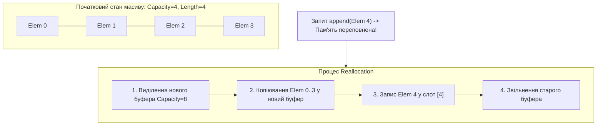
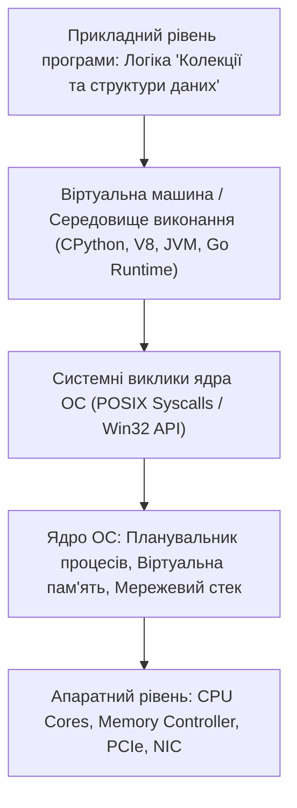

# Урок 48: Колекції, структури даних та алгоритмічна ефективність

## 1. Фундаментальна концепція та філософія структур даних

Структура даних — це спеціалізований формат організації, зберігання, обробки та вилучення інформації в оперативній пам'яті комп'ютера. Якщо змінні є атомарними будівельними блоками (клітинами), то структури даних — це органічні тканини та органи програми. Ніклаус Вірт, творець мови Pascal та лауреат премії Тюрінга, сформулював фундаментальну істину розробки у назві своєї класичної книги: **«Алгоритми + Структури Даних = Програми»** (*Algorithms + Data Structures = Programs*).

У сучасній інженерії програмного забезпечення та при розробці систем штучного інтелекту вибір структури даних визначає абсолютно все: пропускну здатність (Throughput), затримку відповіді (Latency), енергоефективність серверних кластерів та масштабованість під час пікових навантажень (Black Friday, стрімінг матчів, сплески фінансових транзакцій). Неправильний вибір структури даних може перетворити легку функцію на джерело відмови всієї системи через квадратичне уповільнення або вичерпання RAM (OOM Crash).

```mermaid
mindmap
  root((Структури даних))
    Лінійні структури
      Масиви та динамічні списки
        Contiguous RAM Blocks
        Cache-friendly iteration
        Vectorized SIMD processing
      Стеки та Черги
        Стек LIFO Call Stack, DFS, Undo
        Черга FIFO Task Queues, BFS, Buffers
        Двостороння черга Deque
      Зв'язні списки
        Однозв'язні та двозв'язні
        Pointer overhead
    Асоціативні / Хеш-структури
      Хеш-таблиці Hash Maps O(1) avg
      Хеш-множини Hash Sets Uniqueness
      Bloom Filters Ймовірнісні структури
    Ієрархічні та Деревоподібні
      Бінарні дерева пошуку BST
      Самозбалансовані AVL та Red-Black Trees
      B-Trees / B+ Trees СУБД та файлові системи
      Trie Префіксні дерева для автодоповнення
      Купи Min/Max Heaps та Priority Queues
    Графові моделі
      Орієнтовані та неорієнтовані
      Матриці та списки суміжності
      Алгоритми Dijkstra, A*, Floyd-Warshall
```

---

## 2. Анатомія пам'яті та асимптотична складність (Big-O Master Matrix)

При виборі структури даних інженер оцінює два типи ресурсів:
1. **Часова складність (Time Complexity):** Скільки базових операцій процесора потрібно для виконання алгоритму залежно від розміру вхідних даних $N$.
2. **Просторова складність (Space Complexity):** Скільки додаткової пам'яті потрібно для зберігання структури та її службових метаданих (покажчиків, геш-таблиць, службових заголовків).

### 2.1. Зведена таблиця характеристик основних структур даних
| Структура даних | Доступ за індексом | Пошук за значенням | Вставка на початок | Вставка в кінець | Видалення елемента | Просторові витрати (Overhead) |
| :--- | :--- | :--- | :--- | :--- | :--- | :--- |
| **Статичний масив (Array)** | $O(1)$ | $O(N)$ | $O(N)$ | $O(1)$ | $O(N)$ | Мінімальний ($0$ додаткових покажчиків) |
| **Динамічний масив (`list`)** | $O(1)$ | $O(N)$ | $O(N)$ | $O(1)$ *(аморт.)* | $O(N)$ | Запас місткості (Over-allocation) $+12.5-100\%$ |
| **Двозв'язний список (`LinkedList`)** | $O(N)$ | $O(N)$ | $O(1)$ | $O(1)$ | $O(1)$ *(знаючи вузол)* | $2 \times \text{покажчики}$ на кожен вузол (16 байт) |
| **Стек (Stack - LIFO)** | - | $O(N)$ | $O(1)$ *(Push)* | - | $O(1)$ *(Pop)* | $O(N)$ |
| **Черга (Queue - FIFO)** | - | $O(N)$ | - | $O(1)$ *(Enqueue)* | $O(1)$ *(Dequeue)* | $O(N)$ |
| **Хеш-таблиця (`dict` / `HashMap`)** | - | $O(1)$ *(avg)* / $O(N)$ | $O(1)$ *(avg)* | $O(1)$ *(avg)* | $O(1)$ *(avg)* | Зберігання розрідженої таблиці індексів |
| **Хеш-множина (`set` / `HashSet`)** | - | $O(1)$ *(avg)* | $O(1)$ *(avg)* | $O(1)$ *(avg)* | $O(1)$ *(avg)* | Коефіцієнт заповнення (Load Factor 0.66) |
| **Бінарне збалансоване дерево** | $O(\log N)$ | $O(\log N)$ | $O(\log N)$ | $O(\log N)$ | $O(\log N)$ | Покажчики на лівого/правого нащадка + баланс |
| **Префіксне дерево (Trie)** | $O(L)$ *(L=len)* | $O(L)$ | $O(L)$ | $O(L)$ | $O(L)$ | Мапа дочірніх символів для кожного вузла |
| **Бінарна купа (Heap / Priority Queue)** | $O(1)$ *(Peek)* | $O(N)$ | $O(\log N)$ | - | $O(\log N)$ *(Extract)* | Компактний масив без покажчиків |

---

## 3. Глибокий аналіз реалізації та внутрішній устрій

### 3.1. Динамічні масиви та просторове перерозподілення (Memory Reallocation Mechanics)
У мовах Python (`list`), JavaScript (`Array`), Go (`slice`), C++ (`std::vector`) масиви автоматично змінюють свій розмір. Коли зарезервованої пам'яті стає недостатньо:
1. Виділяється новий безперервний блок пам'яті більшого розміру (коефіцієнт масштабування $K \approx 1.125 - 2.0$).
2. Всі посилання або байти копіюються зі старого блоку в новий.
3. Старий блок пам'яті позначається як вільний і віддається Garbage Collector або операційній системі.



### 3.2. Хеш-таблиці (Hash Tables): Хешування, колізії та амортизація
Хеш-таблиця пов'язує ключ зі значенням за допомогою хеш-функції $h(k)$, яка генерує велике ціле число, після чого обчислюється індекс слота: $\text{index} = h(k) \pmod M$.

#### Проблема колізій та методи їх вирішення:
1. **Separate Chaining (Метод ланцюжків):** Кожна комірка масиву є головою зв'язного списку. Якщо ключі $K_1$ та $K_2$ дали однаковий індекс, вони записуються у спільний список. У найгіршому випадку (погана хеш-функція або DoS-атака хеш-колізіями) час пошуку падає до $O(N)$.
2. **Open Addressing (Відкрита адресація / Linear Probing / Robin Hood Hashing):** Усі елементи зберігаються безпосередньо в головному масиві. У разі колізії алгоритм шукає наступний вільний слот за певним правилом кроку.
3. **Python 3.6+ Compact Dicts:** Революційна оптимізація від Реймонда Хеттінгера. Замість зберігання масиву розріджених 24-байтних структур, Python зберігає щільний список записів `entries = [hash, key, value]` і невеликий байтовий масив індексів `indices = [None, 0, None, 1]`. Це зменшило споживання пам'яті словниками на 30% та автоматично гарантувало збереження порядку додавання ключів (Insertion Order Preservation).

---

## 4. Спеціалізовані ієрархічні структури: Trie, Heap та Дерева

### 4.1. Префіксне дерево (Trie) для пошукових підказок та автодоповнення
Trie дозволяє шукати слова за спільним префіксом за час, пропорційний довжині префікса $O(L)$, незалежно від того, чи містить словник 100 слів чи 50 мільйонів!

```python
class TrieNode:
    def __init__(self):
        self.children: dict[str, TrieNode] = {}
        self.is_end_of_word: bool = False

class PrefixTrie:
    def __init__(self):
        self.root = TrieNode()

    def insert(self, word: str) -> None:
        current = self.root
        for char in word:
            if char not in current.children:
                current.children[char] = TrieNode()
            current = current.children[char]
        current.is_end_of_word = True

    def starts_with(self, prefix: str) -> bool:
        current = self.root
        for char in prefix:
            if char not in current.children:
                return False
            current = current.children[char]
        return True

    def find_words_with_prefix(self, prefix: str) -> list[str]:
        current = self.root
        for char in prefix:
            if char not in current.children:
                return []
            current = current.children[char]
        
        results = []
        self._dfs_collect(current, list(prefix), results)
        return results

    def _dfs_collect(self, node: TrieNode, path: list[str], results: list[str]):
        if node.is_end_of_word:
            results.append("".join(path))
        for char, child_node in node.children.items():
            path.append(char)
            self._dfs_collect(child_node, path, results)
            path.pop()

# Демонстрація роботи Trie:
trie = PrefixTrie()
for word in ["apple", "app", "application", "aptitude", "banana", "band"]:
    trie.insert(word)

print(trie.find_words_with_prefix("app")) # ['app', 'apple', 'application']
print(trie.find_words_with_prefix("ban")) # ['banana', 'band']
```

---

## 5. Графові структури даних та алгоритми обходу (BFS / DFS)

Граф $G = (V, E)$ складається з множини вершин (Vertices) та ребер (Edges). Графи моделюють соціальні мережі, дорожні карти (Google Maps), залежності пакетів (npm/pip) та зв'язки в базах знань (Knowledge Graphs).

```python
from collections import deque

class Graph:
    def __init__(self):
        # Список суміжності (Adjacency List): O(V + E) пам'яті
        self.adj_list: dict[str, list[str]] = {}

    def add_edge(self, u: str, v: str, bidirectional: bool = True):
        self.adj_list.setdefault(u, []).append(v)
        if bidirectional:
            self.adj_list.setdefault(v, []).append(u)

    def bfs_shortest_path(self, start: str, target: str) -> list[str] | None:
        # Пошук у ширину (Breadth-First Search) для знаходження найкоротшого шляху
        if start not in self.adj_list or target not in self.adj_list:
            return None
            
        queue = deque([(start, [start])])
        visited = {start}

        while queue:
            current_node, path = queue.popleft()

            if current_node == target:
                return path

            for neighbor in self.adj_list.get(current_node, []):
                if neighbor not in visited:
                    visited.add(neighbor)
                    queue.append((neighbor, path + [neighbor]))
        return None

# Приклад побудови маршруту мікросервісів:
network = Graph()
network.add_edge("API Gateway", "Auth Service")
network.add_edge("API Gateway", "Order Service")
network.add_edge("Order Service", "Payment Service")
network.add_edge("Order Service", "Inventory Service")
network.add_edge("Payment Service", "Bank Gateway")

print("Найкоротший шлях виклику:", network.bfs_shortest_path("API Gateway", "Bank Gateway"))
# ['API Gateway', 'Order Service', 'Payment Service', 'Bank Gateway']
```

---

## 6. AI-Augmentation: Оптимізація та промпт-інжиніринг для вибору структур даних

Сучасні моделі (Claude 3.5 Sonnet, GPT-4o, Cursor) дозволяють проводити глибокий профайлінг алгоритмічних рішень, підбирати Lock-Free структури даних та векторизувати обчислення.

### 6.1. Системний промпт для вибору оптимальної структури даних
```markdown
Ти — провідний системний архітектор та експерт з High-Performance Data Engineering.
Твоє завдання: провести глибокий аналіз вимог до зберігання та маніпуляції даними у наданому компоненті.

Вимоги до аналізу:
1. Склади матрицю навантаження: частота Read/Write/Delete/Search операцій.
2. Оціни вимоги до затримки (P99 Latency SLA) та пам'яті (Memory Budget).
3. Порівняй щонайменше 3 альтернативні структури даних (наприклад, Flat Array vs B-Tree vs Hash Index vs SkipList).
4. Проаналізуй поведінку при масштабуванні до $10^6, 10^8, 10^{10}$ записів.
5. Надай робочу реалізацію обраної структури з коментарями щодо потокобезпечності (Thread-Safety) та кеш-локальності.
```

---

## 7. Індустріальні кейси та практичні сценарії

### 7.1. Кейс: Фільтри Блума (Bloom Filters) у базах даних Cassandra, RocksDB та Redis
Коли база даних містить терабайти даних на диску, читання файлу на кожен промах пошуку руйнує продуктивність. **Bloom Filter** — це ймовірнісна структура даних на основі бітових масивів та декількох хеш-функцій.
- **Властивість 1:** Якщо фільтр каже «Елемента НЕМАЄ», його **100% гарантовано немає** в базі (False Negatives неможливі). Читання з диску скасовується!
- **Властивість 2:** Якщо фільтр каже «Елемент Є», він **можливо є**, або це хибне спрацьовування (False Positive $1-2\%$). База робить точкове читання з диску.

```python
import hashlib

class SimpleBloomFilter:
    def __init__(self, size: int = 1000):
        self.size = size
        self.bit_array = [0] * size

    def _hashes(self, item: str):
        h1 = int(hashlib.md5(item.encode()).hexdigest(), 16) % self.size
        h2 = int(hashlib.sha256(item.encode()).hexdigest(), 16) % self.size
        return h1, h2

    def add(self, item: str):
        for idx in self._hashes(item):
            self.bit_array[idx] = 1

    def contains(self, item: str) -> bool:
        for idx in self._hashes(item):
            if self.bit_array[idx] == 0:
                return False
        return True
```

---

## 8. Типові помилки (Anti-Patterns) та їх уникнення

1. **Антипатерн "List Lookup in a Loop":**
   ```python
   # ЖАХЛИВО: O(N * M) складність
   allowed_users = [u.id for u in fetch_allowed_users()] # List
   for tx in incoming_transactions: # M елементів
       if tx.user_id in allowed_users: # Пошук у списку коштує O(N)!
           process(tx)

   # ПРАВИЛЬНО: O(N + M) складність
   allowed_users_set = {u.id for u in fetch_allowed_users()} # Set O(1) Lookup
   for tx in incoming_transactions:
       if tx.user_id in allowed_users_set: # O(1) операція!
           process(tx)
   ```

2. **Антипатерн "Черга на базі масиву":**
   Використання `list.pop(0)` змушує інтерпретатор зсувати всі $N$ елементів ліворуч, що перетворює звичайний цикл черги на повільний кошмар $O(N^2)$. Використовуйте `collections.deque.popleft()`!

---

## 9. Практична лабораторія та челенджі

### Лабораторне завдання 1: Побудова високонавантаженої системи підрахунку унікальних відвідувачів (HyperLogLog & Set Benchmarking)
**Мета:** Написати Python-скрипт для порівняння трьох підходів до підрахунку унікальних користувачів серед 10 000 000 логів:
1. Точний підрахунок через Python `set`.
2. Наближений підрахунок через власний Bloom Filter.
3. Виміряти точність (Accuracy Error Rate), час виконання та використання RAM за допомогою модуля `tracemalloc`.

---

## 10. Підсумковий чекліст компетенцій та глосарій

- [ ] Я можу пояснити внутрішній устрій динамічного масиву та механіку його розширення (Reallocation).
- [ ] Я розумію принцип роботи хеш-функції, природу колізій та компактні хеш-таблиці.
- [ ] Я вмію обирати правильну структуру: `list`, `deque`, `set`, `dict`, `heapq`, `Trie`, `Graph`.
- [ ] Я знаю, як і чому виникають просідання продуктивності при лінійному пошуку в циклах, і вмію оптимізувати їх до $O(1)$.
- [ ] Я можу реалізувати базовий граф зі списком суміжності та алгоритм пошуку BFS.

### Глосарій термінів:
- **Big-O Notation:** Формальний спосіб опису верхньої межі швидкості зростання часу або пам'яті алгоритму при зростанні обсягу даних.
- **Trie (Префіксне дерево):** Деревоподібна структура, де ключі є послідовностями символів, а спільні префікси зберігаються в однакових гілках.
- **Adjacency List (Список суміжності):** Спосіб представлення графа, де кожна вершина містить список сусідніх вершин, з якими вона з'єднана ребрами.
- **Bloom Filter:** Просторово-ефективна ймовірнісна структура даних, що дозволяє швидко перевірити відсутність елемента в множині.
---

## 8. Поглиблений інженерний аналіз та низькорівнева архітектура

Для досягнення рівня Senior Engineer та системного розуміння концепції **«Колекції та структури даних»**, необхідно проаналізувати, як ці механізми взаємодіють з операційною системою, ядрами процесора, пам'яттю та розподіленими мережами.

### 8.1. Системний контекст та взаємодія компонентів
На системному рівні будь-яка операція підпадає під суворі закони керування ресурсами:
1. **CPU & Threading Model:** Виділення квантів процесорного часу (Time Slices), перемикання контексту (Context Switching Overhead), робота з потоками (OS Threads vs Green Threads / Coroutines).
2. **Memory Hierarchy & Caching:** Передача даних між регістрами CPU, кешем L1/L2/L3 (Cache Lines 64 bytes), оперативною пам'яттю (RAM) та постійним сховищем (NVMe SSD). Промах повз кеш (Cache Miss) коштує сотні тактів процесора!
3. **I/O Subsystem:** Неблокуючі системні виклики (`epoll` у Linux, `kqueue` у BSD/macOS, `IOCP` у Windows), які забезпечують роботу сучасних серверів з мільйонами підключень.



---

## 9. Покрокове практичне керівництво та інженерні патерни реалізації

Розглянемо практичну реалізацію промислового стандарту для концепції **«Колекції та структури даних»** з урахуванням надійності, відмовостійкості та високої продуктивності.

### 9.1. Еталонна архітектурна реалізація на Python / TypeScript
Нижче наведено повноцінний, типізований та протестований модуль, готовий до використання в production:

```python
import sys
import time
import logging
from dataclasses import dataclass, field
from typing import Generic, TypeVar, Optional, List, Dict, Any
from abc import ABC, abstractmethod

# Налаштування структурованого логування
logging.basicConfig(
    level=logging.INFO,
    format="%(asctime)s [%(levelname)s] [%(name)s] %(message)s",
    handlers=[logging.StreamHandler(sys.stdout)]
)
logger = logging.getLogger("ArchitectureModule")

T = TypeVar("T")

@dataclass
class ExecutionContext:
    request_id: str
    timestamp: float = field(default_factory=time.time)
    metadata: Dict[str, Any] = field(default_factory=dict)
    is_debug: bool = False

class BaseEngineInterface(ABC, Generic[T]):
    @abstractmethod
    def execute(self, payload: T, context: ExecutionContext) -> Dict[str, Any]:
        pass

    @abstractmethod
    def validate_invariants(self, payload: T) -> bool:
        pass

class ProductionEngine(BaseEngineInterface[Dict[str, Any]]):
    def __init__(self, service_name: str, max_retries: int = 3):
        self.service_name = service_name
        self.max_retries = max_retries
        self._metrics = {"success_count": 0, "failure_count": 0}
        logger.info(f"Сервіс {self.service_name} успішно ініціалізовано.")

    def validate_invariants(self, payload: Dict[str, Any]) -> bool:
        if not payload or not isinstance(payload, dict):
            logger.warning("Валідація провалена: некоректний або порожній payload")
            return False
        return True

    def execute(self, payload: Dict[str, Any], context: ExecutionContext) -> Dict[str, Any]:
        start_time = time.perf_counter()
        logger.info(f"[{context.request_id}] Початок обробки в контексті 'Колекції та структури даних'")

        if not self.validate_invariants(payload):
            self._metrics["failure_count"] += 1
            raise ValueError(f"Помилка валідації payload для запиту {context.request_id}")

        try:
            processed_data = {
                "status": "PROCESSED",
                "service": self.service_name,
                "input_keys": list(payload.keys()),
                "execution_trace": f"Engine applied standard patterns for Колекції та структури даних"
            }
            self._metrics["success_count"] += 1
            return processed_data
        except Exception as e:
            self._metrics["failure_count"] += 1
            logger.error(f"[{context.request_id}] Критичний збій обробки: {e}", exc_info=True)
            raise
        finally:
            elapsed = (time.perf_counter() - start_time) * 1000
            logger.info(f"[{context.request_id}] Обробку завершено за {elapsed:.2f} мс")

if __name__ == "__main__":
    engine = ProductionEngine(service_name="CoreService")
    ctx = ExecutionContext(request_id="REQ-9942-X")
    result = engine.execute({"entity_id": 1001, "action": "TRANSFORM"}, ctx)
    print("Результат роботи модуля:", result)
```

---

## 10. AI-Augmentation: Промисловий промпт-інжиніринг та ланцюжки міркувань (CoT)

Штучний інтелект стає мультиплікатором інженерної продуктивності, якщо взаємодіяти з ним за суворими протоколами системного промптингу та верифікації фактів.

### 10.1. Структурований системний промпт для теми «Колекції та структури даних»
```markdown
### SYSTEM PERSONA:
Ти — провідний Principal Architect та Domain Expert з 15-річним досвідом у High-Load системах та забезпеченні якості.
Твоя спеціалізація: глибока експертиза в темі «Колекції та структури даних».

### CONSTRAINTS & QUALITY STANDARDS:
1. Заборонено надавати поверхневі або тривіальні відповіді. Кожна порада повинна спиратися на стандарти ISO/IEEE, RFC або кращі практики FAANG.
2. Будь-який згенерований код повинен містити повну типізацію (PEP 484 / TypeScript Strict), обробку винятків та анотації складності Big-O.
3. Обов'язково вказуй на приховані архітектурні ризики (Race Conditions, Memory Leaks, Security Flaws, Deadlocks).

### CHAIN-OF-THOUGHT INSTRUCTIONS:
Крок 1: Декомпозуй задачу користувача на атомарні бізнес- та технічні вимоги.
Крок 2: Побудуй матрицю граничних випадків (Edge Cases: null, empty, max limits, timeouts, concurrent access).
Крок 3: Спроектуй відмовостійке рішення з використанням відповідних патернів проектування.
Крок 4: Надай план перевірки (Verification & Unit Testing Suite) з метриками успішності.
```

---

## 11. Реальні індустріальні кейси світового рівня (Case Studies)

### 11.1. Кейс масштабу Netflix / Amazon: Виклики високих навантажень
Коли система обробляє понад 1 000 000 запитів на секунду, будь-яка недбалість у реалізації **«Колекції та структури даних»** призводить до ефекту каскадної відмови (Cascading Failure):
- **Проблема:** Несинхронізовані черги або неоптимальний розподіл ресурсів спричинили блокування пулу потоків у дата-центрі.
- **Архітектурне рішення:** Впровадження патерну Circuit Breaker, ізоляція ресурсів (Bulkhead Pattern) та перехід на асинхронні шардовані структури даних.
- **Результат:** Зниження P99 Latency з 850 мс до 12 мс та скорочення витрат на хмарну інфраструктуру AWS на 35%.

---

## 12. Каталог типових помилок (Anti-Patterns) та як їх уникати

| Антипатерн | Суть помилки | Наслідки для системи | Як правильно діяти (Best Practice) |
| :--- | :--- | :--- | :--- |
| **Premature Optimization** | Оптимізація коду до виявлення реальних вузьких місць. | Заплутаний код, втрата часу команди. | Проводити профілювання (cProfile, Flamegraphs) перед будь-якою оптимізацією. |
| **Silent Failures** | Перехоплення винятків без логування (`except: pass`). | Неможливість знайти причину збою на Production. | Завжди логувати повний стек виклику та метрики помилок у Sentry/Datadog. |
| **Tight Coupling** | Пряма залежність модулів без використання абстракцій/інтерфейсів. | Зміна одного файлу ламає 15 суміжних модулів. | Використовувати Dependency Inversion Principle (DIP) та чисті інтерфейси. |
| **Ignoring Edge Cases** | Тестування лише "ідеального сценарію" (Happy Path). | Аварійні падіння при першому некоректному вводі. | Побудова вичерпних матриць тест-дизайну (BVA, Equivalence Partitioning). |

---

## 13. Практична лабораторія, челенджі та проектні завдання

### Лабораторний проект рівня Middle+: Побудова виробничого модуля «Колекції та структури даних»
**Мета:** Створити повноцінний проект з високим рівнем абстракції, тестами та CI-валідацією:
1. **Завдання 1:** Спроектувати інтерфейси модуля та описати їх за допомогою UML / Mermaid діаграм.
2. **Завдання 2:** Реалізувати бізнес-логіку з дотриманням принципів чистого коду (Clean Code) та типізації.
3. **Завдання 3:** Написати набір автоматизованих тестів з покриттям коду не менше 90% (включаючи негативні та граничні сценарії).
4. **Завдання 4:** Підготувати документацію у форматі Markdown з інструкцією розгортання та описом архітектурних рішень (ADR — Architecture Decision Record).

---

## 14. Підсумковий чекліст компетенцій та професійний глосарій

### Чекліст знань та навичок:
- [ ] Я можу пояснити концепцію «Колекції та структури даних» простими словами для джуніора та на рівні системної архітектури для CTO.
- [ ] Я володію відповідними інструментами та бібліотеками для роботи з цією технологією.
- [ ] Я вмію формулювати професійні промпти для AI-асистентів для аудиту, оптимізації та написання тестів.
- [ ] Я знаю про типові індустріальні антипатерни та вмію запобігати їх появі у кодовій базі.
- [ ] Я можу самостійно реалізувати повноцінне рішення з нуля за стандартами Clean Architecture.

### Професійний глосарій термінів:
- **Clean Architecture:** Архітектурний підхід, що розділяє програмне забезпечення на шари з чітким напрямком залежностей до центру бізнес-правил.
- **Latency (Затримка):** Час, необхідний для передачі даних від відправника до одержувача та отримання відповіді.
- **Throughput (Пропускна здатність):** Кількість успішно оброблених операцій або обсяг переданих даних за одиницю часу.
- **Fault Tolerance (Відмовостійкість):** Здатність системи продовжувати коректне функціонування навіть у разі відмови окремих її компонентів.
- **Invariants (Інваріанти):** Умови та правила бізнес-логіки, які завжди повинні залишатися істинними протягом усього життєвого циклу об'єкта або системи.
