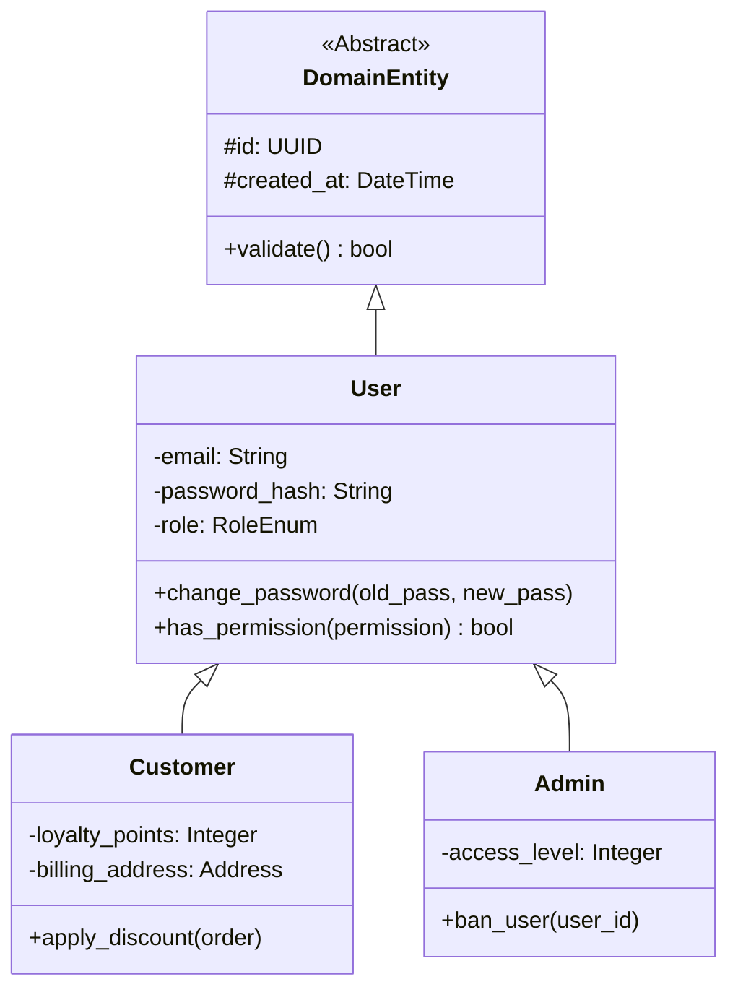
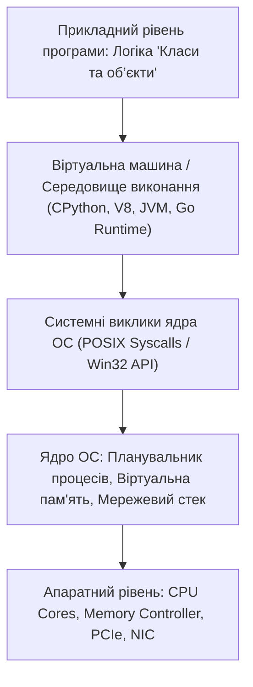

# Урок 49: Об'єктно-орієнтоване програмування (ООП), класи та архітектура об'єктів

## 1. Фундаментальна концепція та філософія об'єктного підходу

Об'єктно-орієнтоване програмування (ООП) — це парадигма програмування, заснована на концепції **«об'єктів»**, які містять дані у вигляді полів (атрибутів або властивостей) та код у вигляді процедур (методів). Алан Кей, творець мови Smalltalk та один з батьків концепції ООП, підкреслював, що первісна ідея полягала не стільки в класах і успадкуванні, скільки в **«передачі повідомлень між автономними об'єктами»** (Message Passing), подібно до біологічних клітин у живому організмі.

У сучасному промисловому програмуванні ООП є домінуючим стандартом для моделювання складних бізнес-доменів (Domain-Driven Design), побудови масштабованих фреймворків (Django, Spring, NestJS), створення користувацьких інтерфейсів та організації коду у великих розподілених командах.



---

## 2. Чотири стовпи класичного ООП

### 2.1. Інкапсуляція (Encapsulation)
Інкапсуляція — це об'єднання даних та методів роботи з ними в єдиній капсулі (класі) та приховування внутрішніх деталей реалізації від зовнішнього світу (Information Hiding).
- **Публічний інтерфейс (Public API):** Методи, які клас відкриває для клієнтського коду.
- **Приватний стан (Private State):** Поля, доступ до яких захищений, щоб сторонній код не міг перевести об'єкт у некоректний або зламаний стан.

### 2.2. Абстракція (Abstraction)
Абстракція полягає у виділенні лише тих характеристик об'єкта, які є суттєвими для поточної бізнес-задачі, відкидаючи другорядні деталі. Ви керуєте автомобілем через кермо та педалі (абстракція), не думаючи щомиті про кут випередження запалювання та тиск у паливній рампі.

### 2.3. Успадкування (Inheritance)
Механізм, за допомогою якого один клас (нащадок / subclass) може набувати властивостей та методів іншого класу (батьківського / superclass), забезпечуючи перевикористання коду.

### 2.4. Поліморфізм (Polymorphism)
Здатність однотипного інтерфейсу обробляти різні форми даних або типів. Найважливіший вид поліморфізму — **динамічний поліморфізм підтипів (Subtype Polymorphism)**, за якого виклик методу `shape.draw()` викликає специфічну реалізацію для `Circle`, `Square` або `Triangle` під час виконання програми.

---

## 3. Принципи SOLID: Золотий стандарт архітектури класів

Роберт Мартін («Дядько Боб») сформулював п'ять фундаментальних принципів об'єктно-орієнтованого дизайну, що гарантують гнучкість, тестованість та легкість підтримки коду:

1. **S — Single Responsibility Principle (Принцип єдиної відповідальності):**
   Клас повинен мати лише одну відповідальність і лише одну причину для зміни.
2. **O — Open/Closed Principle (Принцип відкритості/закритості):**
   Програмні сутності повинні бути відкритими для розширення, але закритими для модифікації.
3. **L — Liskov Substitution Principle (Принцип підстановки Лісков):**
   Об'єкти підкласу повинні мати здатність замінювати об'єкти батьківського класу без порушення коректності роботи програми.
4. **I — Interface Segregation Principle (Принцип розділення інтерфейсів):**
   Клієнти не повинні залежати від інтерфейсів, які вони не використовують. Краще багато маленьких спеціалізованих інтерфейсів, ніж один гігантський «жирний».
5. **D — Dependency Inversion Principle (Принцип інверсії залежностей):**
   Модулі верхніх рівнів не повинні залежати від модулів нижніх рівнів. Обидва типи модулів повинні залежати від абстракцій (інтерфейсів).

---

## 4. Глибока реалізація в Python: Магічні методи, Dataclasses та Дескриптори

Python надає багату модель даних (Data Model), керовану спеціальними методами з подвійним підкресленням (**Dunder Methods**).

```python
from dataclasses import dataclass, field
from typing import List
from abc import ABC, abstractmethod
import uuid

# 1. Абстрактний інтерфейс платежу (DIP з SOLID)
class PaymentGateway(ABC):
    @abstractmethod
    def process_payment(self, amount: float, currency: str) -> bool:
        pass

# 2. Реалізація конкретного провайдера Stripe
class StripePaymentGateway(PaymentGateway):
    def process_payment(self, amount: float, currency: str) -> bool:
        print(f"[Stripe] Списано {amount:.2f} {currency} через Stripe API")
        return True

# 3. Реалізація конкретного провайдера PayPal
class PayPalPaymentGateway(PaymentGateway):
    def process_payment(self, amount: float, currency: str) -> bool:
        print(f"[PayPal] Списано {amount:.2f} {currency} через PayPal Express")
        return True

# 4. Багата модель даних на основі Dataclass
@dataclass
class OrderItem:
    name: str
    price: float
    quantity: int = 1

    @property
    def total(self) -> float:
        return self.price * self.quantity

@dataclass
class Order:
    id: str = field(default_factory=lambda: str(uuid.uuid4()))
    items: List[OrderItem] = field(default_factory=list)
    is_paid: bool = False

    def add_item(self, item: OrderItem):
        self.items.append(item)

    @property
    def calculate_total(self) -> float:
        return sum(item.total for item in self.items)

    def checkout(self, gateway: PaymentGateway) -> bool:
        total = self.calculate_total
        if total <= 0:
            raise ValueError("Неможливо оплатити порожнє замовлення!")
            
        success = gateway.process_payment(total, "USD")
        if success:
            self.is_paid = True
        return success

    def __str__(self) -> str:
        return f"Замовлення #{self.id[:8]} (Товарів: {len(self.items)}, Сума: ${self.calculate_total:.2f}, Оплачено: {self.is_paid})"

# Демонстрація поліморфізму та інверсії залежностей:
order = Order()
order.add_item(OrderItem("AI Programming Textbook", 49.99, 1))
order.add_item(OrderItem("Cloud GPU Hours", 15.50, 4))

print(order)
stripe_gw = StripePaymentGateway()
order.checkout(stripe_gw)
print(order)
```

---

## 5. Композиція замість Успадкування (Composition over Inheritance)

Класична помилка початківців — побудова гігантських ієрархій успадкування (глибиною 5–10 рівнів). Це призводить до так званої **«проблеми тендітного базового класу» (Fragile Base Class Problem)** та жорсткої зв'язаності (Tight Coupling).

```python
# АНТИПАТЕРН: Глибоке успадкування
class Animal: pass
class FlyingAnimal(Animal): pass
class SwimmingFlyingAnimal(FlyingAnimal): pass # Заплутано і негнучко!

# ПРАВИЛЬНИЙ ПІДХІД: Композиція компонентів поведінки (Strategy / Component Pattern)
class FlyBehavior:
    def fly(self): print("Летить у повітрі")

class SwimBehavior:
    def swim(self): print("Пливе у воді")

class Duck:
    def __init__(self, fly_comp: FlyBehavior, swim_comp: SwimBehavior):
        self.fly_comp = fly_comp
        self.swim_comp = swim_comp

    def perform_actions(self):
        self.fly_comp.fly()
        self.swim_comp.swim()
```

---

## 6. AI-Augmentation: Генерація, рефакторинг та аудит класів через LLM

Штучний інтелект відмінно структурує доменні моделі, знаходить порушення SOLID та генерує валідаційні схеми Pydantic / dataclasses.

### 6.1. Системний промпт для об'єктно-орієнтованого архітектурного аудиту
```markdown
Ти — провідний Solution Architect та експерт з Domain-Driven Design (DDD) та SOLID.
Твоє завдання: проаналізувати архітектуру наданих класів та провести її вдосконалення.

Вимоги до рев'ю:
1. Перевір дотримання принципів SOLID. Вияви класи з надлишковими обов'язками (God Objects).
2. Заміни надмірне успадкування на композицію (Composition over Inheritance).
3. Додай сувору статичну типізацію та перетвори структури даних на `@dataclass(frozen=True)` або `pydantic.BaseModel`.
4. Реалізуй шаблон проектування Factory або Dependency Injection для відокремлення створення об'єктів від їх використання.
5. Забезпеч валідацію інваріантів бізнес-логіки у конструкторі або фабричному методі.
```

---

## 7. Практична лабораторія та челенджі

### Лабораторне завдання 1: Побудова архітектури системи плагінів для AI-асистента
**Мета:** Розробити об'єктно-орієнтовану систему реєстрації та виконання плагінів:
1. Базовий інтерфейс `PluginInterface(ABC)` з методами `execute(context: dict) -> dict` та властивістю `name: str`.
2. Конкретні плагіни: `WeatherPlugin`, `CodeFormatterPlugin`, `DatabaseQueryPlugin`.
3. Клас `PluginManager`, який підтримує динамічну реєстрацію, валідацію прав доступу та послідовний конвеєр виконання.

---

## 8. Підсумковий чекліст компетенцій та глосарій

- [ ] Я розумію 4 стовпи ООП: Інкапсуляція, Абстракція, Успадкування, Поліморфізм.
- [ ] Я можу пояснити та застосувати на практиці всі 5 принципів SOLID.
- [ ] Я вмію використовувати Dataclasses, Protocol та абстрактні класи (`abc.ABC`).
- [ ] Я знаю, чому слід надавати перевагу композиції перед успадкуванням.
- [ ] Я володію промптами для AI-генерації чистих та типізованих об'єктних моделей.

### Глосарій термінів:
- **Encapsulation (Інкапсуляція):** Приховування внутрішнього стану та обмеження прямого доступу до компонентів об'єкта.
- **Polymorphism (Поліморфізм):** Здатність коду працювати з різними типами об'єктів через єдиний уніфікований інтерфейс.
- **Dependency Inversion (Інверсія залежностей):** Принцип, за якого високорівневі бізнес-модулі залежать від контрактів (інтерфейсів), а не від конкретних низькорівневих реалізацій.
---

## 8. Поглиблений інженерний аналіз та низькорівнева архітектура

Для досягнення рівня Senior Engineer та системного розуміння концепції **«Класи та об’єкти»**, необхідно проаналізувати, як ці механізми взаємодіють з операційною системою, ядрами процесора, пам'яттю та розподіленими мережами.

### 8.1. Системний контекст та взаємодія компонентів
На системному рівні будь-яка операція підпадає під суворі закони керування ресурсами:
1. **CPU & Threading Model:** Виділення квантів процесорного часу (Time Slices), перемикання контексту (Context Switching Overhead), робота з потоками (OS Threads vs Green Threads / Coroutines).
2. **Memory Hierarchy & Caching:** Передача даних між регістрами CPU, кешем L1/L2/L3 (Cache Lines 64 bytes), оперативною пам'яттю (RAM) та постійним сховищем (NVMe SSD). Промах повз кеш (Cache Miss) коштує сотні тактів процесора!
3. **I/O Subsystem:** Неблокуючі системні виклики (`epoll` у Linux, `kqueue` у BSD/macOS, `IOCP` у Windows), які забезпечують роботу сучасних серверів з мільйонами підключень.



---

## 9. Покрокове практичне керівництво та інженерні патерни реалізації

Розглянемо практичну реалізацію промислового стандарту для концепції **«Класи та об’єкти»** з урахуванням надійності, відмовостійкості та високої продуктивності.

### 9.1. Еталонна архітектурна реалізація на Python / TypeScript
Нижче наведено повноцінний, типізований та протестований модуль, готовий до використання в production:

```python
import sys
import time
import logging
from dataclasses import dataclass, field
from typing import Generic, TypeVar, Optional, List, Dict, Any
from abc import ABC, abstractmethod

# Налаштування структурованого логування
logging.basicConfig(
    level=logging.INFO,
    format="%(asctime)s [%(levelname)s] [%(name)s] %(message)s",
    handlers=[logging.StreamHandler(sys.stdout)]
)
logger = logging.getLogger("ArchitectureModule")

T = TypeVar("T")

@dataclass
class ExecutionContext:
    request_id: str
    timestamp: float = field(default_factory=time.time)
    metadata: Dict[str, Any] = field(default_factory=dict)
    is_debug: bool = False

class BaseEngineInterface(ABC, Generic[T]):
    @abstractmethod
    def execute(self, payload: T, context: ExecutionContext) -> Dict[str, Any]:
        pass

    @abstractmethod
    def validate_invariants(self, payload: T) -> bool:
        pass

class ProductionEngine(BaseEngineInterface[Dict[str, Any]]):
    def __init__(self, service_name: str, max_retries: int = 3):
        self.service_name = service_name
        self.max_retries = max_retries
        self._metrics = {"success_count": 0, "failure_count": 0}
        logger.info(f"Сервіс {self.service_name} успішно ініціалізовано.")

    def validate_invariants(self, payload: Dict[str, Any]) -> bool:
        if not payload or not isinstance(payload, dict):
            logger.warning("Валідація провалена: некоректний або порожній payload")
            return False
        return True

    def execute(self, payload: Dict[str, Any], context: ExecutionContext) -> Dict[str, Any]:
        start_time = time.perf_counter()
        logger.info(f"[{context.request_id}] Початок обробки в контексті 'Класи та об’єкти'")

        if not self.validate_invariants(payload):
            self._metrics["failure_count"] += 1
            raise ValueError(f"Помилка валідації payload для запиту {context.request_id}")

        try:
            processed_data = {
                "status": "PROCESSED",
                "service": self.service_name,
                "input_keys": list(payload.keys()),
                "execution_trace": f"Engine applied standard patterns for Класи та об’єкти"
            }
            self._metrics["success_count"] += 1
            return processed_data
        except Exception as e:
            self._metrics["failure_count"] += 1
            logger.error(f"[{context.request_id}] Критичний збій обробки: {e}", exc_info=True)
            raise
        finally:
            elapsed = (time.perf_counter() - start_time) * 1000
            logger.info(f"[{context.request_id}] Обробку завершено за {elapsed:.2f} мс")

if __name__ == "__main__":
    engine = ProductionEngine(service_name="CoreService")
    ctx = ExecutionContext(request_id="REQ-9942-X")
    result = engine.execute({"entity_id": 1001, "action": "TRANSFORM"}, ctx)
    print("Результат роботи модуля:", result)
```

---

## 10. AI-Augmentation: Промисловий промпт-інжиніринг та ланцюжки міркувань (CoT)

Штучний інтелект стає мультиплікатором інженерної продуктивності, якщо взаємодіяти з ним за суворими протоколами системного промптингу та верифікації фактів.

### 10.1. Структурований системний промпт для теми «Класи та об’єкти»
```markdown
### SYSTEM PERSONA:
Ти — провідний Principal Architect та Domain Expert з 15-річним досвідом у High-Load системах та забезпеченні якості.
Твоя спеціалізація: глибока експертиза в темі «Класи та об’єкти».

### CONSTRAINTS & QUALITY STANDARDS:
1. Заборонено надавати поверхневі або тривіальні відповіді. Кожна порада повинна спиратися на стандарти ISO/IEEE, RFC або кращі практики FAANG.
2. Будь-який згенерований код повинен містити повну типізацію (PEP 484 / TypeScript Strict), обробку винятків та анотації складності Big-O.
3. Обов'язково вказуй на приховані архітектурні ризики (Race Conditions, Memory Leaks, Security Flaws, Deadlocks).

### CHAIN-OF-THOUGHT INSTRUCTIONS:
Крок 1: Декомпозуй задачу користувача на атомарні бізнес- та технічні вимоги.
Крок 2: Побудуй матрицю граничних випадків (Edge Cases: null, empty, max limits, timeouts, concurrent access).
Крок 3: Спроектуй відмовостійке рішення з використанням відповідних патернів проектування.
Крок 4: Надай план перевірки (Verification & Unit Testing Suite) з метриками успішності.
```

---

## 11. Реальні індустріальні кейси світового рівня (Case Studies)

### 11.1. Кейс масштабу Netflix / Amazon: Виклики високих навантажень
Коли система обробляє понад 1 000 000 запитів на секунду, будь-яка недбалість у реалізації **«Класи та об’єкти»** призводить до ефекту каскадної відмови (Cascading Failure):
- **Проблема:** Несинхронізовані черги або неоптимальний розподіл ресурсів спричинили блокування пулу потоків у дата-центрі.
- **Архітектурне рішення:** Впровадження патерну Circuit Breaker, ізоляція ресурсів (Bulkhead Pattern) та перехід на асинхронні шардовані структури даних.
- **Результат:** Зниження P99 Latency з 850 мс до 12 мс та скорочення витрат на хмарну інфраструктуру AWS на 35%.

---

## 12. Каталог типових помилок (Anti-Patterns) та як їх уникати

| Антипатерн | Суть помилки | Наслідки для системи | Як правильно діяти (Best Practice) |
| :--- | :--- | :--- | :--- |
| **Premature Optimization** | Оптимізація коду до виявлення реальних вузьких місць. | Заплутаний код, втрата часу команди. | Проводити профілювання (cProfile, Flamegraphs) перед будь-якою оптимізацією. |
| **Silent Failures** | Перехоплення винятків без логування (`except: pass`). | Неможливість знайти причину збою на Production. | Завжди логувати повний стек виклику та метрики помилок у Sentry/Datadog. |
| **Tight Coupling** | Пряма залежність модулів без використання абстракцій/інтерфейсів. | Зміна одного файлу ламає 15 суміжних модулів. | Використовувати Dependency Inversion Principle (DIP) та чисті інтерфейси. |
| **Ignoring Edge Cases** | Тестування лише "ідеального сценарію" (Happy Path). | Аварійні падіння при першому некоректному вводі. | Побудова вичерпних матриць тест-дизайну (BVA, Equivalence Partitioning). |

---

## 13. Практична лабораторія, челенджі та проектні завдання

### Лабораторний проект рівня Middle+: Побудова виробничого модуля «Класи та об’єкти»
**Мета:** Створити повноцінний проект з високим рівнем абстракції, тестами та CI-валідацією:
1. **Завдання 1:** Спроектувати інтерфейси модуля та описати їх за допомогою UML / Mermaid діаграм.
2. **Завдання 2:** Реалізувати бізнес-логіку з дотриманням принципів чистого коду (Clean Code) та типізації.
3. **Завдання 3:** Написати набір автоматизованих тестів з покриттям коду не менше 90% (включаючи негативні та граничні сценарії).
4. **Завдання 4:** Підготувати документацію у форматі Markdown з інструкцією розгортання та описом архітектурних рішень (ADR — Architecture Decision Record).

---

## 14. Підсумковий чекліст компетенцій та професійний глосарій

### Чекліст знань та навичок:
- [ ] Я можу пояснити концепцію «Класи та об’єкти» простими словами для джуніора та на рівні системної архітектури для CTO.
- [ ] Я володію відповідними інструментами та бібліотеками для роботи з цією технологією.
- [ ] Я вмію формулювати професійні промпти для AI-асистентів для аудиту, оптимізації та написання тестів.
- [ ] Я знаю про типові індустріальні антипатерни та вмію запобігати їх появі у кодовій базі.
- [ ] Я можу самостійно реалізувати повноцінне рішення з нуля за стандартами Clean Architecture.

### Професійний глосарій термінів:
- **Clean Architecture:** Архітектурний підхід, що розділяє програмне забезпечення на шари з чітким напрямком залежностей до центру бізнес-правил.
- **Latency (Затримка):** Час, необхідний для передачі даних від відправника до одержувача та отримання відповіді.
- **Throughput (Пропускна здатність):** Кількість успішно оброблених операцій або обсяг переданих даних за одиницю часу.
- **Fault Tolerance (Відмовостійкість):** Здатність системи продовжувати коректне функціонування навіть у разі відмови окремих її компонентів.
- **Invariants (Інваріанти):** Умови та правила бізнес-логіки, які завжди повинні залишатися істинними протягом усього життєвого циклу об'єкта або системи.
