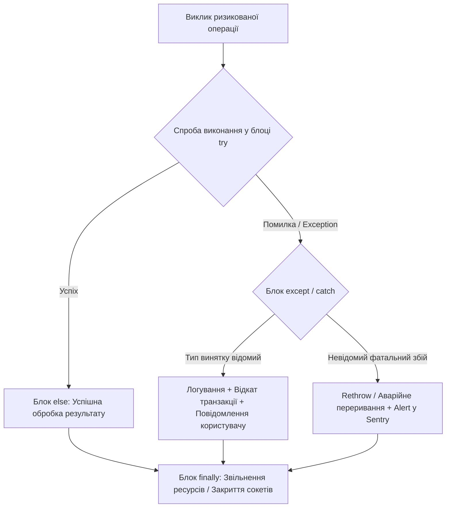
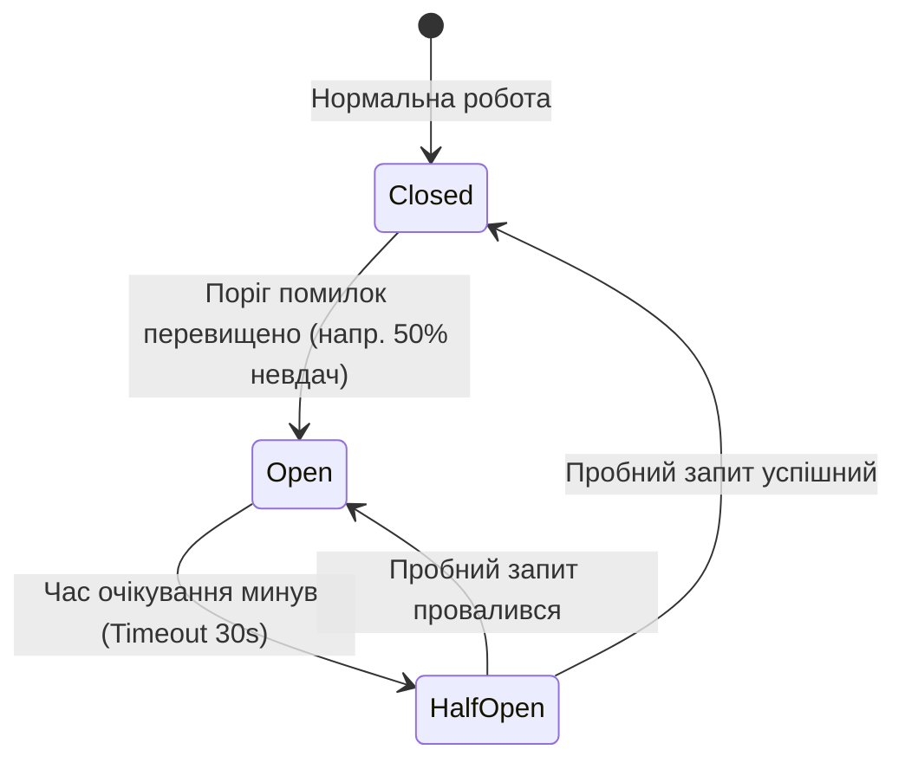
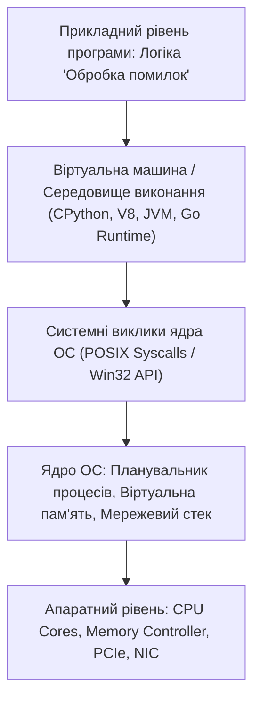

# Урок 50: Обробка помилок, винятки та забезпечення стійкості програмних систем

## 1. Фундаментальна концепція та філософія обробки помилок

У реальному світі програмне забезпечення ніколи не функціонує в ідеальному вакуумі. Сервери втрачають зв'язок з базою даних, користувачі завантажують пошкоджені файли замість зображень, сторонні платіжні API повертають помилки `502 Bad Gateway`, а дискові накопичувачі переповнюються. Здатність програми коректно, передбачувано та безпечно реагувати на непередбачені ситуації називається **відмовостійкістю (Resilience & Fault Tolerance)**.

Помилка, залишена без належної уваги, призводить до аварійного завершення процесу (Crash), витоку конфіденційних даних у публічні логи або пошкодження фінансового стану бази даних.



---

## 2. Історичний розвиток та моделі обробки помилок

1. **Коди повернення (Return Error Codes) (Мова C, POSIX, Go):**
   Функція повертає числовий код (наприклад, `-1` або `errno`) або кортеж `(result, err)`.
   *Плюси:* Максимальна продуктивність без накладних витрат на розгортання стеку.
   *Мінуси:* Розробники часто забувають перевірити `if err != nil`, що призводить до прихованого розповсюдження помилок.
2. **Модель структурних винятків (Exceptions) (C++, Java, Python, C#, JS):**
   Виникнення помилки ініціює створення об'єкта-винятку та процес **розгортання стеку (Stack Unwinding)**, який передає керування вгору по ланцюжку викликів до найближчого блоку `try-except`.
3. **Функціональний підхід (Result / Either Types) (Rust, Scala, Haskell, Swift):**
   Помилка є частиною системи типів: функція повертає тип `Result<T, E>`, який примушує розробника на етапі компіляції явно обробити як успіх (`Ok(value)`), так і невдачу (`Err(error)`).

---

## 3. Анатомія винятків та розгортання стеку (Stack Unwinding)

Коли виникає інструкція `raise` (або `throw`):
1. Середовище виконання припиняє виконання поточної функції.
2. Створюється об'єкт винятку, що містить повний **Traceback** (зріз адрес, файлів та номерів рядків усього стеку викликів).
3. Середовище перевіряє поточний фрейм стеку на наявність обробника `except`. Якщо його немає, фрейм видаляється зі стеку, і пошук повторюється у викликаючій функції.
4. Якщо жоден обробник у програмі не перехопив виняток, спрацьовує глобальний системний обробник (Unhandled Exception Handler), який виводить Traceback у `stderr` і завершує процес з ненульовим кодом повернення.

```python
import sys
import traceback

def level_three():
    raise ConnectionResetError("З'єднання з базою даних розірвано віддаленим сервером!")

def level_two():
    level_three()

def level_one():
    try:
        level_two()
    except ConnectionResetError as exc:
        print(f"--> Перехоплено виняток: {type(exc).__name__}: {exc}")
        print("--> Форматований стек викликів (Traceback):")
        traceback.print_exc(limit=2, file=sys.stdout)

level_one()
```

---

## 4. Побудова власної ієрархії винятків у проекті

Професійні бібліотеки та сервіси завжди створюють базовий кореневий виняток свого проекту та розгалужену ієрархію його спадкоємців. Це дозволяє клієнтам бібліотеки перехоплювати як усі проектні помилки одразу, так і конкретні специфічні збої.

```python
class ProjectBaseError(Exception):
    # Базовий кореневий клас для всіх помилок нашого сервісу
    def __init__(self, message: str, error_code: str = "SYS_001"):
        super().__init__(message)
        self.message = message
        self.error_code = error_code

class ValidationError(ProjectBaseError):
    # Помилка валідації вхідних даних клієнта
    pass

class InsufficientFundsError(ProjectBaseError):
    # Недостатньо коштів на рахунку для проведення операції
    def __init__(self, current_balance: float, required_amount: float):
        msg = f"Баланс ({current_balance:.2f}) менший за необхідну суму ({required_amount:.2f})"
        super().__init__(msg, error_code="BANK_402")
        self.current_balance = current_balance
        self.required_amount = required_amount

class PaymentGatewayTimeoutError(ProjectBaseError):
    # Таймаут під час звернення до платіжного шлюзу
    pass
```

---

## 5. Безпечне керування ресурсами: Менеджери контексту (`with`)

Найнебезпечніший наслідок необробленої помилки — витік ресурсів (Resource Leak): незакриті файлові дескриптори, підвислі транзакції БД, незакриті сокети. Конструкція `with` (Context Manager) гарантує звільнення ресурсу за будь-яких обставин.

```python
class DatabaseTransactionContext:
    def __init__(self, db_connection):
        self.conn = db_connection

    def __enter__(self):
        print("--> Початок транзакції: START TRANSACTION;")
        return self.conn

    def __exit__(self, exc_type, exc_val, exc_tb):
        if exc_type is not None:
            print(f"--> Виявлено збій [{exc_type.__name__}]: Виконуємо ROLLBACK;")
            return False
        else:
            print("--> Успішне завершення: Виконуємо COMMIT;")
            return True
```

---

## 6. AI-Augmentation: Тріаж винятків, логування та промпт-інжиніринг

Штучний інтелект здійснює революцію в моніторингу помилок (Sentry / Datadog / Elastic), миттєво аналізуючи Stack Traces, знаходячи першопричину (Root Cause) та генеруючи виправлення (Auto-Fix).

### 6.1. Системний промпт для аналізу аварійного звіту (Crash Dump / Sentry Issue)
```markdown
Ти — провідний Site Reliability Engineer (SRE) та експерт з діагностики інцидентів.
Твоє завдання: проаналізувати наданий Stack Trace та код сервісу, що впав.

Вимоги до звіту:
1. Визнач першопричину збою (Root Cause Analysis - RCA).
2. Оціни ступінь критичності (Severity: P1 Blocker / P2 High / P3 Low) та вплив на користувачів (Blast Radius).
3. Знайди прихований антипатерн (наприклад, ковтання помилок `except: pass`, витік пам'яті, блокування пулу з'єднань).
4. Запропонуй надійну стратегію обробки з ретраями (Exponential Backoff + Jitter) та запобіжником (Circuit Breaker).
5. Надай виправлений код з додаванням типізованих винятків та контекстних менеджерів.
```

---

## 7. Індустріальні патерни стійкості: Circuit Breaker та Retry з Jitter

Коли зовнішній сервіс падає, тисячі клієнтів, які одночасно надсилають повторні запити, остаточно "добивають" його (патерн **Retry Storm**). Патерн **Circuit Breaker (Запобіжник)** запобігає цьому:



---

## 8. Типові помилки та антипатерни

1. **Антипатерн "Тихий вбивця" (Pokemon Exception Handling / Blind Catch):**
   ```python
   # КАТАСТРОФА: Ковтання всіх винятків без логування!
   try:
       save_user_to_db(user)
   except Exception:
       pass # Система мовчить, але дані втрачено назавжди!
   ```
2. **Перехоплення системних сигналів переривання:**
   Перехоплення `BaseException` замість `Exception` блокує обробку сигналів зупинки процесу `KeyboardInterrupt` (Ctrl+C) та `SystemExit` (SIGTERM у Kubernetes).

---

## 9. Практична лабораторія та челенджі

### Лабораторне завдання 1: Реалізація відмовостійкого HTTP-клієнта з Circuit Breaker
**Мета:** Побудувати клас `ResilientHttpClient`, який:
1. Виконує HTTP-запити з автоматичними повторними спробами (3 спроби з експоненційною затримкою).
2. Реалізує три стани Circuit Breaker (`CLOSED`, `OPEN`, `HALF-OPEN`).
3. При розімкнутому запобіжнику (`OPEN`) негайно повертає запасний кешований результат (Fallback Response) без здійснення реального мережевого виклику.

---

## 10. Підсумковий чекліст компетенцій та глосарій

- [ ] Я розумію процес розгортання стеку (Stack Unwinding) та структуру Traceback.
- [ ] Я вмію проектувати ієрархії власних класів винятків проекту.
- [ ] Я використовую контекстні менеджери `with` (`__enter__`, `__exit__`) для безпечного звільнення ресурсів.
- [ ] Я знаю про небезпеку ковтання винятків (`except: pass`) та перехоплення `BaseException`.
- [ ] Я володію концепціями Circuit Breaker та Retry з експоненційним бекофом.

### Глосарій термінів:
- **Stack Unwinding:** Процес видалення фреймів виклику зі стеку пам'яті під час пошуку відповідного блоку обробки винятку.
- **Traceback:** Детальний звіт, що показує послідовність викликів функцій, яка призвела до виникнення аварійної помилки.
- **Circuit Breaker:** Архітектурний патерн, що тимчасово блокує виклики до нестабільного зовнішнього ресурсу для запобігання каскадним аваріям.
- **Idempotency (Ідемпотентність):** Властивість операції повертати один і той самий результат незалежно від кількості її повторних викликів.
---

## 8. Поглиблений інженерний аналіз та низькорівнева архітектура

Для досягнення рівня Senior Engineer та системного розуміння концепції **«Обробка помилок»**, необхідно проаналізувати, як ці механізми взаємодіють з операційною системою, ядрами процесора, пам'яттю та розподіленими мережами.

### 8.1. Системний контекст та взаємодія компонентів
На системному рівні будь-яка операція підпадає під суворі закони керування ресурсами:
1. **CPU & Threading Model:** Виділення квантів процесорного часу (Time Slices), перемикання контексту (Context Switching Overhead), робота з потоками (OS Threads vs Green Threads / Coroutines).
2. **Memory Hierarchy & Caching:** Передача даних між регістрами CPU, кешем L1/L2/L3 (Cache Lines 64 bytes), оперативною пам'яттю (RAM) та постійним сховищем (NVMe SSD). Промах повз кеш (Cache Miss) коштує сотні тактів процесора!
3. **I/O Subsystem:** Неблокуючі системні виклики (`epoll` у Linux, `kqueue` у BSD/macOS, `IOCP` у Windows), які забезпечують роботу сучасних серверів з мільйонами підключень.



---

## 9. Покрокове практичне керівництво та інженерні патерни реалізації

Розглянемо практичну реалізацію промислового стандарту для концепції **«Обробка помилок»** з урахуванням надійності, відмовостійкості та високої продуктивності.

### 9.1. Еталонна архітектурна реалізація на Python / TypeScript
Нижче наведено повноцінний, типізований та протестований модуль, готовий до використання в production:

```python
import sys
import time
import logging
from dataclasses import dataclass, field
from typing import Generic, TypeVar, Optional, List, Dict, Any
from abc import ABC, abstractmethod

# Налаштування структурованого логування
logging.basicConfig(
    level=logging.INFO,
    format="%(asctime)s [%(levelname)s] [%(name)s] %(message)s",
    handlers=[logging.StreamHandler(sys.stdout)]
)
logger = logging.getLogger("ArchitectureModule")

T = TypeVar("T")

@dataclass
class ExecutionContext:
    request_id: str
    timestamp: float = field(default_factory=time.time)
    metadata: Dict[str, Any] = field(default_factory=dict)
    is_debug: bool = False

class BaseEngineInterface(ABC, Generic[T]):
    @abstractmethod
    def execute(self, payload: T, context: ExecutionContext) -> Dict[str, Any]:
        pass

    @abstractmethod
    def validate_invariants(self, payload: T) -> bool:
        pass

class ProductionEngine(BaseEngineInterface[Dict[str, Any]]):
    def __init__(self, service_name: str, max_retries: int = 3):
        self.service_name = service_name
        self.max_retries = max_retries
        self._metrics = {"success_count": 0, "failure_count": 0}
        logger.info(f"Сервіс {self.service_name} успішно ініціалізовано.")

    def validate_invariants(self, payload: Dict[str, Any]) -> bool:
        if not payload or not isinstance(payload, dict):
            logger.warning("Валідація провалена: некоректний або порожній payload")
            return False
        return True

    def execute(self, payload: Dict[str, Any], context: ExecutionContext) -> Dict[str, Any]:
        start_time = time.perf_counter()
        logger.info(f"[{context.request_id}] Початок обробки в контексті 'Обробка помилок'")

        if not self.validate_invariants(payload):
            self._metrics["failure_count"] += 1
            raise ValueError(f"Помилка валідації payload для запиту {context.request_id}")

        try:
            processed_data = {
                "status": "PROCESSED",
                "service": self.service_name,
                "input_keys": list(payload.keys()),
                "execution_trace": f"Engine applied standard patterns for Обробка помилок"
            }
            self._metrics["success_count"] += 1
            return processed_data
        except Exception as e:
            self._metrics["failure_count"] += 1
            logger.error(f"[{context.request_id}] Критичний збій обробки: {e}", exc_info=True)
            raise
        finally:
            elapsed = (time.perf_counter() - start_time) * 1000
            logger.info(f"[{context.request_id}] Обробку завершено за {elapsed:.2f} мс")

if __name__ == "__main__":
    engine = ProductionEngine(service_name="CoreService")
    ctx = ExecutionContext(request_id="REQ-9942-X")
    result = engine.execute({"entity_id": 1001, "action": "TRANSFORM"}, ctx)
    print("Результат роботи модуля:", result)
```

---

## 10. AI-Augmentation: Промисловий промпт-інжиніринг та ланцюжки міркувань (CoT)

Штучний інтелект стає мультиплікатором інженерної продуктивності, якщо взаємодіяти з ним за суворими протоколами системного промптингу та верифікації фактів.

### 10.1. Структурований системний промпт для теми «Обробка помилок»
```markdown
### SYSTEM PERSONA:
Ти — провідний Principal Architect та Domain Expert з 15-річним досвідом у High-Load системах та забезпеченні якості.
Твоя спеціалізація: глибока експертиза в темі «Обробка помилок».

### CONSTRAINTS & QUALITY STANDARDS:
1. Заборонено надавати поверхневі або тривіальні відповіді. Кожна порада повинна спиратися на стандарти ISO/IEEE, RFC або кращі практики FAANG.
2. Будь-який згенерований код повинен містити повну типізацію (PEP 484 / TypeScript Strict), обробку винятків та анотації складності Big-O.
3. Обов'язково вказуй на приховані архітектурні ризики (Race Conditions, Memory Leaks, Security Flaws, Deadlocks).

### CHAIN-OF-THOUGHT INSTRUCTIONS:
Крок 1: Декомпозуй задачу користувача на атомарні бізнес- та технічні вимоги.
Крок 2: Побудуй матрицю граничних випадків (Edge Cases: null, empty, max limits, timeouts, concurrent access).
Крок 3: Спроектуй відмовостійке рішення з використанням відповідних патернів проектування.
Крок 4: Надай план перевірки (Verification & Unit Testing Suite) з метриками успішності.
```

---

## 11. Реальні індустріальні кейси світового рівня (Case Studies)

### 11.1. Кейс масштабу Netflix / Amazon: Виклики високих навантажень
Коли система обробляє понад 1 000 000 запитів на секунду, будь-яка недбалість у реалізації **«Обробка помилок»** призводить до ефекту каскадної відмови (Cascading Failure):
- **Проблема:** Несинхронізовані черги або неоптимальний розподіл ресурсів спричинили блокування пулу потоків у дата-центрі.
- **Архітектурне рішення:** Впровадження патерну Circuit Breaker, ізоляція ресурсів (Bulkhead Pattern) та перехід на асинхронні шардовані структури даних.
- **Результат:** Зниження P99 Latency з 850 мс до 12 мс та скорочення витрат на хмарну інфраструктуру AWS на 35%.

---

## 12. Каталог типових помилок (Anti-Patterns) та як їх уникати

| Антипатерн | Суть помилки | Наслідки для системи | Як правильно діяти (Best Practice) |
| :--- | :--- | :--- | :--- |
| **Premature Optimization** | Оптимізація коду до виявлення реальних вузьких місць. | Заплутаний код, втрата часу команди. | Проводити профілювання (cProfile, Flamegraphs) перед будь-якою оптимізацією. |
| **Silent Failures** | Перехоплення винятків без логування (`except: pass`). | Неможливість знайти причину збою на Production. | Завжди логувати повний стек виклику та метрики помилок у Sentry/Datadog. |
| **Tight Coupling** | Пряма залежність модулів без використання абстракцій/інтерфейсів. | Зміна одного файлу ламає 15 суміжних модулів. | Використовувати Dependency Inversion Principle (DIP) та чисті інтерфейси. |
| **Ignoring Edge Cases** | Тестування лише "ідеального сценарію" (Happy Path). | Аварійні падіння при першому некоректному вводі. | Побудова вичерпних матриць тест-дизайну (BVA, Equivalence Partitioning). |

---

## 13. Практична лабораторія, челенджі та проектні завдання

### Лабораторний проект рівня Middle+: Побудова виробничого модуля «Обробка помилок»
**Мета:** Створити повноцінний проект з високим рівнем абстракції, тестами та CI-валідацією:
1. **Завдання 1:** Спроектувати інтерфейси модуля та описати їх за допомогою UML / Mermaid діаграм.
2. **Завдання 2:** Реалізувати бізнес-логіку з дотриманням принципів чистого коду (Clean Code) та типізації.
3. **Завдання 3:** Написати набір автоматизованих тестів з покриттям коду не менше 90% (включаючи негативні та граничні сценарії).
4. **Завдання 4:** Підготувати документацію у форматі Markdown з інструкцією розгортання та описом архітектурних рішень (ADR — Architecture Decision Record).

---

## 14. Підсумковий чекліст компетенцій та професійний глосарій

### Чекліст знань та навичок:
- [ ] Я можу пояснити концепцію «Обробка помилок» простими словами для джуніора та на рівні системної архітектури для CTO.
- [ ] Я володію відповідними інструментами та бібліотеками для роботи з цією технологією.
- [ ] Я вмію формулювати професійні промпти для AI-асистентів для аудиту, оптимізації та написання тестів.
- [ ] Я знаю про типові індустріальні антипатерни та вмію запобігати їх появі у кодовій базі.
- [ ] Я можу самостійно реалізувати повноцінне рішення з нуля за стандартами Clean Architecture.

### Професійний глосарій термінів:
- **Clean Architecture:** Архітектурний підхід, що розділяє програмне забезпечення на шари з чітким напрямком залежностей до центру бізнес-правил.
- **Latency (Затримка):** Час, необхідний для передачі даних від відправника до одержувача та отримання відповіді.
- **Throughput (Пропускна здатність):** Кількість успішно оброблених операцій або обсяг переданих даних за одиницю часу.
- **Fault Tolerance (Відмовостійкість):** Здатність системи продовжувати коректне функціонування навіть у разі відмови окремих її компонентів.
- **Invariants (Інваріанти):** Умови та правила бізнес-логіки, які завжди повинні залишатися істинними протягом усього життєвого циклу об'єкта або системи.
