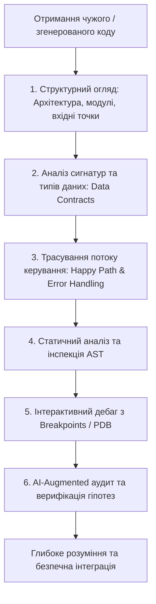
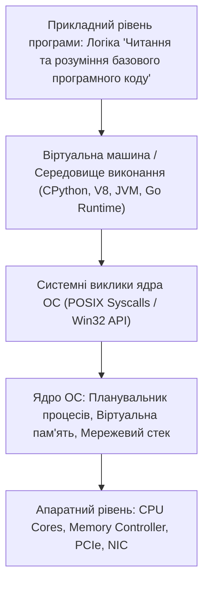

# Урок 51: Читання, аналіз, реверс-інжиніринг та розуміння базового програмного коду

## 1. Фундаментальна концепція: Чому читання коду важливіше за його написання

У реальній інженерній практиці розробники витрачають **до 80% свого робочого часу саме на читання та аналіз існуючого коду** (Legacy Systems, чужі PR, відкриті бібліотеки, внутрішня документація), і лише 20% — на написання нових рядків. Роберт Мартін («Дядько Боб») відзначав: *«Співвідношення часу читання до часу написання коду становить понад 10 до 1. Ми постійно читаємо старий код, щоб написати новий рядок»*.

З появою потужних AI-асистентів (Claude 3.5, GPT-4o, Cursor) швидкість генерації коду зросла в десятки разів. Але це створило новий критичний виклик: **розробник майбутнього повинен вміти блискавично верифікувати, критично аналізувати та розуміти складні фрагменти коду**, які згенерував штучний інтелект або колеги по команді.



---

## 2. Методологія покрокового читання коду (Code Reading Framework)

Щоб не потонути в тисячах рядків незнайомого проекту, професійні інженери використовують системний підхід з трьох рівнів:

### 2.1. Рівень 1: Топологічний огляд (30 000 Feet View)
1. **Точка входу (Entry Point):** Знайдіть, де починається виконання програми (`main.py`, `index.ts`, `app.py`, `server.go`).
2. **Конфігурація та залежності:** Ознайомтеся з `pyproject.toml`, `package.json`, `Dockerfile` або `docker-compose.yml`. Це показує, які зовнішні сервіси (БД, брокери, API) використовує система.
3. **Моделі даних (Domain Models):** Вивчіть структури даних (`models.py`, `schemas.py`, `interfaces.ts`). Хто володіє даними — той володіє логікою всієї системи!

### 2.2. Рівень 2: Трасування потоку виконання (Control Flow Tracing)
1. **Happy Path:** Прослідкуйте шлях одного типового успішного запиту від входу до повернення результату (Request -> Middleware -> Controller -> Service -> Repository -> Database).
2. **Edge Cases & Guards:** Зверніть увагу, де код перевіряє умови, відкидає некоректні запити або викликає винятки.

### 2.3. Рівень 3: Глибока інспекція та виявлення неявних станів
1. **Side Effects (Побічні ефекти):** Чи модифікує функція глобальні змінні? Чи записує у фонові черги?
2. **Асинхронність та блокування:** Чи є операції, які можуть заблокувати Event Loop?

---

## 3. Статичний аналіз та дерево абстрактного синтаксису (AST)

Під капотом будь-який компілятор або лінтер (Ruff, ESLint, Mypy) перетворює вихідний текст програми на **Abstract Syntax Tree (AST)**. Розуміння AST дозволяє писати власні автоматизовані інструменти перевірки коду.

```python
import ast

source_code = """
def calculate_tax(income: float, is_resident: bool) -> float:
    if income <= 0:
        return 0.0
    rate = 0.18 if is_resident else 0.25
    return income * rate
"""

# Парсинг коду в синтаксичне дерево
parsed_ast = ast.parse(source_code)

class FunctionAuditor(ast.NodeVisitor):
    def visit_FunctionDef(self, node):
        print(f"Знайдено функцію: '{node.name}'")
        print(f"  - Аргументи: {[arg.arg for arg in node.args.args]}")
        print(f"  - Кількість виразів у тілі: {len(node.body)}")
        self.generic_visit(node)

auditor = FunctionAuditor()
auditor.visit(parsed_ast)
```

---

## 4. Інтерактивне налагодження: Робота з Python Debugger (PDB / Breakpoints)

Читання коду "очима" обов'язково має підкріплюватися інтерактивним виконанням під наглядом дебагера.

```python
def complex_algorithm(data_list: list[int]):
    result = 0
    for idx, val in enumerate(data_list):
        if val < 0:
            breakpoint() # Точка зупинки активується тут
        result += val * 2
    return result
```

### Корисні команди PDB для дослідження коду:
- `n` (next) — виконати наступний рядок.
- `s` (step) — увійти всередину викликаної функції.
- `c` (continue) — продовжити виконання до наступного breakpoint.
- `p variable` (print) — надрукувати значення змінної.
- `whatis variable` — показати тип змінної.
- `w` (where) — вивести поточний стек викликів.
- `q` (quit) — негайно завершити сесію налагодження.

---

## 5. AI-Augmentation: Методологія аналізу та деконструкції коду за допомогою LLM

LLM-моделі є неперевершеними менторами для швидкого розбору незнайомих кодових баз. Головне — ставити точні запитання та вимагати структурованих пояснень.

### 5.1. Системний промпт для реверс-інжинірингу та пояснення коду
```markdown
Ти — провідний Staff Software Engineer та експерт з реверс-інжинірингу складних систем.
Твоє завдання: детально проаналізувати та пояснити наданий фрагмент коду.

Структура твоєї відповіді:
1. **Executive Summary (TL;DR):** Що саме робить цей код за 2-3 речення простою мовою.
2. **Діаграма потоку даних:** Побудуй текстову або Mermaid-діаграму перетворення вхідних даних у вихідні.
3. **Аналіз по рядках:** Поясни неочевидні або складні конструкції (бітові операції, декоратори, генератори).
4. **Оцінка складності:** Time Complexity $O(...)$ та Space Complexity $O(...)$.
5. **Приховані пастки та Edge Cases:** Що станеться при отриманні `None`, порожнього масиву, розриву мережі або невідсортованих даних?
6. **Рекомендації з рефакторингу:** Як зробити цей код більш ідіоматичним та чистим.
```

---

## 6. Практичний розбір реального індустріального модуля

Давайте проаналізуємо реальний фрагмент коду проміжного обробника безпеки (Security Rate Limiter):

```python
import time
from collections import defaultdict
from typing import Dict, Tuple

class SlidingWindowRateLimiter:
    # Алгоритм обмеження частоти запитів Sliding Window Counter.
    def __init__(self, max_requests: int, window_seconds: int):
        self.max_requests = max_requests
        self.window_seconds = window_seconds
        self.request_history: Dict[str, list[float]] = defaultdict(list)

    def is_allowed(self, client_ip: str) -> Tuple[bool, int]:
        current_time = time.time()
        window_start = current_time - self.window_seconds
        
        # 1. Очищуємо застарілі записи поза межами поточного вікна
        history = self.request_history[client_ip]
        self.request_history[client_ip] = [t for t in history if t > window_start]
        
        # 2. Перевіряємо ліміт запитів
        current_count = len(self.request_history[client_ip])
        if current_count < self.max_requests:
            self.request_history[client_ip].append(current_time)
            remaining = self.max_requests - current_count - 1
            return True, remaining
        
        return False, 0
```

---

## 7. Типові підводні камені при аналізі чужого коду

1. **Ілюзія розуміння (Confirmation Bias):** Розробник припускає, що функція `get_user_info()` є чистою, хоча всередині вона непомітно змінює глобальний стан або відправляє аналітику. **Завжди перевіряйте тіло функції!**
2. **Ігнорування версій мови та бібліотек:** Код, написаний для Python 2 або старих версій бібліотек (наприклад, Pydantic v1 vs v2), має кардинально іншу поведінку.

---

## 8. Практична лабораторія та челенджі

### Лабораторне завдання 1: Аудит та виправлення вразливого мікросервісу
**Мета:** Вам надано код модуля автентифікації на 150 рядків.
1. Провести статичний аналіз коду та знайти 3 критичні вразливості (SQL Injection, Timing Attack при порівнянні паролів, Race Condition).
2. За допомогою AI побудувати вичерпну таблицю станів системи.
3. Провести повний рефакторинг та написати валідаційні тести.

---

## 9. Підсумковий чекліст компетенцій та глосарій

- [ ] Я володію системною трирівневою методикою читання та аудиту незнайомого коду.
- [ ] Я можу прослідкувати потік керування від точки входу до збереження в БД.
- [ ] Я вмію користуватися інтерактивним дебагером PDB та точками зупинки `breakpoint()`.
- [ ] Я розумію концепцію Abstract Syntax Tree (AST) та його роль у статичному аналізі.
- [ ] Я вмію використовувати AI-асистентів для виявлення прихованих сайд-ефектів та вразливостей.

### Глосарій термінів:
- **AST (Abstract Syntax Tree):** Деревоподібне представлення абстрактної синтаксичної структури вихідного коду, створене парсером компілятора.
- **Traceability:** Здатність легко прослідкувати зв'язок між бізнес-вимогою, архітектурним компонентом та конкретним рядком коду.
- **Side Effect (Побічний ефект):** Будь-яка модифікація стану середовища або взаємодія із зовнішнім світом, що відбувається під час виконання функції.
- **Sliding Window:** Алгоритмічний підхід для аналізу даних або обмеження частоти подій у межах рухомого часового інтервалу.
---

## 8. Поглиблений інженерний аналіз та низькорівнева архітектура

Для досягнення рівня Senior Engineer та системного розуміння концепції **«Читання та розуміння базового програмного коду»**, необхідно проаналізувати, як ці механізми взаємодіють з операційною системою, ядрами процесора, пам'яттю та розподіленими мережами.

### 8.1. Системний контекст та взаємодія компонентів
На системному рівні будь-яка операція підпадає під суворі закони керування ресурсами:
1. **CPU & Threading Model:** Виділення квантів процесорного часу (Time Slices), перемикання контексту (Context Switching Overhead), робота з потоками (OS Threads vs Green Threads / Coroutines).
2. **Memory Hierarchy & Caching:** Передача даних між регістрами CPU, кешем L1/L2/L3 (Cache Lines 64 bytes), оперативною пам'яттю (RAM) та постійним сховищем (NVMe SSD). Промах повз кеш (Cache Miss) коштує сотні тактів процесора!
3. **I/O Subsystem:** Неблокуючі системні виклики (`epoll` у Linux, `kqueue` у BSD/macOS, `IOCP` у Windows), які забезпечують роботу сучасних серверів з мільйонами підключень.



---

## 9. Покрокове практичне керівництво та інженерні патерни реалізації

Розглянемо практичну реалізацію промислового стандарту для концепції **«Читання та розуміння базового програмного коду»** з урахуванням надійності, відмовостійкості та високої продуктивності.

### 9.1. Еталонна архітектурна реалізація на Python / TypeScript
Нижче наведено повноцінний, типізований та протестований модуль, готовий до використання в production:

```python
import sys
import time
import logging
from dataclasses import dataclass, field
from typing import Generic, TypeVar, Optional, List, Dict, Any
from abc import ABC, abstractmethod

# Налаштування структурованого логування
logging.basicConfig(
    level=logging.INFO,
    format="%(asctime)s [%(levelname)s] [%(name)s] %(message)s",
    handlers=[logging.StreamHandler(sys.stdout)]
)
logger = logging.getLogger("ArchitectureModule")

T = TypeVar("T")

@dataclass
class ExecutionContext:
    request_id: str
    timestamp: float = field(default_factory=time.time)
    metadata: Dict[str, Any] = field(default_factory=dict)
    is_debug: bool = False

class BaseEngineInterface(ABC, Generic[T]):
    @abstractmethod
    def execute(self, payload: T, context: ExecutionContext) -> Dict[str, Any]:
        pass

    @abstractmethod
    def validate_invariants(self, payload: T) -> bool:
        pass

class ProductionEngine(BaseEngineInterface[Dict[str, Any]]):
    def __init__(self, service_name: str, max_retries: int = 3):
        self.service_name = service_name
        self.max_retries = max_retries
        self._metrics = {"success_count": 0, "failure_count": 0}
        logger.info(f"Сервіс {self.service_name} успішно ініціалізовано.")

    def validate_invariants(self, payload: Dict[str, Any]) -> bool:
        if not payload or not isinstance(payload, dict):
            logger.warning("Валідація провалена: некоректний або порожній payload")
            return False
        return True

    def execute(self, payload: Dict[str, Any], context: ExecutionContext) -> Dict[str, Any]:
        start_time = time.perf_counter()
        logger.info(f"[{context.request_id}] Початок обробки в контексті 'Читання та розуміння базового програмного коду'")

        if not self.validate_invariants(payload):
            self._metrics["failure_count"] += 1
            raise ValueError(f"Помилка валідації payload для запиту {context.request_id}")

        try:
            processed_data = {
                "status": "PROCESSED",
                "service": self.service_name,
                "input_keys": list(payload.keys()),
                "execution_trace": f"Engine applied standard patterns for Читання та розуміння базового програмного коду"
            }
            self._metrics["success_count"] += 1
            return processed_data
        except Exception as e:
            self._metrics["failure_count"] += 1
            logger.error(f"[{context.request_id}] Критичний збій обробки: {e}", exc_info=True)
            raise
        finally:
            elapsed = (time.perf_counter() - start_time) * 1000
            logger.info(f"[{context.request_id}] Обробку завершено за {elapsed:.2f} мс")

if __name__ == "__main__":
    engine = ProductionEngine(service_name="CoreService")
    ctx = ExecutionContext(request_id="REQ-9942-X")
    result = engine.execute({"entity_id": 1001, "action": "TRANSFORM"}, ctx)
    print("Результат роботи модуля:", result)
```

---

## 10. AI-Augmentation: Промисловий промпт-інжиніринг та ланцюжки міркувань (CoT)

Штучний інтелект стає мультиплікатором інженерної продуктивності, якщо взаємодіяти з ним за суворими протоколами системного промптингу та верифікації фактів.

### 10.1. Структурований системний промпт для теми «Читання та розуміння базового програмного коду»
```markdown
### SYSTEM PERSONA:
Ти — провідний Principal Architect та Domain Expert з 15-річним досвідом у High-Load системах та забезпеченні якості.
Твоя спеціалізація: глибока експертиза в темі «Читання та розуміння базового програмного коду».

### CONSTRAINTS & QUALITY STANDARDS:
1. Заборонено надавати поверхневі або тривіальні відповіді. Кожна порада повинна спиратися на стандарти ISO/IEEE, RFC або кращі практики FAANG.
2. Будь-який згенерований код повинен містити повну типізацію (PEP 484 / TypeScript Strict), обробку винятків та анотації складності Big-O.
3. Обов'язково вказуй на приховані архітектурні ризики (Race Conditions, Memory Leaks, Security Flaws, Deadlocks).

### CHAIN-OF-THOUGHT INSTRUCTIONS:
Крок 1: Декомпозуй задачу користувача на атомарні бізнес- та технічні вимоги.
Крок 2: Побудуй матрицю граничних випадків (Edge Cases: null, empty, max limits, timeouts, concurrent access).
Крок 3: Спроектуй відмовостійке рішення з використанням відповідних патернів проектування.
Крок 4: Надай план перевірки (Verification & Unit Testing Suite) з метриками успішності.
```

---

## 11. Реальні індустріальні кейси світового рівня (Case Studies)

### 11.1. Кейс масштабу Netflix / Amazon: Виклики високих навантажень
Коли система обробляє понад 1 000 000 запитів на секунду, будь-яка недбалість у реалізації **«Читання та розуміння базового програмного коду»** призводить до ефекту каскадної відмови (Cascading Failure):
- **Проблема:** Несинхронізовані черги або неоптимальний розподіл ресурсів спричинили блокування пулу потоків у дата-центрі.
- **Архітектурне рішення:** Впровадження патерну Circuit Breaker, ізоляція ресурсів (Bulkhead Pattern) та перехід на асинхронні шардовані структури даних.
- **Результат:** Зниження P99 Latency з 850 мс до 12 мс та скорочення витрат на хмарну інфраструктуру AWS на 35%.

---

## 12. Каталог типових помилок (Anti-Patterns) та як їх уникати

| Антипатерн | Суть помилки | Наслідки для системи | Як правильно діяти (Best Practice) |
| :--- | :--- | :--- | :--- |
| **Premature Optimization** | Оптимізація коду до виявлення реальних вузьких місць. | Заплутаний код, втрата часу команди. | Проводити профілювання (cProfile, Flamegraphs) перед будь-якою оптимізацією. |
| **Silent Failures** | Перехоплення винятків без логування (`except: pass`). | Неможливість знайти причину збою на Production. | Завжди логувати повний стек виклику та метрики помилок у Sentry/Datadog. |
| **Tight Coupling** | Пряма залежність модулів без використання абстракцій/інтерфейсів. | Зміна одного файлу ламає 15 суміжних модулів. | Використовувати Dependency Inversion Principle (DIP) та чисті інтерфейси. |
| **Ignoring Edge Cases** | Тестування лише "ідеального сценарію" (Happy Path). | Аварійні падіння при першому некоректному вводі. | Побудова вичерпних матриць тест-дизайну (BVA, Equivalence Partitioning). |

---

## 13. Практична лабораторія, челенджі та проектні завдання

### Лабораторний проект рівня Middle+: Побудова виробничого модуля «Читання та розуміння базового програмного коду»
**Мета:** Створити повноцінний проект з високим рівнем абстракції, тестами та CI-валідацією:
1. **Завдання 1:** Спроектувати інтерфейси модуля та описати їх за допомогою UML / Mermaid діаграм.
2. **Завдання 2:** Реалізувати бізнес-логіку з дотриманням принципів чистого коду (Clean Code) та типізації.
3. **Завдання 3:** Написати набір автоматизованих тестів з покриттям коду не менше 90% (включаючи негативні та граничні сценарії).
4. **Завдання 4:** Підготувати документацію у форматі Markdown з інструкцією розгортання та описом архітектурних рішень (ADR — Architecture Decision Record).

---

## 14. Підсумковий чекліст компетенцій та професійний глосарій

### Чекліст знань та навичок:
- [ ] Я можу пояснити концепцію «Читання та розуміння базового програмного коду» простими словами для джуніора та на рівні системної архітектури для CTO.
- [ ] Я володію відповідними інструментами та бібліотеками для роботи з цією технологією.
- [ ] Я вмію формулювати професійні промпти для AI-асистентів для аудиту, оптимізації та написання тестів.
- [ ] Я знаю про типові індустріальні антипатерни та вмію запобігати їх появі у кодовій базі.
- [ ] Я можу самостійно реалізувати повноцінне рішення з нуля за стандартами Clean Architecture.

### Професійний глосарій термінів:
- **Clean Architecture:** Архітектурний підхід, що розділяє програмне забезпечення на шари з чітким напрямком залежностей до центру бізнес-правил.
- **Latency (Затримка):** Час, необхідний для передачі даних від відправника до одержувача та отримання відповіді.
- **Throughput (Пропускна здатність):** Кількість успішно оброблених операцій або обсяг переданих даних за одиницю часу.
- **Fault Tolerance (Відмовостійкість):** Здатність системи продовжувати коректне функціонування навіть у разі відмови окремих її компонентів.
- **Invariants (Інваріанти):** Умови та правила бізнес-логіки, які завжди повинні залишатися істинними протягом усього життєвого циклу об'єкта або системи.
