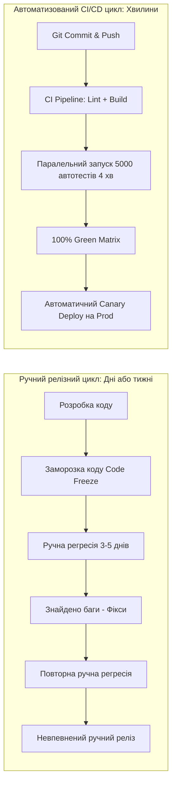
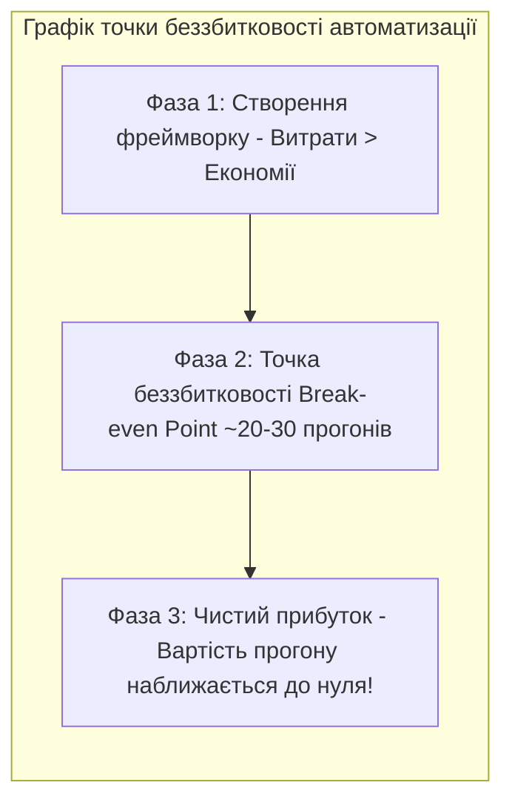
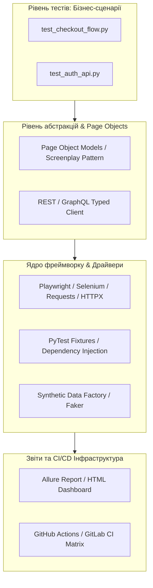
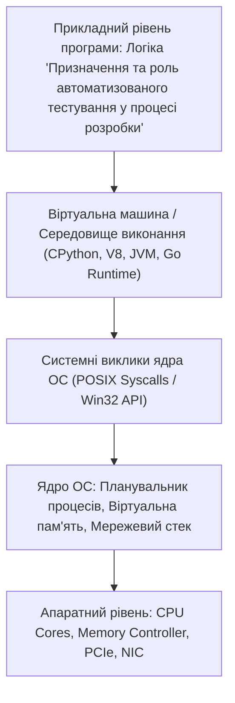

# Урок 57: Призначення, економіка та стратегічна роль автоматизованого тестування у процесі розробки

## 1. Фундаментальна концепція та філософія автоматизації тестування

Автоматизація тестування (Test Automation) — це застосування програмних засобів, бібліотек, тестових фреймворків та інфраструктури виконання для автономного прогону тестових сценаріїв, верифікації очікуваних результатів, контролю якості коду та надання миттєвого зворотного зв'язку інженерній команді без безпосередньої участі людини під час кожного запуску.

У сучасному світі безперервної інтеграції та доставки (CI/CD), де такі технологічні гіганти, як Amazon, Netflix, Meta та Google, здійснюють тисячі розгортань коду на день, **ручне тестування кожного релізу фізично неможливе**. Автоматизація перетворює забезпечення якості з «вузького місця» (Bottleneck), що гальмує бізнес, на потужний драйвер швидкості розробки (Delivery Velocity) та технологічної стабільності.



---

## 2. Економічна модель та розрахунок окупності автоматизації (Test Automation ROI)

Автоматизація тестування — це серйозна інвестиція, яка вимагає витрат на розробку коду тестів, створення фреймворку, підтримку тестової інфраструктури (Selenium Grid, Playwright Sharding, Docker, CI Runners) та постійний менеджмент нестабільних тестів (Flaky Tests).

### 2.1. Формула повернення інвестицій (Return on Investment - ROI)
$$\text{ROI} = \frac{\text{Економія від автоматизації} - \text{Витрати на автоматизацію}}{\text{Витрати на автоматизацію}} \times 100\%$$

Де:
- **Економія:** $(\text{Час ручного прогону} \times \text{Кількість релізів} \times \text{Погодинна ставка QA}) + \text{Запобігання втратам від багів на Production}$.
- **Витрати:** $(\text{Час на створення фреймворку та тестів} \times \text{Ставка SDET}) + \text{Витрати на підтримку та оновлення} + \text{Вартість серверів CI/CD}$.



---

## 3. Ключові цілі та технічні переваги автоматизації

1. **Швидкість зворотного зв'язку (Fast Feedback Loop):** Розробник отримує звіт про стан коду через 3–5 хвилин після `git push`, а не через 3 дні після передачі в QA.
2. **Невблаганна точність та повторюваність:** Автотест ніколи не втомиться, не пропустить крок через неуважність і завжди перевірить 1 000 полів форми абсолютно однаково.
3. **Вивільнення інтелектуального ресурсу QA:** Рутинні регресійні перевірки виконує машина, а QA-інженери фокусуються на аналізі ризиків, дослідницькому тестуванні, архітектурі та безпеці.
4. **Високе тестове покриття (Test Coverage):** Можливість щоночі проганяти десятки тисяч комбінацій даних (Data-Driven Testing), що фізично недоступно людині.
5. **Тестування нефункціональних вимог:** Навантажувальне тестування (Load & Stress Testing на 100 000 користувачів) та тестування продуктивності API неможливо виконати вручну.

---

## 4. Класичні компоненти та архітектура сучасного тестового фреймворку

Сучасний проект автоматизації тестування (на Python PyTest, TypeScript Playwright або Java JUnit) проектується як повноцінний програмний продукт за всіма законами архітектури:



---

## 5. Практичний приклад: Чистий автотест на Python + Playwright з Page Object Model

```python
import pytest
from playwright.sync_api import Page, expect

# 1. Page Object Model (Інкапсуляція селекторів та взаємодій)
class LoginPage:
    def __init__(self, page: Page):
        self.page = page
        self.username_input = page.locator("#username")
        self.password_input = page.locator("#password")
        self.submit_button = page.locator("button[type='submit']")
        self.error_banner = page.locator(".alert-danger")

    def navigate(self):
        self.page.goto("https://app.example.com/login")

    def login(self, username: str, password: str):
        self.username_input.fill(username)
        self.password_input.fill(password)
        self.submit_button.click()

# 2. Автоматизований тест-сьют
def test_successful_login(page: Page):
    login_page = LoginPage(page)
    login_page.navigate()
    login_page.login("standard_user", "SecretPass123!")
    
    # Верифікація за допомогою вбудованих автоочікувань Playwright (Web-First Assertions)
    expect(page).to_have_url("https://app.example.com/dashboard")
    expect(page.locator(".welcome-header")).to_contain_text("Ласкаво просимо")

def test_invalid_password_shows_error(page: Page):
    login_page = LoginPage(page)
    login_page.navigate()
    login_page.login("standard_user", "WrongPassword")
    
    expect(login_page.error_banner).to_be_visible()
    expect(login_page.error_banner).to_contain_text("Невірний логін або пароль")
```

---

## 6. AI-Augmentation: Штучний інтелект у сучасному Test Automation

Сучасний SDET (Software Development Engineer in Test) використовує AI-інструменти для:
1. **Self-Healing Tests (Самовідновлювальні тести):** Якщо розробник змінив `id="submit-btn"` на `data-testid="checkout-button"`, AI-драйвер аналізує DOM-дерево і знаходить потрібну кнопку без падіння тесту.
2. **Генерація Page Objects та фікстур:** AI аналізує HTML/DOM сторінки або Swagger OpenAPI схему та генерує готові типізовані класи клієнтів.
3. **Автоматична класифікація падінь (Failure Triage):** Розрізнення падінь через реальні дефекти бекенду від мережевих таймаутів та нестабільних середовищ.

---

## 7. Типові помилки та антипатерни в автоматизації

1. **Антипатерн "Автоматизація заради автоматизації":** Написання складних автотестів на фічі, які змінюються щотижня або використовуються один раз на рік.
2. **Антипатерн "Ігнорування нестабільних тестів (Flaky Tests)":** Коли тести іноді падають через `time.sleep()`, і команда починає ігнорувати червоні білди в CI. Завжди використовуйте явні очікування (Explicit Waits / Web-First Assertions)!

---

## 8. Практична лабораторія та челенджі

### Лабораторне завдання 1: Розрахунок бізнес-кейсу автоматизації для фінтех-проекту
**Мета:** Надати фінансове обґрунтування для CTO щодо переходу з ручного регресійного тестування на автоматизований CI-пайплайн:
1. Ручний регрес: 2 QA, 16 годин на кожен реліз, 4 релізи на місяць, ставка $25/год.
2. Автоматизація: розробка фреймворку 160 годин (SDET $40/год), підтримка 10 год/міс, хмарні раннери $50/міс.
3. Розрахувати точку беззбитковості (Break-even point) та окупність інвестицій за 1 рік (1-Year ROI).

---

## 9. Підсумковий чекліст компетенцій та глосарій

- [ ] Я можу пояснити стратегічне призначення автоматизації тестування у CI/CD.
- [ ] Я вмію розраховувати окупність автоматизації (Test Automation ROI).
- [ ] Я розумію архітектуру тестового фреймворку та патерн Page Object Model (POM).
- [ ] Я знаю про концепції Web-First Assertions, Flaky Tests та Self-Healing селектори.
- [ ] Я вмію використовувати AI для прискорення написання автотестів та тріажу падінь.

### Глосарій термінів:
- **SDET (Software Development Engineer in Test):** Інженер-програміст, який спеціалізується на розробці інструментів та фреймворків тестування.
- **Flaky Test:** Нестабільний тест, який без зміни вихідного коду може випадково проходити або падати під час різних запусків.
- **Page Object Model (POM):** Патерн проектування, що розділяє бізнес-логіку тестів від деталей взаємодії з користувацьким інтерфейсом.
- **Web-First Assertions:** Механізм перевірок у сучасних фреймворках (Playwright), який автоматично очікує виконання умови з заданим таймаутом перед фіксацією помилки.
---

## 8. Поглиблений інженерний аналіз та низькорівнева архітектура

Для досягнення рівня Senior Engineer та системного розуміння концепції **«Призначення та роль автоматизованого тестування у процесі розробки»**, необхідно проаналізувати, як ці механізми взаємодіють з операційною системою, ядрами процесора, пам'яттю та розподіленими мережами.

### 8.1. Системний контекст та взаємодія компонентів
На системному рівні будь-яка операція підпадає під суворі закони керування ресурсами:
1. **CPU & Threading Model:** Виділення квантів процесорного часу (Time Slices), перемикання контексту (Context Switching Overhead), робота з потоками (OS Threads vs Green Threads / Coroutines).
2. **Memory Hierarchy & Caching:** Передача даних між регістрами CPU, кешем L1/L2/L3 (Cache Lines 64 bytes), оперативною пам'яттю (RAM) та постійним сховищем (NVMe SSD). Промах повз кеш (Cache Miss) коштує сотні тактів процесора!
3. **I/O Subsystem:** Неблокуючі системні виклики (`epoll` у Linux, `kqueue` у BSD/macOS, `IOCP` у Windows), які забезпечують роботу сучасних серверів з мільйонами підключень.



---

## 9. Покрокове практичне керівництво та інженерні патерни реалізації

Розглянемо практичну реалізацію промислового стандарту для концепції **«Призначення та роль автоматизованого тестування у процесі розробки»** з урахуванням надійності, відмовостійкості та високої продуктивності.

### 9.1. Еталонна архітектурна реалізація на Python / TypeScript
Нижче наведено повноцінний, типізований та протестований модуль, готовий до використання в production:

```python
import sys
import time
import logging
from dataclasses import dataclass, field
from typing import Generic, TypeVar, Optional, List, Dict, Any
from abc import ABC, abstractmethod

# Налаштування структурованого логування
logging.basicConfig(
    level=logging.INFO,
    format="%(asctime)s [%(levelname)s] [%(name)s] %(message)s",
    handlers=[logging.StreamHandler(sys.stdout)]
)
logger = logging.getLogger("ArchitectureModule")

T = TypeVar("T")

@dataclass
class ExecutionContext:
    request_id: str
    timestamp: float = field(default_factory=time.time)
    metadata: Dict[str, Any] = field(default_factory=dict)
    is_debug: bool = False

class BaseEngineInterface(ABC, Generic[T]):
    @abstractmethod
    def execute(self, payload: T, context: ExecutionContext) -> Dict[str, Any]:
        pass

    @abstractmethod
    def validate_invariants(self, payload: T) -> bool:
        pass

class ProductionEngine(BaseEngineInterface[Dict[str, Any]]):
    def __init__(self, service_name: str, max_retries: int = 3):
        self.service_name = service_name
        self.max_retries = max_retries
        self._metrics = {"success_count": 0, "failure_count": 0}
        logger.info(f"Сервіс {self.service_name} успішно ініціалізовано.")

    def validate_invariants(self, payload: Dict[str, Any]) -> bool:
        if not payload or not isinstance(payload, dict):
            logger.warning("Валідація провалена: некоректний або порожній payload")
            return False
        return True

    def execute(self, payload: Dict[str, Any], context: ExecutionContext) -> Dict[str, Any]:
        start_time = time.perf_counter()
        logger.info(f"[{context.request_id}] Початок обробки в контексті 'Призначення та роль автоматизованого тестування у процесі розробки'")

        if not self.validate_invariants(payload):
            self._metrics["failure_count"] += 1
            raise ValueError(f"Помилка валідації payload для запиту {context.request_id}")

        try:
            processed_data = {
                "status": "PROCESSED",
                "service": self.service_name,
                "input_keys": list(payload.keys()),
                "execution_trace": f"Engine applied standard patterns for Призначення та роль автоматизованого тестування у процесі розробки"
            }
            self._metrics["success_count"] += 1
            return processed_data
        except Exception as e:
            self._metrics["failure_count"] += 1
            logger.error(f"[{context.request_id}] Критичний збій обробки: {e}", exc_info=True)
            raise
        finally:
            elapsed = (time.perf_counter() - start_time) * 1000
            logger.info(f"[{context.request_id}] Обробку завершено за {elapsed:.2f} мс")

if __name__ == "__main__":
    engine = ProductionEngine(service_name="CoreService")
    ctx = ExecutionContext(request_id="REQ-9942-X")
    result = engine.execute({"entity_id": 1001, "action": "TRANSFORM"}, ctx)
    print("Результат роботи модуля:", result)
```

---

## 10. AI-Augmentation: Промисловий промпт-інжиніринг та ланцюжки міркувань (CoT)

Штучний інтелект стає мультиплікатором інженерної продуктивності, якщо взаємодіяти з ним за суворими протоколами системного промптингу та верифікації фактів.

### 10.1. Структурований системний промпт для теми «Призначення та роль автоматизованого тестування у процесі розробки»
```markdown
### SYSTEM PERSONA:
Ти — провідний Principal Architect та Domain Expert з 15-річним досвідом у High-Load системах та забезпеченні якості.
Твоя спеціалізація: глибока експертиза в темі «Призначення та роль автоматизованого тестування у процесі розробки».

### CONSTRAINTS & QUALITY STANDARDS:
1. Заборонено надавати поверхневі або тривіальні відповіді. Кожна порада повинна спиратися на стандарти ISO/IEEE, RFC або кращі практики FAANG.
2. Будь-який згенерований код повинен містити повну типізацію (PEP 484 / TypeScript Strict), обробку винятків та анотації складності Big-O.
3. Обов'язково вказуй на приховані архітектурні ризики (Race Conditions, Memory Leaks, Security Flaws, Deadlocks).

### CHAIN-OF-THOUGHT INSTRUCTIONS:
Крок 1: Декомпозуй задачу користувача на атомарні бізнес- та технічні вимоги.
Крок 2: Побудуй матрицю граничних випадків (Edge Cases: null, empty, max limits, timeouts, concurrent access).
Крок 3: Спроектуй відмовостійке рішення з використанням відповідних патернів проектування.
Крок 4: Надай план перевірки (Verification & Unit Testing Suite) з метриками успішності.
```

---

## 11. Реальні індустріальні кейси світового рівня (Case Studies)

### 11.1. Кейс масштабу Netflix / Amazon: Виклики високих навантажень
Коли система обробляє понад 1 000 000 запитів на секунду, будь-яка недбалість у реалізації **«Призначення та роль автоматизованого тестування у процесі розробки»** призводить до ефекту каскадної відмови (Cascading Failure):
- **Проблема:** Несинхронізовані черги або неоптимальний розподіл ресурсів спричинили блокування пулу потоків у дата-центрі.
- **Архітектурне рішення:** Впровадження патерну Circuit Breaker, ізоляція ресурсів (Bulkhead Pattern) та перехід на асинхронні шардовані структури даних.
- **Результат:** Зниження P99 Latency з 850 мс до 12 мс та скорочення витрат на хмарну інфраструктуру AWS на 35%.

---

## 12. Каталог типових помилок (Anti-Patterns) та як їх уникати

| Антипатерн | Суть помилки | Наслідки для системи | Як правильно діяти (Best Practice) |
| :--- | :--- | :--- | :--- |
| **Premature Optimization** | Оптимізація коду до виявлення реальних вузьких місць. | Заплутаний код, втрата часу команди. | Проводити профілювання (cProfile, Flamegraphs) перед будь-якою оптимізацією. |
| **Silent Failures** | Перехоплення винятків без логування (`except: pass`). | Неможливість знайти причину збою на Production. | Завжди логувати повний стек виклику та метрики помилок у Sentry/Datadog. |
| **Tight Coupling** | Пряма залежність модулів без використання абстракцій/інтерфейсів. | Зміна одного файлу ламає 15 суміжних модулів. | Використовувати Dependency Inversion Principle (DIP) та чисті інтерфейси. |
| **Ignoring Edge Cases** | Тестування лише "ідеального сценарію" (Happy Path). | Аварійні падіння при першому некоректному вводі. | Побудова вичерпних матриць тест-дизайну (BVA, Equivalence Partitioning). |

---

## 13. Практична лабораторія, челенджі та проектні завдання

### Лабораторний проект рівня Middle+: Побудова виробничого модуля «Призначення та роль автоматизованого тестування у процесі розробки»
**Мета:** Створити повноцінний проект з високим рівнем абстракції, тестами та CI-валідацією:
1. **Завдання 1:** Спроектувати інтерфейси модуля та описати їх за допомогою UML / Mermaid діаграм.
2. **Завдання 2:** Реалізувати бізнес-логіку з дотриманням принципів чистого коду (Clean Code) та типізації.
3. **Завдання 3:** Написати набір автоматизованих тестів з покриттям коду не менше 90% (включаючи негативні та граничні сценарії).
4. **Завдання 4:** Підготувати документацію у форматі Markdown з інструкцією розгортання та описом архітектурних рішень (ADR — Architecture Decision Record).

---

## 14. Підсумковий чекліст компетенцій та професійний глосарій

### Чекліст знань та навичок:
- [ ] Я можу пояснити концепцію «Призначення та роль автоматизованого тестування у процесі розробки» простими словами для джуніора та на рівні системної архітектури для CTO.
- [ ] Я володію відповідними інструментами та бібліотеками для роботи з цією технологією.
- [ ] Я вмію формулювати професійні промпти для AI-асистентів для аудиту, оптимізації та написання тестів.
- [ ] Я знаю про типові індустріальні антипатерни та вмію запобігати їх появі у кодовій базі.
- [ ] Я можу самостійно реалізувати повноцінне рішення з нуля за стандартами Clean Architecture.

### Професійний глосарій термінів:
- **Clean Architecture:** Архітектурний підхід, що розділяє програмне забезпечення на шари з чітким напрямком залежностей до центру бізнес-правил.
- **Latency (Затримка):** Час, необхідний для передачі даних від відправника до одержувача та отримання відповіді.
- **Throughput (Пропускна здатність):** Кількість успішно оброблених операцій або обсяг переданих даних за одиницю часу.
- **Fault Tolerance (Відмовостійкість):** Здатність системи продовжувати коректне функціонування навіть у разі відмови окремих її компонентів.
- **Invariants (Інваріанти):** Умови та правила бізнес-логіки, які завжди повинні залишатися істинними протягом усього життєвого циклу об'єкта або системи.
