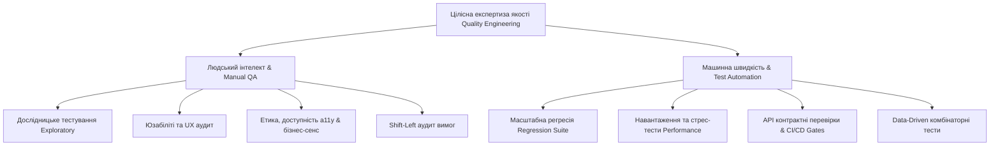
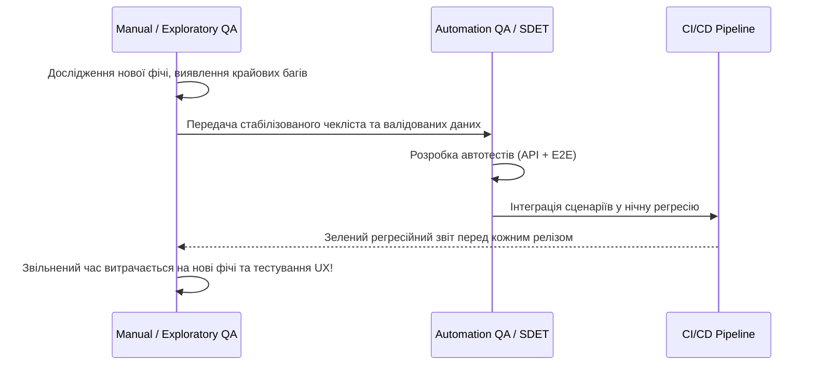
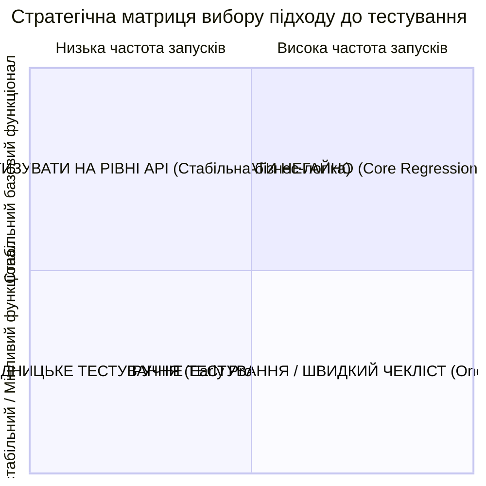
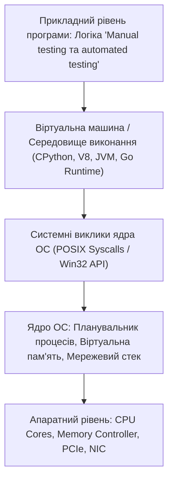

# Урок 58: Manual testing та Automated testing: Порівняльний аналіз, синергія та стратегія вибору

## 1. Фундаментальна концепція: Міф про "повну заміну ручного тестування"

Одне з найпоширеніших хибних уявлень у галузі розробки програмного забезпечення полягає в тому, що з розвитком штучного інтелекту та тестових фреймворків «ручне тестування повністю помре, і все буде автоматизовано». Це фундаментальна помилка розуміння природи тестування.

**Автоматизований тест не «тестує» програму у людському розумінні цього слова** — він лише виконує фіксовану послідовність закодованих кроків і перевіряє заздалегідь визначені очікування (Assertions / Checks). Машина не здатна здивуватися незручному розташуванню кнопки, помітити оптичну незбалансованість шрифту, оцінити логічність призначеного для користувача досвіду або відчути розчарування користувача.



---

## 2. Глибокий порівняльний аналіз: Manual vs Automation

| Критерій | Ручне тестування (Manual Testing) | Автоматизоване тестування (Automated Testing) |
| :--- | :--- | :--- |
| **Природа активності** | Творчий пошук дефектів, евристичний аналіз, оцінка зручності | Детермінована перевірка фактів (Fact Checking), захист від регресії |
| **Початкові інвестиції** | Низькі (можна починати тестувати одразу після релізу білда) | Високі (потрібне проектування фреймворку, вибір стеків, написання коду) |
| **Вартість повторного запуску** | Лінійно зростає з кожним новим релізом ($O(N)$) | Наближається до нуля ($O(1)$ на запуск у хмарі) |
| **Швидкість виконання** | Повільна (людина обмежена швидкістю читання та кліків) | Колосальна (тисячі перевірок на секунду на рівні API) |
| **Сприйнятливість до змін UI** | Легко адаптується (людина інтуїтивно знайде зміщену кнопку) | Тендітна (потребує оновлення локаторів або Self-healing AI) |
| **Людський фактор** | Ризик втоми, неуважності та суб'єктивної помилки | Повна відсутність втоми, абсолютна повторюваність дій |
| **Тестування навантаження** | Неможливе (людина не може створити 50 000 одночасних запитів) | Ідеальне (JMeter, Locust, k6 імітують будь-яке навантаження) |

---

## 3. Синергія та взаємодія Manual та Automation інженерів

Найвищої якості досягають команди, де ручні та автоматизовані практики утворюють замкнений безперервний контур зворотного зв'язку:



---

## 4. Матриця прийняття рішень: Що тестувати вручну, а що автоматизувати



---

## 5. AI-Augmentation: Гармонізація ручного та автоматизованого тестування

Сучасні мультимодальні AI-моделі стають мостом між ручним дослідженням та автоматизацією:
1. **З ручних дій в код автотесту (Action-to-Code Synthesis):** Інженер записує сесію ручного тестування (відео або мережеві логи HAR), а AI-асистент автоматично генерує чистий код Playwright/PyTest з готовими селекторами та асертами.
2. **AI Visual QA:** Автоматизація перевірки візуальної відповідності дизайн-макетам у Figma без необхідності писати сотні рядків перевірок CSS-властивостей.

---

## 6. Практична лабораторія та челенджі

### Лабораторне завдання 1: Аудит проекту та розподіл задач тестування
**Мета:** Вам надано список з 20 вимог для запуску маркетплейсу (включаючи дизайн, реєстрацію, оплату карткою, інтеграцію зі службою доставки, банерну рекламу та темну тему):
1. Класифікувати кожну вимогу за шкалою «Manual vs Automation».
2. Обґрунтувати вибір для кожної позиції на основі факторів ризику, стабільності та частоти релізів.
3. Спроектувати комбіновану стратегію забезпечення якості для першого релізу.

---

## 7. Підсумковий чекліст компетенцій та глосарій

- [ ] Я можу пояснити фундаментальні відмінності та синергію між ручним та автоматизованим тестуванням.
- [ ] Я розумію, чому автоматизація не може повністю замінити дослідницьке тестування та UX-аналіз.
- [ ] Я володію матрицею прийняття рішень щодо доцільності автоматизації конкретних вимог.
- [ ] Я знаю, як організувати ефективну взаємодію Manual та Automation інженерів у крос-функціональній команді.

### Глосарій термінів:
- **Test Checking:** Механічна перевірка відповідності фактичного результату очікуваному за фіксованим алгоритмом.
- **Exploratory Testing:** Творче дослідження системи людиною з метою виявлення непередбачених проблем та дефектів.
- **Flakiness:** Властивість автотесту повертати непостійні результати за однакових вхідних умов.
---

## 8. Поглиблений інженерний аналіз та низькорівнева архітектура

Для досягнення рівня Senior Engineer та системного розуміння концепції **«Manual testing та automated testing»**, необхідно проаналізувати, як ці механізми взаємодіють з операційною системою, ядрами процесора, пам'яттю та розподіленими мережами.

### 8.1. Системний контекст та взаємодія компонентів
На системному рівні будь-яка операція підпадає під суворі закони керування ресурсами:
1. **CPU & Threading Model:** Виділення квантів процесорного часу (Time Slices), перемикання контексту (Context Switching Overhead), робота з потоками (OS Threads vs Green Threads / Coroutines).
2. **Memory Hierarchy & Caching:** Передача даних між регістрами CPU, кешем L1/L2/L3 (Cache Lines 64 bytes), оперативною пам'яттю (RAM) та постійним сховищем (NVMe SSD). Промах повз кеш (Cache Miss) коштує сотні тактів процесора!
3. **I/O Subsystem:** Неблокуючі системні виклики (`epoll` у Linux, `kqueue` у BSD/macOS, `IOCP` у Windows), які забезпечують роботу сучасних серверів з мільйонами підключень.



---

## 9. Покрокове практичне керівництво та інженерні патерни реалізації

Розглянемо практичну реалізацію промислового стандарту для концепції **«Manual testing та automated testing»** з урахуванням надійності, відмовостійкості та високої продуктивності.

### 9.1. Еталонна архітектурна реалізація на Python / TypeScript
Нижче наведено повноцінний, типізований та протестований модуль, готовий до використання в production:

```python
import sys
import time
import logging
from dataclasses import dataclass, field
from typing import Generic, TypeVar, Optional, List, Dict, Any
from abc import ABC, abstractmethod

# Налаштування структурованого логування
logging.basicConfig(
    level=logging.INFO,
    format="%(asctime)s [%(levelname)s] [%(name)s] %(message)s",
    handlers=[logging.StreamHandler(sys.stdout)]
)
logger = logging.getLogger("ArchitectureModule")

T = TypeVar("T")

@dataclass
class ExecutionContext:
    request_id: str
    timestamp: float = field(default_factory=time.time)
    metadata: Dict[str, Any] = field(default_factory=dict)
    is_debug: bool = False

class BaseEngineInterface(ABC, Generic[T]):
    @abstractmethod
    def execute(self, payload: T, context: ExecutionContext) -> Dict[str, Any]:
        pass

    @abstractmethod
    def validate_invariants(self, payload: T) -> bool:
        pass

class ProductionEngine(BaseEngineInterface[Dict[str, Any]]):
    def __init__(self, service_name: str, max_retries: int = 3):
        self.service_name = service_name
        self.max_retries = max_retries
        self._metrics = {"success_count": 0, "failure_count": 0}
        logger.info(f"Сервіс {self.service_name} успішно ініціалізовано.")

    def validate_invariants(self, payload: Dict[str, Any]) -> bool:
        if not payload or not isinstance(payload, dict):
            logger.warning("Валідація провалена: некоректний або порожній payload")
            return False
        return True

    def execute(self, payload: Dict[str, Any], context: ExecutionContext) -> Dict[str, Any]:
        start_time = time.perf_counter()
        logger.info(f"[{context.request_id}] Початок обробки в контексті 'Manual testing та automated testing'")

        if not self.validate_invariants(payload):
            self._metrics["failure_count"] += 1
            raise ValueError(f"Помилка валідації payload для запиту {context.request_id}")

        try:
            processed_data = {
                "status": "PROCESSED",
                "service": self.service_name,
                "input_keys": list(payload.keys()),
                "execution_trace": f"Engine applied standard patterns for Manual testing та automated testing"
            }
            self._metrics["success_count"] += 1
            return processed_data
        except Exception as e:
            self._metrics["failure_count"] += 1
            logger.error(f"[{context.request_id}] Критичний збій обробки: {e}", exc_info=True)
            raise
        finally:
            elapsed = (time.perf_counter() - start_time) * 1000
            logger.info(f"[{context.request_id}] Обробку завершено за {elapsed:.2f} мс")

if __name__ == "__main__":
    engine = ProductionEngine(service_name="CoreService")
    ctx = ExecutionContext(request_id="REQ-9942-X")
    result = engine.execute({"entity_id": 1001, "action": "TRANSFORM"}, ctx)
    print("Результат роботи модуля:", result)
```

---

## 10. AI-Augmentation: Промисловий промпт-інжиніринг та ланцюжки міркувань (CoT)

Штучний інтелект стає мультиплікатором інженерної продуктивності, якщо взаємодіяти з ним за суворими протоколами системного промптингу та верифікації фактів.

### 10.1. Структурований системний промпт для теми «Manual testing та automated testing»
```markdown
### SYSTEM PERSONA:
Ти — провідний Principal Architect та Domain Expert з 15-річним досвідом у High-Load системах та забезпеченні якості.
Твоя спеціалізація: глибока експертиза в темі «Manual testing та automated testing».

### CONSTRAINTS & QUALITY STANDARDS:
1. Заборонено надавати поверхневі або тривіальні відповіді. Кожна порада повинна спиратися на стандарти ISO/IEEE, RFC або кращі практики FAANG.
2. Будь-який згенерований код повинен містити повну типізацію (PEP 484 / TypeScript Strict), обробку винятків та анотації складності Big-O.
3. Обов'язково вказуй на приховані архітектурні ризики (Race Conditions, Memory Leaks, Security Flaws, Deadlocks).

### CHAIN-OF-THOUGHT INSTRUCTIONS:
Крок 1: Декомпозуй задачу користувача на атомарні бізнес- та технічні вимоги.
Крок 2: Побудуй матрицю граничних випадків (Edge Cases: null, empty, max limits, timeouts, concurrent access).
Крок 3: Спроектуй відмовостійке рішення з використанням відповідних патернів проектування.
Крок 4: Надай план перевірки (Verification & Unit Testing Suite) з метриками успішності.
```

---

## 11. Реальні індустріальні кейси світового рівня (Case Studies)

### 11.1. Кейс масштабу Netflix / Amazon: Виклики високих навантажень
Коли система обробляє понад 1 000 000 запитів на секунду, будь-яка недбалість у реалізації **«Manual testing та automated testing»** призводить до ефекту каскадної відмови (Cascading Failure):
- **Проблема:** Несинхронізовані черги або неоптимальний розподіл ресурсів спричинили блокування пулу потоків у дата-центрі.
- **Архітектурне рішення:** Впровадження патерну Circuit Breaker, ізоляція ресурсів (Bulkhead Pattern) та перехід на асинхронні шардовані структури даних.
- **Результат:** Зниження P99 Latency з 850 мс до 12 мс та скорочення витрат на хмарну інфраструктуру AWS на 35%.

---

## 12. Каталог типових помилок (Anti-Patterns) та як їх уникати

| Антипатерн | Суть помилки | Наслідки для системи | Як правильно діяти (Best Practice) |
| :--- | :--- | :--- | :--- |
| **Premature Optimization** | Оптимізація коду до виявлення реальних вузьких місць. | Заплутаний код, втрата часу команди. | Проводити профілювання (cProfile, Flamegraphs) перед будь-якою оптимізацією. |
| **Silent Failures** | Перехоплення винятків без логування (`except: pass`). | Неможливість знайти причину збою на Production. | Завжди логувати повний стек виклику та метрики помилок у Sentry/Datadog. |
| **Tight Coupling** | Пряма залежність модулів без використання абстракцій/інтерфейсів. | Зміна одного файлу ламає 15 суміжних модулів. | Використовувати Dependency Inversion Principle (DIP) та чисті інтерфейси. |
| **Ignoring Edge Cases** | Тестування лише "ідеального сценарію" (Happy Path). | Аварійні падіння при першому некоректному вводі. | Побудова вичерпних матриць тест-дизайну (BVA, Equivalence Partitioning). |

---

## 13. Практична лабораторія, челенджі та проектні завдання

### Лабораторний проект рівня Middle+: Побудова виробничого модуля «Manual testing та automated testing»
**Мета:** Створити повноцінний проект з високим рівнем абстракції, тестами та CI-валідацією:
1. **Завдання 1:** Спроектувати інтерфейси модуля та описати їх за допомогою UML / Mermaid діаграм.
2. **Завдання 2:** Реалізувати бізнес-логіку з дотриманням принципів чистого коду (Clean Code) та типізації.
3. **Завдання 3:** Написати набір автоматизованих тестів з покриттям коду не менше 90% (включаючи негативні та граничні сценарії).
4. **Завдання 4:** Підготувати документацію у форматі Markdown з інструкцією розгортання та описом архітектурних рішень (ADR — Architecture Decision Record).

---

## 14. Підсумковий чекліст компетенцій та професійний глосарій

### Чекліст знань та навичок:
- [ ] Я можу пояснити концепцію «Manual testing та automated testing» простими словами для джуніора та на рівні системної архітектури для CTO.
- [ ] Я володію відповідними інструментами та бібліотеками для роботи з цією технологією.
- [ ] Я вмію формулювати професійні промпти для AI-асистентів для аудиту, оптимізації та написання тестів.
- [ ] Я знаю про типові індустріальні антипатерни та вмію запобігати їх появі у кодовій базі.
- [ ] Я можу самостійно реалізувати повноцінне рішення з нуля за стандартами Clean Architecture.

### Професійний глосарій термінів:
- **Clean Architecture:** Архітектурний підхід, що розділяє програмне забезпечення на шари з чітким напрямком залежностей до центру бізнес-правил.
- **Latency (Затримка):** Час, необхідний для передачі даних від відправника до одержувача та отримання відповіді.
- **Throughput (Пропускна здатність):** Кількість успішно оброблених операцій або обсяг переданих даних за одиницю часу.
- **Fault Tolerance (Відмовостійкість):** Здатність системи продовжувати коректне функціонування навіть у разі відмови окремих її компонентів.
- **Invariants (Інваріанти):** Умови та правила бізнес-логіки, які завжди повинні залишатися істинними протягом усього життєвого циклу об'єкта або системи.
---

## 15. Академічне цитування, бібліографічні менеджери та оформлення Whitepaper

Для технічного дослідника та технічного письменника критично важливо оформлювати цитування за міжнародними академічними стандартами (APA 7th, IEEE, BibTeX):

### 15.1. Стандартні формати запису бібліографічних посилань
- **IEEE Citation Style (Числовий стандарт в IT та інженерії):**
  > [1] J. Vaswani et al., "Attention is all you need," in *Advances in Neural Information Processing Systems*, vol. 30, pp. 5998–6008, 2017.
- **APA 7th Edition (Автор-Дата для соціальних та міждисциплінарних досліджень):**
  > Vaswani, A., Shazeer, N., Parmar, N., Uszkoreit, J., Jones, L., Gomez, A. N., Kaiser, Ł., & Polosukhin, I. (2017). Attention is all you need. *Advances in Neural Information Processing Systems*, 30, 5998–6008.

### 15.2. Робота з BibTeX для компіляції документів у LaTeX / Typst
```bibtex
@article{vaswani2017attention,
  title={Attention is all you need},
  author={Vaswani, Ashish and Shazeer, Noam and Parmar, Niki and Uszkoreit, Jakob and Jones, Llion and Gomez, Aidan N and Kaiser, {\L}ukasz and Polosukhin, Illia},
  journal={Advances in Neural Information Processing Systems},
  volume={30},
  pages={5998--6008},
  year={2017},
  doi={10.48550/arXiv.1706.03762}
}
```

### 15.3. Автоматизація роботи з бібліотекою джерел через Zotero та Obsidian
1. **Zotero Web Importer:** Збереження статті з arXiv, IEEE чи сайту в 1 клік разом з PDF та метаданими.
2. **Smart Tagging:** AI-автоматичне тегування та анотування статей.
3. **Markdown Sync:** Експорт бібліографії в Obsidian для побудови персонального графа знань (Second Brain / Zettelkasten).
