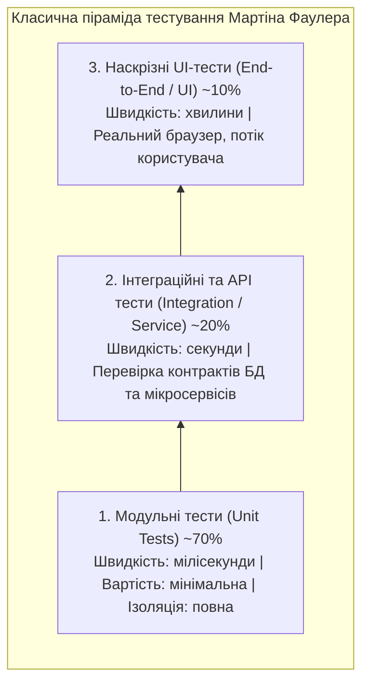
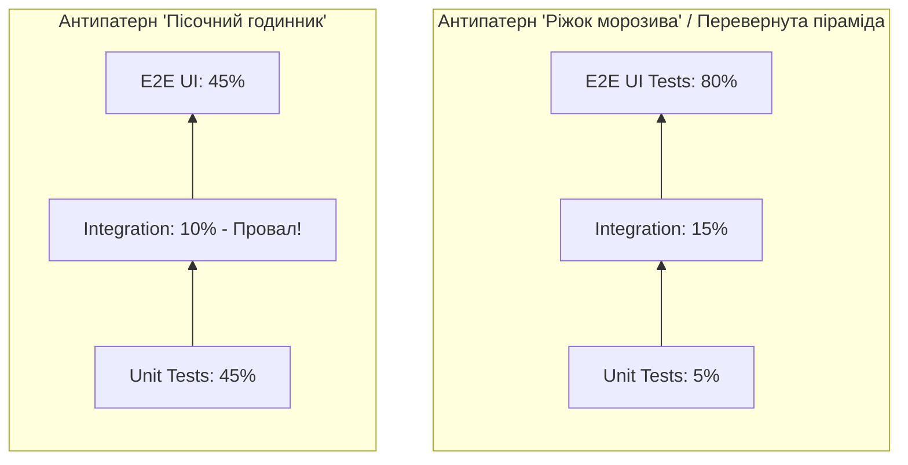
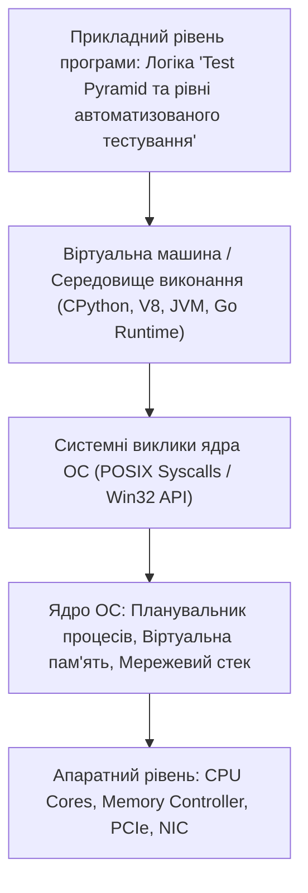

# Урок 60: Піраміда тестування (Test Pyramid), рівні тестів та архітектура тестового покриття

## 1. Фундаментальна концепція та філософія піраміди тестування

Піраміда тестування (Test Pyramid) — це архітектурна концепція, вперше сформульована Майком Коном (Mike Cohn) у книзі *«Succeeding with Agile»* та популяризована Мартіном Фаулером (Martin Fowler). Вона наочно демонструє оптимальне кількісне співвідношення різних рівнів автоматизованих тестів у проекті.

Головний закон піраміди тестування простий: **чим нижчий рівень тестів, тим вони швидші, дешевші у розробці та стабільніші; чим вищий рівень, тим тести повільніші, дорожчі та більш схильні до нестабільності (Flakiness)**.



---

## 2. Детальний розбір рівнів піраміди тестування

### 2.1. Рівень 1: Модульні тести (Unit Tests)
- **Що перевіряють:** Окремі функції, методи, класи, алгоритми та чисті бізнес-правила в повній ізоляції від зовнішнього світу.
- **Інструменти:** PyTest, JUnit, Jest, Mocha, Go Test.
- **Ізоляція:** Усі зовнішні залежності (БД, сторонні API, файлова система) замінюються на тестові двійники (**Test Doubles: Mocks, Stubs, Fakes**).
- **Швидкість:** 10 000 модульних тестів виконуються за 5–10 секунд!

### 2.2. Рівень 2: Інтеграційні та компонентні тести (Integration / API Tests)
- **Що перевіряють:** Взаємодію між двома або більше реальними модулями (сервіс + база даних PostgreSQL, сервіс + Redis кеш, клієнт + зовнішній REST API).
- **Інструменти:** Testcontainers (Docker-контейнери на льоту), Supertest, HTTPX, Requests, REST-Assured.
- **Швидкість:** Сотні тестів виконуються за 30–60 секунд.

### 2.3. Рівень 3: Наскрізні тести (End-to-End / E2E Tests)
- **Що перевіряють:** Повний реальний шлях користувача в реальному браузері або мобільному додатку від входу до фінальної дії.
- **Інструменти:** Playwright, Cypress, Selenium WebDriver, Appium.
- **Швидкість:** Один тест триває від 10 до 45 секунд.

---

## 3. Патологічні антипатерни архітектури тестів



### 3.1. Чому «Ріжок морозива» (The Ice Cream Cone) вбиває CI/CD:
- Якщо команда ігнорує Unit та API тести, а пише сотні UI E2E тестів:
  1. Білд у CI виконується по 3–4 години замість 5 хвилин.
  2. Виникає епідемія Flaky Tests через мікрозбої мережі та анімації.
  3. Коли падає E2E тест, неможливо зрозуміти першопричину (це збій фронтенду, помилка валідації в API чи збій бази даних?).

---

## 4. Практичний приклад одного сценарію на трьох рівнях піраміди

Давайте розглянемо, як функція нарахування знижки тестується на кожному з трьох рівнів:

```python
# 1. UNIT TEST (Перевірка математики чистої функції)
def test_calculate_discount_unit():
    assert calculate_discount(price=100.0, discount_pct=20) == 80.0
    assert calculate_discount(price=100.0, discount_pct=0) == 100.0

# 2. INTEGRATION TEST (Перевірка контролера та збереження замовлення в БД)
def test_order_checkout_api_integration(client, db_session):
    response = client.post("/api/v1/orders/checkout", json={"item_id": 42, "promo": "SAVE20"})
    assert response.status_code == 200
    assert response.json()["final_price"] == 80.0
    
    # Перевірка запису в реальній тестовій базі:
    order_in_db = db_session.query(Order).filter_by(id=response.json()["order_id"]).first()
    assert order_in_db.status == "PAID"

# 3. E2E UI TEST (Перевірка відображення ціни в браузері через Playwright)
def test_checkout_e2e_ui(page: Page):
    page.goto("https://shop.example.com/cart")
    page.fill("#promo-input", "SAVE20")
    page.click("#apply-promo-btn")
    expect(page.locator("#total-price")).to_have_text("$80.00")
```

---

## 5. AI-Augmentation: Оптимізація балансу піраміди за допомогою LLM

### 5.1. Системний промпт для аудиту архітектури тестового покриття
```markdown
Ти — провідний Test Architect та Performance Engineering Consultant.
Твоє завдання: проаналізувати склад тестового репозиторію та перебудувати піраміду тестування.

Вимоги:
1. Проведи аудит поточного співвідношення тестів (Unit / Integration / E2E).
2. Знайди повільні E2E UI тести, які можна безпечно "спустити" на рівень API або Unit без втрати якості (E2E to API Pushdown).
3. Побудуй план скорочення часу прогону CI/CD сьюту з 45 хвилин до 5 хвилин.
4. Додай рекомендації щодо використання Testcontainers для надійного інтеграційного тестування.
```

---

## 6. Практична лабораторія та челенджі

### Лабораторне завдання 1: Рефакторинг антипатерну перевернутої піраміди
**Мета:** Вам надано тестовий сьют інтернет-банкінгу, що складається зі 100 повільних UI тестів Selenium (час прогону 50 хв):
1. Декомпозувати 15 UI сценаріїв на 40 швидких Unit тестів та 20 надійних API тестів.
2. Залишити лише 3 критичні End-to-End сценарії.
3. Продемонструвати скорочення часу виконання білда та підвищення стабільності.

---

## 7. Підсумковий чекліст компетенцій та глосарій

- [ ] Я можу пояснити класичну піраміду тестування Майка Кона та Мартіна Фаулера.
- [ ] Я розумію технічні відмінності між Unit, Integration та E2E тестами.
- [ ] Я знаю про небезпеку антипатернів «Ріжок морозива» та «Пісочний годинник».
- [ ] Я вмію переносити перевірки з повільного UI рівня на швидкий рівень API та Unit (Pushdown Strategy).

### Глосарій термінів:
- **Unit Testing:** Тестування мінімальних ізольованих компонентів коду (функцій, класів) за допомогою моків.
- **Integration Testing:** Перевірка коректності взаємодії між різними інтегрованими модулями та зовнішніми сервісами.
- **End-to-End (E2E) Testing:** Тестування всього ланцюжка виконання програми від інтерфейсу користувача до бази даних.
- **Testcontainers:** Бібліотека для автоматичного підняття реальних залежностей (PostgreSQL, Kafka, Redis) у Docker-контейнерах під час виконання тестів.
---

## 8. Поглиблений інженерний аналіз та низькорівнева архітектура

Для досягнення рівня Senior Engineer та системного розуміння концепції **«Test Pyramid та рівні автоматизованого тестування»**, необхідно проаналізувати, як ці механізми взаємодіють з операційною системою, ядрами процесора, пам'яттю та розподіленими мережами.

### 8.1. Системний контекст та взаємодія компонентів
На системному рівні будь-яка операція підпадає під суворі закони керування ресурсами:
1. **CPU & Threading Model:** Виділення квантів процесорного часу (Time Slices), перемикання контексту (Context Switching Overhead), робота з потоками (OS Threads vs Green Threads / Coroutines).
2. **Memory Hierarchy & Caching:** Передача даних між регістрами CPU, кешем L1/L2/L3 (Cache Lines 64 bytes), оперативною пам'яттю (RAM) та постійним сховищем (NVMe SSD). Промах повз кеш (Cache Miss) коштує сотні тактів процесора!
3. **I/O Subsystem:** Неблокуючі системні виклики (`epoll` у Linux, `kqueue` у BSD/macOS, `IOCP` у Windows), які забезпечують роботу сучасних серверів з мільйонами підключень.



---

## 9. Покрокове практичне керівництво та інженерні патерни реалізації

Розглянемо практичну реалізацію промислового стандарту для концепції **«Test Pyramid та рівні автоматизованого тестування»** з урахуванням надійності, відмовостійкості та високої продуктивності.

### 9.1. Еталонна архітектурна реалізація на Python / TypeScript
Нижче наведено повноцінний, типізований та протестований модуль, готовий до використання в production:

```python
import sys
import time
import logging
from dataclasses import dataclass, field
from typing import Generic, TypeVar, Optional, List, Dict, Any
from abc import ABC, abstractmethod

# Налаштування структурованого логування
logging.basicConfig(
    level=logging.INFO,
    format="%(asctime)s [%(levelname)s] [%(name)s] %(message)s",
    handlers=[logging.StreamHandler(sys.stdout)]
)
logger = logging.getLogger("ArchitectureModule")

T = TypeVar("T")

@dataclass
class ExecutionContext:
    request_id: str
    timestamp: float = field(default_factory=time.time)
    metadata: Dict[str, Any] = field(default_factory=dict)
    is_debug: bool = False

class BaseEngineInterface(ABC, Generic[T]):
    @abstractmethod
    def execute(self, payload: T, context: ExecutionContext) -> Dict[str, Any]:
        pass

    @abstractmethod
    def validate_invariants(self, payload: T) -> bool:
        pass

class ProductionEngine(BaseEngineInterface[Dict[str, Any]]):
    def __init__(self, service_name: str, max_retries: int = 3):
        self.service_name = service_name
        self.max_retries = max_retries
        self._metrics = {"success_count": 0, "failure_count": 0}
        logger.info(f"Сервіс {self.service_name} успішно ініціалізовано.")

    def validate_invariants(self, payload: Dict[str, Any]) -> bool:
        if not payload or not isinstance(payload, dict):
            logger.warning("Валідація провалена: некоректний або порожній payload")
            return False
        return True

    def execute(self, payload: Dict[str, Any], context: ExecutionContext) -> Dict[str, Any]:
        start_time = time.perf_counter()
        logger.info(f"[{context.request_id}] Початок обробки в контексті 'Test Pyramid та рівні автоматизованого тестування'")

        if not self.validate_invariants(payload):
            self._metrics["failure_count"] += 1
            raise ValueError(f"Помилка валідації payload для запиту {context.request_id}")

        try:
            processed_data = {
                "status": "PROCESSED",
                "service": self.service_name,
                "input_keys": list(payload.keys()),
                "execution_trace": f"Engine applied standard patterns for Test Pyramid та рівні автоматизованого тестування"
            }
            self._metrics["success_count"] += 1
            return processed_data
        except Exception as e:
            self._metrics["failure_count"] += 1
            logger.error(f"[{context.request_id}] Критичний збій обробки: {e}", exc_info=True)
            raise
        finally:
            elapsed = (time.perf_counter() - start_time) * 1000
            logger.info(f"[{context.request_id}] Обробку завершено за {elapsed:.2f} мс")

if __name__ == "__main__":
    engine = ProductionEngine(service_name="CoreService")
    ctx = ExecutionContext(request_id="REQ-9942-X")
    result = engine.execute({"entity_id": 1001, "action": "TRANSFORM"}, ctx)
    print("Результат роботи модуля:", result)
```

---

## 10. AI-Augmentation: Промисловий промпт-інжиніринг та ланцюжки міркувань (CoT)

Штучний інтелект стає мультиплікатором інженерної продуктивності, якщо взаємодіяти з ним за суворими протоколами системного промптингу та верифікації фактів.

### 10.1. Структурований системний промпт для теми «Test Pyramid та рівні автоматизованого тестування»
```markdown
### SYSTEM PERSONA:
Ти — провідний Principal Architect та Domain Expert з 15-річним досвідом у High-Load системах та забезпеченні якості.
Твоя спеціалізація: глибока експертиза в темі «Test Pyramid та рівні автоматизованого тестування».

### CONSTRAINTS & QUALITY STANDARDS:
1. Заборонено надавати поверхневі або тривіальні відповіді. Кожна порада повинна спиратися на стандарти ISO/IEEE, RFC або кращі практики FAANG.
2. Будь-який згенерований код повинен містити повну типізацію (PEP 484 / TypeScript Strict), обробку винятків та анотації складності Big-O.
3. Обов'язково вказуй на приховані архітектурні ризики (Race Conditions, Memory Leaks, Security Flaws, Deadlocks).

### CHAIN-OF-THOUGHT INSTRUCTIONS:
Крок 1: Декомпозуй задачу користувача на атомарні бізнес- та технічні вимоги.
Крок 2: Побудуй матрицю граничних випадків (Edge Cases: null, empty, max limits, timeouts, concurrent access).
Крок 3: Спроектуй відмовостійке рішення з використанням відповідних патернів проектування.
Крок 4: Надай план перевірки (Verification & Unit Testing Suite) з метриками успішності.
```

---

## 11. Реальні індустріальні кейси світового рівня (Case Studies)

### 11.1. Кейс масштабу Netflix / Amazon: Виклики високих навантажень
Коли система обробляє понад 1 000 000 запитів на секунду, будь-яка недбалість у реалізації **«Test Pyramid та рівні автоматизованого тестування»** призводить до ефекту каскадної відмови (Cascading Failure):
- **Проблема:** Несинхронізовані черги або неоптимальний розподіл ресурсів спричинили блокування пулу потоків у дата-центрі.
- **Архітектурне рішення:** Впровадження патерну Circuit Breaker, ізоляція ресурсів (Bulkhead Pattern) та перехід на асинхронні шардовані структури даних.
- **Результат:** Зниження P99 Latency з 850 мс до 12 мс та скорочення витрат на хмарну інфраструктуру AWS на 35%.

---

## 12. Каталог типових помилок (Anti-Patterns) та як їх уникати

| Антипатерн | Суть помилки | Наслідки для системи | Як правильно діяти (Best Practice) |
| :--- | :--- | :--- | :--- |
| **Premature Optimization** | Оптимізація коду до виявлення реальних вузьких місць. | Заплутаний код, втрата часу команди. | Проводити профілювання (cProfile, Flamegraphs) перед будь-якою оптимізацією. |
| **Silent Failures** | Перехоплення винятків без логування (`except: pass`). | Неможливість знайти причину збою на Production. | Завжди логувати повний стек виклику та метрики помилок у Sentry/Datadog. |
| **Tight Coupling** | Пряма залежність модулів без використання абстракцій/інтерфейсів. | Зміна одного файлу ламає 15 суміжних модулів. | Використовувати Dependency Inversion Principle (DIP) та чисті інтерфейси. |
| **Ignoring Edge Cases** | Тестування лише "ідеального сценарію" (Happy Path). | Аварійні падіння при першому некоректному вводі. | Побудова вичерпних матриць тест-дизайну (BVA, Equivalence Partitioning). |

---

## 13. Практична лабораторія, челенджі та проектні завдання

### Лабораторний проект рівня Middle+: Побудова виробничого модуля «Test Pyramid та рівні автоматизованого тестування»
**Мета:** Створити повноцінний проект з високим рівнем абстракції, тестами та CI-валідацією:
1. **Завдання 1:** Спроектувати інтерфейси модуля та описати їх за допомогою UML / Mermaid діаграм.
2. **Завдання 2:** Реалізувати бізнес-логіку з дотриманням принципів чистого коду (Clean Code) та типізації.
3. **Завдання 3:** Написати набір автоматизованих тестів з покриттям коду не менше 90% (включаючи негативні та граничні сценарії).
4. **Завдання 4:** Підготувати документацію у форматі Markdown з інструкцією розгортання та описом архітектурних рішень (ADR — Architecture Decision Record).

---

## 14. Підсумковий чекліст компетенцій та професійний глосарій

### Чекліст знань та навичок:
- [ ] Я можу пояснити концепцію «Test Pyramid та рівні автоматизованого тестування» простими словами для джуніора та на рівні системної архітектури для CTO.
- [ ] Я володію відповідними інструментами та бібліотеками для роботи з цією технологією.
- [ ] Я вмію формулювати професійні промпти для AI-асистентів для аудиту, оптимізації та написання тестів.
- [ ] Я знаю про типові індустріальні антипатерни та вмію запобігати їх появі у кодовій базі.
- [ ] Я можу самостійно реалізувати повноцінне рішення з нуля за стандартами Clean Architecture.

### Професійний глосарій термінів:
- **Clean Architecture:** Архітектурний підхід, що розділяє програмне забезпечення на шари з чітким напрямком залежностей до центру бізнес-правил.
- **Latency (Затримка):** Час, необхідний для передачі даних від відправника до одержувача та отримання відповіді.
- **Throughput (Пропускна здатність):** Кількість успішно оброблених операцій або обсяг переданих даних за одиницю часу.
- **Fault Tolerance (Відмовостійкість):** Здатність системи продовжувати коректне функціонування навіть у разі відмови окремих її компонентів.
- **Invariants (Інваріанти):** Умови та правила бізнес-логіки, які завжди повинні залишатися істинними протягом усього життєвого циклу об'єкта або системи.
