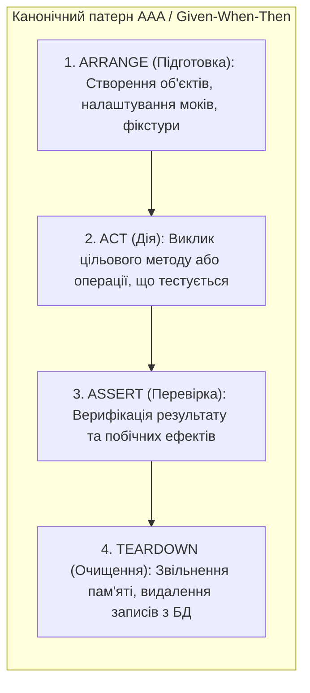
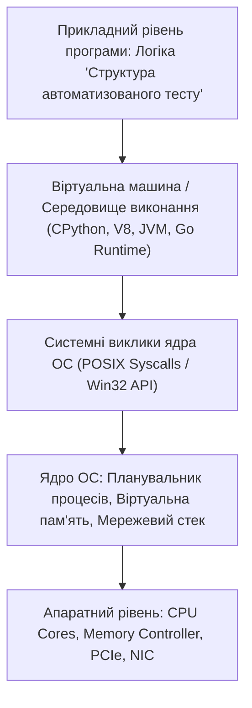

# Урок 61: Внутрішня анатомія, структура, патерни та життєвий цикл автоматизованого тесту

## 1. Фундаментальна концепція та філософія структури тесту

Автоматизований тест — це не просто довільний набір викликів функцій. Це суворий інженерний експеримент, який повинен бути **детермінованим, ізольованим, читабельним, самодостатнім та здатним надати вичерпний опис причини збою** за частки секунди.

Якщо код тесту написаний хаотично, без дотримання загальноприйнятих патернів структуризації, він перетворюється на тягар: розробники витрачають години на те, щоб зрозуміти, чому тест упав, де готувалися дані і що саме перевірялося.



---

## 2. Канонічні патерни структуризації коду тесту

### 2.1. Патерн AAA (Arrange - Act - Assert)
Найпопулярніший патерн у світі Unit та інтеграційного тестування:
1. **Arrange:** Підготовка стану системи, вхідних аргументів, конфігурації та моків.
2. **Act:** Виконання однієї конкретної дії (виклику функції або відправки запиту). **Правило:** Блок Act повинен містити 1 (максимум 2) рядки коду!
3. **Assert:** Порівняння фактичного результату з еталонним очікуванням.

### 2.2. Патерн Given - When - Then (BDD Style)
Семантичний аналог AAA, орієнтований на бізнес-термінологію та сценарії поведінки.

### 2.3. Патерн Four-Phase Test (Чотирифідний тест)
Розширює AAA обов'язковою четвертою фазою:
$$\text{Setup} \longrightarrow \text{Exercise} \longrightarrow \text{Verify} \longrightarrow \text{Teardown}$$

---

## 3. Анатомія чистого тесту: Принципи F.I.R.S.T.

Кожен професійний автотест повинен відповідати стандартам **FIRST**:

| Буква | Принцип | Значення |
| :--- | :--- | :--- |
| **F** | **Fast (Швидкий)** | Тести повинні виконуватися за мілісекунди, щоб розробники запускали їх постійно. |
| **I** | **Independent / Isolated (Ізольований)** | Тести не повинні залежати один від одного. Порядок запуску не має значення! |
| **R** | **Repeatable (Повторюваний)** | Тест дає однаковий результат на машині розробника, в CI/CD та на staging-сервері незалежно від часу доби чи часового поясу. |
| **S** | **Self-Validating (Самоперевіряючий)** | Тест повертає однозначний бінарний результат (PASS або FAIL), не вимагаючи ручного перегляду логів людиною. |
| **T** | **Timely / Thorough (Своєчасний / Ретельний)** | Тести пишуться разом з кодом (або перед ним за TDD) і покривають усі граничні випадки. |

---

## 4. Фікстури та керування станом у PyTest (`@pytest.fixture`)

Фікстури забезпечують елегантне відокремлення підготовки даних (Setup) та очищення ресурсів (Teardown) від самого тіла тесту через механізм Dependency Injection (впровадження залежностей).

```python
import pytest
from dataclasses import dataclass
from typing import Generator

@dataclass
class BankAccount:
    account_id: str
    balance: float

# 1. Фікстура підготовки стану з автоочищенням (Yield Fixture)
@pytest.fixture
def active_account() -> Generator[BankAccount, None, None]:
    # Setup Phase (Arrange)
    account = BankAccount(account_id="UA-10042", balance=5000.0)
    print(f"--> [SETUP] Створено тестовий рахунок {account.account_id}")
    
    yield account # Передача об'єкта в тіло тесту
    
    # Teardown Phase (Cleanup)
    print(f"--> [TEARDOWN] Видалення рахунку {account.account_id} з тестової бази")
    account.balance = 0.0

# 2. Чистий тест з використанням патерну AAA:
def test_withdraw_funds_success(active_account: BankAccount):
    # Arrange (Отримано з фікстури: balance = 5000.0)
    withdraw_amount = 1500.0
    
    # Act (Цільова операція)
    active_account.balance -= withdraw_amount
    
    # Assert (Перевірка інваріантів)
    assert active_account.balance == 3500.0, "Баланс після списання розраховано невірно!"
```

---

## 5. Робота з тестовими двійниками (Test Doubles: Mocks, Stubs, Spies)

Коли тестований модуль звертається до зовнішніх неконтрольованих систем (відправка SMS, платіжний шлюз Stripe, генерація PDF), ми використовуємо **Mocking**:

```python
from unittest.mock import MagicMock

class NotificationService:
    def __init__(self, sms_gateway):
        self.sms_gateway = sms_gateway

    def notify_user_about_order(self, phone: str, order_id: str) -> bool:
        message = f"Ваше замовлення #{order_id} успішно оплачено!"
        return self.sms_gateway.send_sms(to=phone, body=message)

def test_notify_user_calls_sms_gateway():
    # Arrange: Створюємо мок-об'єкт шлюзу
    mock_gateway = MagicMock()
    mock_gateway.send_sms.return_value = True # Stubbing відповіді
    service = NotificationService(sms_gateway=mock_gateway)
    
    # Act: Викликаємо бізнес-метод
    result = service.notify_user_about_order("+380501234567", "ORD-99")
    
    # Assert: Перевіряємо виклик мока (Behavior Verification)
    assert result is True
    mock_gateway.send_sms.assert_called_once_with(
        to="+380501234567",
        body="Ваше замовлення #ORD-99 успішно оплачено!"
    )
```

---

## 6. AI-Augmentation: Промптинг для рефакторингу та аудиту структури автотестів

### 6.1. Системний промпт для рефакторингу тестового коду за стандартами AAA & FIRST
```markdown
Ти — провідний SDET та експерт з PyTest / Clean Test Architecture.
Твоє завдання: провести глибокий рефакторинг наданого заплутаного автотесту.

Вимоги:
1. Чітко розділи код на блоки `# Arrange`, `# Act`, `# Assert` згідно з патерном AAA.
2. Винеси всю громіздку підготовку стану та моки у перевикористовувані PyTest Fixtures.
3. Усунь небезпечні міжопераційні залежності та витоки глобального стану (Global State Pollution).
4. Забезпеч інформативні повідомлення про помилки в асертах (Custom Failure Messages).
5. Перевір відповідність усім принципам F.I.R.S.T.
```

---

## 7. Практична лабораторія та челенджі

### Лабораторне завдання 1: Побудова тестового сьюту для мікросервісу розрахунку доставки
**Мета:** Написати набір модульних та інтеграційних тестів для сервісу розрахунку вартості доставки (`DeliveryCostCalculator`):
1. Реалізувати фікстури для різних типів вантажів та міст призначення.
2. Застосувати патерн AAA та параметризацію `@pytest.mark.parametrize` для 10 крайових комбінацій ваги та габаритів.
3. Заізолювати звернення до сервісу геокодування за допомогою `unittest.mock`.

---

## 8. Підсумковий чекліст компетенцій та глосарій

- [ ] Я володію патернами структурування тестів AAA (Arrange-Act-Assert) та Given-When-Then.
- [ ] Я знаю та застосовую всі принципи F.I.R.S.T. для написання стабільних тестів.
- [ ] Я вмію створювати та комбінувати фікстури в PyTest з керуванням областю видимості (Scope).
- [ ] Я розумію різницю між Mock, Stub, Fake та вмію верифікувати виклики методів.
- [ ] Я вмію використовувати AI для автоматичного рефакторингу нестабільних тестів.

### Глосарій термінів:
- **Arrange-Act-Assert (AAA):** Стандартний патерн структурування коду тесту на три чіткі послідовні фази.
- **Fixture:** Функція або об'єкт, що готує необхідне тестове середовище та гарантує його очищення після тесту.
- **Mock Object:** Тестовий двійник реального об'єкта, який записує виклики своїх методів і дозволяє верифікувати поведінку програми.
- **Dependency Injection (DI):** Патерн проектування, за якого залежності передаються в об'єкт ззовні, а не створюються ним самостійно.
---

## 8. Поглиблений інженерний аналіз та низькорівнева архітектура

Для досягнення рівня Senior Engineer та системного розуміння концепції **«Структура автоматизованого тесту»**, необхідно проаналізувати, як ці механізми взаємодіють з операційною системою, ядрами процесора, пам'яттю та розподіленими мережами.

### 8.1. Системний контекст та взаємодія компонентів
На системному рівні будь-яка операція підпадає під суворі закони керування ресурсами:
1. **CPU & Threading Model:** Виділення квантів процесорного часу (Time Slices), перемикання контексту (Context Switching Overhead), робота з потоками (OS Threads vs Green Threads / Coroutines).
2. **Memory Hierarchy & Caching:** Передача даних між регістрами CPU, кешем L1/L2/L3 (Cache Lines 64 bytes), оперативною пам'яттю (RAM) та постійним сховищем (NVMe SSD). Промах повз кеш (Cache Miss) коштує сотні тактів процесора!
3. **I/O Subsystem:** Неблокуючі системні виклики (`epoll` у Linux, `kqueue` у BSD/macOS, `IOCP` у Windows), які забезпечують роботу сучасних серверів з мільйонами підключень.



---

## 9. Покрокове практичне керівництво та інженерні патерни реалізації

Розглянемо практичну реалізацію промислового стандарту для концепції **«Структура автоматизованого тесту»** з урахуванням надійності, відмовостійкості та високої продуктивності.

### 9.1. Еталонна архітектурна реалізація на Python / TypeScript
Нижче наведено повноцінний, типізований та протестований модуль, готовий до використання в production:

```python
import sys
import time
import logging
from dataclasses import dataclass, field
from typing import Generic, TypeVar, Optional, List, Dict, Any
from abc import ABC, abstractmethod

# Налаштування структурованого логування
logging.basicConfig(
    level=logging.INFO,
    format="%(asctime)s [%(levelname)s] [%(name)s] %(message)s",
    handlers=[logging.StreamHandler(sys.stdout)]
)
logger = logging.getLogger("ArchitectureModule")

T = TypeVar("T")

@dataclass
class ExecutionContext:
    request_id: str
    timestamp: float = field(default_factory=time.time)
    metadata: Dict[str, Any] = field(default_factory=dict)
    is_debug: bool = False

class BaseEngineInterface(ABC, Generic[T]):
    @abstractmethod
    def execute(self, payload: T, context: ExecutionContext) -> Dict[str, Any]:
        pass

    @abstractmethod
    def validate_invariants(self, payload: T) -> bool:
        pass

class ProductionEngine(BaseEngineInterface[Dict[str, Any]]):
    def __init__(self, service_name: str, max_retries: int = 3):
        self.service_name = service_name
        self.max_retries = max_retries
        self._metrics = {"success_count": 0, "failure_count": 0}
        logger.info(f"Сервіс {self.service_name} успішно ініціалізовано.")

    def validate_invariants(self, payload: Dict[str, Any]) -> bool:
        if not payload or not isinstance(payload, dict):
            logger.warning("Валідація провалена: некоректний або порожній payload")
            return False
        return True

    def execute(self, payload: Dict[str, Any], context: ExecutionContext) -> Dict[str, Any]:
        start_time = time.perf_counter()
        logger.info(f"[{context.request_id}] Початок обробки в контексті 'Структура автоматизованого тесту'")

        if not self.validate_invariants(payload):
            self._metrics["failure_count"] += 1
            raise ValueError(f"Помилка валідації payload для запиту {context.request_id}")

        try:
            processed_data = {
                "status": "PROCESSED",
                "service": self.service_name,
                "input_keys": list(payload.keys()),
                "execution_trace": f"Engine applied standard patterns for Структура автоматизованого тесту"
            }
            self._metrics["success_count"] += 1
            return processed_data
        except Exception as e:
            self._metrics["failure_count"] += 1
            logger.error(f"[{context.request_id}] Критичний збій обробки: {e}", exc_info=True)
            raise
        finally:
            elapsed = (time.perf_counter() - start_time) * 1000
            logger.info(f"[{context.request_id}] Обробку завершено за {elapsed:.2f} мс")

if __name__ == "__main__":
    engine = ProductionEngine(service_name="CoreService")
    ctx = ExecutionContext(request_id="REQ-9942-X")
    result = engine.execute({"entity_id": 1001, "action": "TRANSFORM"}, ctx)
    print("Результат роботи модуля:", result)
```

---

## 10. AI-Augmentation: Промисловий промпт-інжиніринг та ланцюжки міркувань (CoT)

Штучний інтелект стає мультиплікатором інженерної продуктивності, якщо взаємодіяти з ним за суворими протоколами системного промптингу та верифікації фактів.

### 10.1. Структурований системний промпт для теми «Структура автоматизованого тесту»
```markdown
### SYSTEM PERSONA:
Ти — провідний Principal Architect та Domain Expert з 15-річним досвідом у High-Load системах та забезпеченні якості.
Твоя спеціалізація: глибока експертиза в темі «Структура автоматизованого тесту».

### CONSTRAINTS & QUALITY STANDARDS:
1. Заборонено надавати поверхневі або тривіальні відповіді. Кожна порада повинна спиратися на стандарти ISO/IEEE, RFC або кращі практики FAANG.
2. Будь-який згенерований код повинен містити повну типізацію (PEP 484 / TypeScript Strict), обробку винятків та анотації складності Big-O.
3. Обов'язково вказуй на приховані архітектурні ризики (Race Conditions, Memory Leaks, Security Flaws, Deadlocks).

### CHAIN-OF-THOUGHT INSTRUCTIONS:
Крок 1: Декомпозуй задачу користувача на атомарні бізнес- та технічні вимоги.
Крок 2: Побудуй матрицю граничних випадків (Edge Cases: null, empty, max limits, timeouts, concurrent access).
Крок 3: Спроектуй відмовостійке рішення з використанням відповідних патернів проектування.
Крок 4: Надай план перевірки (Verification & Unit Testing Suite) з метриками успішності.
```

---

## 11. Реальні індустріальні кейси світового рівня (Case Studies)

### 11.1. Кейс масштабу Netflix / Amazon: Виклики високих навантажень
Коли система обробляє понад 1 000 000 запитів на секунду, будь-яка недбалість у реалізації **«Структура автоматизованого тесту»** призводить до ефекту каскадної відмови (Cascading Failure):
- **Проблема:** Несинхронізовані черги або неоптимальний розподіл ресурсів спричинили блокування пулу потоків у дата-центрі.
- **Архітектурне рішення:** Впровадження патерну Circuit Breaker, ізоляція ресурсів (Bulkhead Pattern) та перехід на асинхронні шардовані структури даних.
- **Результат:** Зниження P99 Latency з 850 мс до 12 мс та скорочення витрат на хмарну інфраструктуру AWS на 35%.

---

## 12. Каталог типових помилок (Anti-Patterns) та як їх уникати

| Антипатерн | Суть помилки | Наслідки для системи | Як правильно діяти (Best Practice) |
| :--- | :--- | :--- | :--- |
| **Premature Optimization** | Оптимізація коду до виявлення реальних вузьких місць. | Заплутаний код, втрата часу команди. | Проводити профілювання (cProfile, Flamegraphs) перед будь-якою оптимізацією. |
| **Silent Failures** | Перехоплення винятків без логування (`except: pass`). | Неможливість знайти причину збою на Production. | Завжди логувати повний стек виклику та метрики помилок у Sentry/Datadog. |
| **Tight Coupling** | Пряма залежність модулів без використання абстракцій/інтерфейсів. | Зміна одного файлу ламає 15 суміжних модулів. | Використовувати Dependency Inversion Principle (DIP) та чисті інтерфейси. |
| **Ignoring Edge Cases** | Тестування лише "ідеального сценарію" (Happy Path). | Аварійні падіння при першому некоректному вводі. | Побудова вичерпних матриць тест-дизайну (BVA, Equivalence Partitioning). |

---

## 13. Практична лабораторія, челенджі та проектні завдання

### Лабораторний проект рівня Middle+: Побудова виробничого модуля «Структура автоматизованого тесту»
**Мета:** Створити повноцінний проект з високим рівнем абстракції, тестами та CI-валідацією:
1. **Завдання 1:** Спроектувати інтерфейси модуля та описати їх за допомогою UML / Mermaid діаграм.
2. **Завдання 2:** Реалізувати бізнес-логіку з дотриманням принципів чистого коду (Clean Code) та типізації.
3. **Завдання 3:** Написати набір автоматизованих тестів з покриттям коду не менше 90% (включаючи негативні та граничні сценарії).
4. **Завдання 4:** Підготувати документацію у форматі Markdown з інструкцією розгортання та описом архітектурних рішень (ADR — Architecture Decision Record).

---

## 14. Підсумковий чекліст компетенцій та професійний глосарій

### Чекліст знань та навичок:
- [ ] Я можу пояснити концепцію «Структура автоматизованого тесту» простими словами для джуніора та на рівні системної архітектури для CTO.
- [ ] Я володію відповідними інструментами та бібліотеками для роботи з цією технологією.
- [ ] Я вмію формулювати професійні промпти для AI-асистентів для аудиту, оптимізації та написання тестів.
- [ ] Я знаю про типові індустріальні антипатерни та вмію запобігати їх появі у кодовій базі.
- [ ] Я можу самостійно реалізувати повноцінне рішення з нуля за стандартами Clean Architecture.

### Професійний глосарій термінів:
- **Clean Architecture:** Архітектурний підхід, що розділяє програмне забезпечення на шари з чітким напрямком залежностей до центру бізнес-правил.
- **Latency (Затримка):** Час, необхідний для передачі даних від відправника до одержувача та отримання відповіді.
- **Throughput (Пропускна здатність):** Кількість успішно оброблених операцій або обсяг переданих даних за одиницю часу.
- **Fault Tolerance (Відмовостійкість):** Здатність системи продовжувати коректне функціонування навіть у разі відмови окремих її компонентів.
- **Invariants (Інваріанти):** Умови та правила бізнес-логіки, які завжди повинні залишатися істинними протягом усього життєвого циклу об'єкта або системи.
