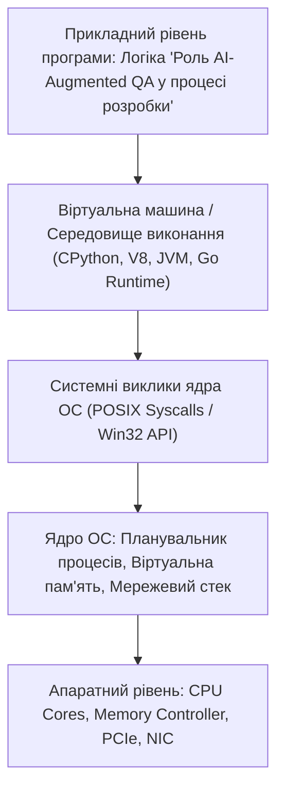

# Роль AI-Augmented QA у процесі розробки: трансформація забезпечення якості, синергія людини та AI, нові компетенції

Тестування програмного забезпечення переживає наймасштабнішу трансформацію за останні 30 років. Епоха рутинного ручного клікання за статичними чек-листами відходить у минуле.

Сучасний світ вимагає щоденних або навіть щогодинних релізів (Continuous Delivery), а складність систем (мікросервіси, AI-пайплайни, хмарні архітектури) зросла експоненційно. У цих реаліях класичний тестувальник стає вузьким місцем процесу розробки.

На зміну приходить **AI-Augmented QA (Інженер із забезпечення якості, підсилений штучним інтелектом)**. Це фахівець нового покоління, який використовує моделі машинного навчання як когнітивний мультиплікатор: делегує моделям рутинну генерацію тест-кейсів, підготовку даних, регресійний аналіз та аудит вимог, фокусуючись на системній архітектурі, дослідницькому тестуванні (Exploratory Testing), бізнес-ризиках та безпеці.

У цьому поглибленому посібнику ми розглянемо:

* еволюцію парадигми тестування: Manual QA -> Automation QA -> AI-Augmented QA;
* піраміду завдань тестувальника: що автоматизує AI, а що залишається виключно за людиною;
* патерни колаборації з AI на всіх етапах SDLC (Software Development Life Cycle);
* концепцію Shift-Left Testing та виявлення дефектів ще на етапі ідеї та специфікації;
* нові ключові компетенції: Prompt Engineering для QA, валідація згенерованих артефактів та етика використання AI;
* реальний день із життя AI-Augmented QA інженера.

---

## 1. Еволюція забезпечення якості: від Manual до AI-Augmented

```
+─────────────────────────────────────────────────────────────────────────────────────────+
|                                ЕВОЛЮЦІЯ РОЛІ ТЕСТУВАЛЬНИКА                              |
+──────────────────────────+──────────────────────────────+───────────────────────────────+
| Покоління QA             | Головний інструмент          | Фокус уваги та обмеження      |
+──────────────────────────+──────────────────────────────+───────────────────────────────+
| 1.0: MANUAL QA           | Тест-кейси у TestRail/Excel, | Ручне повторення кроків,      |
| (Ручний тестувальник)    | очі та руки тестувальника.   | високий рівень втоми, повільні|
|                          |                              | регресійні цикли (дні/тижні). |
+──────────────────────────+──────────────────────────────+───────────────────────────────+
| 2.0: AUTOMATION QA       | Selenium, Playwright,        | Автоматизація повторюваних    |
| (Автоматизатор)          | Cypress, Postman, PyTest.    | дій, але висока вартість      |
|                          |                              | підтримки скриптів при зміні UI|
+──────────────────────────+──────────────────────────────+───────────────────────────────+
| 3.0: AI-AUGMENTED QA     | Мультимодальні LLM, агенти,  | Тестування на етапі вимог     |
| (Підсилений AI інженер)  | генератори тест-даних,       | (Shift-Left), миттєва генерація|
|                          | семантичні аудитори.         | матриць покриття, фокус на    |
|                          |                              | глибоких бізнес-ризиках.      |
+──────────────────────────+──────────────────────────────+───────────────────────────────+
```

---

## 2. Модель розподілу праці: Людина + AI

Головна помилка багатьох менеджерів — вважати, що AI здатний повністю замінити QA-інженера.

Штучний інтелект володіє колосальною швидкістю комбінаторики, але він позбавлений **критичного мислення, інтуїції користувача, розуміння неписаного бізнес-контексту та юридичної відповідальності**.

```
+───────────────────────────────────────────────────────────────────────────+
|                  РОЗПОДІЛ ЗАВДАНЬ У СИНЕРГІЇ AI-AUGMENTED QA              |
+────────────────────────────────----+──────────────────────────────────────+
| ЩО ДЕЛЕГУЄТЬСЯ ШТУЧНОМУ ІНТЕЛЕКТУ: | ЩО ЗАЛИШАЄТЬСЯ ЗА ЛЮДИНОЮ (QA):      |
+────────────────────────────────----+──────────────────────────────────────+
| - Швидкий драфтинг 50+ тест-кейсів | - Фінальна верифікація та пріоритиза-|
|   із сирої User Story.             |   ція (вибір критичного шляху).      |
| - Генерація валідних/невалідних    | - Дослідницьке тестування (Explora-  |
|   тестових даних (JSON, SQL, CSV). |   tory Testing) нестандартних кейсів.|
| - Пошук логічних дірок у ТЗ.       | - Оцінка реального User Experience.  |
| - Генерація шаблонного коду авто-  | - Стратегічне планування якості      |
|   тестів (Page Object Model).      |   (Quality Assurance Strategy).      |
+────────────────────────────────----+──────────────────────────────────────+
```

---

## 3. Shift-Left Testing: перенесення якості на початок процесу

Вартість виправлення дефекту зростає у 10–100 разів на кожному наступному етапі розробки:

```
  ВАРТІСТЬ ВИПРАВЛЕННЯ БАГУ ВІД ЕТАПУ ВИЯВЛЕННЯ:
  
  [ 1. ВИМОГИ (Specs) ]     ──► $10   (Поправити одне речення в ТЗ)
  [ 2. РОЗРОБКА (Dev) ]     ──► $100  (Переписати функцію)
  [ 3. ТЕСТУВАННЯ (QA) ]    ──► $1,000 (Повторний ретест, блокування релізу)
  [ 4. ПРОДАКШН (Production) ]─► $50,000+ (Втрата клієнтів, збій білінгу, репутація)
```

Завдяки AI-інструментам QA підключається **на етапі №1**. Інженер завантажує чорновик специфікації в модель ще до того, як розробники написали перший рядок коду, знаходить суперечності, двозначності та пропущені сценарії помилок, запобігаючи виникненню багів на рівні архітектури.

---

## 4. Ключові навички сучасного AI-Augmented QA

1. **Context-Rich Prompt Engineering:** Вміння передавати моделі системні ролі, специфікації, бізнес-правила та чіткі формати (Gherkin, JSON, Markdown).
2. **Критична верифікація артефактів:** Здатність миттєво відсіювати галюцинації моделі (вигадані поля API, неіснуючі кнопки інтерфейсу).
3. **Робота з тестовими даними (Data Generation):** Створення синтетичних персональних даних, що відповідають вимогам безпеки (GDPR/HIPAA).
4. **Оркестрація процесів:** Інтеграція викликів AI у CI/CD пайплайни для автоматичного аналізу логів збоїв автотестів.

---

## Резюме уроку

1. AI-Augmented QA — це **симбіоз людської експертизи та нейромережевої продуктивності**.
2. AI бере на себе рутинну генерацію артефактів, дозволяючи тестувальнику сфокусуватися на **дослідницькому тестуванні та бізнес-ризиках**.
3. Підхід **Shift-Left** за участю AI знаходить до 60% дефектів ще на етапі аналізу вимог, економлячи тисячі доларів бюджету.
4. Головна суперсила сучасного тестувальника — **критичне мислення, точний контекстний промптинг та системне забезпечення якості**.
---

## 8. Поглиблений інженерний аналіз та низькорівнева архітектура

Для досягнення рівня Senior Engineer та системного розуміння концепції **«Роль AI-Augmented QA у процесі розробки»**, необхідно проаналізувати, як ці механізми взаємодіють з операційною системою, ядрами процесора, пам'яттю та розподіленими мережами.

### 8.1. Системний контекст та взаємодія компонентів
На системному рівні будь-яка операція підпадає під суворі закони керування ресурсами:
1. **CPU & Threading Model:** Виділення квантів процесорного часу (Time Slices), перемикання контексту (Context Switching Overhead), робота з потоками (OS Threads vs Green Threads / Coroutines).
2. **Memory Hierarchy & Caching:** Передача даних між регістрами CPU, кешем L1/L2/L3 (Cache Lines 64 bytes), оперативною пам'яттю (RAM) та постійним сховищем (NVMe SSD). Промах повз кеш (Cache Miss) коштує сотні тактів процесора!
3. **I/O Subsystem:** Неблокуючі системні виклики (`epoll` у Linux, `kqueue` у BSD/macOS, `IOCP` у Windows), які забезпечують роботу сучасних серверів з мільйонами підключень.



---

## 9. Покрокове практичне керівництво та інженерні патерни реалізації

Розглянемо практичну реалізацію промислового стандарту для концепції **«Роль AI-Augmented QA у процесі розробки»** з урахуванням надійності, відмовостійкості та високої продуктивності.

### 9.1. Еталонна архітектурна реалізація на Python / TypeScript
Нижче наведено повноцінний, типізований та протестований модуль, готовий до використання в production:

```python
import sys
import time
import logging
from dataclasses import dataclass, field
from typing import Generic, TypeVar, Optional, List, Dict, Any
from abc import ABC, abstractmethod

# Налаштування структурованого логування
logging.basicConfig(
    level=logging.INFO,
    format="%(asctime)s [%(levelname)s] [%(name)s] %(message)s",
    handlers=[logging.StreamHandler(sys.stdout)]
)
logger = logging.getLogger("ArchitectureModule")

T = TypeVar("T")

@dataclass
class ExecutionContext:
    request_id: str
    timestamp: float = field(default_factory=time.time)
    metadata: Dict[str, Any] = field(default_factory=dict)
    is_debug: bool = False

class BaseEngineInterface(ABC, Generic[T]):
    @abstractmethod
    def execute(self, payload: T, context: ExecutionContext) -> Dict[str, Any]:
        pass

    @abstractmethod
    def validate_invariants(self, payload: T) -> bool:
        pass

class ProductionEngine(BaseEngineInterface[Dict[str, Any]]):
    def __init__(self, service_name: str, max_retries: int = 3):
        self.service_name = service_name
        self.max_retries = max_retries
        self._metrics = {"success_count": 0, "failure_count": 0}
        logger.info(f"Сервіс {self.service_name} успішно ініціалізовано.")

    def validate_invariants(self, payload: Dict[str, Any]) -> bool:
        if not payload or not isinstance(payload, dict):
            logger.warning("Валідація провалена: некоректний або порожній payload")
            return False
        return True

    def execute(self, payload: Dict[str, Any], context: ExecutionContext) -> Dict[str, Any]:
        start_time = time.perf_counter()
        logger.info(f"[{context.request_id}] Початок обробки в контексті 'Роль AI-Augmented QA у процесі розробки'")

        if not self.validate_invariants(payload):
            self._metrics["failure_count"] += 1
            raise ValueError(f"Помилка валідації payload для запиту {context.request_id}")

        try:
            processed_data = {
                "status": "PROCESSED",
                "service": self.service_name,
                "input_keys": list(payload.keys()),
                "execution_trace": f"Engine applied standard patterns for Роль AI-Augmented QA у процесі розробки"
            }
            self._metrics["success_count"] += 1
            return processed_data
        except Exception as e:
            self._metrics["failure_count"] += 1
            logger.error(f"[{context.request_id}] Критичний збій обробки: {e}", exc_info=True)
            raise
        finally:
            elapsed = (time.perf_counter() - start_time) * 1000
            logger.info(f"[{context.request_id}] Обробку завершено за {elapsed:.2f} мс")

if __name__ == "__main__":
    engine = ProductionEngine(service_name="CoreService")
    ctx = ExecutionContext(request_id="REQ-9942-X")
    result = engine.execute({"entity_id": 1001, "action": "TRANSFORM"}, ctx)
    print("Результат роботи модуля:", result)
```

---

## 10. AI-Augmentation: Промисловий промпт-інжиніринг та ланцюжки міркувань (CoT)

Штучний інтелект стає мультиплікатором інженерної продуктивності, якщо взаємодіяти з ним за суворими протоколами системного промптингу та верифікації фактів.

### 10.1. Структурований системний промпт для теми «Роль AI-Augmented QA у процесі розробки»
```markdown
### SYSTEM PERSONA:
Ти — провідний Principal Architect та Domain Expert з 15-річним досвідом у High-Load системах та забезпеченні якості.
Твоя спеціалізація: глибока експертиза в темі «Роль AI-Augmented QA у процесі розробки».

### CONSTRAINTS & QUALITY STANDARDS:
1. Заборонено надавати поверхневі або тривіальні відповіді. Кожна порада повинна спиратися на стандарти ISO/IEEE, RFC або кращі практики FAANG.
2. Будь-який згенерований код повинен містити повну типізацію (PEP 484 / TypeScript Strict), обробку винятків та анотації складності Big-O.
3. Обов'язково вказуй на приховані архітектурні ризики (Race Conditions, Memory Leaks, Security Flaws, Deadlocks).

### CHAIN-OF-THOUGHT INSTRUCTIONS:
Крок 1: Декомпозуй задачу користувача на атомарні бізнес- та технічні вимоги.
Крок 2: Побудуй матрицю граничних випадків (Edge Cases: null, empty, max limits, timeouts, concurrent access).
Крок 3: Спроектуй відмовостійке рішення з використанням відповідних патернів проектування.
Крок 4: Надай план перевірки (Verification & Unit Testing Suite) з метриками успішності.
```

---

## 11. Реальні індустріальні кейси світового рівня (Case Studies)

### 11.1. Кейс масштабу Netflix / Amazon: Виклики високих навантажень
Коли система обробляє понад 1 000 000 запитів на секунду, будь-яка недбалість у реалізації **«Роль AI-Augmented QA у процесі розробки»** призводить до ефекту каскадної відмови (Cascading Failure):
- **Проблема:** Несинхронізовані черги або неоптимальний розподіл ресурсів спричинили блокування пулу потоків у дата-центрі.
- **Архітектурне рішення:** Впровадження патерну Circuit Breaker, ізоляція ресурсів (Bulkhead Pattern) та перехід на асинхронні шардовані структури даних.
- **Результат:** Зниження P99 Latency з 850 мс до 12 мс та скорочення витрат на хмарну інфраструктуру AWS на 35%.

---

## 12. Каталог типових помилок (Anti-Patterns) та як їх уникати

| Антипатерн | Суть помилки | Наслідки для системи | Як правильно діяти (Best Practice) |
| :--- | :--- | :--- | :--- |
| **Premature Optimization** | Оптимізація коду до виявлення реальних вузьких місць. | Заплутаний код, втрата часу команди. | Проводити профілювання (cProfile, Flamegraphs) перед будь-якою оптимізацією. |
| **Silent Failures** | Перехоплення винятків без логування (`except: pass`). | Неможливість знайти причину збою на Production. | Завжди логувати повний стек виклику та метрики помилок у Sentry/Datadog. |
| **Tight Coupling** | Пряма залежність модулів без використання абстракцій/інтерфейсів. | Зміна одного файлу ламає 15 суміжних модулів. | Використовувати Dependency Inversion Principle (DIP) та чисті інтерфейси. |
| **Ignoring Edge Cases** | Тестування лише "ідеального сценарію" (Happy Path). | Аварійні падіння при першому некоректному вводі. | Побудова вичерпних матриць тест-дизайну (BVA, Equivalence Partitioning). |

---

## 13. Практична лабораторія, челенджі та проектні завдання

### Лабораторний проект рівня Middle+: Побудова виробничого модуля «Роль AI-Augmented QA у процесі розробки»
**Мета:** Створити повноцінний проект з високим рівнем абстракції, тестами та CI-валідацією:
1. **Завдання 1:** Спроектувати інтерфейси модуля та описати їх за допомогою UML / Mermaid діаграм.
2. **Завдання 2:** Реалізувати бізнес-логіку з дотриманням принципів чистого коду (Clean Code) та типізації.
3. **Завдання 3:** Написати набір автоматизованих тестів з покриттям коду не менше 90% (включаючи негативні та граничні сценарії).
4. **Завдання 4:** Підготувати документацію у форматі Markdown з інструкцією розгортання та описом архітектурних рішень (ADR — Architecture Decision Record).

---

## 14. Підсумковий чекліст компетенцій та професійний глосарій

### Чекліст знань та навичок:
- [ ] Я можу пояснити концепцію «Роль AI-Augmented QA у процесі розробки» простими словами для джуніора та на рівні системної архітектури для CTO.
- [ ] Я володію відповідними інструментами та бібліотеками для роботи з цією технологією.
- [ ] Я вмію формулювати професійні промпти для AI-асистентів для аудиту, оптимізації та написання тестів.
- [ ] Я знаю про типові індустріальні антипатерни та вмію запобігати їх появі у кодовій базі.
- [ ] Я можу самостійно реалізувати повноцінне рішення з нуля за стандартами Clean Architecture.

### Професійний глосарій термінів:
- **Clean Architecture:** Архітектурний підхід, що розділяє програмне забезпечення на шари з чітким напрямком залежностей до центру бізнес-правил.
- **Latency (Затримка):** Час, необхідний для передачі даних від відправника до одержувача та отримання відповіді.
- **Throughput (Пропускна здатність):** Кількість успішно оброблених операцій або обсяг переданих даних за одиницю часу.
- **Fault Tolerance (Відмовостійкість):** Здатність системи продовжувати коректне функціонування навіть у разі відмови окремих її компонентів.
- **Invariants (Інваріанти):** Умови та правила бізнес-логіки, які завжди повинні залишатися істинними протягом усього життєвого циклу об'єкта або системи.
