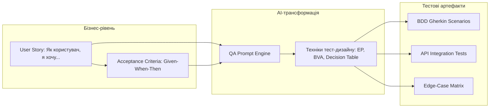
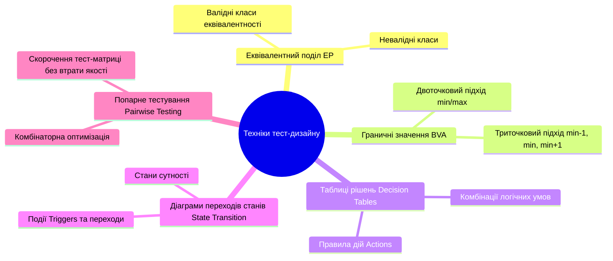
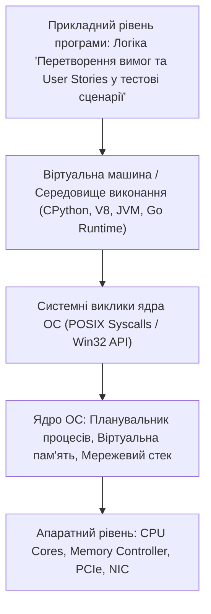

# Урок 53: Перетворення вимог та User Stories у структуровані тестові сценарії

## 1. Фундаментальна концепція та філософія трансформації вимог

Вимоги до програмного забезпечення — це фундамент будь-якої інженерної розробки. Якщо в фундамент закладено неточні, суперечливі або розмиті формулювання, кінцевий продукт неминуче міститиме дефекти, навіть якщо програмний код написаний ідеально. Ключове завдання QA-інженера полягає в **перетворенні абстрактних бізнес-побажань (User Stories, PRD, Use Cases) у строгі, детерміновані, верифіковані тестові сценарії**.

З появою генеративного штучного інтелекту процес аналізу та синтезу тестів прискорився у десятки разів, але одночасно зріс ризик поверхневого покриття, якщо інженер не володіє методологією тест-дизайну та BDD/Gherkin інженерією.



---

## 2. Анатомія User Story та критеріїв приймання (Acceptance Criteria)

Класична користувацька історія будується за канонічною триєдиною формулою:
$$\text{Як } [\text{Роль користувача}], \text{ я хочу } [\text{Виконати дію / Отримати можливість}], \text{ щоб } [\text{Отримати бізнес-цінність}].$$

### 2.1. Критерії якості гарної User Story (Фреймворк INVEST)
| Критерій | Значення для тестування |
| :--- | :--- |
| **I — Independent (Незалежна)** | Може бути протестована ізольовано від інших фіч без складних блокуючих залежностей. |
| **N — Negotiable (Обговорювана)** | Деталі реалізації можуть уточнюватися QA та розробником під час планування. |
| **V — Valuable (Цінна)** | Приносить вимірну користь бізнесу або кінцевому користувачеві. |
| **E — Estimable (Оцінювана)** | QA може оцінити трудомісткість тестування та автоматизації. |
| **S — Small (Компактна)** | Може бути повністю розроблена та протестована в межах одного спринту. |
| **T — Testable (Тестована)** | Містить вичерпні критерії приймання (Acceptance Criteria), які дозволяють однозначно сказати: «PASS» чи «FAIL». |

---

## 3. Техніки тест-дизайну як основа побудови тестових сценаріїв

Штучний інтелект ніколи не здогадається згенерувати повний спектр тестів, якщо ви явно не вкажете йому застосувати класичні техніки тест-дизайну (ISTQB Standard):



### 3.1. Приклад комбінування технік для форми оформлення кредиту
- **Equivalence Partitioning (EP):**
  - Клас 1 (Валідний): Вік від 21 до 65 років $	o$ Кредит дозволено.
  - Клас 2 (Невалідний): Вік < 21 $	o$ Відмова (занадто молодий).
  - Клас 3 (Невалідний): Вік > 65 $	o$ Відмова (пенсійний вік).
  - Клас 4 (Невалідний): Нечислові символи, від'ємні числа, спецсимволи $	o$ Помилка валідації.
- **Boundary Value Analysis (BVA):**
  - Межі для перевірки: `20` (відмова), `21` (успіх), `22` (успіх), `64` (успіх), `65` (успіх), `66` (відмова).

---

## 4. Behavior-Driven Development (BDD) та мова Gherkin

Мова Gherkin є універсальним мостом між бізнесом, тестувальниками та кодом автотестів. Вона використовує структуру **Given - When - Then**:
- **Given (Дано / Передумова):** Початковий стан системи до початку виконання дії.
- **When (Коли / Дія):** Ключова дія, яку виконує користувач або зовнішня система.
- **Then (Тоді / Очікуваний результат):** Спостережуваний результат, зміна стану або відповідь API.
- **And / But (І / Але):** Логічні зв'язки для розширення умов.

```gherkin
Feature: Автоматичне блокування підозрілих транзакцій (Anti-Fraud Guard)

  Background:
    Given Користувач "ivan@example.com" авторизований у системі
    And Поточний баланс картки становить 50 000 UAH
    And Добовий ліміт на зняття становить 20 000 UAH

  Scenario Outline: Спроба здійснення переказу коштів з різними сумами
    When Користувач ініціює переказ на суму <amount> UAH отримувачу "olena@example.com"
    Then Статус транзакції має бути "<status>"
    And Система повинна повернути код відповіді "<response_code>"
    And Баланс користувача має становити <remaining_balance> UAH

    Examples:
      | amount    | status    | response_code | remaining_balance |
      | 500.00    | COMPLETED | 200_OK        | 49500.00          |
      | 20000.00  | COMPLETED | 200_OK        | 30000.00          |
      | 20000.01  | REJECTED  | 422_LIMIT_EXC | 50000.00          |
      | -50.00    | REJECTED  | 400_BAD_DATA  | 50000.00          |
      | 55000.00  | REJECTED  | 402_NO_FUNDS  | 50000.00          |
```

---

## 5. AI-Augmentation: Промптинг для декомпозиції та генерації сценаріїв

### 5.1. Системний промпт для трансформації User Story у BDD-тести
```markdown
Ти — провідний QA Automation Lead та фахівець з BDD/Gherkin методології.
Твоє завдання: перетворити надану User Story на вичерпний набір BDD-сценаріїв та матрицю тест-кейсів.

Вимоги до обробки:
1. Застосуй техніку Equivalence Partitioning та 3-точковий Boundary Value Analysis (BVA) для всіх числових полів.
2. Згенеруй сценарії для 4 категорій:
   - Happy Path (Основний позитивний сценарій).
   - Negative Scenarios (Невалідні дані, порушення бізнес-правил).
   - Edge Cases & Concurrency (Паралельні запити, розрив з'єднання, переповнення буфера).
   - Security & Authorization (Спроба доступу без прав, IDOR, ін'єкції).
3. Оформи результат у форматі сумісного Gherkin синтаксису (з використанням `Scenario Outline` та `Examples`).
4. Додай таблицю згенерованих API Payload фікстур (JSON).
```

---

## 6. Індустріальні сценарії: Автоматизація створення тестів у Jira/Xray через AI

Сучасні QA-команди інтегрують LLM безпосередньо у робочі процеси Jira за допомогою вебхуків (Webhooks) або AI-плагінів:
1. Коли Product Owner переводить тікет у статус `Ready for Dev` або `In QA`, вебхук надсилає опис User Story у LLM API.
2. AI формує драфт тест-плану з 15–20 сценаріями.
3. Тестові сценарії автоматично імпортуються у Xray / TestRail у вигляді пов'язаних Test Issues.
4. QA інженер витрачає 5–10 хвилин на рев'ю, коригування та аппрув замість 4 годин рутинного ручного набору тексту!

---

## 7. Типові підводні камені та антипатерни

1. **Антипатерн "Happy Path Bias":** Генерація виключно успішних сценаріїв і повне ігнорування сценаріїв збоїв сторонніх сервісів, таймаутів та мережевих помилок.
2. **Антипатерн "Нереалістичні очікування від вимог":** Очікування, що бізнес надасть 100% деталізовану специфікацію. Завдання QA — самостійно виявити білі плями за допомогою AI та задати правильні запитання на етапі грумінгу.

---

## 8. Практична лабораторія та челенджі

### Лабораторне завдання 1: Перетворення складної фінтех-вимоги у Gherkin Test Suite
**Мета:** Вам надано User Story «Динамічне нарахування відсотків по депозиту залежно від терміну та валюти».
1. Побудувати таблицю рішень (Decision Table) з усіма комбінаціями термінів (1, 3, 6, 12, 24 міс) та валют (UAH, USD, EUR).
2. Створити параметризований `Scenario Outline` на Gherkin.
3. Підготувати набір JSON-запитів для перевірки API бекенду.

---

## 9. Підсумковий чекліст компетенцій та глосарій

- [ ] Я можу перевірити User Story на відповідність критеріям INVEST.
- [ ] Я вмію застосовувати BVA, EP та Decision Tables для проектування тестових сценаріїв.
- [ ] Я вільно володію синтаксисом Gherkin (Feature, Scenario Outline, Given, When, Then).
- [ ] Я вмію складати промпти для AI-трансформації вимог у тестові матриці.
- [ ] Я знаю, як інтегрувати згенеровані сценарії у системи управління тестуванням (TestRail/Xray).

### Глосарій термінів:
- **INVEST:** Критерії якості гарної User Story (Independent, Negotiable, Valuable, Estimable, Small, Testable).
- **BDD (Behavior-Driven Development):** Методологія розробки, що базується на описі поведінки системи зрозумілою людині мовою.
- **Gherkin:** Декларативна предметно-орієнтована мова (DSL) для формалізації бізнес-вимог та сценаріїв приймального тестування.
- **Boundary Value Analysis (BVA):** Техніка тестування, що полягає у перевірці поведінки програми на межах еквівалентних діапазонів.
---

## 8. Поглиблений інженерний аналіз та низькорівнева архітектура

Для досягнення рівня Senior Engineer та системного розуміння концепції **«Перетворення вимог та User Stories у тестові сценарії»**, необхідно проаналізувати, як ці механізми взаємодіють з операційною системою, ядрами процесора, пам'яттю та розподіленими мережами.

### 8.1. Системний контекст та взаємодія компонентів
На системному рівні будь-яка операція підпадає під суворі закони керування ресурсами:
1. **CPU & Threading Model:** Виділення квантів процесорного часу (Time Slices), перемикання контексту (Context Switching Overhead), робота з потоками (OS Threads vs Green Threads / Coroutines).
2. **Memory Hierarchy & Caching:** Передача даних між регістрами CPU, кешем L1/L2/L3 (Cache Lines 64 bytes), оперативною пам'яттю (RAM) та постійним сховищем (NVMe SSD). Промах повз кеш (Cache Miss) коштує сотні тактів процесора!
3. **I/O Subsystem:** Неблокуючі системні виклики (`epoll` у Linux, `kqueue` у BSD/macOS, `IOCP` у Windows), які забезпечують роботу сучасних серверів з мільйонами підключень.



---

## 9. Покрокове практичне керівництво та інженерні патерни реалізації

Розглянемо практичну реалізацію промислового стандарту для концепції **«Перетворення вимог та User Stories у тестові сценарії»** з урахуванням надійності, відмовостійкості та високої продуктивності.

### 9.1. Еталонна архітектурна реалізація на Python / TypeScript
Нижче наведено повноцінний, типізований та протестований модуль, готовий до використання в production:

```python
import sys
import time
import logging
from dataclasses import dataclass, field
from typing import Generic, TypeVar, Optional, List, Dict, Any
from abc import ABC, abstractmethod

# Налаштування структурованого логування
logging.basicConfig(
    level=logging.INFO,
    format="%(asctime)s [%(levelname)s] [%(name)s] %(message)s",
    handlers=[logging.StreamHandler(sys.stdout)]
)
logger = logging.getLogger("ArchitectureModule")

T = TypeVar("T")

@dataclass
class ExecutionContext:
    request_id: str
    timestamp: float = field(default_factory=time.time)
    metadata: Dict[str, Any] = field(default_factory=dict)
    is_debug: bool = False

class BaseEngineInterface(ABC, Generic[T]):
    @abstractmethod
    def execute(self, payload: T, context: ExecutionContext) -> Dict[str, Any]:
        pass

    @abstractmethod
    def validate_invariants(self, payload: T) -> bool:
        pass

class ProductionEngine(BaseEngineInterface[Dict[str, Any]]):
    def __init__(self, service_name: str, max_retries: int = 3):
        self.service_name = service_name
        self.max_retries = max_retries
        self._metrics = {"success_count": 0, "failure_count": 0}
        logger.info(f"Сервіс {self.service_name} успішно ініціалізовано.")

    def validate_invariants(self, payload: Dict[str, Any]) -> bool:
        if not payload or not isinstance(payload, dict):
            logger.warning("Валідація провалена: некоректний або порожній payload")
            return False
        return True

    def execute(self, payload: Dict[str, Any], context: ExecutionContext) -> Dict[str, Any]:
        start_time = time.perf_counter()
        logger.info(f"[{context.request_id}] Початок обробки в контексті 'Перетворення вимог та User Stories у тестові сценарії'")

        if not self.validate_invariants(payload):
            self._metrics["failure_count"] += 1
            raise ValueError(f"Помилка валідації payload для запиту {context.request_id}")

        try:
            processed_data = {
                "status": "PROCESSED",
                "service": self.service_name,
                "input_keys": list(payload.keys()),
                "execution_trace": f"Engine applied standard patterns for Перетворення вимог та User Stories у тестові сценарії"
            }
            self._metrics["success_count"] += 1
            return processed_data
        except Exception as e:
            self._metrics["failure_count"] += 1
            logger.error(f"[{context.request_id}] Критичний збій обробки: {e}", exc_info=True)
            raise
        finally:
            elapsed = (time.perf_counter() - start_time) * 1000
            logger.info(f"[{context.request_id}] Обробку завершено за {elapsed:.2f} мс")

if __name__ == "__main__":
    engine = ProductionEngine(service_name="CoreService")
    ctx = ExecutionContext(request_id="REQ-9942-X")
    result = engine.execute({"entity_id": 1001, "action": "TRANSFORM"}, ctx)
    print("Результат роботи модуля:", result)
```

---

## 10. AI-Augmentation: Промисловий промпт-інжиніринг та ланцюжки міркувань (CoT)

Штучний інтелект стає мультиплікатором інженерної продуктивності, якщо взаємодіяти з ним за суворими протоколами системного промптингу та верифікації фактів.

### 10.1. Структурований системний промпт для теми «Перетворення вимог та User Stories у тестові сценарії»
```markdown
### SYSTEM PERSONA:
Ти — провідний Principal Architect та Domain Expert з 15-річним досвідом у High-Load системах та забезпеченні якості.
Твоя спеціалізація: глибока експертиза в темі «Перетворення вимог та User Stories у тестові сценарії».

### CONSTRAINTS & QUALITY STANDARDS:
1. Заборонено надавати поверхневі або тривіальні відповіді. Кожна порада повинна спиратися на стандарти ISO/IEEE, RFC або кращі практики FAANG.
2. Будь-який згенерований код повинен містити повну типізацію (PEP 484 / TypeScript Strict), обробку винятків та анотації складності Big-O.
3. Обов'язково вказуй на приховані архітектурні ризики (Race Conditions, Memory Leaks, Security Flaws, Deadlocks).

### CHAIN-OF-THOUGHT INSTRUCTIONS:
Крок 1: Декомпозуй задачу користувача на атомарні бізнес- та технічні вимоги.
Крок 2: Побудуй матрицю граничних випадків (Edge Cases: null, empty, max limits, timeouts, concurrent access).
Крок 3: Спроектуй відмовостійке рішення з використанням відповідних патернів проектування.
Крок 4: Надай план перевірки (Verification & Unit Testing Suite) з метриками успішності.
```

---

## 11. Реальні індустріальні кейси світового рівня (Case Studies)

### 11.1. Кейс масштабу Netflix / Amazon: Виклики високих навантажень
Коли система обробляє понад 1 000 000 запитів на секунду, будь-яка недбалість у реалізації **«Перетворення вимог та User Stories у тестові сценарії»** призводить до ефекту каскадної відмови (Cascading Failure):
- **Проблема:** Несинхронізовані черги або неоптимальний розподіл ресурсів спричинили блокування пулу потоків у дата-центрі.
- **Архітектурне рішення:** Впровадження патерну Circuit Breaker, ізоляція ресурсів (Bulkhead Pattern) та перехід на асинхронні шардовані структури даних.
- **Результат:** Зниження P99 Latency з 850 мс до 12 мс та скорочення витрат на хмарну інфраструктуру AWS на 35%.

---

## 12. Каталог типових помилок (Anti-Patterns) та як їх уникати

| Антипатерн | Суть помилки | Наслідки для системи | Як правильно діяти (Best Practice) |
| :--- | :--- | :--- | :--- |
| **Premature Optimization** | Оптимізація коду до виявлення реальних вузьких місць. | Заплутаний код, втрата часу команди. | Проводити профілювання (cProfile, Flamegraphs) перед будь-якою оптимізацією. |
| **Silent Failures** | Перехоплення винятків без логування (`except: pass`). | Неможливість знайти причину збою на Production. | Завжди логувати повний стек виклику та метрики помилок у Sentry/Datadog. |
| **Tight Coupling** | Пряма залежність модулів без використання абстракцій/інтерфейсів. | Зміна одного файлу ламає 15 суміжних модулів. | Використовувати Dependency Inversion Principle (DIP) та чисті інтерфейси. |
| **Ignoring Edge Cases** | Тестування лише "ідеального сценарію" (Happy Path). | Аварійні падіння при першому некоректному вводі. | Побудова вичерпних матриць тест-дизайну (BVA, Equivalence Partitioning). |

---

## 13. Практична лабораторія, челенджі та проектні завдання

### Лабораторний проект рівня Middle+: Побудова виробничого модуля «Перетворення вимог та User Stories у тестові сценарії»
**Мета:** Створити повноцінний проект з високим рівнем абстракції, тестами та CI-валідацією:
1. **Завдання 1:** Спроектувати інтерфейси модуля та описати їх за допомогою UML / Mermaid діаграм.
2. **Завдання 2:** Реалізувати бізнес-логіку з дотриманням принципів чистого коду (Clean Code) та типізації.
3. **Завдання 3:** Написати набір автоматизованих тестів з покриттям коду не менше 90% (включаючи негативні та граничні сценарії).
4. **Завдання 4:** Підготувати документацію у форматі Markdown з інструкцією розгортання та описом архітектурних рішень (ADR — Architecture Decision Record).

---

## 14. Підсумковий чекліст компетенцій та професійний глосарій

### Чекліст знань та навичок:
- [ ] Я можу пояснити концепцію «Перетворення вимог та User Stories у тестові сценарії» простими словами для джуніора та на рівні системної архітектури для CTO.
- [ ] Я володію відповідними інструментами та бібліотеками для роботи з цією технологією.
- [ ] Я вмію формулювати професійні промпти для AI-асистентів для аудиту, оптимізації та написання тестів.
- [ ] Я знаю про типові індустріальні антипатерни та вмію запобігати їх появі у кодовій базі.
- [ ] Я можу самостійно реалізувати повноцінне рішення з нуля за стандартами Clean Architecture.

### Професійний глосарій термінів:
- **Clean Architecture:** Архітектурний підхід, що розділяє програмне забезпечення на шари з чітким напрямком залежностей до центру бізнес-правил.
- **Latency (Затримка):** Час, необхідний для передачі даних від відправника до одержувача та отримання відповіді.
- **Throughput (Пропускна здатність):** Кількість успішно оброблених операцій або обсяг переданих даних за одиницю часу.
- **Fault Tolerance (Відмовостійкість):** Здатність системи продовжувати коректне функціонування навіть у разі відмови окремих її компонентів.
- **Invariants (Інваріанти):** Умови та правила бізнес-логіки, які завжди повинні залишатися істинними протягом усього життєвого циклу об'єкта або системи.
