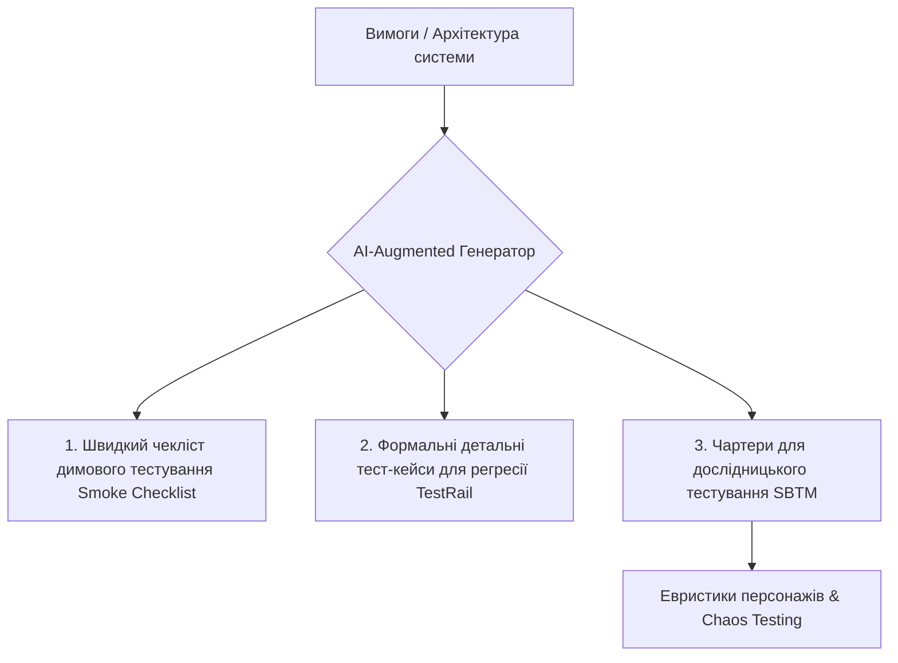
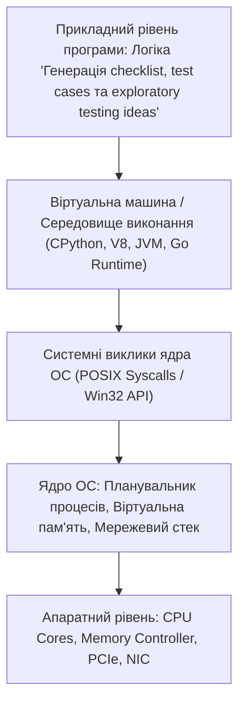

# Урок 54: Генерація чеклістів, тест-кейсів та ідей для дослідницького тестування (Exploratory Testing)

## 1. Фундаментальна концепція та філософія тестової документації

Тестова документація — це карта та компас інженера з якості. Залежно від контексту проекту, швидкості релізного циклу та зрілості команди, QA використовує різні рівні деталізації артефактів:
- **Чекліст (Checklist):** Високорівневий список перевірок («Що перевірити»), що забезпечує максимальну швидкість тестування при низьких накладних витратах на підтримку.
- **Тест-кейс (Test Case):** Формальний покроковий сценарій з чіткими передумовами, тестовими даними та очікуваними результатами («Як саме перевірити»).
- **Exploratory Testing (Дослідницьке тестування):** Одночасне дослідження системи, проектування тестів та їх виконання на основі інтуїції, евристик та аналізу ризиків.



---

## 2. Анатомія ідеального тест-кейсу

Професійний тест-кейс повинен відповідати стандартам ISO/IEC/IEEE 29119 та бути зрозумілим будь-якому члену команди без додаткових усних пояснень.

### 2.1. Обов'язкові атрибути тест-кейсу:
1. **ID:** Унікальний ідентифікатор (наприклад, `TC-PAY-042`).
2. **Title (Назва):** Чіткий опис суті перевірки у форматі дії та умови (наприклад: *«Перевірка блокування транзакції при перевищенні ліміту 3DS»*).
3. **Priority (Пріоритет):** `Blocker`, `Critical`, `Major`, `Minor`.
4. **Preconditions (Передумови):** Стан системи, права користувача, баланс або конфігурація перед тестом.
5. **Test Data (Тестові дані):** Точні значення входів (валідовані анонімізовані дані або синтетичні фікстури).
6. **Steps to Reproduce (Покрокові дії):** Нумеровані однозначні дії.
7. **Expected Result (Очікуваний результат):** Точний стан системи, відповідь інтерфейсу чи запис у базі даних.

---

## 3. Дослідницьке тестування (Exploratory Testing) та Session-Based Test Management (SBTM)

Дослідницьке тестування — це не хаотичне клікання кнопок («Monkey Testing»), а суворий науковий підхід. Його основу складає **Чартер тестування (Test Charter)**.

### 3.1. Структура чартеру дослідницької сесії:
- **Explore (Дослідити):** Цільовий модуль або функціонал.
- **With (За допомогою):** Інструменти, евристики, спеціалізовані вхідні дані.
- **To Discover (Щоб виявити):** Потенційні ризики, витоки пам'яті, деградацію UX, проблеми безпеки.

```markdown
### Зразок Чартеру дослідницької сесії (Exploratory Charter)
- **Ціль:** Дослідити процес оформлення замовлення (Checkout Flow).
- **Персонаж (Persona):** «Нетерплячий покупець з нестабільним 3G-з'єднанням».
- **Евристика:** CRUD, Goldilocks (Занадто мало / Занадто багато / Якраз), Повторний клік (Dbl-Click), Втрата мережі.
- **Часовий ліміт (Timebox):** 45 хвилин.
- **Очікуваний результат:** Перелік знайдених аномалій, запис відео сесії, пропозиції щодо покращення стабільності.
```

---

## 4. AI-Augmentation: Промпти для генерації багаторівневої тестової документації

### 4.1. Системний промпт для синтезу регресійних тест-кейсів та евристик
```markdown
Ти — Senior QA Lead з міжнародною сертифікацією ISTQB Full Advanced Level.
Твоє завдання: на основі наданого опису функціоналу згенерувати повний пакет тестової документації.

Пакет повинен містити:
1. **Smoke Checklist:** Топ-5 найбільш критичних перевірок, падіння яких блокує реліз.
2. **Детальні Test Cases (формат TestRail):**
   - 5 Positive Test Cases (Happy Path).
   - 10 Negative Test Cases (Validation, Boundary values, Forbidden operations).
   - 3 Security Test Cases (SQLi, XSS, Role escalation).
3. **Exploratory Testing Charters (SBTM):** 3 детальних чартери для стрес-тестування та нетипових сценаріїв користувачів.
4. **Евристична матриця:** Застосуй евристику FEW HICCUPS (Feedback, Escalation, Warnings, History, Implicit, Competitive, Consistent, Users, Purpose, Standards).
```

---

## 5. Індустріальні кейси: Зниження трудовитрат на підтримку тест-сьютів

### 5.1. Кейс: Автоматичне виявлення дублікатів та застарілих тестів (Test Suite Deduplication)
У великих компаніях з історією у 5–10 років регресійні сьюти розростаються до 5 000–10 000 тест-кейсів. Понад 20% з них є дублікатами або перевіряють функціонал, який давно змінився. Використання векторних баз даних (Vector Embeddings) та LLM дозволяє автоматично виявляти семантичні дублікати тестів, скорочуючи час регресії на 30–40% без втрати якості!

---

## 6. Практична лабораторія та челенджі

### Лабораторне завдання 1: Генерація матриці перевірок для модуля аутентифікації з MFA (Multi-Factor Auth)
**Мета:** Розробити повний тестовий пакет для входу в систему з використанням пароля, SMS OTP-коду та Google Authenticator:
1. Згенерувати за допомогою AI структуру з 20 тест-кейсів.
2. Скласти 2 чартери дослідницького тестування для симуляції атак Brute-Force та перехоплення сесій.
3. Провести верифікацію та вилучити згенеровані дублікати.

---

## 7. Підсумковий чекліст компетенцій та глосарій

- [ ] Я розумію відмінності між чеклістами, тест-кейсами та дослідницьким тестуванням.
- [ ] Я вмію складати формальні тест-кейси згідно зі стандартами ISO/IEEE.
- [ ] Я можу проектувати сесії дослідницького тестування за методологією SBTM.
- [ ] Я знаю про евристики тестування (FEW HICCUPS, Sanity, Personas) та вмію формулювати промпти для їх генерації.
- [ ] Я володію методами оптимізації та дедуплікації великих тестових сьютів за допомогою AI.

### Глосарій термінів:
- **Exploratory Testing:** Підхід до тестування, де проектування та виконання тестів відбуваються паралельно у реальному часі.
- **SBTM (Session-Based Test Management):** Методика структурованого управління дослідницьким тестуванням за допомогою фіксованих за часом сесій та чартерів.
- **Test Charter:** Документ, що визначає цілі, фокус та межі конкретної сесії дослідницького тестування.
- **FEW HICCUPS:** Набір оракулів та евристик тестування, що допомагають виявити невідповідності у поведінці системи.
---

## 8. Поглиблений інженерний аналіз та низькорівнева архітектура

Для досягнення рівня Senior Engineer та системного розуміння концепції **«Генерація checklist, test cases та exploratory testing ideas»**, необхідно проаналізувати, як ці механізми взаємодіють з операційною системою, ядрами процесора, пам'яттю та розподіленими мережами.

### 8.1. Системний контекст та взаємодія компонентів
На системному рівні будь-яка операція підпадає під суворі закони керування ресурсами:
1. **CPU & Threading Model:** Виділення квантів процесорного часу (Time Slices), перемикання контексту (Context Switching Overhead), робота з потоками (OS Threads vs Green Threads / Coroutines).
2. **Memory Hierarchy & Caching:** Передача даних між регістрами CPU, кешем L1/L2/L3 (Cache Lines 64 bytes), оперативною пам'яттю (RAM) та постійним сховищем (NVMe SSD). Промах повз кеш (Cache Miss) коштує сотні тактів процесора!
3. **I/O Subsystem:** Неблокуючі системні виклики (`epoll` у Linux, `kqueue` у BSD/macOS, `IOCP` у Windows), які забезпечують роботу сучасних серверів з мільйонами підключень.



---

## 9. Покрокове практичне керівництво та інженерні патерни реалізації

Розглянемо практичну реалізацію промислового стандарту для концепції **«Генерація checklist, test cases та exploratory testing ideas»** з урахуванням надійності, відмовостійкості та високої продуктивності.

### 9.1. Еталонна архітектурна реалізація на Python / TypeScript
Нижче наведено повноцінний, типізований та протестований модуль, готовий до використання в production:

```python
import sys
import time
import logging
from dataclasses import dataclass, field
from typing import Generic, TypeVar, Optional, List, Dict, Any
from abc import ABC, abstractmethod

# Налаштування структурованого логування
logging.basicConfig(
    level=logging.INFO,
    format="%(asctime)s [%(levelname)s] [%(name)s] %(message)s",
    handlers=[logging.StreamHandler(sys.stdout)]
)
logger = logging.getLogger("ArchitectureModule")

T = TypeVar("T")

@dataclass
class ExecutionContext:
    request_id: str
    timestamp: float = field(default_factory=time.time)
    metadata: Dict[str, Any] = field(default_factory=dict)
    is_debug: bool = False

class BaseEngineInterface(ABC, Generic[T]):
    @abstractmethod
    def execute(self, payload: T, context: ExecutionContext) -> Dict[str, Any]:
        pass

    @abstractmethod
    def validate_invariants(self, payload: T) -> bool:
        pass

class ProductionEngine(BaseEngineInterface[Dict[str, Any]]):
    def __init__(self, service_name: str, max_retries: int = 3):
        self.service_name = service_name
        self.max_retries = max_retries
        self._metrics = {"success_count": 0, "failure_count": 0}
        logger.info(f"Сервіс {self.service_name} успішно ініціалізовано.")

    def validate_invariants(self, payload: Dict[str, Any]) -> bool:
        if not payload or not isinstance(payload, dict):
            logger.warning("Валідація провалена: некоректний або порожній payload")
            return False
        return True

    def execute(self, payload: Dict[str, Any], context: ExecutionContext) -> Dict[str, Any]:
        start_time = time.perf_counter()
        logger.info(f"[{context.request_id}] Початок обробки в контексті 'Генерація checklist, test cases та exploratory testing ideas'")

        if not self.validate_invariants(payload):
            self._metrics["failure_count"] += 1
            raise ValueError(f"Помилка валідації payload для запиту {context.request_id}")

        try:
            processed_data = {
                "status": "PROCESSED",
                "service": self.service_name,
                "input_keys": list(payload.keys()),
                "execution_trace": f"Engine applied standard patterns for Генерація checklist, test cases та exploratory testing ideas"
            }
            self._metrics["success_count"] += 1
            return processed_data
        except Exception as e:
            self._metrics["failure_count"] += 1
            logger.error(f"[{context.request_id}] Критичний збій обробки: {e}", exc_info=True)
            raise
        finally:
            elapsed = (time.perf_counter() - start_time) * 1000
            logger.info(f"[{context.request_id}] Обробку завершено за {elapsed:.2f} мс")

if __name__ == "__main__":
    engine = ProductionEngine(service_name="CoreService")
    ctx = ExecutionContext(request_id="REQ-9942-X")
    result = engine.execute({"entity_id": 1001, "action": "TRANSFORM"}, ctx)
    print("Результат роботи модуля:", result)
```

---

## 10. AI-Augmentation: Промисловий промпт-інжиніринг та ланцюжки міркувань (CoT)

Штучний інтелект стає мультиплікатором інженерної продуктивності, якщо взаємодіяти з ним за суворими протоколами системного промптингу та верифікації фактів.

### 10.1. Структурований системний промпт для теми «Генерація checklist, test cases та exploratory testing ideas»
```markdown
### SYSTEM PERSONA:
Ти — провідний Principal Architect та Domain Expert з 15-річним досвідом у High-Load системах та забезпеченні якості.
Твоя спеціалізація: глибока експертиза в темі «Генерація checklist, test cases та exploratory testing ideas».

### CONSTRAINTS & QUALITY STANDARDS:
1. Заборонено надавати поверхневі або тривіальні відповіді. Кожна порада повинна спиратися на стандарти ISO/IEEE, RFC або кращі практики FAANG.
2. Будь-який згенерований код повинен містити повну типізацію (PEP 484 / TypeScript Strict), обробку винятків та анотації складності Big-O.
3. Обов'язково вказуй на приховані архітектурні ризики (Race Conditions, Memory Leaks, Security Flaws, Deadlocks).

### CHAIN-OF-THOUGHT INSTRUCTIONS:
Крок 1: Декомпозуй задачу користувача на атомарні бізнес- та технічні вимоги.
Крок 2: Побудуй матрицю граничних випадків (Edge Cases: null, empty, max limits, timeouts, concurrent access).
Крок 3: Спроектуй відмовостійке рішення з використанням відповідних патернів проектування.
Крок 4: Надай план перевірки (Verification & Unit Testing Suite) з метриками успішності.
```

---

## 11. Реальні індустріальні кейси світового рівня (Case Studies)

### 11.1. Кейс масштабу Netflix / Amazon: Виклики високих навантажень
Коли система обробляє понад 1 000 000 запитів на секунду, будь-яка недбалість у реалізації **«Генерація checklist, test cases та exploratory testing ideas»** призводить до ефекту каскадної відмови (Cascading Failure):
- **Проблема:** Несинхронізовані черги або неоптимальний розподіл ресурсів спричинили блокування пулу потоків у дата-центрі.
- **Архітектурне рішення:** Впровадження патерну Circuit Breaker, ізоляція ресурсів (Bulkhead Pattern) та перехід на асинхронні шардовані структури даних.
- **Результат:** Зниження P99 Latency з 850 мс до 12 мс та скорочення витрат на хмарну інфраструктуру AWS на 35%.

---

## 12. Каталог типових помилок (Anti-Patterns) та як їх уникати

| Антипатерн | Суть помилки | Наслідки для системи | Як правильно діяти (Best Practice) |
| :--- | :--- | :--- | :--- |
| **Premature Optimization** | Оптимізація коду до виявлення реальних вузьких місць. | Заплутаний код, втрата часу команди. | Проводити профілювання (cProfile, Flamegraphs) перед будь-якою оптимізацією. |
| **Silent Failures** | Перехоплення винятків без логування (`except: pass`). | Неможливість знайти причину збою на Production. | Завжди логувати повний стек виклику та метрики помилок у Sentry/Datadog. |
| **Tight Coupling** | Пряма залежність модулів без використання абстракцій/інтерфейсів. | Зміна одного файлу ламає 15 суміжних модулів. | Використовувати Dependency Inversion Principle (DIP) та чисті інтерфейси. |
| **Ignoring Edge Cases** | Тестування лише "ідеального сценарію" (Happy Path). | Аварійні падіння при першому некоректному вводі. | Побудова вичерпних матриць тест-дизайну (BVA, Equivalence Partitioning). |

---

## 13. Практична лабораторія, челенджі та проектні завдання

### Лабораторний проект рівня Middle+: Побудова виробничого модуля «Генерація checklist, test cases та exploratory testing ideas»
**Мета:** Створити повноцінний проект з високим рівнем абстракції, тестами та CI-валідацією:
1. **Завдання 1:** Спроектувати інтерфейси модуля та описати їх за допомогою UML / Mermaid діаграм.
2. **Завдання 2:** Реалізувати бізнес-логіку з дотриманням принципів чистого коду (Clean Code) та типізації.
3. **Завдання 3:** Написати набір автоматизованих тестів з покриттям коду не менше 90% (включаючи негативні та граничні сценарії).
4. **Завдання 4:** Підготувати документацію у форматі Markdown з інструкцією розгортання та описом архітектурних рішень (ADR — Architecture Decision Record).

---

## 14. Підсумковий чекліст компетенцій та професійний глосарій

### Чекліст знань та навичок:
- [ ] Я можу пояснити концепцію «Генерація checklist, test cases та exploratory testing ideas» простими словами для джуніора та на рівні системної архітектури для CTO.
- [ ] Я володію відповідними інструментами та бібліотеками для роботи з цією технологією.
- [ ] Я вмію формулювати професійні промпти для AI-асистентів для аудиту, оптимізації та написання тестів.
- [ ] Я знаю про типові індустріальні антипатерни та вмію запобігати їх появі у кодовій базі.
- [ ] Я можу самостійно реалізувати повноцінне рішення з нуля за стандартами Clean Architecture.

### Професійний глосарій термінів:
- **Clean Architecture:** Архітектурний підхід, що розділяє програмне забезпечення на шари з чітким напрямком залежностей до центру бізнес-правил.
- **Latency (Затримка):** Час, необхідний для передачі даних від відправника до одержувача та отримання відповіді.
- **Throughput (Пропускна здатність):** Кількість успішно оброблених операцій або обсяг переданих даних за одиницю часу.
- **Fault Tolerance (Відмовостійкість):** Здатність системи продовжувати коректне функціонування навіть у разі відмови окремих її компонентів.
- **Invariants (Інваріанти):** Умови та правила бізнес-логіки, які завжди повинні залишатися істинними протягом усього життєвого циклу об'єкта або системи.
