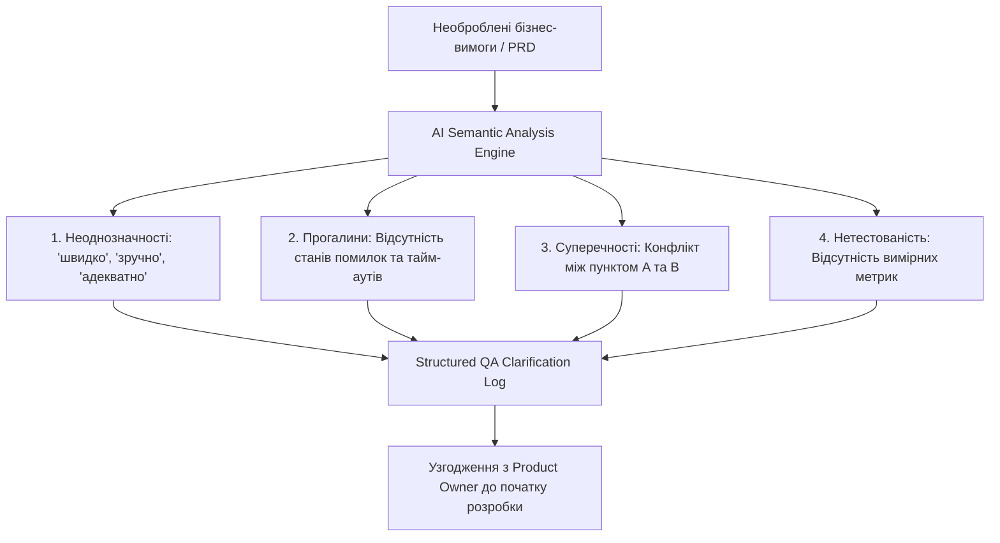
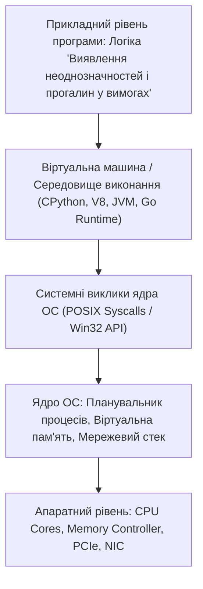

# Урок 55: Виявлення неоднозначностей, суперечностей і прогалин у вимогах за допомогою AI

## 1. Фундаментальна концепція: Тестування вимог як найвища точка окупності QA

Дослідження показують, що **понад 50% усіх критичних дефектів у програмному забезпеченні закладаються на етапі формулювання вимог**, а не під час написання коду! Якщо бізнес-аналітик або продакт-менеджер використав розмите слово, пропустив опис аварійного стану системи або не узгодив вимогу з суміжним мікросервісом, розробники реалізують цей хибний сценарій у коді, а тестувальники витратять дні на з'ясування: «Це баг чи фіча?».

**Тестування вимог (Requirements Testing / Static Testing)** — це процес аналізу специфікацій на предмет повноти, однозначності, несуперечливості, тестованості та відповідності бізнес-цілям до початку кодування.



---

## 2. Класифікація дефектів у специфікаціях

| Тип дефекту | Приклад у тексті вимоги | Чому це катастрофа | Як має бути сформульовано |
| :--- | :--- | :--- | :--- |
| **Неоднозначність (Ambiguity)** | *«Система повинна швидко завантажувати сторінку балансу».* | «Швидко» — суб'єктивне поняття. Для розробника це 5 сек, для користувача — 200 мс. | *«Час повної відмальовки сторінки (LCP) повинен становити не більше 1.2 с при 95-му перцентилі».* |
| **Прогалина (Gap / Incompleteness)** | *«Користувач вводить SMS-код для підтвердження оплати».* | Не описано: що буде, якщо код введено неправильно 3 рази? Скільки секунд живе код? Що якщо SMS не дійшла? | Повний опис тайм-аутів, лімітів спроб та механізму повторної відправки (Resend OTP). |
| **Суперечність (Contradiction)** | Розділ 2: *«Пароль обов'язково 8+ символів»*. Розділ 5: *«Максимальна довжина поля пароля 6 символів»*. | Розробники фронтенду і бекенду реалізують різну логіку, реєстрація користувача заблокується. | Єдиний узгоджений контракт валідації по всій системі. |
| **Нетестованість (Non-testability)** | *«Інтерфейс повинен бути інтуїтивно зрозумілим та ергономічним».* | Неможливо перевірити об'єктивним тестом (PASS/FAIL). | *«Коефіцієнт успішного проходження онбордингу новими користувачами без звернення в саппорт > 85%».* |

---

## 3. Слова-маркери (Red Flag Words), які сигналізують про дефекти у вимогах

Досвідчений QA та навчений AI миттєво сканують текст на наявність небезпечних лексичних маркерів:
- **Суб'єктивні оцінки:** *швидко, зручно, ефективно, надійно, красиво, сучасно, плавно.*
- **Невизначені кількості:** *деякі, більшість, кілька, достатньо, відповідний, різний.*
- **Неявні умови:** *зазвичай, як правило, за необхідності, якщо можливо, за бажанням.*
- **Пасивний стан без суб'єкта:** *«дані мають бути оновлені»* (ким? коли? за якою подією?).
- **Узагальнюючі слова без винятків:** *завжди, ніколи, усі, кожен* (часто ігнорують форс-мажори).

---

## 4. AI-Augmentation: Промптинг для глибокого семантичного аудиту вимог

Генеративні моделі володіють колосальним контекстним баченням і здатні за 30 секунд виявити логічні суперечності в документах на 50 сторінок.

### 4.1. Системний промпт для виявлення дефектів у специфікації (Requirements Linter)
```markdown
Ти — провідний Business Systems Analyst та Lead QA Architect.
Твоє завдання: провести безжальний статичний аудит наданої специфікації вимог (PRD / User Story).

Вимоги до аудиту:
1. Знайди всі слова-маркери невизначеності (Red Flag Words) та запропонуй їх точні технічні заміни.
2. Склади таблицю прогалин (Gaps Matrix):
   - Що відбувається при відмові зовнішніх API?
   - Що відбувається при втраті мережі під час операції (Network Failure)?
   - Які обмеження на конкурентний доступ (Concurrency & Race Conditions)?
   - Яка політика безпеки та обробки персональних даних (GDPR/PII)?
3. Знайди прямі та непрямі логічні суперечності між різними вимогами.
4. Сформулюй структурований список з 10 критичних запитань до Product Owner для блоку Grooming.
```

---

## 5. Індустріальні кейси: Збереження мільйонних бюджетів завдяки ранньому аудиту

### 5.1. Кейс: Фінансовий збій через прогалину у вимогах валютної конвертації
Великий європейський платіжний сервіс випустив фічу автоматичної конвертації валют. У вимогах було детально описано розрахунок курсу, але пропущено пункт: *«Який курс застосовувати, якщо транзакція ініційована у п'ятницю ввечері, а кліринг відбувається в понеділок?»*. У вихідні стався різкий стрибок курсу валют, і компанія зазнала збитків на €1.2 млн за два дні. Грамотний Shift-Left аудит вимог здатний попередити такі інциденти ще на етапі драфту документації!

---

## 6. Практична лабораторія та челенджі

### Лабораторне завдання 1: Аудит суперечливої специфікації системи лояльності
**Мета:** Вам надано текст специфікації фічі «Кешбек та бонуси за покупки», який містить 7 навмисно закладених дефектів (неоднозначності, суперечності лімітів, прогалини повернення товару).
1. Прогнати текст через спеціалізований AI-промпт.
2. Скласти офіційний QA Clarification Report.
3. Переписати вимоги у форматі вичерпних критеріїв приймання (Acceptance Criteria).

---

## 7. Підсумковий чекліст компетенцій та глосарій

- [ ] Я розумію принципи та економічну важливість тестування вимог (Static Testing).
- [ ] Я знаю класифікацію дефектів вимог (Ambiguity, Incompleteness, Contradiction, Non-testability).
- [ ] Я вмію знаходити слова-маркери невизначеності у текстах специфікацій.
- [ ] Я використовую AI для генерації логів уточнення вимог (Clarification Reports).
- [ ] Я вмію перетворювати нетестовані бізнес-побажання у вимірні технічні критерії.

### Глосарій термінів:
- **Static Testing (Статичне тестування):** Форма тестування, за якої програмні артефакти (вимоги, дизайн, код) аналізуються без фактичного запуску програми.
- **Ambiguity (Неоднозначність):** Властивість вимоги, що допускає декілька різних тлумачень різними учасниками команди.
- **Traceability Matrix:** Матриця трасованості, що пов'язує вимоги бізнесу з архітектурними компонентами, тест-кейсами та дефектами.
- **Clarification Report:** Офіційний документ тестувальника, що містить перелік запитань та пропозицій щодо усунення прогалин у вимогах.
---

## 8. Поглиблений інженерний аналіз та низькорівнева архітектура

Для досягнення рівня Senior Engineer та системного розуміння концепції **«Виявлення неоднозначностей і прогалин у вимогах»**, необхідно проаналізувати, як ці механізми взаємодіють з операційною системою, ядрами процесора, пам'яттю та розподіленими мережами.

### 8.1. Системний контекст та взаємодія компонентів
На системному рівні будь-яка операція підпадає під суворі закони керування ресурсами:
1. **CPU & Threading Model:** Виділення квантів процесорного часу (Time Slices), перемикання контексту (Context Switching Overhead), робота з потоками (OS Threads vs Green Threads / Coroutines).
2. **Memory Hierarchy & Caching:** Передача даних між регістрами CPU, кешем L1/L2/L3 (Cache Lines 64 bytes), оперативною пам'яттю (RAM) та постійним сховищем (NVMe SSD). Промах повз кеш (Cache Miss) коштує сотні тактів процесора!
3. **I/O Subsystem:** Неблокуючі системні виклики (`epoll` у Linux, `kqueue` у BSD/macOS, `IOCP` у Windows), які забезпечують роботу сучасних серверів з мільйонами підключень.



---

## 9. Покрокове практичне керівництво та інженерні патерни реалізації

Розглянемо практичну реалізацію промислового стандарту для концепції **«Виявлення неоднозначностей і прогалин у вимогах»** з урахуванням надійності, відмовостійкості та високої продуктивності.

### 9.1. Еталонна архітектурна реалізація на Python / TypeScript
Нижче наведено повноцінний, типізований та протестований модуль, готовий до використання в production:

```python
import sys
import time
import logging
from dataclasses import dataclass, field
from typing import Generic, TypeVar, Optional, List, Dict, Any
from abc import ABC, abstractmethod

# Налаштування структурованого логування
logging.basicConfig(
    level=logging.INFO,
    format="%(asctime)s [%(levelname)s] [%(name)s] %(message)s",
    handlers=[logging.StreamHandler(sys.stdout)]
)
logger = logging.getLogger("ArchitectureModule")

T = TypeVar("T")

@dataclass
class ExecutionContext:
    request_id: str
    timestamp: float = field(default_factory=time.time)
    metadata: Dict[str, Any] = field(default_factory=dict)
    is_debug: bool = False

class BaseEngineInterface(ABC, Generic[T]):
    @abstractmethod
    def execute(self, payload: T, context: ExecutionContext) -> Dict[str, Any]:
        pass

    @abstractmethod
    def validate_invariants(self, payload: T) -> bool:
        pass

class ProductionEngine(BaseEngineInterface[Dict[str, Any]]):
    def __init__(self, service_name: str, max_retries: int = 3):
        self.service_name = service_name
        self.max_retries = max_retries
        self._metrics = {"success_count": 0, "failure_count": 0}
        logger.info(f"Сервіс {self.service_name} успішно ініціалізовано.")

    def validate_invariants(self, payload: Dict[str, Any]) -> bool:
        if not payload or not isinstance(payload, dict):
            logger.warning("Валідація провалена: некоректний або порожній payload")
            return False
        return True

    def execute(self, payload: Dict[str, Any], context: ExecutionContext) -> Dict[str, Any]:
        start_time = time.perf_counter()
        logger.info(f"[{context.request_id}] Початок обробки в контексті 'Виявлення неоднозначностей і прогалин у вимогах'")

        if not self.validate_invariants(payload):
            self._metrics["failure_count"] += 1
            raise ValueError(f"Помилка валідації payload для запиту {context.request_id}")

        try:
            processed_data = {
                "status": "PROCESSED",
                "service": self.service_name,
                "input_keys": list(payload.keys()),
                "execution_trace": f"Engine applied standard patterns for Виявлення неоднозначностей і прогалин у вимогах"
            }
            self._metrics["success_count"] += 1
            return processed_data
        except Exception as e:
            self._metrics["failure_count"] += 1
            logger.error(f"[{context.request_id}] Критичний збій обробки: {e}", exc_info=True)
            raise
        finally:
            elapsed = (time.perf_counter() - start_time) * 1000
            logger.info(f"[{context.request_id}] Обробку завершено за {elapsed:.2f} мс")

if __name__ == "__main__":
    engine = ProductionEngine(service_name="CoreService")
    ctx = ExecutionContext(request_id="REQ-9942-X")
    result = engine.execute({"entity_id": 1001, "action": "TRANSFORM"}, ctx)
    print("Результат роботи модуля:", result)
```

---

## 10. AI-Augmentation: Промисловий промпт-інжиніринг та ланцюжки міркувань (CoT)

Штучний інтелект стає мультиплікатором інженерної продуктивності, якщо взаємодіяти з ним за суворими протоколами системного промптингу та верифікації фактів.

### 10.1. Структурований системний промпт для теми «Виявлення неоднозначностей і прогалин у вимогах»
```markdown
### SYSTEM PERSONA:
Ти — провідний Principal Architect та Domain Expert з 15-річним досвідом у High-Load системах та забезпеченні якості.
Твоя спеціалізація: глибока експертиза в темі «Виявлення неоднозначностей і прогалин у вимогах».

### CONSTRAINTS & QUALITY STANDARDS:
1. Заборонено надавати поверхневі або тривіальні відповіді. Кожна порада повинна спиратися на стандарти ISO/IEEE, RFC або кращі практики FAANG.
2. Будь-який згенерований код повинен містити повну типізацію (PEP 484 / TypeScript Strict), обробку винятків та анотації складності Big-O.
3. Обов'язково вказуй на приховані архітектурні ризики (Race Conditions, Memory Leaks, Security Flaws, Deadlocks).

### CHAIN-OF-THOUGHT INSTRUCTIONS:
Крок 1: Декомпозуй задачу користувача на атомарні бізнес- та технічні вимоги.
Крок 2: Побудуй матрицю граничних випадків (Edge Cases: null, empty, max limits, timeouts, concurrent access).
Крок 3: Спроектуй відмовостійке рішення з використанням відповідних патернів проектування.
Крок 4: Надай план перевірки (Verification & Unit Testing Suite) з метриками успішності.
```

---

## 11. Реальні індустріальні кейси світового рівня (Case Studies)

### 11.1. Кейс масштабу Netflix / Amazon: Виклики високих навантажень
Коли система обробляє понад 1 000 000 запитів на секунду, будь-яка недбалість у реалізації **«Виявлення неоднозначностей і прогалин у вимогах»** призводить до ефекту каскадної відмови (Cascading Failure):
- **Проблема:** Несинхронізовані черги або неоптимальний розподіл ресурсів спричинили блокування пулу потоків у дата-центрі.
- **Архітектурне рішення:** Впровадження патерну Circuit Breaker, ізоляція ресурсів (Bulkhead Pattern) та перехід на асинхронні шардовані структури даних.
- **Результат:** Зниження P99 Latency з 850 мс до 12 мс та скорочення витрат на хмарну інфраструктуру AWS на 35%.

---

## 12. Каталог типових помилок (Anti-Patterns) та як їх уникати

| Антипатерн | Суть помилки | Наслідки для системи | Як правильно діяти (Best Practice) |
| :--- | :--- | :--- | :--- |
| **Premature Optimization** | Оптимізація коду до виявлення реальних вузьких місць. | Заплутаний код, втрата часу команди. | Проводити профілювання (cProfile, Flamegraphs) перед будь-якою оптимізацією. |
| **Silent Failures** | Перехоплення винятків без логування (`except: pass`). | Неможливість знайти причину збою на Production. | Завжди логувати повний стек виклику та метрики помилок у Sentry/Datadog. |
| **Tight Coupling** | Пряма залежність модулів без використання абстракцій/інтерфейсів. | Зміна одного файлу ламає 15 суміжних модулів. | Використовувати Dependency Inversion Principle (DIP) та чисті інтерфейси. |
| **Ignoring Edge Cases** | Тестування лише "ідеального сценарію" (Happy Path). | Аварійні падіння при першому некоректному вводі. | Побудова вичерпних матриць тест-дизайну (BVA, Equivalence Partitioning). |

---

## 13. Практична лабораторія, челенджі та проектні завдання

### Лабораторний проект рівня Middle+: Побудова виробничого модуля «Виявлення неоднозначностей і прогалин у вимогах»
**Мета:** Створити повноцінний проект з високим рівнем абстракції, тестами та CI-валідацією:
1. **Завдання 1:** Спроектувати інтерфейси модуля та описати їх за допомогою UML / Mermaid діаграм.
2. **Завдання 2:** Реалізувати бізнес-логіку з дотриманням принципів чистого коду (Clean Code) та типізації.
3. **Завдання 3:** Написати набір автоматизованих тестів з покриттям коду не менше 90% (включаючи негативні та граничні сценарії).
4. **Завдання 4:** Підготувати документацію у форматі Markdown з інструкцією розгортання та описом архітектурних рішень (ADR — Architecture Decision Record).

---

## 14. Підсумковий чекліст компетенцій та професійний глосарій

### Чекліст знань та навичок:
- [ ] Я можу пояснити концепцію «Виявлення неоднозначностей і прогалин у вимогах» простими словами для джуніора та на рівні системної архітектури для CTO.
- [ ] Я володію відповідними інструментами та бібліотеками для роботи з цією технологією.
- [ ] Я вмію формулювати професійні промпти для AI-асистентів для аудиту, оптимізації та написання тестів.
- [ ] Я знаю про типові індустріальні антипатерни та вмію запобігати їх появі у кодовій базі.
- [ ] Я можу самостійно реалізувати повноцінне рішення з нуля за стандартами Clean Architecture.

### Професійний глосарій термінів:
- **Clean Architecture:** Архітектурний підхід, що розділяє програмне забезпечення на шари з чітким напрямком залежностей до центру бізнес-правил.
- **Latency (Затримка):** Час, необхідний для передачі даних від відправника до одержувача та отримання відповіді.
- **Throughput (Пропускна здатність):** Кількість успішно оброблених операцій або обсяг переданих даних за одиницю часу.
- **Fault Tolerance (Відмовостійкість):** Здатність системи продовжувати коректне функціонування навіть у разі відмови окремих її компонентів.
- **Invariants (Інваріанти):** Умови та правила бізнес-логіки, які завжди повинні залишатися істинними протягом усього життєвого циклу об'єкта або системи.
