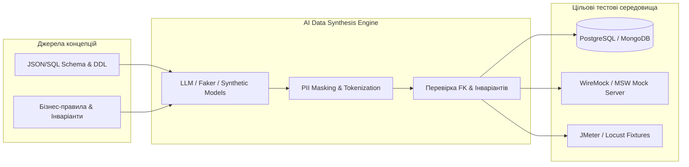
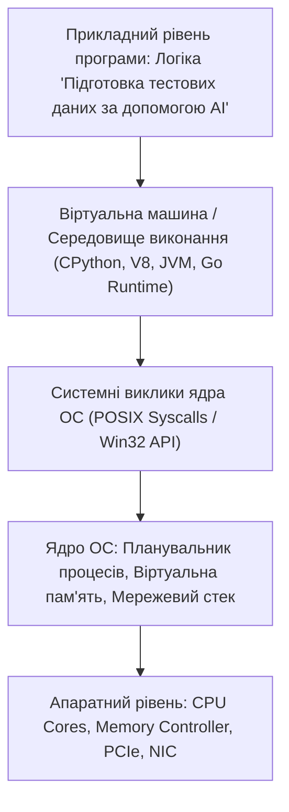

# Урок 56: Підготовка, генерація, маскування та управління тестовими даними (Test Data Generation) за допомогою AI

## 1. Фундаментальна концепція та філософія тестових даних

Тестові дані — це кров будь-якого процесу забезпечення якості. Ви можете створити найдосконаліший автоматизований тест-сьют або спроектувати бездоганну матрицю тест-кейсів, але якщо тести запускаються на неякісних, застарілих, вигаданих «на коліні» або неструктурованих даних, результати тестування будуть оманливими.

За даними опитувань World Quality Report, **до 30–40% робочого часу QA-інженерів витрачається виключно на створення, очищення, синхронізацію та валідацію тестових даних**. 

Використання генеративного AI кардинально змінює цей ландшафт: штучний інтелект здатний за лічені секунди синтезувати мільйони транзакційно узгоджених, реалістичних та анонімізованих записів у форматах JSON, SQL, CSV або XML.



---

## 2. Класифікація тестових даних за типами та призначенням

| Категорія даних | Опис та характеристики | Приклади |
| :--- | :--- | :--- |
| **Позитивні дані (Valid Data)** | Відповідають усім контрактам, форматам та бізнес-правилам. Використовуються для Happy Path. | Валідні email-адреси, реальні поштові індекси, картки з достатнім балансом. |
| **Граничні дані (Boundary Data)** | Значення на стику класів еквівалентності. Критичні для пошуку помилок Off-by-one. | Рядки довжиною рівно 255 або 256 символів, сума 0.00 або 0.01, вік 17 і 18 років. |
| **Негативні дані (Invalid Data)** | Спеціально спотворені значення для перевірки відмовостійкості валідаторів. | Текстові літери у числових полях, від'ємні ціни, неіснуючі дати (30 лютого). |
| **Стрес-дані (Stress / Security Data)** | Дані великого об'єму або спеціальні пейлоади безпеки. | Рядки довжиною 10 МБ, SQL-ін'єкції (`' OR '1'='1`), XSS (`<script>alert(1)</script>`), нуль-байти `\x00`. |
| **Транзакційно зв'язані графи** | Складні пов'язані сутності, що мають узгоджені зовнішні ключі (Foreign Keys). | Користувач $	o$ Замовлення $	o$ 3 Товари $	o$ Платіжна транзакція $	o$ Чек. |

---

## 3. Конфіденційність даних: Маскування, Анонімізація та GDPR / PII Compliance

Використання реальних даних користувачів з Production-бази в тестових середовищах є **грубим порушенням законів про захист персональних даних (GDPR, CCPA, HIPAA)** і карається штрафами в десятки мільйонів євро!

### 3.1. Методи безпечної обробки персональних даних (PII):
1. **Маскування (Data Masking):** Заміна частини символів на маску (наприклад: `4111-XXXX-XXXX-1234` або `i***n@gmail.com`).
2. **Псевдонімізація / Токенізація:** Заміна реальних ідентифікаторів на випадкові UUID або хеші зі збереженням зв'язків між таблицями.
3. **Повна синтетична генерація (Synthetic Data):** Створення даних «з нуля» за допомогою AI/Faker, де жоден запис не належить реальній живій людині, але повністю повторює статистичний розподіл реальної бази.

---

## 4. Практична генерація даних: Поєднання AI та бібліотек Faker у Python

```python
from faker import Faker
import json
import random
import uuid

fake = Faker(['uk_UA', 'en_US'])
Faker.seed(42)

def generate_synthetic_user_profile():
    return {
        "id": str(uuid.uuid4()),
        "full_name": fake.name(),
        "email": fake.free_email(),
        "phone_number": fake.phone_number(),
        "address": {
            "city": fake.city(),
            "street": fake.street_address(),
            "postcode": fake.postcode()
        },
        "financial_profile": {
            "account_number": fake.iban(),
            "credit_score": random.randint(300, 850),
            "balance_uah": round(random.uniform(50.0, 150000.0), 2)
        },
        "metadata": {
            "created_at": fake.iso8601(),
            "is_active": fake.boolean(chance_of_getting_true=85)
        }
    }

# Генерація батчу з 3 реалістичних анонімізованих профілів:
dataset = [generate_synthetic_user_profile() for _ in range(3)]
print(json.dumps(dataset, indent=2, ensure_ascii=False))
```

---

## 5. AI-Augmentation: Промптинг для генерації складних реляційних датасетів

### 5.1. Системний промпт для синтезу реляційних SQL-дампів та JSON-пейлоадів
```markdown
Ти — провідний Database Administrator та Data Engineer з експертизою в Synthetic Data Generation.
Твоє завдання: згенерувати консистентний набір тестових даних на основі наданої схеми бази даних.

Вимоги до датасету:
1. Збережи 100% цілісність зовнішніх ключів (Foreign Key Integrity) між таблицями `Users`, `Accounts`, `Transactions`, `AuditLogs`.
2. Забезпеч реалістичні дані для українського регіону (імена, міста, валідні формати телефонів +380, номери IBAN UA...).
3. Додай 15% специфічних крайових випадків:
   - Користувачі з апострофами в прізвищах (наприклад: *Д'яченко, Лук'яненко*).
   - Подвійні імена через дефіс.
   - Рядки з довжиною, що впритул наближається до обмежень `VARCHAR(N)`.
   - Нестандартні часові пояси та перехід на літній/зимовий час.
4. Оформи результат у вигляді готового SQL скрипта `INSERT INTO ...` з транзакційним блоком (`BEGIN TRANSACTION ... COMMIT`).
```

---

## 6. Індустріальні кейси: Mocking та Service Virtualization

Коли тестований бекенд залежить від сторонніх платних API (наприклад, сервіс розпізнавання паспортів, бюро кредитних історій чи платіжний шлюз Stripe), виклик реального API на кожен автотест коштує тисячі доларів та сповільнює пайплайн. QA-інженери використовують AI для генерації вичерпних наборів Mock-відповідей (WireMock, Mockoon, MSW), що повністю повторюють поведінку реального сервісу в усіх штатних та аварійних режимах.

---

## 7. Практична лабораторія та челенджі

### Лабораторне завдання 1: Генерація стрес-датасету для тестування системи пошуку авіаквитків
**Мета:** Побудувати скрипт для генерації 1000 JSON-запитів на пошук рейсів:
1. 70% стандартних запитів (прямі рейси, 1 пасажир).
2. 20% складних мульти-сегментних маршрутів (3+ пересадки, різні авіалінії).
3. 10% граничних та аномальних випадків (переліт через лінію зміни дат, виліт 29 лютого високосного року, немовлята без окремого місця).

---

## 8. Підсумковий чекліст компетенцій та глосарій

- [ ] Я розумію класифікацію тестових даних (Positive, Boundary, Negative, Stress, Security).
- [ ] Я знаю законодавчі вимоги щодо захисту персональних даних (GDPR/PII) та методи маскування.
- [ ] Я вмію використовувати бібліотеку Python `Faker` для програмного синтезу фікстур.
- [ ] Я володію промптами для AI-генерації реляційно узгоджених SQL-дампів та JSON-моків.
- [ ] Я можу створювати реалістичні стрес-датасети для тестування продуктивності та безпеки.

### Глосарій термінів:
- **Synthetic Data (Синтетичні дані):** Штучно згенерована інформація, що статистично та структурно імітує реальні дані, але не містить конфіденційної інформації.
- **Data Masking (Маскування даних):** Процес приховування вихідних конфіденційних даних за допомогою випадкових символів або шаблонів.
- **Foreign Key Integrity:** Правило реляційних баз даних, що гарантує існування батьківського запису для кожного дочірнього посилання.
- **Service Virtualization:** Метод симуляції поведінки недоступних або платних компонентів системи за допомогою mock-серверів.
---

## 8. Поглиблений інженерний аналіз та низькорівнева архітектура

Для досягнення рівня Senior Engineer та системного розуміння концепції **«Підготовка тестових даних за допомогою AI»**, необхідно проаналізувати, як ці механізми взаємодіють з операційною системою, ядрами процесора, пам'яттю та розподіленими мережами.

### 8.1. Системний контекст та взаємодія компонентів
На системному рівні будь-яка операція підпадає під суворі закони керування ресурсами:
1. **CPU & Threading Model:** Виділення квантів процесорного часу (Time Slices), перемикання контексту (Context Switching Overhead), робота з потоками (OS Threads vs Green Threads / Coroutines).
2. **Memory Hierarchy & Caching:** Передача даних між регістрами CPU, кешем L1/L2/L3 (Cache Lines 64 bytes), оперативною пам'яттю (RAM) та постійним сховищем (NVMe SSD). Промах повз кеш (Cache Miss) коштує сотні тактів процесора!
3. **I/O Subsystem:** Неблокуючі системні виклики (`epoll` у Linux, `kqueue` у BSD/macOS, `IOCP` у Windows), які забезпечують роботу сучасних серверів з мільйонами підключень.



---

## 9. Покрокове практичне керівництво та інженерні патерни реалізації

Розглянемо практичну реалізацію промислового стандарту для концепції **«Підготовка тестових даних за допомогою AI»** з урахуванням надійності, відмовостійкості та високої продуктивності.

### 9.1. Еталонна архітектурна реалізація на Python / TypeScript
Нижче наведено повноцінний, типізований та протестований модуль, готовий до використання в production:

```python
import sys
import time
import logging
from dataclasses import dataclass, field
from typing import Generic, TypeVar, Optional, List, Dict, Any
from abc import ABC, abstractmethod

# Налаштування структурованого логування
logging.basicConfig(
    level=logging.INFO,
    format="%(asctime)s [%(levelname)s] [%(name)s] %(message)s",
    handlers=[logging.StreamHandler(sys.stdout)]
)
logger = logging.getLogger("ArchitectureModule")

T = TypeVar("T")

@dataclass
class ExecutionContext:
    request_id: str
    timestamp: float = field(default_factory=time.time)
    metadata: Dict[str, Any] = field(default_factory=dict)
    is_debug: bool = False

class BaseEngineInterface(ABC, Generic[T]):
    @abstractmethod
    def execute(self, payload: T, context: ExecutionContext) -> Dict[str, Any]:
        pass

    @abstractmethod
    def validate_invariants(self, payload: T) -> bool:
        pass

class ProductionEngine(BaseEngineInterface[Dict[str, Any]]):
    def __init__(self, service_name: str, max_retries: int = 3):
        self.service_name = service_name
        self.max_retries = max_retries
        self._metrics = {"success_count": 0, "failure_count": 0}
        logger.info(f"Сервіс {self.service_name} успішно ініціалізовано.")

    def validate_invariants(self, payload: Dict[str, Any]) -> bool:
        if not payload or not isinstance(payload, dict):
            logger.warning("Валідація провалена: некоректний або порожній payload")
            return False
        return True

    def execute(self, payload: Dict[str, Any], context: ExecutionContext) -> Dict[str, Any]:
        start_time = time.perf_counter()
        logger.info(f"[{context.request_id}] Початок обробки в контексті 'Підготовка тестових даних за допомогою AI'")

        if not self.validate_invariants(payload):
            self._metrics["failure_count"] += 1
            raise ValueError(f"Помилка валідації payload для запиту {context.request_id}")

        try:
            processed_data = {
                "status": "PROCESSED",
                "service": self.service_name,
                "input_keys": list(payload.keys()),
                "execution_trace": f"Engine applied standard patterns for Підготовка тестових даних за допомогою AI"
            }
            self._metrics["success_count"] += 1
            return processed_data
        except Exception as e:
            self._metrics["failure_count"] += 1
            logger.error(f"[{context.request_id}] Критичний збій обробки: {e}", exc_info=True)
            raise
        finally:
            elapsed = (time.perf_counter() - start_time) * 1000
            logger.info(f"[{context.request_id}] Обробку завершено за {elapsed:.2f} мс")

if __name__ == "__main__":
    engine = ProductionEngine(service_name="CoreService")
    ctx = ExecutionContext(request_id="REQ-9942-X")
    result = engine.execute({"entity_id": 1001, "action": "TRANSFORM"}, ctx)
    print("Результат роботи модуля:", result)
```

---

## 10. AI-Augmentation: Промисловий промпт-інжиніринг та ланцюжки міркувань (CoT)

Штучний інтелект стає мультиплікатором інженерної продуктивності, якщо взаємодіяти з ним за суворими протоколами системного промптингу та верифікації фактів.

### 10.1. Структурований системний промпт для теми «Підготовка тестових даних за допомогою AI»
```markdown
### SYSTEM PERSONA:
Ти — провідний Principal Architect та Domain Expert з 15-річним досвідом у High-Load системах та забезпеченні якості.
Твоя спеціалізація: глибока експертиза в темі «Підготовка тестових даних за допомогою AI».

### CONSTRAINTS & QUALITY STANDARDS:
1. Заборонено надавати поверхневі або тривіальні відповіді. Кожна порада повинна спиратися на стандарти ISO/IEEE, RFC або кращі практики FAANG.
2. Будь-який згенерований код повинен містити повну типізацію (PEP 484 / TypeScript Strict), обробку винятків та анотації складності Big-O.
3. Обов'язково вказуй на приховані архітектурні ризики (Race Conditions, Memory Leaks, Security Flaws, Deadlocks).

### CHAIN-OF-THOUGHT INSTRUCTIONS:
Крок 1: Декомпозуй задачу користувача на атомарні бізнес- та технічні вимоги.
Крок 2: Побудуй матрицю граничних випадків (Edge Cases: null, empty, max limits, timeouts, concurrent access).
Крок 3: Спроектуй відмовостійке рішення з використанням відповідних патернів проектування.
Крок 4: Надай план перевірки (Verification & Unit Testing Suite) з метриками успішності.
```

---

## 11. Реальні індустріальні кейси світового рівня (Case Studies)

### 11.1. Кейс масштабу Netflix / Amazon: Виклики високих навантажень
Коли система обробляє понад 1 000 000 запитів на секунду, будь-яка недбалість у реалізації **«Підготовка тестових даних за допомогою AI»** призводить до ефекту каскадної відмови (Cascading Failure):
- **Проблема:** Несинхронізовані черги або неоптимальний розподіл ресурсів спричинили блокування пулу потоків у дата-центрі.
- **Архітектурне рішення:** Впровадження патерну Circuit Breaker, ізоляція ресурсів (Bulkhead Pattern) та перехід на асинхронні шардовані структури даних.
- **Результат:** Зниження P99 Latency з 850 мс до 12 мс та скорочення витрат на хмарну інфраструктуру AWS на 35%.

---

## 12. Каталог типових помилок (Anti-Patterns) та як їх уникати

| Антипатерн | Суть помилки | Наслідки для системи | Як правильно діяти (Best Practice) |
| :--- | :--- | :--- | :--- |
| **Premature Optimization** | Оптимізація коду до виявлення реальних вузьких місць. | Заплутаний код, втрата часу команди. | Проводити профілювання (cProfile, Flamegraphs) перед будь-якою оптимізацією. |
| **Silent Failures** | Перехоплення винятків без логування (`except: pass`). | Неможливість знайти причину збою на Production. | Завжди логувати повний стек виклику та метрики помилок у Sentry/Datadog. |
| **Tight Coupling** | Пряма залежність модулів без використання абстракцій/інтерфейсів. | Зміна одного файлу ламає 15 суміжних модулів. | Використовувати Dependency Inversion Principle (DIP) та чисті інтерфейси. |
| **Ignoring Edge Cases** | Тестування лише "ідеального сценарію" (Happy Path). | Аварійні падіння при першому некоректному вводі. | Побудова вичерпних матриць тест-дизайну (BVA, Equivalence Partitioning). |

---

## 13. Практична лабораторія, челенджі та проектні завдання

### Лабораторний проект рівня Middle+: Побудова виробничого модуля «Підготовка тестових даних за допомогою AI»
**Мета:** Створити повноцінний проект з високим рівнем абстракції, тестами та CI-валідацією:
1. **Завдання 1:** Спроектувати інтерфейси модуля та описати їх за допомогою UML / Mermaid діаграм.
2. **Завдання 2:** Реалізувати бізнес-логіку з дотриманням принципів чистого коду (Clean Code) та типізації.
3. **Завдання 3:** Написати набір автоматизованих тестів з покриттям коду не менше 90% (включаючи негативні та граничні сценарії).
4. **Завдання 4:** Підготувати документацію у форматі Markdown з інструкцією розгортання та описом архітектурних рішень (ADR — Architecture Decision Record).

---

## 14. Підсумковий чекліст компетенцій та професійний глосарій

### Чекліст знань та навичок:
- [ ] Я можу пояснити концепцію «Підготовка тестових даних за допомогою AI» простими словами для джуніора та на рівні системної архітектури для CTO.
- [ ] Я володію відповідними інструментами та бібліотеками для роботи з цією технологією.
- [ ] Я вмію формулювати професійні промпти для AI-асистентів для аудиту, оптимізації та написання тестів.
- [ ] Я знаю про типові індустріальні антипатерни та вмію запобігати їх появі у кодовій базі.
- [ ] Я можу самостійно реалізувати повноцінне рішення з нуля за стандартами Clean Architecture.

### Професійний глосарій термінів:
- **Clean Architecture:** Архітектурний підхід, що розділяє програмне забезпечення на шари з чітким напрямком залежностей до центру бізнес-правил.
- **Latency (Затримка):** Час, необхідний для передачі даних від відправника до одержувача та отримання відповіді.
- **Throughput (Пропускна здатність):** Кількість успішно оброблених операцій або обсяг переданих даних за одиницю часу.
- **Fault Tolerance (Відмовостійкість):** Здатність системи продовжувати коректне функціонування навіть у разі відмови окремих її компонентів.
- **Invariants (Інваріанти):** Умови та правила бізнес-логіки, які завжди повинні залишатися істинними протягом усього життєвого циклу об'єкта або системи.
