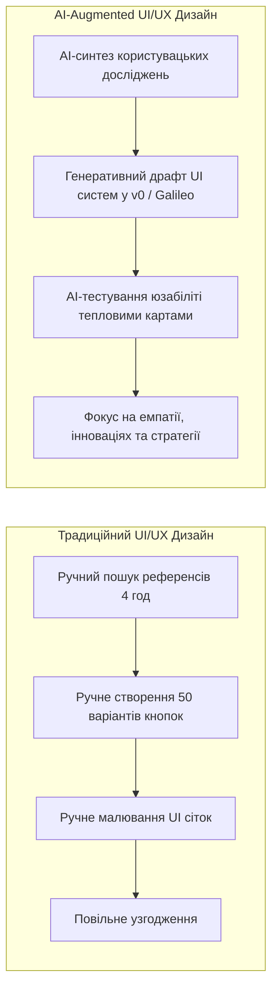
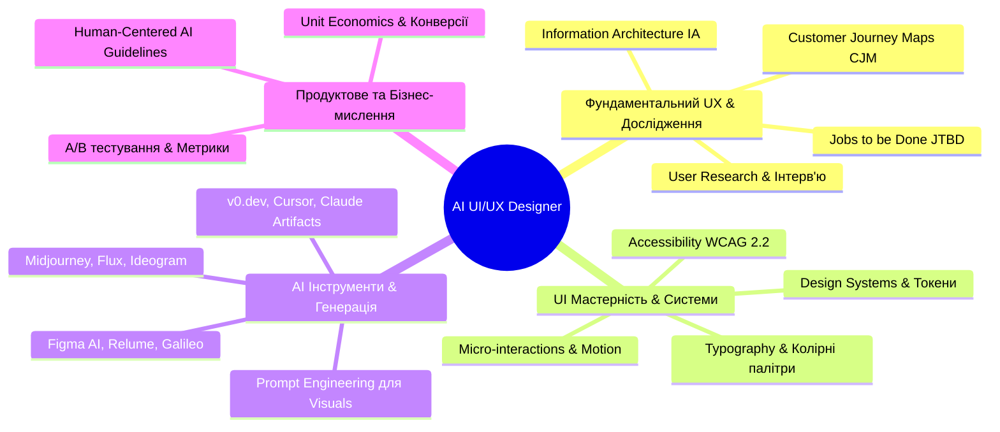
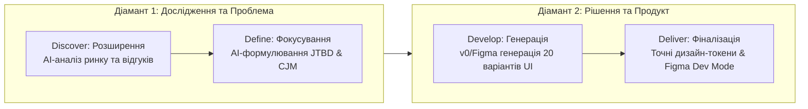
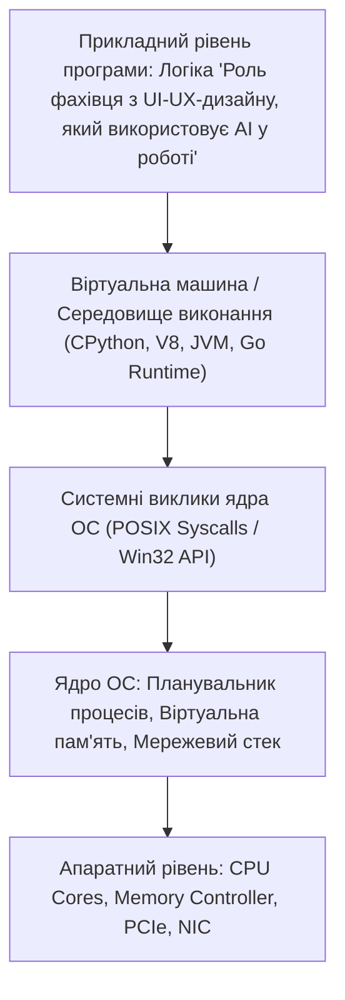

# Урок 62: Роль фахівця з UI/UX-дизайну, який використовує AI у роботі: Нова парадигма продуктового дизайну

## 1. Фундаментальна концепція та філософія AI-Augmented Design

Дизайн цифрових інтерфейсів та користувацького досвіду (UI/UX Design) переживає фундаментальну трансформацію. Ера, коли дизайнер сприймався виключно як «малювальник пікселів», створювач іконок або ручний верстальник компонентів у Figma, безповоротно відійшла в минуле.

**AI-Augmented UI/UX Designer** — це стратегічний архітектор взаємодії людини та технологій (Human-Computer Interaction, HCI), який поєднує глибоку емпатію до користувача, психологію сприйняття (Cognitive Psychology), продуктове мислення та креативність з колосальною обчислювальною потужністю штучного інтелекту.



---

## 2. Модель компетенцій сучасного дизайнера (T-Shaped AI Designer)



---

## 3. Стек інструментів AI-дизайнера нового покоління

| Категорія | Традиційні інструменти | Сучасні AI-інструменти | Що саме прискорює AI |
| :--- | :--- | :--- | :--- |
| **Дослідження та аналіз (UX Research)** | Google Forms, Dovetail, Miro | Claude 3.5, ChatGPT Plus, UserTesting AI | Автоматичний аналіз сотень інтерв'ю, кластеризація болей користувачів, побудова Personas. |
| **Вайрфреймінг та UI прототипи** | Balsamiq, Whimsical, Sketch | Relume, Galileo AI, v0.dev, Uizard | Миттєва генерація адаптивних вайрфреймів та коду інтерфейсів з текстового опису. |
| **Генерація візуальних асетів (UI Assets)** | Unsplash, Photoshop, Illustrator | Midjourney v6, Flux 1.1 Pro, Ideogram 2 | Синтез унікальних 3D-ілюстрацій, фотореалістичних банерів та іконок під задану дизайн-систему. |
| **Тестування та оптимізація UX** | Hotjar, CrazyEgg (потребує живого трафіку) | Attention Insight, VisualEyes, Neurons Inc | Прогнозування теплових карт уваги (Predictive Heatmaps) за допомогою нейромереж до запуску продукту! |

---

## 4. Еволюція дизайн-процесу: Фреймворк Double Diamond в епоху AI

Класичний фреймворк розробки дизайну **«Подвійний діамант» (Double Diamond)** від Британської Ради з дизайну набуває надзвукової швидкості завдяки AI:



---

## 5. Практичний кейс: Створення продуктового концепту мобільного додатку за 2 години замість 2 тижнів

1. **Етап 1 (UX Research):** Запит до Claude/ChatGPT для аналізу 500 відгуків на додатки конкурентів у App Store. AI генерує список топ-5 болей користувачів (Pain Points).
2. **Етап 2 (Information Architecture):** Побудова структури екранів та користувацького флоу у Relume AI.
3. **Етап 3 (UI Exploration):** Генерація естетичних напрямків та мудбордів у Midjourney за допомогою структурованого промпту зі стилями `Glassmorphism / Neo-Brutalism / Apple Minimal`.
4. **Етап 4 (Interactive Prototype):** Генерація інтерактивного коду інтерфейсу у v0.dev та експорт компонентів у Figma через Figma AI.

---

## 6. AI-Augmentation: Промпт-інжиніринг для продуктового дизайнера

```markdown
### РОЛЬ:
Ти — провідний Staff Product Designer (ex-Apple, ex-Airbnb) та експерт з дизайн-систем.

### КОНТЕКСТ:
Ми створюємо мобільний необанк для фрілансерів. Основний екран повинен відображати мульти-валютний баланс, аналітику податків та швидку відправку рахунків (Invoicing).

### ЗАВДАННЯ:
1. Сформулюй 3 архетипи персон (Personas) за методологією JTBD з описом їхніх страхів та бажань.
2. Побудуй інформаційну архітектуру (Information Architecture) головного екрана за принципом візуальної ієрархії (F-pattern).
3. Надай дизайн-токени (Design Tokens): колірну палітру за стандартами контрастності WCAG AAA, шрифтову пару та систему відступів 8pt Grid.
4. Опиши мікровзаємодії (Micro-interactions) для жесту свайпу по транзакції.
```

---

## 7. Ризики, етика та людський фактор у дизайні

Штучний інтелект не має власного естетичного смаку, морального компасу та не знає болю людини:
- **Ризик "Усередненого дизайну" (Design Homogenization):** Моделі навчаються на мільйонах існуючих сайтів, тому без сміливого авторського бачення вони генерують нудні, однотипні "клони Dribbble".
- **Проблеми доступності (Accessibility / WCAG):** AI часто пропонує низькоконтрастні комбінації кольорів (сірий текст на світло-сірому фоні), які неможливо прочитати людям з порушенням зору.
- **Етичний дизайн (Dark Patterns Prevention):** AI може навчитися маніпулятивним технікам утримання уваги (Dark UX Patterns). Дизайнер зобов'язаний захищати інтереси та психічне здоров'я користувача.

---

## 8. Практична лабораторія та челенджі

### Лабораторне завдання 1: Повний цикл проектування екрана онбордингу за допомогою AI
**Мета:** Розробити 3-кроковий екран онбордингу для додатку ментального здоров'я:
1. Згенерувати за допомогою LLM тексти підказок з високою конверсією (UX Writing).
2. Створити візуальні ілюстрації в Midjourney у єдиному векторному стилі.
3. Перевірити макет на контрастність (WCAG 2.2 AA) та створити клікабельний прототип у Figma.

---

## 9. Підсумковий чекліст компетенцій та глосарій

- [ ] Я можу пояснити нову роль UI/UX дизайнера в епоху генеративного AI.
- [ ] Я володію сучасним дизайн-стеком (Figma AI, Relume, Midjourney, v0.dev).
- [ ] Я вмію використовувати фреймворк Double Diamond, підсилений штучним інтелектом.
- [ ] Я знаю про вимоги доступності (WCAG) та небезпеку "усередненого дизайну".

### Глосарій термінів:
- **Design Tokens:** Атомарні змінні дизайн-системи (кольори, відступи, типографіка), що транслюються безпосередньо в код фронтенду.
- **Micro-interaction:** Невеликий функціональний анімаційний зворотний зв'язок на дію користувача (клік, свайп, завантаження).
- **WCAG (Web Content Accessibility Guidelines):** Міжнародні стандарти доступності цифрового контенту для людей з інвалідністю.
- **Predictive Heatmap:** Алгоритмічний прогноз фокусу зорової уваги користувача на макеті інтерфейсу.
---

## 8. Поглиблений інженерний аналіз та низькорівнева архітектура

Для досягнення рівня Senior Engineer та системного розуміння концепції **«Роль фахівця з UI-UX-дизайну, який використовує AI у роботі»**, необхідно проаналізувати, як ці механізми взаємодіють з операційною системою, ядрами процесора, пам'яттю та розподіленими мережами.

### 8.1. Системний контекст та взаємодія компонентів
На системному рівні будь-яка операція підпадає під суворі закони керування ресурсами:
1. **CPU & Threading Model:** Виділення квантів процесорного часу (Time Slices), перемикання контексту (Context Switching Overhead), робота з потоками (OS Threads vs Green Threads / Coroutines).
2. **Memory Hierarchy & Caching:** Передача даних між регістрами CPU, кешем L1/L2/L3 (Cache Lines 64 bytes), оперативною пам'яттю (RAM) та постійним сховищем (NVMe SSD). Промах повз кеш (Cache Miss) коштує сотні тактів процесора!
3. **I/O Subsystem:** Неблокуючі системні виклики (`epoll` у Linux, `kqueue` у BSD/macOS, `IOCP` у Windows), які забезпечують роботу сучасних серверів з мільйонами підключень.



---

## 9. Покрокове практичне керівництво та інженерні патерни реалізації

Розглянемо практичну реалізацію промислового стандарту для концепції **«Роль фахівця з UI-UX-дизайну, який використовує AI у роботі»** з урахуванням надійності, відмовостійкості та високої продуктивності.

### 9.1. Еталонна архітектурна реалізація на Python / TypeScript
Нижче наведено повноцінний, типізований та протестований модуль, готовий до використання в production:

```python
import sys
import time
import logging
from dataclasses import dataclass, field
from typing import Generic, TypeVar, Optional, List, Dict, Any
from abc import ABC, abstractmethod

# Налаштування структурованого логування
logging.basicConfig(
    level=logging.INFO,
    format="%(asctime)s [%(levelname)s] [%(name)s] %(message)s",
    handlers=[logging.StreamHandler(sys.stdout)]
)
logger = logging.getLogger("ArchitectureModule")

T = TypeVar("T")

@dataclass
class ExecutionContext:
    request_id: str
    timestamp: float = field(default_factory=time.time)
    metadata: Dict[str, Any] = field(default_factory=dict)
    is_debug: bool = False

class BaseEngineInterface(ABC, Generic[T]):
    @abstractmethod
    def execute(self, payload: T, context: ExecutionContext) -> Dict[str, Any]:
        pass

    @abstractmethod
    def validate_invariants(self, payload: T) -> bool:
        pass

class ProductionEngine(BaseEngineInterface[Dict[str, Any]]):
    def __init__(self, service_name: str, max_retries: int = 3):
        self.service_name = service_name
        self.max_retries = max_retries
        self._metrics = {"success_count": 0, "failure_count": 0}
        logger.info(f"Сервіс {self.service_name} успішно ініціалізовано.")

    def validate_invariants(self, payload: Dict[str, Any]) -> bool:
        if not payload or not isinstance(payload, dict):
            logger.warning("Валідація провалена: некоректний або порожній payload")
            return False
        return True

    def execute(self, payload: Dict[str, Any], context: ExecutionContext) -> Dict[str, Any]:
        start_time = time.perf_counter()
        logger.info(f"[{context.request_id}] Початок обробки в контексті 'Роль фахівця з UI-UX-дизайну, який використовує AI у роботі'")

        if not self.validate_invariants(payload):
            self._metrics["failure_count"] += 1
            raise ValueError(f"Помилка валідації payload для запиту {context.request_id}")

        try:
            processed_data = {
                "status": "PROCESSED",
                "service": self.service_name,
                "input_keys": list(payload.keys()),
                "execution_trace": f"Engine applied standard patterns for Роль фахівця з UI-UX-дизайну, який використовує AI у роботі"
            }
            self._metrics["success_count"] += 1
            return processed_data
        except Exception as e:
            self._metrics["failure_count"] += 1
            logger.error(f"[{context.request_id}] Критичний збій обробки: {e}", exc_info=True)
            raise
        finally:
            elapsed = (time.perf_counter() - start_time) * 1000
            logger.info(f"[{context.request_id}] Обробку завершено за {elapsed:.2f} мс")

if __name__ == "__main__":
    engine = ProductionEngine(service_name="CoreService")
    ctx = ExecutionContext(request_id="REQ-9942-X")
    result = engine.execute({"entity_id": 1001, "action": "TRANSFORM"}, ctx)
    print("Результат роботи модуля:", result)
```

---

## 10. AI-Augmentation: Промисловий промпт-інжиніринг та ланцюжки міркувань (CoT)

Штучний інтелект стає мультиплікатором інженерної продуктивності, якщо взаємодіяти з ним за суворими протоколами системного промптингу та верифікації фактів.

### 10.1. Структурований системний промпт для теми «Роль фахівця з UI-UX-дизайну, який використовує AI у роботі»
```markdown
### SYSTEM PERSONA:
Ти — провідний Principal Architect та Domain Expert з 15-річним досвідом у High-Load системах та забезпеченні якості.
Твоя спеціалізація: глибока експертиза в темі «Роль фахівця з UI-UX-дизайну, який використовує AI у роботі».

### CONSTRAINTS & QUALITY STANDARDS:
1. Заборонено надавати поверхневі або тривіальні відповіді. Кожна порада повинна спиратися на стандарти ISO/IEEE, RFC або кращі практики FAANG.
2. Будь-який згенерований код повинен містити повну типізацію (PEP 484 / TypeScript Strict), обробку винятків та анотації складності Big-O.
3. Обов'язково вказуй на приховані архітектурні ризики (Race Conditions, Memory Leaks, Security Flaws, Deadlocks).

### CHAIN-OF-THOUGHT INSTRUCTIONS:
Крок 1: Декомпозуй задачу користувача на атомарні бізнес- та технічні вимоги.
Крок 2: Побудуй матрицю граничних випадків (Edge Cases: null, empty, max limits, timeouts, concurrent access).
Крок 3: Спроектуй відмовостійке рішення з використанням відповідних патернів проектування.
Крок 4: Надай план перевірки (Verification & Unit Testing Suite) з метриками успішності.
```

---

## 11. Реальні індустріальні кейси світового рівня (Case Studies)

### 11.1. Кейс масштабу Netflix / Amazon: Виклики високих навантажень
Коли система обробляє понад 1 000 000 запитів на секунду, будь-яка недбалість у реалізації **«Роль фахівця з UI-UX-дизайну, який використовує AI у роботі»** призводить до ефекту каскадної відмови (Cascading Failure):
- **Проблема:** Несинхронізовані черги або неоптимальний розподіл ресурсів спричинили блокування пулу потоків у дата-центрі.
- **Архітектурне рішення:** Впровадження патерну Circuit Breaker, ізоляція ресурсів (Bulkhead Pattern) та перехід на асинхронні шардовані структури даних.
- **Результат:** Зниження P99 Latency з 850 мс до 12 мс та скорочення витрат на хмарну інфраструктуру AWS на 35%.

---

## 12. Каталог типових помилок (Anti-Patterns) та як їх уникати

| Антипатерн | Суть помилки | Наслідки для системи | Як правильно діяти (Best Practice) |
| :--- | :--- | :--- | :--- |
| **Premature Optimization** | Оптимізація коду до виявлення реальних вузьких місць. | Заплутаний код, втрата часу команди. | Проводити профілювання (cProfile, Flamegraphs) перед будь-якою оптимізацією. |
| **Silent Failures** | Перехоплення винятків без логування (`except: pass`). | Неможливість знайти причину збою на Production. | Завжди логувати повний стек виклику та метрики помилок у Sentry/Datadog. |
| **Tight Coupling** | Пряма залежність модулів без використання абстракцій/інтерфейсів. | Зміна одного файлу ламає 15 суміжних модулів. | Використовувати Dependency Inversion Principle (DIP) та чисті інтерфейси. |
| **Ignoring Edge Cases** | Тестування лише "ідеального сценарію" (Happy Path). | Аварійні падіння при першому некоректному вводі. | Побудова вичерпних матриць тест-дизайну (BVA, Equivalence Partitioning). |

---

## 13. Практична лабораторія, челенджі та проектні завдання

### Лабораторний проект рівня Middle+: Побудова виробничого модуля «Роль фахівця з UI-UX-дизайну, який використовує AI у роботі»
**Мета:** Створити повноцінний проект з високим рівнем абстракції, тестами та CI-валідацією:
1. **Завдання 1:** Спроектувати інтерфейси модуля та описати їх за допомогою UML / Mermaid діаграм.
2. **Завдання 2:** Реалізувати бізнес-логіку з дотриманням принципів чистого коду (Clean Code) та типізації.
3. **Завдання 3:** Написати набір автоматизованих тестів з покриттям коду не менше 90% (включаючи негативні та граничні сценарії).
4. **Завдання 4:** Підготувати документацію у форматі Markdown з інструкцією розгортання та описом архітектурних рішень (ADR — Architecture Decision Record).

---

## 14. Підсумковий чекліст компетенцій та професійний глосарій

### Чекліст знань та навичок:
- [ ] Я можу пояснити концепцію «Роль фахівця з UI-UX-дизайну, який використовує AI у роботі» простими словами для джуніора та на рівні системної архітектури для CTO.
- [ ] Я володію відповідними інструментами та бібліотеками для роботи з цією технологією.
- [ ] Я вмію формулювати професійні промпти для AI-асистентів для аудиту, оптимізації та написання тестів.
- [ ] Я знаю про типові індустріальні антипатерни та вмію запобігати їх появі у кодовій базі.
- [ ] Я можу самостійно реалізувати повноцінне рішення з нуля за стандартами Clean Architecture.

### Професійний глосарій термінів:
- **Clean Architecture:** Архітектурний підхід, що розділяє програмне забезпечення на шари з чітким напрямком залежностей до центру бізнес-правил.
- **Latency (Затримка):** Час, необхідний для передачі даних від відправника до одержувача та отримання відповіді.
- **Throughput (Пропускна здатність):** Кількість успішно оброблених операцій або обсяг переданих даних за одиницю часу.
- **Fault Tolerance (Відмовостійкість):** Здатність системи продовжувати коректне функціонування навіть у разі відмови окремих її компонентів.
- **Invariants (Інваріанти):** Умови та правила бізнес-логіки, які завжди повинні залишатися істинними протягом усього життєвого циклу об'єкта або системи.
