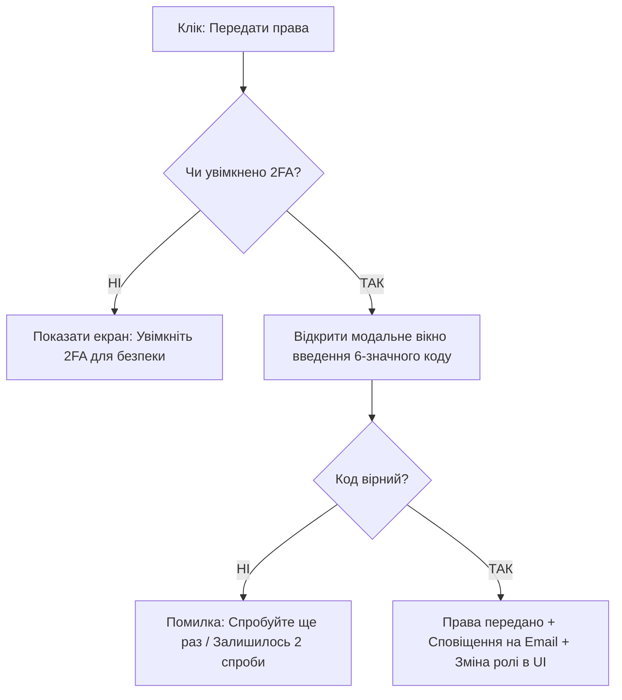

# Перетворення вимог до продукту в контекст для проєктування інтерфейсу: інформаційна архітектура, User Flows, Wireframes та дизайн-системи

Дизайнер інтерфейсів — це перекладач між абстрактними бізнес-вимогами та візуальним простором людського сприйняття.

Коли бізнес каже: *«Нам потрібна можливість масового експорту звітів з фільтрацією за 15 параметрами»*, недосвідчений дизайнер просто захаращує екран 15 випадаючими списками та величезною кнопкою. Досвідчений дизайнер спочатку перетворює цю вимогу на **User Flow (потік дій користувача), будує інформаційну архітектуру, проєктує низькодеталізований вайрфрейм (Low-Fi Wireframe) і лише потім накладає дизайн-систему**.

Штучний інтелект стає найпотужнішим прискорювачем цього переходу: він перетворює сухий текст Product Requirement Document (PRD) на чіткі схеми екранів, списки компонентів, стани кнопок та адаптивні сітки.

У цьому поглибленому посібнику ми розглянемо:

* декомпозицію PRD на елементи інтерфейсу: екрани, модулі, віджети та стани (States);
* проектування карт переходів (**User Flows & Screen Flows**) у вигляді текстових та візуальних діаграм (Mermaid);
* генерацію низькодеталізованих вайрфреймів (ASCII / Wireframe Prompts / Relume);
* компонентну архітектуру за методологією **Atomic Design** (Атоми, Молекули, Організми, Шаблони, Сторінки);
* формалізацію контексту для UI-генераторів (v0.dev, Galileo AI, Figma AI).

---

## 1. Від PRD до екранів: 4 рівні трансформації

```
+───────────────────────────────────────────────────────────────────────────+
|                 4 РІВНІ ТРАНСФОРМАЦІЇ ВИМОГИ В ІНТЕРФЕЙС                  |
+───────────────────────────────────────────────────────────────────────────+
| РІВЕНЬ 1: БІЗНЕС-ВИМОГА (PRD)                                             |
| "Користувач повинен мати змогу безпечно передати права на проект колезі"  |
+───────────────────────────────────────────────────────────────────────────+
| РІВЕНЬ 2: USER FLOW (Сценарій дій)                                        |
| [Клік Налаштування] ──► [Вкладка Команда] ──► [Вибір ролі] ──► [Модалка 2FA|
+───────────────────────────────────────────────────────────────────────────+
| РІВЕНЬ 3: ІНФОРМАЦІЙНА АРХІТЕКТУРА ТА ВАЙРФРЕЙМ                           |
| Складові екрану: Header, SearchBar, UserListTable, RoleDropdown, SubmitBtn|
+───────────────────────────────────────────────────────────────────────────+
| РІВЕНЬ 4: СТАНИ ЕЛЕМЕНТІВ (Component States)                              |
| Default, Hover, Focused, Disabled, Loading, Error (Невірний 2FA код)      |
+───────────────────────────────────────────────────────────────────────────+
```

---

## 2. Проектування User Flow через Mermaid-діаграми

За допомогою AI ви можете за секунди візуалізувати всі можливі шляхи користувача:



---

## 3. Методологія Atomic Design для формування контексту

Перед тим як просити AI згенерувати інтерфейс, структуруйте вимоги за методологією Бреда Фроста:

```
+───────────────────────────────────────────────────────────────────────────+
|                     АТОМАРНИЙ ДИЗАЙН (ATOMIC DESIGN)                      |
+──────────────────────────+────────────────────────────────────────────────+
| 1. АТОМИ (Atoms)         | Кольори, шрифти, іконки, кнопки, інпути.       |
+──────────────────────────+────────────────────────────────────────────────+
| 2. МОЛЕКУЛИ (Molecules)  | Поле пошуку + кнопка "Шукати" = SearchBar.     |
+──────────────────────────+────────────────────────────────────────────────+
| 3. ОРГАНІЗМИ (Organisms) | Лого + Навігація + SearchBar + Аватар = Header.|
+──────────────────────────+────────────────────────────────────────────────+
| 4. ШАБЛОНИ (Templates)   | Каркас сторінки Dashboard (Grid layout).       |
+──────────────────────────+────────────────────────────────────────────────+
| 5. СТОРІНКИ (Pages)      | Шаблон, заповнений реальними даними клієнта.   |
+──────────────────────────+────────────────────────────────────────────────+
```

---

## 4. Промпт для генерації інтерфейсу в інструментах Prompt-to-UI (v0 / Figma AI)

```markdown
Створи адаптивний екран "Team & Permissions Settings" для B2B SaaS платформи.

КОНТЕКСТ ТА СТРУКТУРА:
1. HEADER: Заголовок "Управління командою", опис та кнопка CTA "+ Запросити учасника" (Primary Blue).
2. ФІЛЬТРИ: Поле пошуку за ім'ям/email + випадаючий список фільтра за ролями (Admin, Editor, Viewer).
3. ТАБЛИЦЯ УЧАСНИКІВ:
   - Колонки: Користувач (аватар + ім'я + email), Роль (Dropdown), Статус (Badge: Активний / Очікує), Дії (Кнопка меню з трьома крапками).
4. ДИЗАЙН-СИСТЕМА:
   - Стиль: Clean Minimal SaaS, Tailwind CSS, шрифт Inter.
   - Кольори: Slate-900 для тексту, Blue-600 для акцентів, Gray-100 для фону таблиці.
5. ОБОВ'ЯЗКОВІ СТАНИ: Передбач стан порожньої таблиці (Empty State: "У вашій команді поки немає учасників").
```

---

## Резюме уроку

1. Інтерфейс — це матеріалізація бізнес-вимог через **User Flows, інформаційну архітектуру та сітки**.
2. Завжди проєктуйте **User Flows з усіма розгалуженнями та станами помилок** до відкриття Figma.
3. Методологія **Atomic Design** дозволяє будувати масштабовані дизайн-системи, зрозумілі як для AI, так і для розробників.
4. Чітко формулюйте контекст (ролі, стани, порожні екрани, кольорова палітра) при використанні інструментів **Prompt-to-UI**.