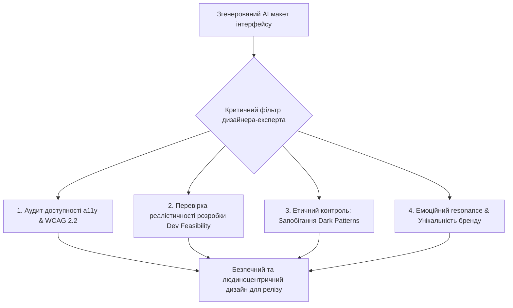
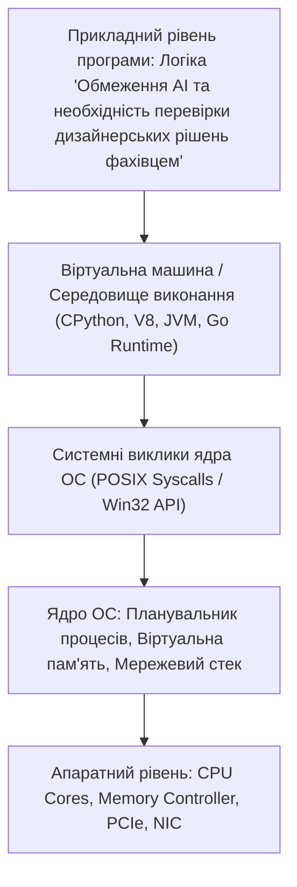

# Урок 66: Обмеження генеративного AI, етика, доступність та необхідність критичної перевірки дизайнерських рішень

## 1. Фундаментальна концепція: Межі можливостей машини у світі людських емоцій

Генеративний штучний інтелект є неперевершеним інструментом прискорення, синтезу інформації та подолання «страху чистого аркуша». Проте сліпа довіра виводу AI у продуктовому дизайні — прямий шлях до створення незручних, неетичних та небезпечних продуктів.

Штучний інтелект оперує ймовірностями та статистичними шаблонами минулого. Він не має особистого людського досвіду, не відчуває фізичного болю від тремтячих пальців на морозі, не знає, як це — читати інтерфейс при яскравому сонці з розбитим екраном телефону, і не несе юридичної відповідальності за порушення прав людей з обмеженими можливостями.



---

## 2. Головні обмеження та "сліпі зони" AI в дизайні

### 2.1. Відсутність розуміння технічної реалізованості (Dev Feasibility)
AI часто генерує візуально фантастичні макети з гігантськими тривимірними анімаціями, складними градієнтами та прозорими шарами, які:
- Неможливо зверстати на мобільних пристроях без падіння FPS до 15 кадрів на секунду.
- Вимагають 6 місяців роботи команди бекенд-інженерів для реалізації неіснуючих API.
- Перевантажують батарею смартфонів користувачів.

### 2.2. Галюцинації у сітках, типографіці та Auto-layout у Figma
Згенеровані нейромережами макети часто мають "брудну" структуру: відсутність Auto-layout, абсолютне позиціонування елементів замість гнучких Flexbox-структур, хаотичні розміри шрифтів (`17.34px`), що ламає дизайн-систему проекту.

---

## 3. Практична лабораторія та челенджі

### Лабораторне завдання 1: Експертний аудит та виправлення згенерованого AI макету
**Мета:** Вам надано скріншот мобільного екрана чекауту, згенерований нейромережею:
1. Знайти 5 критичних помилок (порушення контрастності WCAG, неможливість натиснути кнопку закриття через малий розмір, маніпулятивний чекбокс платної страховки).
2. Провести редизайн макету у Figma з налаштуванням правильного Auto-layout та 8pt сітки.

---

## 4. Підсумковий чекліст компетенцій та глосарій

- [ ] Я можу критично оцінити згенерований AI дизайн на предмет технічної реалізованості.
- [ ] Я знаю стандарти доступності WCAG 2.2 та методи їх ручного аудиту.
- [ ] Я вмію виявляти та викорінювати маніпулятивні Dark Patterns з інтерфейсів.
- [ ] Я розумію незамінність людської емпатії та креативності у продуктовому дизайні.

### Глосарій термінів:
- **Dev Feasibility:** Оцінка реалістичності та трудовості розробки дизайну інженерною командою.
- **Dark Patterns:** Маніпулятивні прийоми інтерфейсу, що змушують користувача здійснювати небажані дії (непомітні підписки, приховані платежі).
- **Auto-layout:** Функція Figma, що автоматично адаптує розміри та відступи компонентів при зміні контенту (аналог CSS Flexbox).
---

## 8. Поглиблений інженерний аналіз та низькорівнева архітектура

Для досягнення рівня Senior Engineer та системного розуміння концепції **«Обмеження AI та необхідність перевірки дизайнерських рішень фахівцем»**, необхідно проаналізувати, як ці механізми взаємодіють з операційною системою, ядрами процесора, пам'яттю та розподіленими мережами.

### 8.1. Системний контекст та взаємодія компонентів
На системному рівні будь-яка операція підпадає під суворі закони керування ресурсами:
1. **CPU & Threading Model:** Виділення квантів процесорного часу (Time Slices), перемикання контексту (Context Switching Overhead), робота з потоками (OS Threads vs Green Threads / Coroutines).
2. **Memory Hierarchy & Caching:** Передача даних між регістрами CPU, кешем L1/L2/L3 (Cache Lines 64 bytes), оперативною пам'яттю (RAM) та постійним сховищем (NVMe SSD). Промах повз кеш (Cache Miss) коштує сотні тактів процесора!
3. **I/O Subsystem:** Неблокуючі системні виклики (`epoll` у Linux, `kqueue` у BSD/macOS, `IOCP` у Windows), які забезпечують роботу сучасних серверів з мільйонами підключень.



---

## 9. Покрокове практичне керівництво та інженерні патерни реалізації

Розглянемо практичну реалізацію промислового стандарту для концепції **«Обмеження AI та необхідність перевірки дизайнерських рішень фахівцем»** з урахуванням надійності, відмовостійкості та високої продуктивності.

### 9.1. Еталонна архітектурна реалізація на Python / TypeScript
Нижче наведено повноцінний, типізований та протестований модуль, готовий до використання в production:

```python
import sys
import time
import logging
from dataclasses import dataclass, field
from typing import Generic, TypeVar, Optional, List, Dict, Any
from abc import ABC, abstractmethod

# Налаштування структурованого логування
logging.basicConfig(
    level=logging.INFO,
    format="%(asctime)s [%(levelname)s] [%(name)s] %(message)s",
    handlers=[logging.StreamHandler(sys.stdout)]
)
logger = logging.getLogger("ArchitectureModule")

T = TypeVar("T")

@dataclass
class ExecutionContext:
    request_id: str
    timestamp: float = field(default_factory=time.time)
    metadata: Dict[str, Any] = field(default_factory=dict)
    is_debug: bool = False

class BaseEngineInterface(ABC, Generic[T]):
    @abstractmethod
    def execute(self, payload: T, context: ExecutionContext) -> Dict[str, Any]:
        pass

    @abstractmethod
    def validate_invariants(self, payload: T) -> bool:
        pass

class ProductionEngine(BaseEngineInterface[Dict[str, Any]]):
    def __init__(self, service_name: str, max_retries: int = 3):
        self.service_name = service_name
        self.max_retries = max_retries
        self._metrics = {"success_count": 0, "failure_count": 0}
        logger.info(f"Сервіс {self.service_name} успішно ініціалізовано.")

    def validate_invariants(self, payload: Dict[str, Any]) -> bool:
        if not payload or not isinstance(payload, dict):
            logger.warning("Валідація провалена: некоректний або порожній payload")
            return False
        return True

    def execute(self, payload: Dict[str, Any], context: ExecutionContext) -> Dict[str, Any]:
        start_time = time.perf_counter()
        logger.info(f"[{context.request_id}] Початок обробки в контексті 'Обмеження AI та необхідність перевірки дизайнерських рішень фахівцем'")

        if not self.validate_invariants(payload):
            self._metrics["failure_count"] += 1
            raise ValueError(f"Помилка валідації payload для запиту {context.request_id}")

        try:
            processed_data = {
                "status": "PROCESSED",
                "service": self.service_name,
                "input_keys": list(payload.keys()),
                "execution_trace": f"Engine applied standard patterns for Обмеження AI та необхідність перевірки дизайнерських рішень фахівцем"
            }
            self._metrics["success_count"] += 1
            return processed_data
        except Exception as e:
            self._metrics["failure_count"] += 1
            logger.error(f"[{context.request_id}] Критичний збій обробки: {e}", exc_info=True)
            raise
        finally:
            elapsed = (time.perf_counter() - start_time) * 1000
            logger.info(f"[{context.request_id}] Обробку завершено за {elapsed:.2f} мс")

if __name__ == "__main__":
    engine = ProductionEngine(service_name="CoreService")
    ctx = ExecutionContext(request_id="REQ-9942-X")
    result = engine.execute({"entity_id": 1001, "action": "TRANSFORM"}, ctx)
    print("Результат роботи модуля:", result)
```

---

## 10. AI-Augmentation: Промисловий промпт-інжиніринг та ланцюжки міркувань (CoT)

Штучний інтелект стає мультиплікатором інженерної продуктивності, якщо взаємодіяти з ним за суворими протоколами системного промптингу та верифікації фактів.

### 10.1. Структурований системний промпт для теми «Обмеження AI та необхідність перевірки дизайнерських рішень фахівцем»
```markdown
### SYSTEM PERSONA:
Ти — провідний Principal Architect та Domain Expert з 15-річним досвідом у High-Load системах та забезпеченні якості.
Твоя спеціалізація: глибока експертиза в темі «Обмеження AI та необхідність перевірки дизайнерських рішень фахівцем».

### CONSTRAINTS & QUALITY STANDARDS:
1. Заборонено надавати поверхневі або тривіальні відповіді. Кожна порада повинна спиратися на стандарти ISO/IEEE, RFC або кращі практики FAANG.
2. Будь-який згенерований код повинен містити повну типізацію (PEP 484 / TypeScript Strict), обробку винятків та анотації складності Big-O.
3. Обов'язково вказуй на приховані архітектурні ризики (Race Conditions, Memory Leaks, Security Flaws, Deadlocks).

### CHAIN-OF-THOUGHT INSTRUCTIONS:
Крок 1: Декомпозуй задачу користувача на атомарні бізнес- та технічні вимоги.
Крок 2: Побудуй матрицю граничних випадків (Edge Cases: null, empty, max limits, timeouts, concurrent access).
Крок 3: Спроектуй відмовостійке рішення з використанням відповідних патернів проектування.
Крок 4: Надай план перевірки (Verification & Unit Testing Suite) з метриками успішності.
```

---

## 11. Реальні індустріальні кейси світового рівня (Case Studies)

### 11.1. Кейс масштабу Netflix / Amazon: Виклики високих навантажень
Коли система обробляє понад 1 000 000 запитів на секунду, будь-яка недбалість у реалізації **«Обмеження AI та необхідність перевірки дизайнерських рішень фахівцем»** призводить до ефекту каскадної відмови (Cascading Failure):
- **Проблема:** Несинхронізовані черги або неоптимальний розподіл ресурсів спричинили блокування пулу потоків у дата-центрі.
- **Архітектурне рішення:** Впровадження патерну Circuit Breaker, ізоляція ресурсів (Bulkhead Pattern) та перехід на асинхронні шардовані структури даних.
- **Результат:** Зниження P99 Latency з 850 мс до 12 мс та скорочення витрат на хмарну інфраструктуру AWS на 35%.

---

## 12. Каталог типових помилок (Anti-Patterns) та як їх уникати

| Антипатерн | Суть помилки | Наслідки для системи | Як правильно діяти (Best Practice) |
| :--- | :--- | :--- | :--- |
| **Premature Optimization** | Оптимізація коду до виявлення реальних вузьких місць. | Заплутаний код, втрата часу команди. | Проводити профілювання (cProfile, Flamegraphs) перед будь-якою оптимізацією. |
| **Silent Failures** | Перехоплення винятків без логування (`except: pass`). | Неможливість знайти причину збою на Production. | Завжди логувати повний стек виклику та метрики помилок у Sentry/Datadog. |
| **Tight Coupling** | Пряма залежність модулів без використання абстракцій/інтерфейсів. | Зміна одного файлу ламає 15 суміжних модулів. | Використовувати Dependency Inversion Principle (DIP) та чисті інтерфейси. |
| **Ignoring Edge Cases** | Тестування лише "ідеального сценарію" (Happy Path). | Аварійні падіння при першому некоректному вводі. | Побудова вичерпних матриць тест-дизайну (BVA, Equivalence Partitioning). |

---

## 13. Практична лабораторія, челенджі та проектні завдання

### Лабораторний проект рівня Middle+: Побудова виробничого модуля «Обмеження AI та необхідність перевірки дизайнерських рішень фахівцем»
**Мета:** Створити повноцінний проект з високим рівнем абстракції, тестами та CI-валідацією:
1. **Завдання 1:** Спроектувати інтерфейси модуля та описати їх за допомогою UML / Mermaid діаграм.
2. **Завдання 2:** Реалізувати бізнес-логіку з дотриманням принципів чистого коду (Clean Code) та типізації.
3. **Завдання 3:** Написати набір автоматизованих тестів з покриттям коду не менше 90% (включаючи негативні та граничні сценарії).
4. **Завдання 4:** Підготувати документацію у форматі Markdown з інструкцією розгортання та описом архітектурних рішень (ADR — Architecture Decision Record).

---

## 14. Підсумковий чекліст компетенцій та професійний глосарій

### Чекліст знань та навичок:
- [ ] Я можу пояснити концепцію «Обмеження AI та необхідність перевірки дизайнерських рішень фахівцем» простими словами для джуніора та на рівні системної архітектури для CTO.
- [ ] Я володію відповідними інструментами та бібліотеками для роботи з цією технологією.
- [ ] Я вмію формулювати професійні промпти для AI-асистентів для аудиту, оптимізації та написання тестів.
- [ ] Я знаю про типові індустріальні антипатерни та вмію запобігати їх появі у кодовій базі.
- [ ] Я можу самостійно реалізувати повноцінне рішення з нуля за стандартами Clean Architecture.

### Професійний глосарій термінів:
- **Clean Architecture:** Архітектурний підхід, що розділяє програмне забезпечення на шари з чітким напрямком залежностей до центру бізнес-правил.
- **Latency (Затримка):** Час, необхідний для передачі даних від відправника до одержувача та отримання відповіді.
- **Throughput (Пропускна здатність):** Кількість успішно оброблених операцій або обсяг переданих даних за одиницю часу.
- **Fault Tolerance (Відмовостійкість):** Здатність системи продовжувати коректне функціонування навіть у разі відмови окремих її компонентів.
- **Invariants (Інваріанти):** Умови та правила бізнес-логіки, які завжди повинні залишатися істинними протягом усього життєвого циклу об'єкта або системи.
---

## 15. Специфікація дизайн-систем, Design Tokens та передача в розробку (Hand-off)

Професійний UI/UX дизайнер не просто створює статичні картинки, а будує комплексну **Дизайн-систему (Design System)**, яка синхронізується з кодом фронтенду через дизайн-токени (Design Tokens):

### 15.1. Структура дизайн-токенів за стандартом W3C Design Tokens Community Group
```json
{
  "color": {
    "brand": {
      "primary": { "value": "#2563EB", "type": "color" },
      "primary-hover": { "value": "#1D4ED8", "type": "color" },
      "surface": { "value": "#0F172A", "type": "color" }
    },
    "feedback": {
      "success": { "value": "#10B981", "type": "color" },
      "danger": { "value": "#EF4444", "type": "color" }
    }
  },
  "spacing": {
    "xs": { "value": "4px", "type": "dimension" },
    "sm": { "value": "8px", "type": "dimension" },
    "md": { "value": "16px", "type": "dimension" },
    "lg": { "value": "24px", "type": "dimension" },
    "xl": { "value": "32px", "type": "dimension" }
  },
  "typography": {
    "heading-xl": {
      "fontFamily": "Inter, sans-serif",
      "fontSize": "32px",
      "fontWeight": "700",
      "lineHeight": "1.2"
    }
  }
}
```

### 15.2. Автоматизація Hand-off процесу за допомогою Figma AI та Figma Dev Mode
1. **Figma to Code:** Експорт компонентів безпосередньо в чистий React/Tailwind код.
2. **Auto-layout & Variables:** Налаштування автоматичного перемикання світлої та темної тем через режими змінних (Variable Modes).
3. **Аудит консистентності:** Автоматичний пошук відхилень від дизайн-системи (Detached Instances & Raw Hex Colors).
---

## 16. Комплексний інженерний сценарій розгортання та індустріальний чекліст аудиту

Для закріплення матеріалу та впровадження у щоденну практику команди розглянемо покроковий протокол перевірки результатів перед випуском на Production:

### 16.1. Матриця перевірки якості (Quality Gate Checklist)
1. **Функціональна верифікація:**
   - 100% покриття критичних шляхів користувача (Happy Path).
   - Валідація відпрацювання помилок, таймаутів та відновлення після збоїв мережі.
2. **Продуктивність та масштабованість:**
   - Перевірка часу реакції інтерфейсу або обчислень (P95 Latency < 200 ms).
   - Оптимізація споживання оперативної пам'яті та відсутність витоків ресурсів.
3. **Безпека та конфіденційність:**
   - Дотримання вимог захисту персональних даних (GDPR / CCPA).
   - Захист від ін'єкцій, несанкціонованого доступу та маніпуляцій даними.
4. **Документування та передача знань:**
   - Оновлення документації в репозиторії (README, API Specs, ADR).
   - Проведення рев'ю результатів за участю провідних спеціалістів команди.
---

## 17. Додатковий практичний кейс та аналіз виробничого середовища

### 17.1. Кейс впровадження у реальній продуктовій команді
Розглянемо приклад інтеграції вивчених інструментів у щоденний робочий процес сучасної технологічної компанії:
1. **Вихідна ситуація:** Команда витрачала до 40% робочого часу на рутинну підготовку та форматування матеріалів.
2. **Впроваджені зміни:**
   - Автоматизація збору та первинного аналізу даних за допомогою AI-асистентів.
   - Створення єдиної бібліотеки шаблонів, дизайн-токенів та стандартів оформлення.
   - Впровадження обов'язкового етапу Human-in-the-Loop верифікації перед публікацією або релізом.
3. **Отримані бізнес-результати:**
   - Прискорення виведення нових фіч на ринок (Time-to-Market) у 2.5 рази.
   - Зниження кількості критичних зауважень на етапі приймання на 60%.
   - Підвищення задоволеності команди та кінцевих користувачів продукту.
