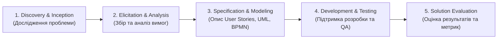

# Урок 78: Роль бізнес-аналітика в процесі створення програмного продукту (SDLC)

## 1. Хто такий бізнес-аналітик (Business Analyst / BA) та його місія в IT

**Бізнес-аналітик (BA)** — це ключовий фахівець і «міст» між бізнес-замовником (клієнтом, стейкхолдерами, інвесторами) та інженерною командою розробки (Product Manager, дизайнери, архітектори, розробники, QA).

Головна місія бізнес-аналітика полягає не просто у записуванні побажань замовника під диктовку, а в:
1. **Глибокому розумінні проблеми бізнесу (Root Problem Understanding)**: відокремлення того, *що клієнт просить* (його уявне рішення), від того, *що бізнесу насправді потрібно* (реальна бізнес-ціль або оптимізація витрат).
2. **Трансформації бізнес-вимог у чіткі технічні специфікації**: формування критеріїв прийнятності (Acceptance Criteria), функціональних (FR) та нефункціональних (NFR) вимог.
3. **Мінімізації ризиків розробки непотрібного або збиткового функціоналу** (Feature Waste Reduction).

---

## 2. Місце бізнес-аналітика в життєвому циклі розробки ПЗ (SDLC)

### Деталізація етапів:
- **Discovery (Передпроєктне дослідження)**: Визначення бізнес-цілей проєкту, оцінка доцільності (Feasibility Study), формулювання концепції продукту (Vision & Scope Document).
- **Elicitation (Збір вимог)**: Проведення інтерв'ю, воркшопів, аналіз конкурентів, спостереження за кінцевими користувачами.
- **Specification (Специфікація)**: Створення структурованої документації — BRD (Business Requirements Document), SRS (Software Requirements Specification), User Stories, Use Cases, діаграм процесів BPMN/UML.
- **Development Support**: Пояснення вимог розробникам на грумінгах (Backlog Grooming / Refinement), участь у плануванні спринтів.
- **Acceptance & Evaluation**: Участь у UAT (User Acceptance Testing), перевірка відповідності розробленого рішення початковим бізнес-цілям.

---

## 3. Класифікація вимог за стандартом BABOK (IIBA)

Згідно з міжнародним зводом знань з бізнес-аналізу (**BABOK Guide v3**), вимоги поділяються на 4 ключові рівні:

1. **Бізнес-вимоги (Business Requirements)**: Високорівневі цілі організації (наприклад: *«Збільшити конверсію мобільних покупок на 25% протягом 6 місяців»*).
2. **Вимоги стейкхолдерів (Stakeholder Requirements)**: Потреби конкретних груп зацікавлених сторін (*«Бухгалтер повинен отримувати зведений фінансовий звіт щоп'ятниці до 18:00»*).
3. **Вимоги до рішення (Solution Requirements)**:
   - **Функціональні (Functional Requirements - FR)**: Що саме система повинна робити (*«Система повинна надсилати SMS з одноразовим кодом підтвердження при зміні пароля»*).
   - **Нефункціональні (Non-Functional Requirements - NFR)**: Якості та обмеження системи — продуктивність, безпека, масштабованість (*«Час відповіді API не повинен перевищувати 200 мс при навантаженні 1000 запитів/сек»*).
4. **Перехідні вимоги (Transition Requirements)**: Тимчасові вимоги для переходу зі старої системи на нову (*«Міграція бази 500,000 користувачів зі збереженням хешів паролів»*).

---

## 4. AI-Augmented Business Analyst: Нова парадигма продуктивності

Сучасний бізнес-аналітик використовує штучний інтелект як інтелектуального партнера для:
- Швидкої декомпозиції епіків (Epics) на атомарні User Stories.
- Генерації драфтів діаграм процесів (PlantUML, Mermaid).
- Автоматичного виявлення логічних суперечностей та прогалин у специфікаціях (Ambiguity Detection).
- Підготовки сценаріїв інтерв'ю та транскрибації зустрічей зі стейкхолдерами.
