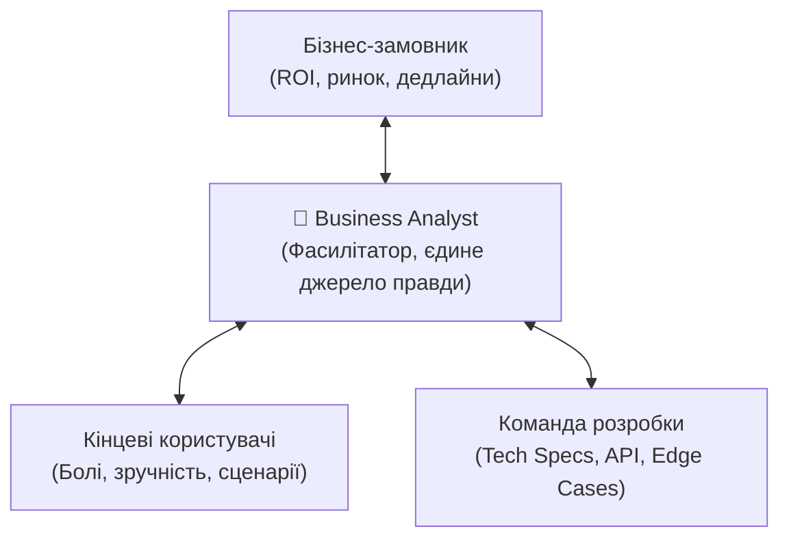

# Урок 79: Взаємодія із замовником, користувачами та командою розробки: фасилітація та комунікаційні мости

## 1. Бізнес-аналітик як фасилітатор та перекладач сенсів

Головна складність IT-проєктів полягає в тому, що різні групи стейкхолдерів розмовляють абсолютно різними «мовами»:
- **Замовник та бізнес**: розмовляють мовою прибутку, окупності інвестицій (ROI), частки ринку, конкурентних переваг та оптимізації витрат.
- **Кінцеві користувачі**: розмовляють мовою зручності, швидкості вирішення своїх повсякденних задач, мінімізації зайвих кліків та зрозумілості інтерфейсу.
- **Команда розробки (Dev / QA / DevOps)**: розмовляє мовою архітектури, баз даних, API контрактів, обробки помилок, нефункціональних обмежень та граничних умов (Edge Cases).

---

## 2. Формати та техніки виявлення вимог (Elicitation Techniques)

1. **Глибинні інтерв'ю (In-depth Interviews)**: Індивідуальні бесіди зі стейкхолдерами для розуміння стратегічних цілей та прихованих очікувань.
2. **Фасилітовані воркшопи (Collaborative Workshops / Event Storming)**: Спільні сесії замовника, архітектора та дизайнера для швидкого узгодження меж продукту та карти подій.
3. **Тіньове спостереження (Job Shadowing / Observation)**: Спостереження за тим, як реальний оператор або клієнт виконує свою щоденну роботу в старій системі (виявлення невербальних болей).
4. **Опитування та анкетування (Surveys / Questionnaires)**: Кількісний збір думок від сотень/тисяч користувачів.
5. **Аналіз інтерфейсів та зворотного інжинірингу (Document Analysis & Reverse Engineering)**: Вивчення існуючих інструкцій, регламентів та старої legacy-системи.

---

## 3. Управління очікуваннями стейкхолдерів та запобігання конфліктам

- **Активне слухання (Active Listening)**: Перефразування почутого (*«Чи правильно я розумію, що головний ризик для вас — це затримка звітності в податкову?»*).
- **Візуалізація домовленостей**: Люди набагато краще сприймають схеми процесів, діаграми та вайрфрейми, ніж 50 сторінок суцільного тексту.
- **Фіксація рішень (Decision Log)**: Документування того, чому було обрано саме такий варіант і які альтернативи були відхилені.

---

## 4. Використання AI для синхронізації команд

1. **Адаптація технічної документації для бізнесу**: AI перекладає опис архітектурного рішення на зрозумілу для інвесторів мову цінності.
2. **Підготовка технічних контекстів для розробників**: AI допомагає структурувати хаотичні тези бізнесу у формат чітких User Stories з Acceptance Criteria за Gherkin.
