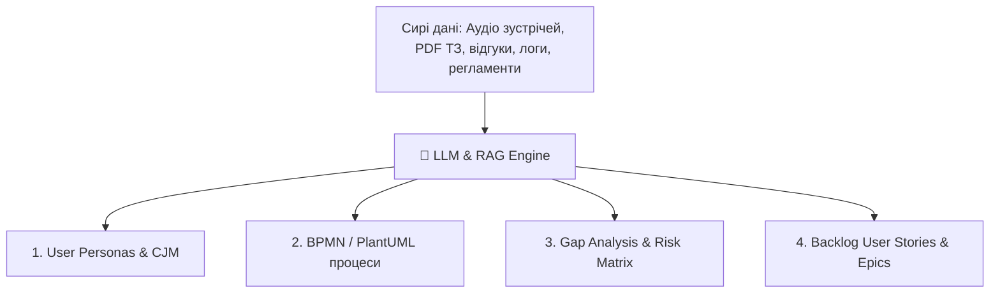

# Урок 80: Використання AI для збору, аналізу та структурування інформації у бізнес-аналізі

## 1. Революція даних: як AI змінює підготовку аналітичних артефактів

Традиційно бізнес-аналітик витрачав до 40% свого часу на механічну обробку інформації: читання сотень сторінок застарілих технічних завдань, ручний аналіз відгуків користувачів, складання порівняльних таблиць конкурентів та форматування документації.

Сьогодні сучасні LLM (GPT-4o, Claude 3.5 Sonnet, Gemini 1.5 Pro) з великими контекстними вікнами (від 128k до 2M токенів) дозволяють аналітику завантажувати цілі пакети документів та миттєво отримувати структуровані звіти.

---

## 2. Основні юзкейси AI у фазі аналізу та збору інформації

### 1. Автоматична транскрибація та екстракція суті зустрічей
Завантаження аудіозапису або стенограми інтерв'ю зі стейкхолдером (Otter.ai, Whisper, Claude) для миттєвого виділення:
- Ключових бізнес-правил (Business Rules).
- Болей та обмежень.
- Списку домовленостей (Action Items) із відповідальними особами.

### 2. Конкурентний аналіз та бенчмаркінг фіч (Feature Benchmarking)
AI аналізує відкриту документацію, відгуки в App Store/Google Play та сайти 5 конкурентів, формуючи порівняльну таблицю функціоналу (Feature Comparison Matrix) та знаходячи цінні ринкові ніші.

### 3. Gap Analysis (Аналіз розривів між As-Is та To-Be)
Порівняння поточної інструкції або діаграми процесу з цільовими бізнес-цілями для виявлення вузьких місць (Bottlenecks) та зайвих ручних операцій.

### 4. Генерація коду діаграм (Text-to-Diagrams)
Генерація синтаксису **Mermaid**, **PlantUML** або **Graphviz** безпосередньо з текстового опису процесу для швидкого додавання в Confluence / Notion.

---

## 3. Промпт-патерни для бізнес-аналітика

- **Role-Context-Task-Constraint (RCTC)**: Чітке завдання ролі досвідченого Lead BA, завантаження контексту предметної області, конкретне завдання та обмеження формату (наприклад: *«поверни у вигляді Markdown таблиці»*).
- **Few-Shot Prompting**: Надання одного-двох прикладів ідеально оформленої User Story вашої команди, щоб AI генерував весь беклог у точній відповідності до корпоративного стилю.
