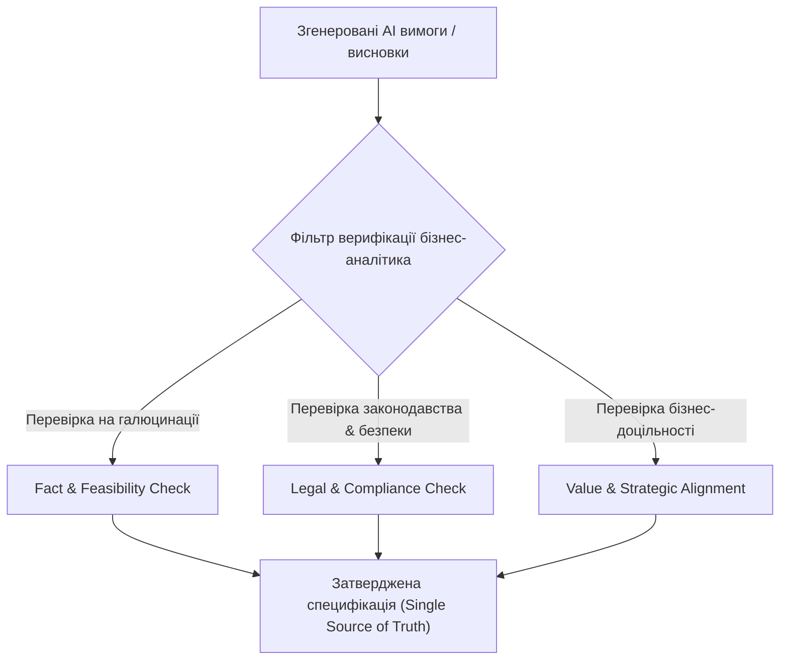

# Урок 81: Межі застосування AI та верифікація сформованих ним висновків

## 1. Сліпі зони та обмеження штучного інтелекту в бізнес-аналізі

Незважаючи на високу швидкість обробки даних, штучний інтелект не володіє справжнім розумінням бізнес-контексту, стратегічної інтуїції та етичної відповідальності. Сліпе довіряння висновкам AI у бізнес-аналізі створює прямі ризики для успіху всього продукту.

---

## 2. Типові помилки та пастки AI при формуванні вимог

1. **Технічні галюцинації (Hallucinations)**: Вигадування неіснуючих API, бібліотек, які більше не підтримуються, або вигаданих тарифних сіток сторонніх сервісів.
2. **Ігнорування локального регуляторного контексту**: AI може запропонувати рішення за законами США, проігнорувавши норми українського законодавства (Дія, Закон про платіжні послуги, GDPR).
3. **Поверхнева оптимізація (Plausible Bullshit)**: AI генерує красивий, переконливий текст, який насправді є набором банальностей без реальної конкретики для інженерів.
4. **Втрата крайових випадків (Edge Cases Blindness)**: Модель чудово описує "Happy Path" (ідеальний сценарій), але систематично пропускає сценарії відмови мережі, банківських таймаутів, часткових повернень або конфліктів паралельних транзакцій.

---

## 3. Методологія верифікації артефактів (Verification & Validation Framework)

Бізнес-аналітик зобов'язаний застосовувати чекліст **INVEST** та правила верифікації перед тим, як передати згенеровані вимоги розробникам:

| Критерій | Питання для перевірки |
| :--- | :--- |
| **Independent (Незалежна)** | Чи може ця User Story розроблятися та тестуватися окремо від інших? |
| **Negotiable (Гнучка)** | Чи залишає вимога простір для технічного вибору архітекторів? |
| **Valuable (Цінна)** | Чи приносить ця функція конкретну вимірювану цінність користувачеві чи бізнесу? |
| **Estimable (Оцінювана)** | Чи достатньо інформації розробникам для оцінки трудомісткості в Story Points? |
| **Small (Компактна)** | Чи вкладається історія в межі одного спринту? |
| **Testable (Тестована)** | Чи є чіткі критерії приймання, за якими QA може однозначно сказати: Pass або Fail? |

---

## 4. Безпека даних та комерційна таємниця (NDA / Trade Secrets)

- **Категорична заборона** завантажувати у відкриті моделі: непублічну фінансову звітність, вихідний код власного пропрієтарного ядра, персональні дані клієнтів (PII), паролі та комерційні таємниці.
- Використання Enterprise-підписок (де дані не використовуються для навчання моделей) або локальних моделей (Ollama / On-Premise LLM).
