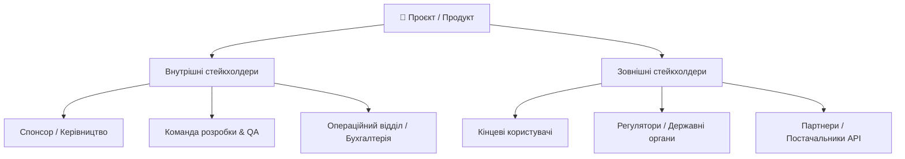

# Урок 82: Визначення та аналіз зацікавлених сторін (Stakeholder Analysis & Management)

## 1. Хто такі стейкхолдери та чому їхній аналіз є першим кроком проєкту

**Зацікавлена сторона (Stakeholder)** — це будь-яка фізична особа, група людей або організація, яка може впливати на рішення, дії чи результат проєкту, або на яку результати проєкту матимуть прямий чи опосередкований вплив.

Ігнорування навіть одного ключового стейкхолдера на старті (наприклад, керівника відділу кібербезпеки або юриста компанії) може призвести до того, що за день до релізу продукт буде заблоковано через невідповідність корпоративним стандартам.

---

## 2. Матриця «Влада / Інтерес» (Power / Interest Grid)

Головний інструмент бізнес-аналітика для класифікації стейкхолдерів та вибору стратегії взаємодії:

| Влада (Power / Influence) \ Інтерес (Interest) | Низький інтерес (Low Interest) | Високий інтерес (High Interest) |
| :--- | :--- | :--- |
| **Висока влада (High Power)** | **Задовольняти потреби (Keep Satisfied)** *Юристи, фінансовий директор, регулятори* | **Керувати тісно (Manage Closely)** *Спонсор проєкту, Product Owner, ключовий клієнт* |
| **Низька влада (Low Power)** | **Моніторити з мінімумом зусиль (Monitor)** *Суміжні відділи, вторинні підрядники* | **Тримати поінформованими (Keep Informed)** *Кінцеві користувачі, оператори підтримки* |

---

## 3. Матриця відповідальності RACI

Матриця **RACI** розподіляє ролі стейкхолдерів для кожної ключової задачі або артефакту:
- **R — Responsible (Виконавець)**: Хто безпосередньо робить задачу (наприклад, BA пише User Story).
- **A — Accountable (Відповідальний / Затверджувач)**: Єдина особа, яка затверджує результат і несе персональну відповідальність (наприклад, Product Owner).
- **C — Consulted (Консультант)**: Експерти, з якими консультуються до прийняття рішення (Tech Lead, Security Officer).
- **I — Informed (Поінформований)**: Особи, яких просто інформують про прийняте рішення або статус (служба підтримки, маркетинг).

---

## 4. Використання AI для складання карти стейкхолдерів (Stakeholder Mapping)

1. **Генерація переліку прихованих стейкхолдерів**: AI аналізує бізнес-домен (наприклад, медичний стартап) та підказує неочевидні групи (лікарі, страхові компанії, фармацевтичні регулятори, пацієнти з вадами зору).
2. **Прогнозування потенційних конфліктів інтересів**: AI моделює, де цілі маркетологів (зібрати більше даних) можуть конфліктувати з вимогами офіцера з безпеки (мінімізувати збір PII).
