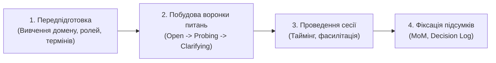
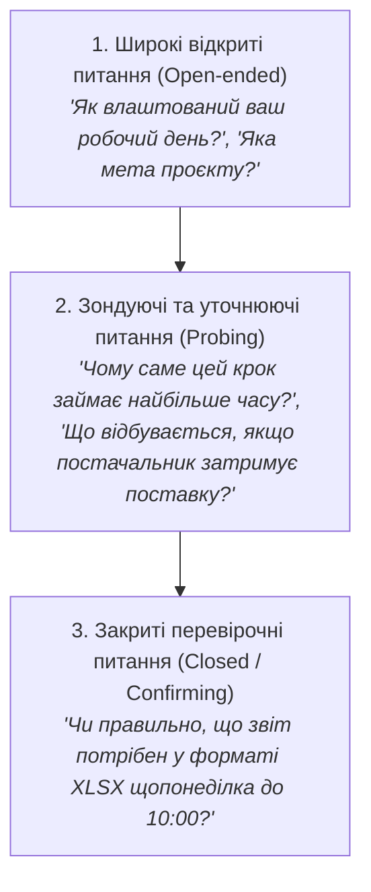

# Урок 83: Підготовка запитань до інтерв’ю та робочих зустрічей: мистецтво формулювання та структура сесії

## 1. Підготовка як 80% успіху виявлення вимог (Elicitation)

Проведення інтерв'ю зі стейкхолдерами без попередньої структурованої підготовки — це головна причина марно витраченого часу, затягування фази Discovery та пропущених критичних вимог. Бізнес-аналітик повинен приходити на зустріч не з білим аркушем, а з гіпотезами, вивченим контекстом предметної області та багаторівневим опитувальником.

---

## 2. Техніка «Воронки запитань» (Questioning Funnel)

Професійний інтерв'юер веде бесіду за принципом звуження фокусу:

### Типи запитань та їхнє призначення:
1. **Відкриті запитання (Open-Ended)**: Спонукають співрозмовника до розгорнутої розповіді, розкривають приховані болі (*«Розкажіть про найскладніший кейс за останній місяць...»*).
2. **Зондуючі запитання (Probing / Deep-Dive)**: Досліджують причини та винятки (*«А що відбувається, якщо покупець вводить невірний номер картки тричі?»*).
3. **Гіпотетичні запитання (Hypothetical / What-If)**: Допомагають знайти нефункціональні вимоги та форс-мажори (*«Що станеться, якщо трафік зросте в 10 разів у Чорну П'ятницю?»*).
4. **Уточнюючі та валідаційні запитання (Clarifying)**: Усувають неоднозначності термінології (*«Коли ви кажете 'швидко', який конкретно час ви маєте на увазі?»*).

---

## 3. Чекліст підготовки до інтерв'ю зі стейкхолдером

- [ ] **Визначення мети зустрічі**: Що саме ми повинні знати/узгодити до кінця бесіди?
- [ ] **Аналіз ролі респондента**: Які його повноваження, зона відповідальності та особисті KPI?
- [ ] **Підготовка глосарію**: З'ясування специфічних галузевих термінів та абревіатур заздалегідь.
- [ ] **Складання тайм-плану зустрічі (Agenda)**:
  - 5 хв: Вступ, ціль, узгодження запису.
  - 30 хв: Основна частина за воронкою запитань.
  - 10 хв: Підбиття проміжних підсумків та наступні кроки.

---

## 4. Використання AI для генерації гайдів та симуляції інтерв'ю

- **Генерація структури опитувальника за ролями**: AI створює персоналізовані питання для CEO (стратегія, гроші), CFO (звітність, інтеграція з 1С), кінцевого користувача (зручність інтерфейсу).
- **Рольова симуляція інтерв'ю (AI Roleplay)**: Бізнес-аналітик тренується ставити питання, попросивши AI зіграти роль консервативного або незадоволеного стейкхолдера.
