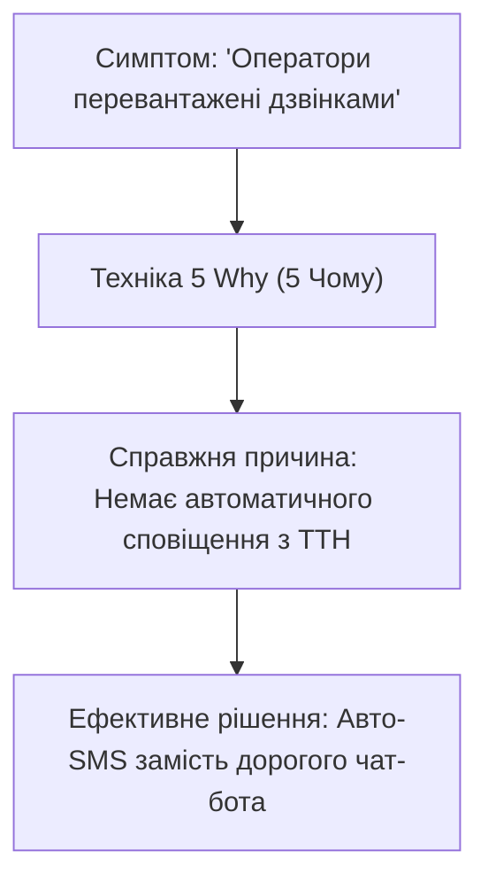

# Урок 84: Виявлення бізнес-потреб, проблем і цілей: Root Cause Analysis та фреймворки цілепокладання

## 1. Проблема vs Симптом: як знайти справжню причину

Найбільша помилка аналітика — прийняти **симптом** за **проблему**.  
Наприклад, замовник каже: *«Нам терміново потрібен чат-бот на базі AI!»*  
- *Симптом*: Оператори не встигають відповідати на дзвінки, клієнти чекають у черзі по 20 хвилин.
- *Уявне рішення замовника*: Чат-бот.
- *Реальна першопричина (Root Cause)*: 70% дзвінків стосуються одного й того самого питання «Де моє замовлення?», оскільки система не надсилає SMS із номером ТТН після відправки зі складу.
- *Справжнє оптимальне рішення*: Налаштувати автоматичну відправку SMS з трек-номером вартістю в $50 замість розробки чат-бота за $10,000.

---

## 2. Інструменти пошуку першопричин (Root Cause Analysis - RCA)

### 1. Техніка «5 Чому» (5 Whys від Toyota Production System)
Послідовне заглиблення через 5 ітерацій запитання «Чому?»:
1. *Чому клієнти скаржаться?* — Бо замовлення затримуються.
2. *Чому вони затримуються?* — Бо склад не встигає запакувати товар.
3. *Чому склад не встигає?* — Бо комірники вручну перевіряють наявність товару в паперових журналах.
4. *Чому в журналах?* — Бо сканери штрихкодів зламані й не підключені до бази даних.
5. *Чому вони не підключені?* — Бо немає інтеграції між WMS та 1С (**Першопричина знайдена**).

### 2. Діаграма Ісікави / «Риб'яча кістка» (Fishbone Diagram)
Аналіз факторів за 6 категоріями: Люди (People), Процеси (Methods), Обладнання (Machines), Матеріали (Materials), Вимірювання (Measurements), Середовище (Environment).

---

## 3. Формулювання бізнес-цілей за SMART

Кожна бізнес-потреба повинна трансформуватися у вимірювану ціль:
- **S — Specific (Конкретна)**: Що саме має бути досягнуто?
- **M — Measurable (Вимірювана)**: Які цифрові метрики покажуть успіх?
- **A — Achievable (Досяжна)**: Чи реалістична ця ціль за наявних ресурсів?
- **R — Relevant (Релевантна)**: Чи відповідає це стратегії бізнесу?
- **T — Time-bound (Обмежена в часі)**: До якої конкретної дати?

*Приклад SMART-цілі*: «Зменшити середній час оформлення кредитної заявки з 45 хвилин до 5 хвилин до кінця Q3 2026 року, підвищивши конверсію завершених заявок на 20%».
