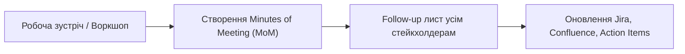

# Урок 85: Фіксація домовленостей, рішень та відкритих питань: Minutes of Meeting та Action Items

## 1. Культура фіксації: чому усні домовленості в IT не існують

У професійній розробці діє непорушне правило: **«Якщо домовленість не зафіксована письмово та не надіслана всім учасникам, її не існує»**.

Людська пам'ять суб'єктивна та вибіркова. Через 2 тижні замовник і розробники пам'ятатимуть одну й ту саму розмову абсолютно по-різному. Фіксація підсумків зустрічі (Minutes of Meeting — MoM) є головним захистом проєкту від хаосу, зриву дедлайнів та судових спорів.

---

## 2. Структура професійного Minutes of Meeting (MoM)

Якісний документ фіксації зустрічі повинен містити 5 обов'язкових блоків:

1. **Метадані**: Дата, час, тема зустрічі, список присутніх (і тих, хто був відсутній, але кому важливо знати результат).
2. **Ключові обговорені теми (Topics Discussed)**: Короткі тези без зайвої води.
3. **Зафіксовані рішення (Decisions Made)**: Що саме було остаточно затверджено (із зазначенням причини).
4. **Список задач та дій (Action Items — Who / What / When)**: Хто виконавець, що саме треба зробити і до якого дедлайну.
5. **Відкриті питання та блокери (Open Questions / Risks)**: Що залишилося невирішеним і хто відповідає за пошук відповіді.

### Шаблон Action Items:
| # | Задача (Action Item) | Відповідальний (Assignee) | Дедлайн (Due Date) | Статус |
| :---: | :--- | :--- | :---: | :---: |
| 1 | Надати тестові доступи до API платіжного шлюзу | Іван (Tech Lead Клієнта) | 18.09.2026 | In Progress |
| 2 | Підготувати драфт User Story для модуля повернень | Олена (BA) | 20.09.2026 | To Do |

---

## 3. Правила оформлення Follow-up комунікації

- **Правило 24 годин**: Follow-up лист із підсумками зустрічі повинен надсилатися не пізніше ніж через 24 години після завершення дзвінка (ідеально — протягом 2–3 годин).
- **Принцип «Мовчання означає згоду» (з попередженням)**: Завжди додавати фінальну фразу:  
  *«Будь ласка, перегляньте зафіксовані домовленості. Якщо у вас є доповнення або правки, просимо надати їх до завтра до 15:00. За відсутності зауважень вважаємо ці рішення остаточно погодженими для старту розробки.»*

---

## 4. Використання AI для автоматизації складання MoM

AI-асистенти дозволяють перетворити 60 хвилин сирого аудіо/транскрипту на бездоганний Minutes of Meeting за 30 секунд:
- Екстракція списку завдань із прямими цитатами зобов'язань.
- Автоматичне заповнення Decision Log у Confluence.
- Формування персональних нагадувань для кожного учасника зустрічі.
