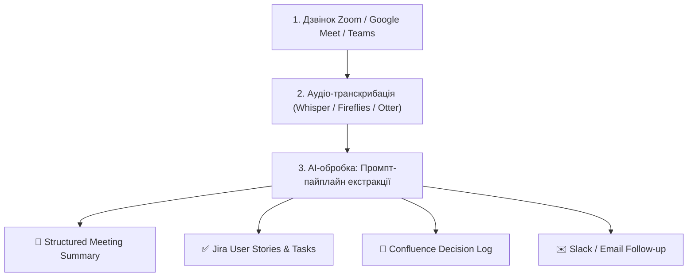

# Урок 86: Узагальнення результатів зустрічей за допомогою AI: автоматизація саммарі, екстракція сутності та інтеграція в беклог

## 1. Пайплайн сучасної обробки зустрічей (End-to-End Meeting Intelligence)

У цифрову еру бізнес-аналітик більше не витрачає вечори на ручне конспектування багатогодинних записів у Zoom чи Google Meet. Сучасний стек Meeting Intelligence об'єднує інструменти автоматичного захоплення аудіо, мовні моделі для структурування та API для публікації задач у Jira/Confluence.



---

## 2. Анатомія промпту для ідеального аналітичного саммарі

Щоб отримати від AI не просто «переказ тексту», а професійний артефакт бізнес-аналізу, промпт повинен містити точні інструкції з вилучення конкретних сутностей:

```text
Ти — Senior Technical Business Analyst.
Проаналізуй надану стенограму робочої зустрічі між замовником та командою.
Твоє завдання — згенерувати аналітичний звіт за такою структурою:

1. EXECUTIVE SUMMARY (3-4 речення про головну мету та підсумок).
2. KEY DECISIONS (список остаточно узгоджених бізнес- та тех-рішень).
3. BUSINESS RULES & CONSTRAINTS (виявлені правила та ліміти).
4. ACTION ITEMS TABLE (таблиця: Задача | Відповідальний | Дедлайн).
5. OPEN RISKS & UNRESOLVED QUESTIONS (блокери та питання без відповіді).
6. NEXT STEPS (дата наступної зустрічі та очікувані артефакти).
```

---

## 3. Автоматизація створення беклогу завдань (Meeting to Backlog)

Один із найпотужніших юзкейсів AI — автоматичне перетворення обговореної на дзвінку фічі у готові User Stories:
- AI розпізнає опис поведінки системи під час розмови.
- Формулює критерії прийнятності (Acceptance Criteria) у форматі Gherkin (Scenario: Given-When-Then).
- Експортує результат у JSON/CSV, готовий для імпорту в Jira або Azure DevOps.

---

## 4. Контроль якості та фільтрація AI-помилок у саммарі

- **Плутанина в іменах та відповідальних**: AI може випадково приписати задачу не тому спікеру (наприклад, якщо один учасник сказав: «Олег це зробить», а AI призначив Сергія). Обов'язкова перевірка призначень людиною!
- **Пропуск сарказму або жартів**: AI може сприйняти жарт стейкхолдера («Та давайте взагалі зробимо додаток безкоштовним для всіх!») як серйозну бізнес-вимогу.
- **Звірка з контекстом попередніх зустрічей**: Перевірка, чи не суперечать нові тези попереднім затвердженим базовим вимогам.
