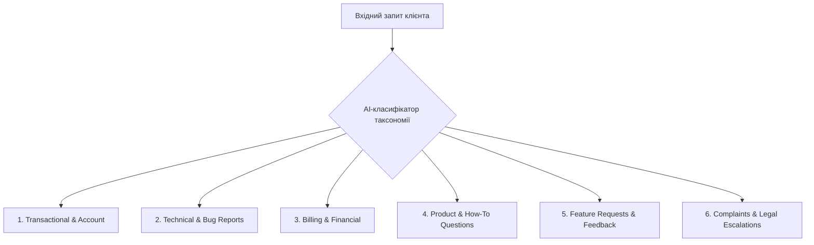

# Урок 74: Типи support-запитів та їхня таксономія у цифровій екосистемі

## 1. Класифікація звернень як основа масштабованої підтримки

Для побудови ефективної служби підтримки кожне вхідне повідомлення має бути правильно ідентифіковане та віднесене до відповідної категорії. Таксономія запитів дозволяє автоматизувати маршрутизацію (Routing), застосовувати точні шаблони відповідей та формувати аналітику для продуктової команди.

---

## 2. Детальний огляд основних категорій звернень

### 1. Інформаційні та «How-To» запити (Informational / Guidance)
- **Приклади**: «Як змінити мову інтерфейсу?», «Чи сумісний ваш додаток з iOS 18?», «Де знайти історію замовлень?».
- **Характеристика**: Стандартні, повторювані питання.
- **Стратегія обробки**: 80–90% можуть автоматизуватися AI-ботом або вирішуватися посиланням на інтерактивну статтю бази знань.

### 2. Транзакційні запити та керування акаунтом (Account & Access Management)
- **Приклади**: «Забув пароль», «Не приходить код 2FA», «Як змінити прив'язаний номер телефону?», «Видаліть мій акаунт (GDPR Right to be Forgotten)».
- **Характеристика**: Потребують суворої верифікації особистості власника акаунту для запобігання несанкціонованому заволодінню доступом (Account Takeover).

### 3. Фінансові та платіжні звернення (Billing & Subscriptions)
- **Приклади**: «З моєї картки списали гроші двічі», «Як скасувати автопродовження підписки?», «Надайте інвойс з ПДВ для юрособи», «Чому не пройшла оплата?».
- **Характеристика**: Висока чутливість клієнта, фінансові ризики, необхідність інтеграції з платіжними шлюзами (Stripe, Fondy).

### 4. Технічні проблеми та баг-репорти (Technical Issues & Incidents)
- **Приклади**: «Додаток вилітає при відкритті кошика на Android 14», «Помилка 500 при завантаженні PDF», «Не синхронізуються дані між пристроями».
- **Характеристика**: Вимагають збору діагностичних даних (версія ОС, модель пристрою, логи, скріншоти/відео) та передачі інженерам QA/Dev.

### 5. Пропозиції та відгуки (Feature Requests & Voice of Customer)
- **Приклади**: «Було б чудово додати темну тему», «Додайте експорт у CSV», «Мені дуже сподобався ваш новий сервіс».
- **Характеристика**: Джерело інсайтів для Product Management. Вимагають подяки користувачу та тегування у ProductBoard/Jira.

### 6. Скарги, конфлікти та юридичні ескалації (Complaints & Disputes)
- **Приклади**: «Ваш сервіс зірвав мені терміни, я подаю до суду!», «Кур'єр поводився грубо», «Ви порушуєте закон про захист прав споживачів».
- **Характеристика**: Найвищий пріоритет (P0/P1), вимагають обов'язкового людського контролю, дипломатії та залучення тімліда або юристів.

---

## 3. Автоматичне тегування та аналіз намірів (Intent Recognition) за допомогою AI

Сучасні LLM здатні за мілісекунди виконувати мультикласову класифікацію:
1. Визначення первинного наміру (Intent: `refund_request`, `password_reset`, `bug_report`).
2. Визначення емоційного забарвлення (Sentiment: `Positive`, `Neutral`, `Frustrated`, `Angry`).
3. Визначення наявності технічних деталей (Logs, Error Codes).
