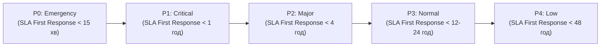

# Урок 75: Класифікація та пріоритизація звернень: матриці пріоритетів та SLA

## 1. Концепція пріоритизації: чому черга FIFO більше не працює

Обслуговування клієнтів за принципом простої черги «перший прийшов — перший обслужений» (FIFO) у сучасних цифрових продуктах є неефективним і збитковим. Якщо VIP-клієнт корпоративного тарифу зіткнувся з зупинкою бізнес-процесу (Down Time), він не може чекати в черзі позаду користувача безкоштовного тарифу, який запитує, як змінити колір аватарки.

**Динамічна пріоритизація** враховує:
1. **Вплив на бізнес (Impact)**: скільки користувачів страждає і чи зупинені фінансові операції.
2. **Терміновість (Urgency)**: наскільки швидко настануть незворотні наслідки.
3. **Клієнтський рівень (Tier / MRR)**: рівень угоди про обслуговування (SLA Tier: Free, Pro, Enterprise).
4. **Ризик втрати клієнта (Churn Probability & Sentiment)**: розгніваність та репутаційні загрози.

---

## 2. Матриця пріоритетів (Urgency vs Impact Matrix)

Пріоритет тікета визначається на перетині ступеня впливу та терміновості:

| Вплив (Impact) \ Терміновість (Urgency) | Висока (High) | Середня (Medium) | Низька (Low) |
| :--- | :---: | :---: | :---: |
| **Критичний (Вся система лежить, блокуючий збій)** | **P0 (Emergency)** | **P1 (Critical)** | **P2 (Major)** |
| **Значний (Ключова функція не працює для частини юзерів)** | **P1 (Critical)** | **P2 (Major)** | **P3 (Minor)** |
| **Локальний (Дрібний баг, є обхідний шлях / Workaround)** | **P2 (Major)** | **P3 (Minor)** | **P4 (Trivial)** |
| **Косметичний (Описка в тексті, побажання)** | **P3 (Minor)** | **P4 (Trivial)** | **P4 (Trivial)** |

---

## 3. Градація рівнів пріоритету та цільові SLA

### Деталізація рівнів:
- **P0 — Emergency / Blocker**: Масовий збій сервісу, недоступність сайту/додатку, витік даних, зупинка прийому платежів.
  - *Реакція*: Негайне сповіщення Incident Commander, включення аварійного регламенту.
- **P1 — Critical**: Не працює критична бізнес-функція для конкретного Enterprise-клієнта (наприклад, не формуються податкові накладні в останній день подачі).
- **P2 — Major**: Серйозна помилка, але існує тимчасовий робочий обхідний шлях (Workaround).
- **P3 — Normal / Minor**: Звичайні питання, баги інтерфейсу, що не блокують роботу, типові запити на повернення.
- **P4 — Low / Trivial**: Косметичні зауваження, побажання щодо нових фіч, описки в документації.

---

## 4. Застосування AI для інтелектуальної пріоритизації та сортування черг

1. **Sentiment-Based Escalation**: Якщо AI виявляє агресивний або вкрай роздратований тон, тікет автоматично піднімається з P3 до P2.
2. **Key Account Identification**: AI зіставляє email відправника з базою CRM (HubSpot/Salesforce) і підвищує пріоритет, якщо MRR клієнта > $1,000/міс.
3. **Spam & Noise Filtering**: AI відсікає автовідповідачі (Out of Office), спам та рекламні розсилки, зберігаючи фокус команди.
