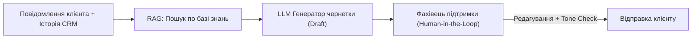

# Урок 76: AI-assisted drafting: генерація, редагування та персоналізація відповідей

## 1. Концепція AI-Assisted Drafting у сучасній підтримці

**AI-assisted drafting** (підготовка чернеток за допомогою ШІ) — це процес, під час якого мовна модель генерує початковий проєкт відповіді на основі контексту тікета, історії клієнта та бази знань компанії, а фахівець підтримки виступає редактором, верифікатором фактів та фінальним авторизатором відправки (Human-in-the-Loop).

---

## 2. Структура професійного промпту для сапорт-драфтингу

Щоб AI згенерував якісну, безпечну та клієнтоорієнтовану відповідь, промпт або внутрішня конфігурація системи повинна містити 5 обов'язкових компонентів:

1. **Рольовий контекст (System Role)**: Наприклад, «Ти — турботливий експерт підтримки фінтех-додатку NeoBank».
2. **Контекст клієнта (Customer Context)**: Ім'я, мова спілкування, історія попередніх звернень, статус акаунту.
3. **Фактична база знань (Retrieved Context / Truth Source)**: Точні правила, посилання на актуальні тарифи, інструкції.
4. **Вимоги до Tone of Voice**: Дружній, професійний, емпатичний, без канцеляризмів та без пустих обіцянок.
5. **Обмеження безпеки (Guardrails)**: Заборона вигадувати знижки, які не затверджені, заборона звинувачувати користувача.

---

## 3. Типові пастки AI-чернеток та як їх виправляти

| Помилка AI | Приклад згенерованого тексту | Як виправити спеціалісту |
| :--- | :--- | :--- |
| **Надмірні або нереалістичні обіцянки** | *«Ми гарантуємо, що наш сервер ніколи більше не впаде!»* | Замінити на реалістичний опис дій: *«Наша команда вже впровадила додатковий моніторинг...»* |
| **Холодний бюрократичний тон** | *«Згідно з пунктом 4.12 регламенту ваша заявка відхилена.»* | Пояснити причину простою мовою з емпатією та запропонувати альтернативу |
| **Невідповідність мови або регіональних висловів** | Калькування англійських ідіом (*«це робить сенс»*) | Відредагувати природною живою українською мовою (*«це має сенс»*) |
| **Галюцинації інтерфейсу** | *«Натисніть зелену кнопку 'Оформити' внизу зліва»* (якщо кнопка синя і вгорі) | Звірити з актуальним інтерфейсом додатку |

---

## 4. Патерни взаємодії спеціаліста з AI-копілотом

- **Expand / Explain**: Перетворення короткої тези спеціаліста («скажи, що платіж іде до 3 банківських днів») у повноцінне ввічливе повідомлення.
- **De-escalate & Soften**: Пом'якшення прямолінійної або жорсткої відмови при заперечному рішенні щодо повернення.
- **Simplify**: Спрощення занадто складного технічного опису помилки для нетехнічного користувача.
- **Translate & Localize**: Миттєва локалізація відповіді з урахуванням культурних особливостей мови клієнта.
