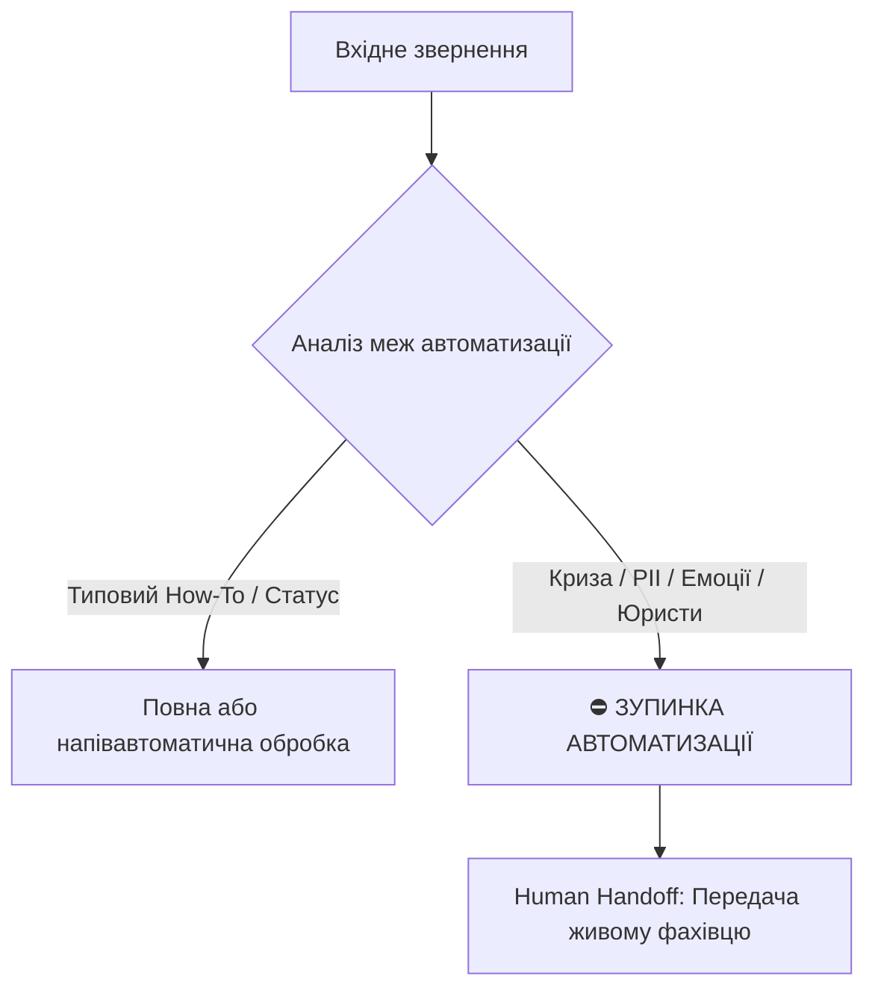

# Урок 77: Межі автоматизації комунікації: етика, регуляції та Human Handoff

## 1. Де закінчується автоматизація: межі штучного інтелекту

Незважаючи на стрімкий розвиток генеративного AI, існують фундаментальні обмеження, за яких повна автоматизація комунікації стає неефективною, небезпечною або навіть незаконною. Розуміння цих меж є обов'язковою кваліфікацією для сучасного Support Lead та AI-Augmented спеціаліста.

---

## 2. Ключові сценарії, де автоматизація суворо заборонена

### 1. Кризові, юридичні та репутаційні ситуації
- Загрози судовим позовом, скарги до державних регуляторів, публічний шантаж у соцмережах.
- Повідомлення про шахрайство, злам акаунту або несанкціонований доступ до конфіденційних даних.
- Спроби соціальної інженерії та фішингу.

### 2. Ситуації з високим рівнем людського горя та форс-мажорів
- Звернення щодо смерті власника акаунту, втрати працездатності, надзвичайних ситуацій (стихійні лиха, війна).
- Автоматичні бадьорі повідомлення від бота в таких випадках завдають непоправної репутаційної шкоди компанії (Uncanny Valley & Tone Deafness).

### 3. Складні нестандартні переговори та компенсації
- Вирішення індивідуальних умов для стратегічних клієнтів (Custom SLA).
- Обговорення компенсацій, що виходять за рамки стандартних макросів.

---

## 3. Регуляторні вимоги (EU AI Act, GDPR, Законодавство про захист прав споживачів)

1. **Обов'язкове маркування штучного інтелекту (AI Transparency)**: Клієнт має чітко знати, спілкується він з ботом чи з людиною. Приховувати факт роботи AI у багатьох юрисдикціях (зокрема ЄС) заборонено законом.
2. **Право на людину (Right to Human Intervention / Human Handoff)**: Клієнт повинен мати можливість у будь-який момент вимагати переключення на живого оператора.
3. **Захист від упередженості та дискримінації**: Алгоритми не мають права дискримінувати користувачів за статтю, регіоном чи іншими ознаками при ухваленні рішень про повернення або доступ до сервісу.

---

## 4. Архітектура безшовного Human Handoff (Передачі людині)

Щоб перемикання від бота до людини не викликало роздратування («Мене знову змушують розповідати все спочатку!»), система повинна передавати оператору:
- Повний контекст попереднього діалогу з ботом.
- Визначений AI намір (Intent) та рівень роздратування (Sentiment).
- Короткий згенерований зміст проблеми (Summary).
- Підготовлену попередню чернетку першого повідомлення.
