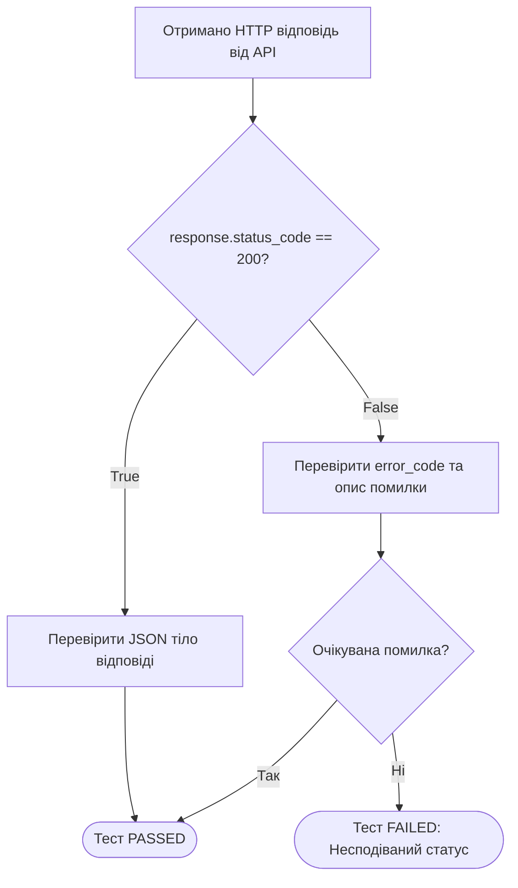

# Урок 60.2: Умовні конструкції та логіка перевірок в автотестах на Python

## 1. Вступ: Навіщо умовні конструкції в автотестах?

Автоматизований тест — це послідовність дій та перевірок. Хоча в ідеальному тестовому сценарії потік має бути лінійним і детермінованим, у реальній роботі автоматизатора виникає безліч ситуацій, де потрібно аналізувати стан системи та приймати рішення:
- Якщо API повернув код `200` — розпарсити відповідь; якщо `400` — перевірити текст валідаційної помилки.
- Якщо на сторінці з'явився банер з кукісами (Cookie Consent Popup) — закрити його перед продовженням тесту.
- Перевірити, який браузер передано в конфігурації (Chrome, Firefox чи Safari), щоб ініціалізувати відповідний веб-драйвер.



---

## 2. Базовий синтаксис `if`, `elif`, `else`

У Python блоки коду визначаються **відступами (Indentation)** — зазвичай 4 пробіли:

```python
status_code = 404

if status_code == 200:
    print("Запит успішний (OK)")
elif status_code == 404:
    print("Ресурс не знайдено (Not Found)")
elif status_code == 500:
    print("Критична помилка сервера (Internal Server Error)")
else:
    print(f"Отримано невідомий статус-код: {status_code}")
```

---

## 3. Оператори порівняння та логічні зв'язки

### 3.1. Оператори порівняння
- `==` — рівно (наприклад, `actual_role == "admin"`)
- `!=` — не дорівнює (`status != "FAILED"`)
- `>` та `<` — більше / менше (`response_time < 1.5`)
- `>=` та `<=` — більше або дорівнює / менше або дорівнює (`items_count >= 1`)

### 3.2. Логічні оператори: `and`, `or`, `not`
- **`and` (І):** Умова істинна лише тоді, коли **обидві** частини істинні.
- **`or` (АБО):** Умова істинна, якщо **хоча б одна** частина істинна.
- **`not` (НЕ):** Інвертує булеве значення (`not False` перетворюється на `True`).

```python
# Приклад перевірки відповіді API:
is_success = True
status_code = 200
has_token = True

if status_code == 200 and has_token:
    print("Авторизація успішна, токен збережено.")

# Перевірка наявності прав:
user_role = "moderator"
if user_role == "admin" or user_role == "moderator":
    print("Користувач має доступ до панелі управління.")
```

---

## 4. Оператор входження `in` — незамінний інструмент QA

Оператор `in` перевіряє, чи міститься підрядок у рядку або елемент у колекції:

```python
response_text = "User with email ivan@test.com was successfully created"

# Перевірка підрядка:
if "successfully created" in response_text:
    print("Користувача створено коректно.")

# Перевірка статус-коду серед списку дозволених кодів успіху:
status_code = 201
if status_code in [200, 201, 204]:
    print("API повернуло успішний статус!")
```

---

## 5. Різниця між `if-else` та `assert` в автоматизації тестування

> [!IMPORTANT]
> Поширена помилка новачків: використання `if-else` замість `assert` для перевірки результату тесту!

```python
# ПОГАНО ДЛЯ ТЕСТУ (Тест покаже PASSED у звіті, навіть якщо статус хибний!):
if actual_status != 200:
    print("Помилка! Статус не 200!") # Тестовий раннер PyTest не помітить збою!

# ПРАВИЛЬНО (PyTest зафіксує падіння тесту і виведе зрозумілий звіт):
assert actual_status == 200, f"Очікували статус 200, але отримали {actual_status}!"
```

**Правило:** 
- `if-else` використовується для **керування потоком тесту** (налаштування оточення, перевірка чи закривати попап).
- `assert` використовується для **фіксації результату тесту** (перевірка очікуваного результату).

---

## 6. Підсумковий чекліст уроку

- [ ] Я знаю синтаксис конструкцій `if`, `elif`, `else` у Python.
- [ ] Я вмію використовувати логічні оператори `and`, `or`, `not`.
- [ ] Я можу перевіряти входження тексту за допомогою оператора `in`.
- [ ] Я чітко розумію різницю між керуванням потоком (`if`) та тестовою перевіркою (`assert`).
