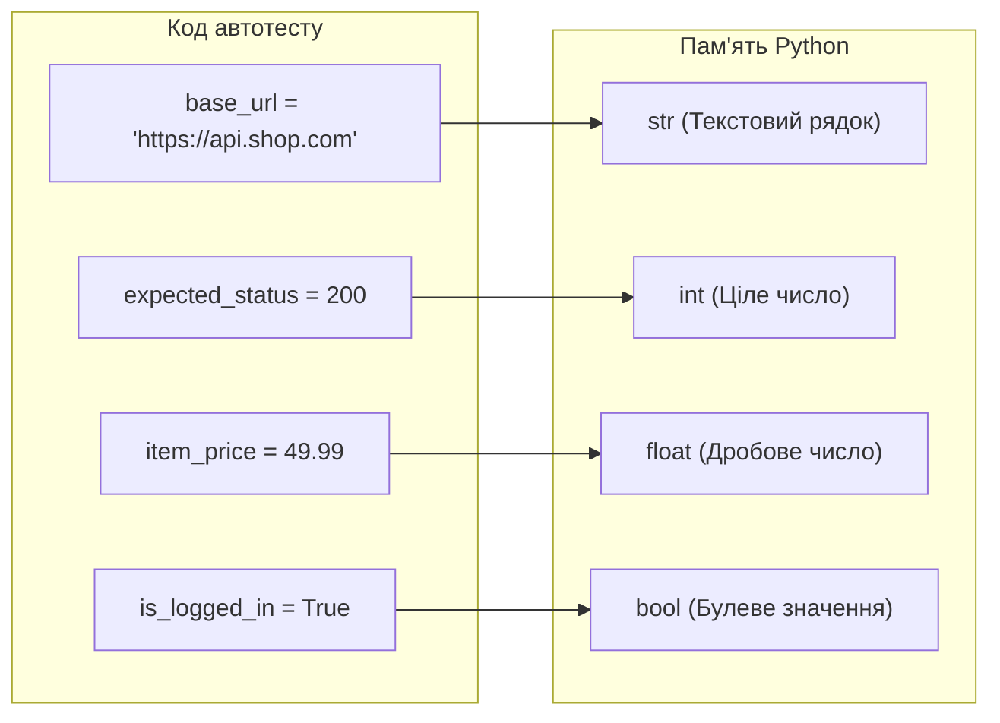

# Урок 61.1: Змінні та базові типи даних у Python для QA Automation інженера

## 1. Вступ: Навіщо QA Automation інженеру розуміти змінні та типи даних?

У світі автоматизації тестування ми постійно працюємо з даними:
- Отримуємо статус-коди відповідей сервера (наприклад, `200` чи `404`).
- Зчитуємо текст помилок на веб-сторінці (наприклад, `"Invalid username or password"`).
- Перевіряємо баланс користувача у кабінеті (наприклад, `1540.50`).
- Перевіряємо стан прапорця або кнопки (активна чи заблокована — `True` чи `False`).

**Змінна** в Python — це іменована «коробка» або ярлик у пам'яті комп'ютера, куди ми зберігаємо дані для подальшого використання у тестах. На відміну від багатьох інших мов (Java, C#), у Python діє **динамічна типізація**: вам не потрібно вручну писати тип змінної при її створенні — Python автоматично визначає тип за значенням.



---

## 2. Основні типи даних у Python для автоматизатора

### 2.1. Рядки (`str` - String)
Рядки представляють текст. Вони записуються в одинарних `'...'`, подвійних `"..."` або потрійних `'''...'''` лапках.
- **Де використовуються в автотестах:** URL-адреси, селектори елементів (CSS/XPath), токени авторизації, заголовки, очікувані тексти повідомлень.

```python
# Приклади в QA автоматизації:
login_url = "https://example.com/login"
username_selector = "#user-name"
expected_error_message = 'Epic sadface: Username is required'

# Довжина рядка за допомогою len():
print(len(expected_error_message))  # Кількість символів
```

### 2.2. Цілі числа (`int` - Integer)
Цілі числа без десяткової крапки (позитивні, негативні або нуль).
- **Де використовуються:** статус-коди HTTP, кількість знайдених товарів, час очікування (timeout у секундах), ID користувача.

```python
http_status_ok = 200
http_status_not_found = 404
timeout_seconds = 10
items_count = 5
```

### 2.3. Дробові числа (`float` - Floating Point)
Числа з плаваючою крапкою (з десятковою частиною).
- **Де використовуються:** ціни товарів, час відповіді сервера в мілісекундах (`0.34s`), знижки, координати.

```python
item_price = 19.99
discount_percentage = 0.15
response_time = 0.42  # час відповіді у секундах
```

### 2.4. Логічний (булевий) тип (`bool` - Boolean)
Має лише два можливі значення: `True` (істина) або `False` (хибність).
- **Де використовуються:** результати перевірок елементів (чи видима кнопка `is_visible()`, чи активне поле `is_enabled()`, чи стоїть галочка `is_checked()`).

```python
is_button_clickable = True
is_user_banned = False
```

---

## 3. Форматування рядків (f-strings) — суперсила автоматизатора

У тестах нам постійно потрібно підставляти змінні в URL, тексти повідомлень або тестові локатори. Найкращий та найсучасніший спосіб у Python — **f-рядки (f-strings)**:

```python
user_id = 42
endpoint = f"https://api.example.com/v1/users/{user_id}/profile"
print(endpoint)
# Виведе: https://api.example.com/v1/users/42/profile

# Динамічний XPath/CSS локатор для кнопки з певним текстом:
button_name = "Купити"
locator = f"//button[contains(text(), '{button_name}')]"
print(locator)
# Виведе: //button[contains(text(), 'Купити')]
```

---

## 4. Перетворення типів (Type Casting)

Часто API повертає числа як рядки (наприклад, `"200"` замість `200`) або зі сторінки ми зчитуємо ціну як текст `"$49.99"`. Щоб провести математичне порівняння в асерті, типи потрібно перетворити:

```python
raw_price = "49.99"
# Перетворюємо рядок у float для порівняння:
numeric_price = float(raw_price)

raw_status = "200"
# Перетворюємо рядок у int:
numeric_status = int(raw_status)

# Перетворення у рядок:
user_code = 12345
str_code = str(user_code)  # "12345"
```

---

## 5. Використання змінних у простих перевірках (Assertions)

Ключове слово `assert` у Python перевіряє умову. Якщо умова істинна (`True`), тест продовжується. Якщо хибна (`False`), викидається помилка `AssertionError`:

```python
actual_status_code = 200
expected_status_code = 200

# Перевірка статусу відповіді:
assert actual_status_code == expected_status_code, f"Очікували {expected_status_code}, але отримали {actual_status_code}"

actual_user_role = "admin"
assert actual_user_role == "admin", "Користувач не отримав права адміністратора!"
```

---

## 6. Підсумковий чекліст уроку

- [ ] Я можу пояснити, що таке змінна та як вона оголошується у Python.
- [ ] Я знаю 4 базові типи: `str`, `int`, `float`, `bool`.
- [ ] Я вмію використовувати f-рядки для побудови динамічних URL та селекторів.
- [ ] Я вмію конвертувати типи за допомогою `int()`, `float()`, `str()`.
- [ ] Я можу написати базовий `assert` з повідомленням про помилку.
