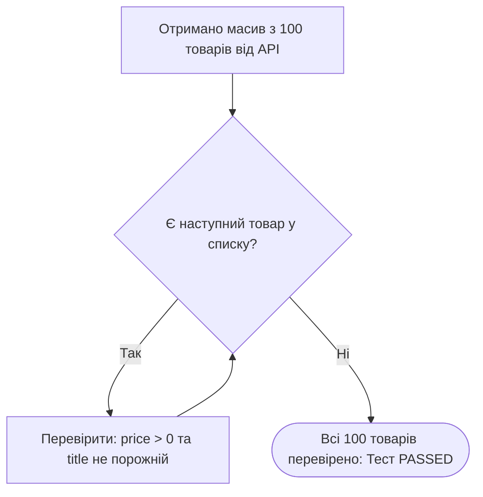

# Урок 60.3: Цикли та ітерації в автоматизації тестування на Python

## 1. Вступ: Навіщо цикли в автотестах?

Цикли — це спосіб виконати один і той самий блок коду багаторазово. В автоматизації тестування ми використовуємо цикли щодня:
- **Перебір списку товарів у каталозі:** перевірити, що всі 20 карток товарів на сторінці мають ціну, картинку та кнопку «Купити».
- **Data-Driven Testing (Тестування на основі даних):** прогнати один і той самий тест входу для списку з 10 різних логінів та паролів.
- **Очікування динамічної події (Polling / Polling loop):** періодично перевіряти, чи завершилася фонова генерація звіту в системі (наприклад, кожні 2 секунди протягом 30 секунд).



---

## 2. Цикл `for` — перебір колекцій та діапазонів

Цикл `for` у Python ідеально підходить для проходження по елементах списків, рядків або генераторів:

```python
# 1. Прохід по списку статус-кодів
expected_statuses = [200, 201, 204]
for status in expected_statuses:
    print(f"Перевіряємо підтримку статусу: {status}")

# 2. Цикл з діапазоном range(start, stop)
# Наприклад: повторити клік 5 разів
for attempt in range(1, 6):
    print(f"Спроба #{attempt} надіслати запит...")
```

### 2.1. Одночасне отримання індексу та елемента через `enumerate()`
Коли вам потрібно знати номер поточного елемента у звіті про помилку:

```python
menu_items = ["Головна", "Каталог", "Контакти", "Про нас"]

for index, item_name in enumerate(menu_items, start=1):
    print(f"Пункт меню #{index}: {item_name}")
```

---

## 3. Цикл `while` — очікування умов та ретраї (Retries)

Цикл `while` виконується доти, доки його умова залишається `True`. Це основа для реалізації механізму повторних спроб (Retry Mechanism):

```python
import time

max_attempts = 5
current_attempt = 0
is_report_ready = False

while current_attempt < max_attempts and not is_report_ready:
    current_attempt += 1
    print(f"Перевірка статусу звіту (Спроба {current_attempt}/{max_attempts})...")
    
    # Симуляція: на 3-й спробі звіт стає готовим
    if current_attempt == 3:
        is_report_ready = True
        print("Звіт сформовано!")
    else:
        time.sleep(1)  # пауза 1 секунда перед наступною спробою

assert is_report_ready is True, "Звіт не сформувався за відведений час!"
```

---

## 4. Керування перебігом циклу: `break` та `continue`

- **`break`:** негайно перериває та завершує весь цикл.
- **`continue`:** пропускає залишок поточної ітерації і переходить до наступного елемента.

```python
# Пошук конкретного товару та вихід з циклу:
products = ["Ноутбук", "Телефон", "Планшет", "Монітор"]

for prod in products:
    if prod == "Планшет":
        print(f"Знайдено цільовий товар '{prod}', завершуємо пошук.")
        break

# Пропуск неактивних користувачів:
users = [
    {"name": "Alice", "is_active": True},
    {"name": "Bob", "is_active": False},
    {"name": "Charlie", "is_active": True}
]

for user in users:
    if not user["is_active"]:
        continue  # Пропускаємо неактивного Bob
    print(f"Відправляємо тестове повідомлення користувачу: {user['name']}")
```

---

## 5. Генератори списків (List Comprehensions) — компактна ітерація

Швидкий спосіб створити або відфільтрувати список тестових даних в один рядок:

```python
prices_with_currency = ["$10.50", "$25.00", "$99.99"]

# Витягуємо лише числові значення в один рядок:
clean_prices = [float(p.replace("$", "")) for p in prices_with_currency]
print(clean_prices)  # [10.5, 25.0, 99.99]

# Фільтрація: отримати тільки ціни вище $20
expensive_prices = [p for p in clean_prices if p > 20.0]
print(expensive_prices)  # [25.0, 99.99]
```

---

## 6. Підсумковий чекліст уроку

- [ ] Я можу пояснити різницю між циклами `for` та `while`.
- [ ] Я вмію використовувати `enumerate()` для нумерації перевірок.
- [ ] Я вмію застосовувати `while` для створення циклів очікування (Polling loops).
- [ ] Я розумію дію операторів `break` та `continue`.
- [ ] Я вмію писати базові List Comprehensions для фільтрації тестових даних.
