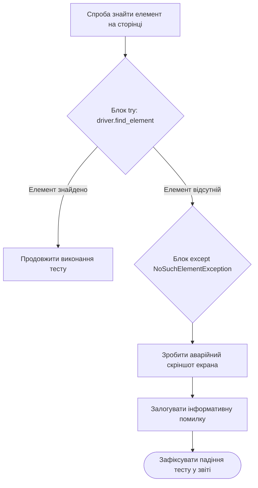

# Урок 60.7: Обробка винятків (Exception Handling) та надійність автотестів

## 1. Вступ: Що таке винятки і чому вони виникають в автотестах?

В ідеальному світі всі сервери відповідають за 50 мс, сайти ніколи не падають, а всі кнопки завжди присутні на екрані. Але в реальному тестуванні ми щодня стикаємося з помилками:
- **`TimeoutException` / `TimeoutError`:** сторінка вантажилася довше ніж 10 секунд через повільну мережу.
- **`NoSuchElementException`:** розробник змінив `id="submit-btn"` на `id="order-btn"`, і веб-драйвер не зміг знайти кнопку.
- **`KeyError` / `JSONDecodeError`:** сервер повернув `500 Internal Server Error` замість очікуваного JSON.
- **`AssertionError`:** кнопка на екрані була вимкнена, хоча очікувалася активною.

**Виняток (Exception)** — це аварійний сигнал Python про те, що під час виконання виникла непередбачена ситуація. Якщо його не перехопити, програма негайно аварійно завершується.



---

## 2. Синтаксис `try`, `except`, `else`, `finally`

```python
try:
    # 1. Блок ризикованого коду
    status = int("200_OK") # Викине ValueError!
except ValueError as error:
    # 2. Блок обробки помилки
    print(f"Перехоплено помилку перетворення: {error}")
else:
    # 3. Виконується ТІЛЬКИ якщо помилок не було
    print("Конвертація пройшла успішно!")
finally:
    # 4. Виконується ЗАВЖДИ (навіть якщо тест упав)
    print("Блок очищення: закриття файлів та з'єднань.")
```

---

## 3. Типові винятки в QA автоматизації

| Назва винятку | Коли виникає в автотестах |
| :--- | :--- |
| **`AssertionError`** | Коли `assert condition` повертає `False` (основний сигнал збою тесту). |
| **`TimeoutError`** | Коли перевищено ліміт часу очікування відповіді API або завантаження сторінки. |
| **`KeyError`** | Спроба звернутися до відсутнього поля в JSON-відповіді. |
| **`IndexError`** | Спроба звернутися до `items[0]`, коли список повернувся порожнім `[]`. |
| **`ValueError`** | Невдала спроба конвертації типу (наприклад, `int("abc")`). |

---

## 4. Грамотне використання `try-finally` для очищення ресурсів (Teardown)

Незалежно від того, пройшов тест успішно чи впав із помилкою, **ми зобов'язані закрити браузер (`driver.quit()`)**, інакше на сервері CI/CD накопичаться сотні підвислих процесів Google Chrome, які «зжеруть» усю оперативну пам'ять!

```python
driver = create_driver()

try:
    driver.get("https://example.com")
    perform_critical_test(driver)
finally:
    # Цей рядок виконається ЗА БУДЬ-ЯКИХ ОБСТАВИН:
    driver.quit()
    print("Браузер успішно закрито.")
```

---

## 5. Підсумковий чекліст уроку

- [ ] Я розумію, чому виникають винятки під час виконання автотестів.
- [ ] Я вмію використовувати конструкцію `try ... except` для перехоплення помилок.
- [ ] Я знаю різницю між блоками `else` та `finally`.
- [ ] Я використовую `finally` або PyTest Fixtures для гарантованого закриття браузерів та з'єднань.
