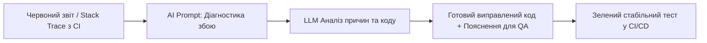

# Урок 60.8: Читання, аналіз, пояснення та модифікація коду автотестів за допомогою AI

## 1. Вступ: AI як асистент-ментор та парний програміст для QA

Сучасний QA Automation інженер більше не пише весь код з нуля самостійно. Поява потужних мовних моделей (Claude 3.5 Sonnet, ChatGPT GPT-4o, Cursor AI, GitHub Copilot) кардинально змінила робочий процес автоматизатора:
- **Аналіз чужого або застарілого коду (Legacy Code):** миттєве пояснення того, що робить складний регулярний вираз або громіздкий XPath локатор.
- **Тріаж збоїв (Failure Diagnosis):** AI аналізує 100 рядків незрозумілого Stack Trace і за секунду вказує на точну причину: *«Елемент перекритий випадаючим банером на рядку 42»*.
- **Рефакторинг та оптимізація:** перетворення повільних, заплутаних скриптів на чисті класи за патерном Page Object Model.
- **Генерація тестових даних:** створення типізованих моків, фікстур та генераторів за лічені хвилини.



---

## 2. Як правильно промптити AI для аналізу коду тесту

Якість допомоги штучного інтелекту безпосередньо залежить від наданого контексту. Слідуйте правилу 3-х компонентів:
1. **Контекст інструментів:** вкажіть фреймворк (наприклад, `Python 3.12 + PyTest + Playwright`).
2. **Фрагмент коду та стек-трейс:** передайте проблемний метод разом із точним текстом помилки.
3. **Очікуваний результат:** чітко сформулюйте, що саме повинен зробити виправлений варіант.

```markdown
### Зразок професійного промпту для аналізу збою тесту:
Ти — Senior SDET експерт з Python та Playwright.
Мій тест впав із наступною помилкою:
`playwright._impl._errors.TimeoutError: Timeout 30000ms exceeded waiting for locator('#checkout-btn')`

Ось мій код:
```python
def test_checkout(page):
    page.goto("https://shop.com/cart")
    page.click("#checkout-btn")
```

Поясни:
1. Чому виник цей таймаут (можливі причини: асинхронне завантаження, зміна iframe чи перекриття іншим елементом)?
2. Надай оптимізований варіант коду з явним автоочікуванням стану `to_be_visible()`.
```

---

## 3. Практичний рефакторинг: Зі спагеті-коду в чистий Page Object

Початківець часто пише тести лінійним суцільним полотном. AI чудово справляється з автоматичною структуризацією:

### До рефакторингу (Спагеті-код):
```python
def test_login_and_search(driver):
    driver.find_element("id", "user").send_keys("ivan")
    driver.find_element("id", "pass").send_keys("123")
    driver.find_element("id", "btn").click()
    time.sleep(5)
    driver.find_element("id", "search").send_keys("laptop")
    driver.find_element("id", "search-btn").click()
```

### Запит до AI:
> *«Проведи рефакторинг цього коду за патерном Page Object Model. Створи окремий клас `LoginPage` та `SearchPage`, прибери жорсткі `time.sleep` і заміни їх на явні перевірки»*.

---

## 4. Критичне правило: Human-in-the-Loop (Перевіряй, але не довіряй сліпо)

AI може допускати **галюцинації**:
- Вигадувати неіснуючі методи бібліотек (наприклад, `page.wait_for_magic_element()`).
- Видаляти важливі бізнес-перевірки заради «спрощення» коду.
- Використовувати застарілі або небезпечні практики.

**Завжди:**
1. Запускайте згенерований AI код локально.
2. Перевіряйте, що тест справді падає на реальному багу і проходить на робочому функціоналі.
3. Прочитуйте кожен рядок, щоб розуміти, як він працює.

---

## 5. Підсумковий чекліст уроку

- [ ] Я вмію використовувати AI для пояснення складних фрагментів чужого коду.
- [ ] Я можу скласти ефективний промпт для тріажу помилок та аналізу Stack Trace.
- [ ] Я вмію формулювати завдання для рефакторингу спагеті-коду в Page Object Model.
- [ ] Я дотримуюся принципу Human-in-the-Loop та завжди валідую код перед комітом.
