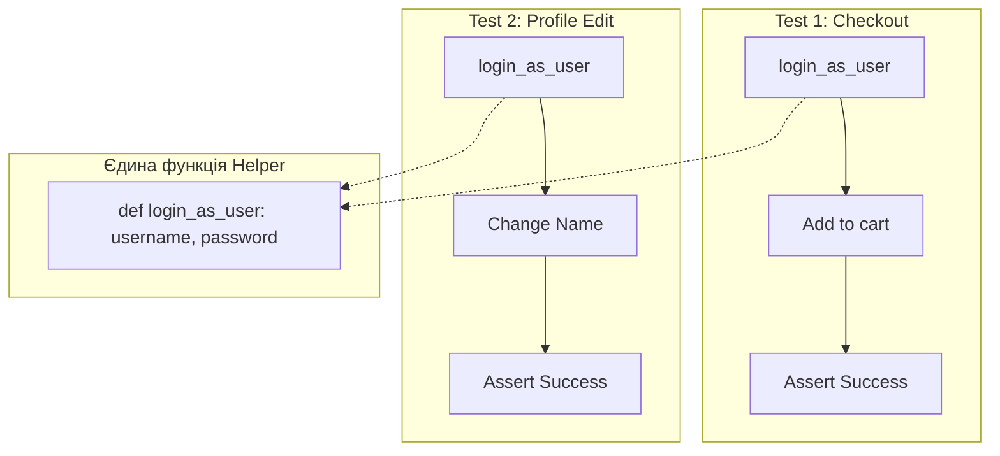

# Урок 61.4: Функції, параметри та повторне використання коду (DRY) в автотестах

## 1. Вступ: Навіщо функції автоматизатору?

Принцип **DRY (Don't Repeat Yourself — Не повторюйся)** є наріжним каменем архітектури тестових фреймворків. Уявіть, що у вас є 50 тестів, і кожен з них починається з 5 рядків коду авторизації (введення логіна, введення пароля, клік по кнопці, очікування токена).

Якщо розробники змінять адресу сторінки входу або назву поля, без функцій вам доведеться вручну переписувати 50 файлів! Якщо ж логіку входу винесено в окрему допоміжну **функцію (Helper Function)**, зміну потрібно буде внести лише в **одному місці**.



---

## 2. Оголошення та виклик функції у Python

Функція оголошується за допомогою ключового слова `def`:

```python
# Оголошення функції
def log_test_step(step_name: str):
    print(f"[TEST STEP] ---> {step_name}")

# Виклик функції
log_test_step("Відкриття головної сторінки")
log_test_step("Клік по кнопці реєстрації")
```

---

## 3. Параметри, аргументи та значення за замовчуванням

Функції можуть приймати вхідні параметри та мати значення за замовчуванням:

```python
def create_test_user(role="standard", is_active=True):
    user_data = {
        "username": f"test_user_{role}",
        "role": role,
        "is_active": is_active
    }
    return user_data

# Виклик зі значеннями за замовчуванням:
user1 = create_test_user()
print(user1)  # role='standard', is_active=True

# Виклик з кастомними аргументами:
admin_user = create_test_user(role="admin", is_active=False)
print(admin_user)
```

---

## 4. Повернення результату за допомогою `return`

Ключове слово `return` передає результат роботи функції назад у викликаючий код:

```python
def calculate_tax(amount: float, tax_rate: float = 0.20) -> float:
    """Розраховує суму податку з ПДВ 20%."""
    return round(amount * tax_rate, 2)

# Використання результату в асерті:
total_tax = calculate_tax(100.0)
assert total_tax == 20.0, f"Невірний розрахунок податку: {total_tax}"
```

---

## 5. Допоміжні функції (Custom Assertions & Helpers) у QA

Створення власних функцій-перевірок робить код автотестів виразним та зрозумілим:

```python
def assert_status_code(actual_code: int, expected_code: int = 200):
    assert actual_code == expected_code, (
        f"API Error! Очікували статус {expected_code}, але отримали {actual_code}!"
    )

# Використання у тесті:
response_code = 200
assert_status_code(response_code, 200)
```

---

## 6. Підсумковий чекліст уроку

- [ ] Я знаю синтаксис створення функцій `def name(params):`.
- [ ] Я вмію передавати аргументи та встановлювати значення за замовчуванням.
- [ ] Я розумію, як працює інструкція `return`.
- [ ] Я можу писати допоміжні функції для генерації тестових даних та кастомних перевірок.
