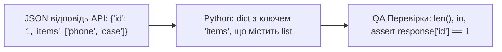

# Урок 61.5: Колекції та структури даних (Lists, Dictionaries, Sets, Tuples) в автотестах

## 1. Вступ: Робота з даними в API та UI тестах

Майже кожна взаємодія з бекендом через REST API повертає дані у форматі **JSON**. У Python формат JSON автоматично перетворюється на комбінацію **словників (`dict`)** та **списків (`list`)**.

Розуміння того, як швидко витягти значення поля, перевірити наявність ключа, відфільтрувати список або перевірити унікальність елементів за допомогою множини (`set`) — це 80% щоденної роботи QA Automation інженера.



---

## 2. Списки (`list`) — впорядковані масиви елементів

Список містить елементи в строгому порядку додавання. Елементи доступні за числовим індексом (нумерація починається з `0`):

```python
browsers = ["chrome", "firefox", "webkit"]

# Доступ за індексом:
print(browsers[0])   # "chrome" (перший елемент)
print(browsers[-1])  # "webkit" (останній елемент)

# Додавання та видалення:
browsers.append("edge")       # Додати в кінець
browsers.remove("firefox")    # Видалити за значенням

# Кількість елементів:
print(len(browsers))  # 3
```

---

## 3. Словники (`dict`) — пари Ключ: Значення (Основа роботи з JSON)

Словник зберігає дані у форматі пар `key: value`. Доступ до значень здійснюється за ім'ям ключа:

```python
api_response = {
    "status": "success",
    "user_id": 4042,
    "user_profile": {
        "first_name": "Ivan",
        "last_name": "Petrenko",
        "roles": ["user", "tester"]
    }
}

# 1. Доступ до значень через квадратні дужки або метод .get()
print(api_response["status"])                        # "success"
print(api_response["user_profile"]["first_name"])   # "Ivan"

# Метод .get() безпечний, бо не викидає помилку, якщо ключа немає:
token = api_response.get("auth_token", "default_token")
print(token)  # "default_token"

# 2. Перевірка наявності ключа у словнику:
assert "user_id" in api_response, "Відповідь API не містить обов'язкового поля user_id!"
```

---

## 4. Множини (`set`) — унікальні значення та дедуплікація

Множина зберігає тільки **унікальні** елементи. Якщо додати дублікат — він автоматично ігнорується:

```python
# Перевірка унікальності ID товарів на сторінці:
raw_product_ids = [101, 102, 103, 101, 104, 102]

unique_ids = set(raw_product_ids)
print(unique_ids)  # {101, 102, 103, 104}

# Перевірка на відсутність дублікатів у тесті:
assert len(raw_product_ids) == len(unique_ids), "Знайдено дублікати товарів у каталозі!"
```

---

## 5. Кортежі (`tuple`) — незмінні послідовності

Кортеж схожий на список, але його неможливо змінити після створення (`immutable`).
- **Де використовуються:** параметри тестів у PyTest (`@pytest.mark.parametrize`), координати екрана, налаштування розмірів вікна браузера `(1920, 1080)`.

```python
window_size = (1920, 1080)
width, height = window_size
print(f"Ширина: {width}, Висота: {height}")
```

---

## 6. Підсумковий чекліст уроку

- [ ] Я можу створювати та модифікувати списки (`list`) в Python.
- [ ] Я вмію працювати з вкладеними словниками (`dict`) та парсити JSON-відповіді.
- [ ] Я знаю різницю між прямим доступом `dict["key"]` та безпечним `dict.get("key")`.
- [ ] Я вмію використовувати множини (`set`) для перевірки унікальності даних.
