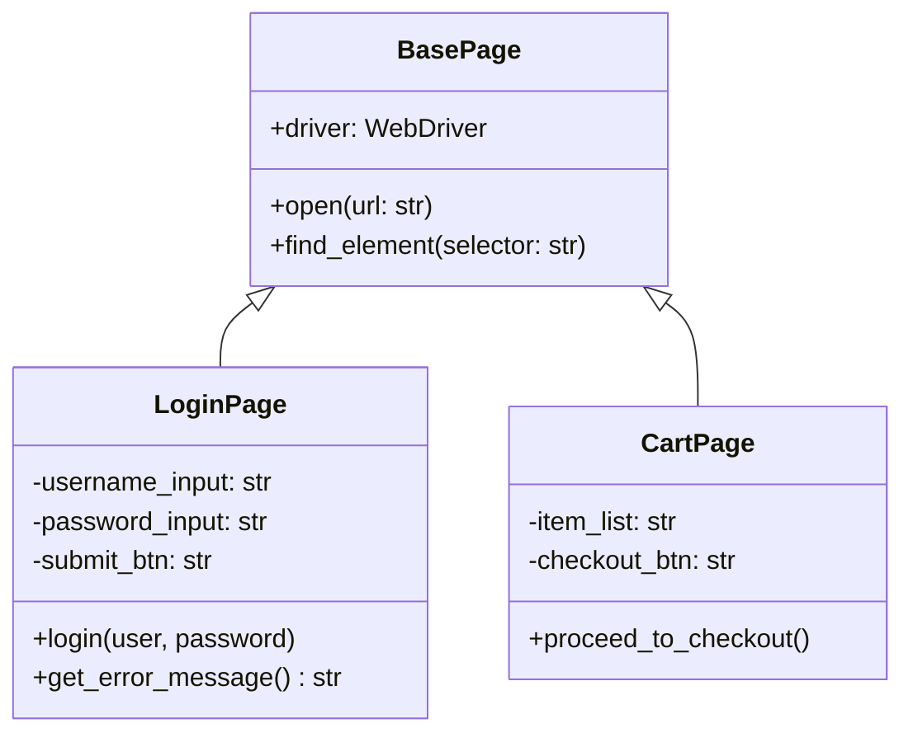

# Урок 61.6: Основи ООП, класи та об’єкти в автоматизації тестування (Page Object Model)

## 1. Вступ: Навіщо ООП автоматизатору тестування?

Об'єктно-орієнтоване програмування (ООП) — це головна парадигма побудови індустріальних тестових фреймворків (Selenium WebDriver, Playwright, Appium). 

У реальних UI тестах ми взаємодіємо зі сторінками: сторінкою входу (LoginPage), сторінкою кошика (CartPage), кабінетом користувача (DashboardPage). 
Замість того, щоб у кожному тесті вручну писати десятки XPath/CSS локаторів, ми створюємо **Клас-Сторінку (Page Object)**, який містить усі локатори цієї сторінки та методи для взаємодії з нею (наприклад, `login()`, `add_to_cart()`).



---

## 2. Що таке Клас і що таке Об'єкт?

- **Клас (Class):** Це креслення, шаблон або схема (наприклад, креслення автомобіля).
- **Об'єкт / Екземпляр (Object / Instance):** Це конкретний створений за цим кресленням предмет (конкретний червоний автомобіль з номером АА1234ВВ).
- **`__init__` (Конструктор):** Спеціальний метод, який автоматично викликається при створенні нового об'єкта для його ініціалізації.
- **`self`:** Посилання на поточний конкретний екземпляр класу.

```python
class TestEnvironment:
    def __init__(self, env_name: str, base_url: str):
        self.env_name = env_name      # Атрибут об'єкта
        self.base_url = base_url      # Атрибут об'єкта

    def get_full_endpoint(self, path: str) -> str:
        # Метод класу
        return f"{self.base_url}/{path.lstrip('/')}"

# Створюємо два різних об'єкти (екземпляри) класу:
staging = TestEnvironment("Staging", "https://stage.shop.com")
prod = TestEnvironment("Production", "https://shop.com")

print(staging.get_full_endpoint("/api/v1/users"))
# https://stage.shop.com/api/v1/users
```

---

## 3. Практичний приклад: Page Object Model (POM) для форми авторизації

Ось як виглядає професійний Page Object на Python:

```python
class LoginPage:
    def __init__(self, driver):
        self.driver = driver
        # Локатори елементів
        self.username_field = "#username"
        self.password_field = "#password"
        self.login_button = "button[type='submit']"
        self.error_alert = ".alert-danger"

    def open(self):
        self.driver.get("https://example.com/login")

    def enter_username(self, username: str):
        self.driver.find_element(self.username_field).send_keys(username)

    def enter_password(self, password: str):
        self.driver.find_element(self.password_field).send_keys(password)

    def click_login(self):
        self.driver.find_element(self.login_button).click()

    def login_as(self, username: str, password: str):
        # Комбінований бізнес-метод
        self.enter_username(username)
        self.enter_password(password)
        self.click_login()
```

### Як цей клас використовується у чистому тесті:
```python
def test_valid_login(mock_driver):
    login_page = LoginPage(mock_driver)
    login_page.open()
    login_page.login_as("standard_user", "SecretPass123!")
    
    assert mock_driver.current_url == "https://example.com/dashboard"
```

---

## 4. Успадкування (Inheritance) — базовий клас `BasePage`

Успадкування дозволяє винести спільні методи (клік, очікування, перевірка заголовка) у батьківський клас `BasePage`:

```python
class BasePage:
    def __init__(self, driver):
        self.driver = driver

    def open_url(self, url: str):
        self.driver.get(url)

    def get_title(self) -> str:
        return self.driver.title

# LoginPage успадковує всі методи BasePage:
class LoginPage(BasePage):
    def login(self, u, p):
        # Має прямий доступ до self.driver та self.open_url()
        pass
```

---

## 5. Підсумковий чекліст уроку

- [ ] Я розумію концепцію класів та об'єктів у контексті автоматизації.
- [ ] Я знаю призначення методу `__init__` та параметра `self`.
- [ ] Я можу пояснити архітектурний патерн Page Object Model (POM).
- [ ] Я вмію створювати базові Page Object класи та перевикористовувати їх у тестах.
