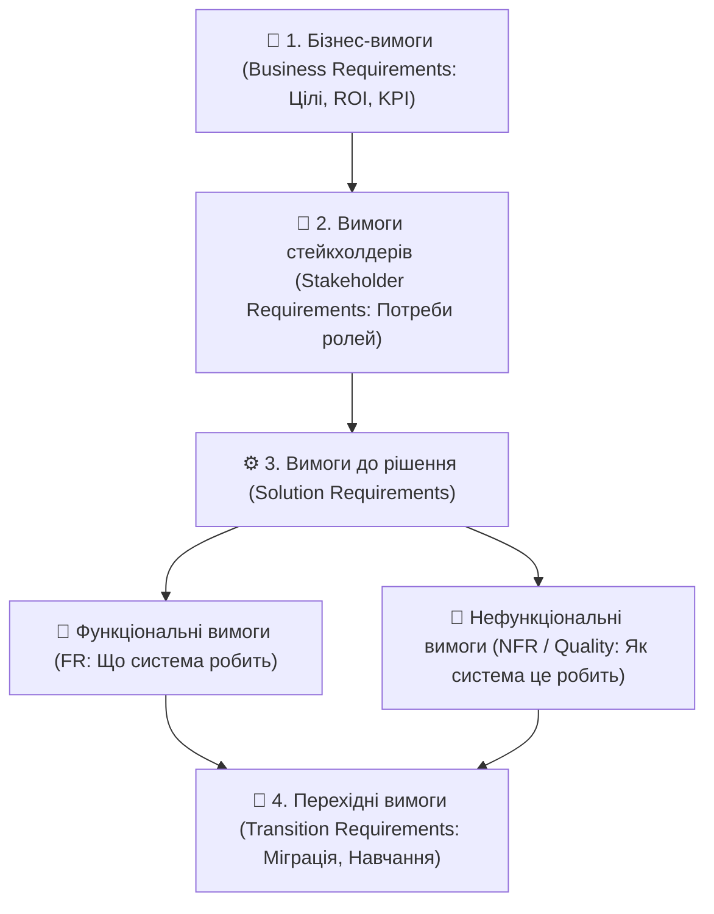

# Урок 124: Види вимог до програмного продукту (BABOK v3 Framework)

## 1. Ієрархія вимог за міжнародним стандартом BABOK v3

У професійному бізнес-аналізі вимоги — це фундамент успішної розробки програмного забезпечення. Згідно з керівництвом **BABOK v3 (Business Analysis Body of Knowledge)**, вимоги класифікуються на 4 чіткі ієрархічні рівні:

---

## 2. Детальна класифікація рівнів вимог

| Рівень вимог | Опис та призначення | Приклад у проєкті |
| :--- | :--- | :--- |
| **1. Business Requirements** | Стратегічні цілі бізнесу, обґрунтування інвестицій | «Збільшити частку онлайн-продажів на 25% протягом 6 місяців» |
| **2. Stakeholder Requirements** | Потреби конкретних груп користувачів та стейкхолдерів | «Менеджер складу повинен бачити залишки товарів у реальному часі» |
| **3. Functional Requirements (FR)** | Конкретна поведінка, операції, алгоритми та функції системи | «Система повинна відправляти SMS з кодом підтвердження при зміні пароля» |
| **4. Non-Functional Requirements (NFR)** | Атрибути якості: продуктивність, безпека, масштабованість, SLA | «Час відповіді API не повинен перевищувати 200ms при 10 000 одночасних запитів» |
| **5. Transition Requirements** | Тимчасові вимоги для переходу зі старої системи на нову | «Міграція 1 млн записів клієнтів з Oracle в PostgreSQL без зупинки бізнесу» |

---

## 3. Використання AI для структурування та класифікації вимог

Генеративний штучний інтелект виступає інтелектуальним асистентом бізнес-аналітика:
- **Автоматична класифікація за BABOK**: Розподіл сирих нотаток зустрічі на бізнес-, функціональні та якісні вимоги.
- **Детекція прихованих NFR**: AI аналізує функціональну вимогу та автоматично формулює необхідні нефункціональні вимоги (наприклад, до вимоги авторизації додає вимоги до стійкості паролів, шифрування та блокування після 5 невдалих спроб).
