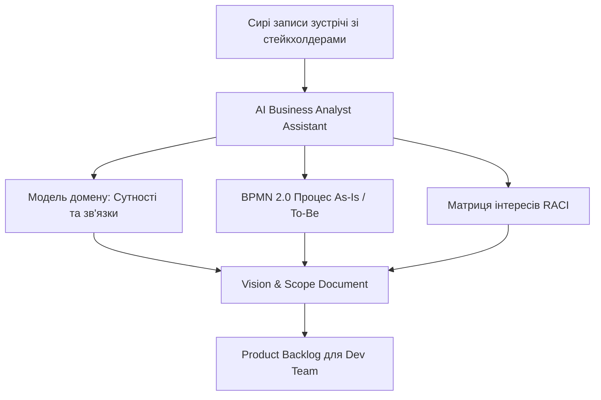
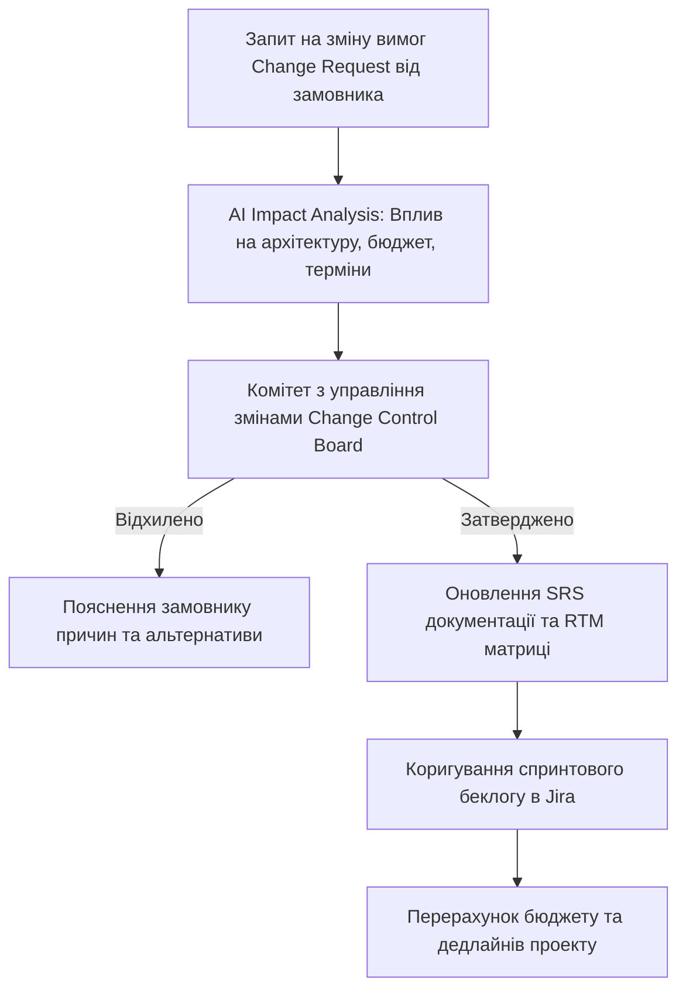

# Урок 124: Збір та аналіз вимог за допомогою AI

## Вступ та теоретичний фундамент
Збір, виявлення та аналіз бізнес-вимог (Requirements Elicitation & Analysis) є фундаментом успіху будь-якого проекту з розробки програмного забезпечення. За статистикою Standish Group CHAOS Report, понад 45% провалів IT-проектів стаються через неповні, суперечливі або некоректно виявлені вимоги стейкхолдерів на початкових етапах.

Робота сучасного AI-Augmented Business Analyst полягає у переході від пасивного стенографування слів замовника до проактивного моделювання бізнес-домену за допомогою мовних моделей:
1. **Інтелектуальний аналіз сирих вхідних даних (Multi-Source Elicitation)**: Синтез транскриптів зустрічей, корпоративних регламентів, застарілих технічних завдань та законодавчих актів.
2. **Побудова бізнес-процесів у нотації BPMN 2.0**: Автоматична генерація схем процесів 'As-Is' (Як є зараз) та 'To-Be' (Як має бути).
3. **Виявлення неявних вимог (Implicit Needs Extraction)**: Знаходження прихованих очікувань замовника, про які він забув згадати на інтерв'ю.
4. **Формування структурованого концепту продукту (Vision & Scope Document)**: Створення єдиного джерела правди для команди розробки та бізнесу.

У цьому уроці ви опануєте інженерні промпти для збору вимог, методики моделювання процесів у Mermaid/BPMN та правила валідації бізнес-домену.

---

## 1. Архітектурні принципи та фреймворк виявлення вимог за BABOK Guide
Згідно з міжнародним зводом знань бізнес-аналізу BABOK v3, процес виявлення вимог включає:
- **Підготовку (Prepare for Elicitation)**: Дослідження контексту галузі та стейкхолдерів.
- **Проведення (Conduct Elicitation)**: Інтерв'ю, воркшопи, спостереження.
- **Підтвердження (Confirm Results)**: Звірка протоколів зустрічей з учасниками.
- **Моделювання (Model Requirements)**: Візуалізація у вигляді діаграм BPMN та Use Case.




---

## 2. Методологічний базис: Порівняння технік виявлення вимог
Порівняльний аналіз технік збору вимог за допомогою AI.


| Техніка збору вимог | Як AI підсилює процес | Ключова перевага | Типовий ризик |
| :--- | :--- | :--- | :--- |
| **Глибинне інтерв'ю зі стейкхолдером** | Генерація структури запитань та транскрибація | Глибоке занурення в мотивацію та біль | Ризик отримати суб'єктивну думку однієї людини |
| **Аналіз існуючої документації (Doc Mining)**| Миттєве вилучення бізнес-правил з 500-сторінкових PDF | Швидкість та 100% покриття регламентів | Документи можуть бути застарілими |
| **Моделювання бізнес-процесів (BPMN)**| Перетворення тексту на діаграму Mermaid BPMN | Візуальна наочність для розробників | Спрощення складних крайових умов |
| **Зворотний інжиніринг легасі-системи** | Аналіз екранних форм та SQL-дампів для відновлення логіки | Точне розуміння поточної логіки As-Is | Ризик скопіювати застарілі баги у нову систему |

---

## 3. Практичний інженерний регламент: Промпт для синтезу вимог у BPMN 2.0 діаграму
Професійний системний промпт для перетворення сирого транскрипту інтерв'ю на структурований бізнес-процес.


```markdown
# =====================================================================
# ПРОМПТ ДЛЯ AI: Синтез вимог у бізнес-процес BPMN 2.0 та Vision Document
# =====================================================================

Ти — Lead Business Analyst (CBAP Certified).
Ось сирий запис зустрічі з операційним директором страхової компанії:
"Ми хочемо автоматизувати процес подачі заяви на виплату за ДТП. Зараз клієнт дзвонить, оператор заповнює папери, передає експерту. Експерт їде дивитися авто, пише звіт. Якщо збиток до 50k грн — виплачуємо одразу, якщо більше — погоджуємо з правлінням. Клієнти скаржаться, що це займає місяць."

Сформуй звіт:
1. **Vision & Scope**: Бізнес-ціль проекту, ключові метрики успіху (скорочення часу з 30 днів до 24 годин).
2. **Діаграма BPMN To-Be у форматі Mermaid flowchart**:
   - Подача через додаток (Фото авто + Дія) -> AI автооцінка збитків -> Розвилка за сумою (< 50k / > 50k) -> Миттєва виплата на карту / Ручний розгляд.
3. **Domain Entities**: Перелік сутностей (Claim, Policy, Vehicle, InspectionReport, Payment).
4. **Top-5 ризиків проекту** та методи їх пом'якшення.
```

---

## 4. Поглиблений аналіз виробничих кейсів, крайових випадків та антипатернів
Аналіз реальних провалів через помилки аналізу вимог.


### Кейс 1: Антипатерн "Розробка правильного продукту не для тих людей"
- **Проблема**: Бізнес-аналітик зібрав вимоги виключно від топ-менеджерів, проігнорувавши операторів складу, які безпосередньо мали працювати з терміналами.
- **Наслідок**: Система вимагала 15 обов'язкових кліків на кожну коробку, що паралізувало роботу складу.
- **Виправлення**: Правило обов'язкового польового спостереження (Job Shadowing) та опитування кінцевих користувачів.

### Кейс 2: Пропуск регуляторних обмежень (GDPR / PCI-DSS)
- **Проблема**: При проектуванні системи лояльності AI згенерував вимогу зберігати паспортні дані у відкритому вигляді.
- **Виправлення**: Автоматична перевірка вимог за чеклистом комплайєнсу.

---

## 5. Покроковий операційний воркфлоу бізнес-аналізу
Стандартний процес роботи аналітика.


### Крок 1: Збір первинного матеріалу (Elicitation Session)
- Провести воркшоп зі стейкхолдерами та записати аудіо.

### Крок 2: Синтез сутностей та процесів за допомогою AI
- Згенерувати первинну модель As-Is та To-Be.

### Крок 3: Створення Vision & Scope Document
- Оформити документ та узгодити межі проекту (Scope Creep Protection).

### Крок 4: Презентація та захист вимог перед розробниками
- Провести сесію передачі знань (Knowledge Transfer) для Tech Lead.

---

## 6. Стратегії підвищення якості бізнес-аналізу
1. **Scope Creep Control**: Чітка фіксація меж першого релізу (MVP) для запобігання безконтрольного розростання вимог.
2. **RACI Matrix Alignment**: Визначення відповідальних за затвердження кожної вимоги.
3. **Glossary Standardization**: Створення єдиного словника проекту (Ubiquitous Language) для уникнення непорозумінь між бізнесом та IT.

---

## 7. Вичерпний чек-лист перевірки та критерії готовності (Definition of Done)
Перед здачею завдань та інтеграцією результатів у виробничу гілку переконайтеся у виконанні наступних критеріїв:

- [ ] **Зібрано вимоги від усіх ключових груп стейкхолдерів (включаючи кінцевих користувачів)**
- [ ] **Побудовано чіткі діаграми процесів As-Is та To-Be у нотації BPMN / Mermaid**
- [ ] **Сформовано документ Vision & Scope з чіткими межами першого релізу (MVP)**
- [ ] **Визначено всі ключові доменні сутності та правила їхньої взаємодії**
- [ ] **Складено словник термінів проекту (Ubiquitous Language) для всієї команди**
- [ ] **Враховано регуляторні та безпекові обмеження (GDPR, локальне законодавство)**
- [ ] **Вимоги затверджені офіційними стейкхолдерами проекту**
- [ ] **Матеріал передано технічній команді для оцінки трудомісткості**

---

## 8. Підсумки, ключові інсайти та розширений глосарій термінів
Опанування цієї теми формує надійний фундамент для щоденної професійної роботи. Системний підхід, формалізовані інженерні стандарти та критичний контроль результатів AI забезпечують високу швидкість та бездоганну надійність кінцевого продукту.

### Глосарій ключових понять
| Термін | Визначення та контекст застосування |
| :--- | :--- |
| **Requirements Elicitation** | Процес виявлення, збору та дослідження потреб зацікавлених сторін для створення програмної системи. |
| **BABOK Guide** | Звід знань з бізнес-аналізу (Business Analysis Body of Knowledge), міжнародний професійний стандарт IIBA. |
| **BPMN 2.0 (Business Process Model and Notation)** | Стандартизована графічна нотація для моделювання бізнес-процесів у вигляді блок-схем. |
| **Vision & Scope Document** | Стратегічний документ, що визначає загальне бачення продукту, бізнес-цілі та межі функціоналу. |
| **Scope Creep** | Неконтрольоване розростання меж та обсягу вимог проекту без відповідного збільшення бюджету чи термінів. |
| **As-Is / To-Be** | Методологія аналізу процесів: 'As-Is' описує поточний стан справ, 'To-Be' — цільовий оптимізований процес. |
| **Ubiquitous Language** | Єдина уніфікована термінологічна мова, прийнята між бізнес-замовниками та розробниками у DDD. |
| **RACI Matrix** | Матриця розподілу відповідальності: Responsible (виконавець), Accountable (відповідальний), Consulted (консультант), Informed (інформований). |
| **Stakeholder** | Особа або група осіб, яка зацікавлена в результатах проекту або на яку впливає його впровадження. |
| **Job Shadowing** | Метод дослідження, при якому аналітик безпосередньо спостерігає за щоденною роботою користувача на його робочому місці. |

---

## 9. Поглиблений аналіз моделювання вимог, фінансового обґрунтування та управління змінами

### 9.1. Методологія розрахунку фінансової ефективності проекту (Business Case & ROI)
Справжній бізнес-аналітик мислить категоріями прибутку, окупності та оптимізації операційних витрат (OpEx / CapEx):
1. **Net Present Value (NPV)**: Чиста приведена вартість грошових потоків проекту з урахуванням дисконтування:
   $$\text{NPV} = \sum_{t=1}^{n} \frac{R_t}{(1 + i)^t} - \text{Initial Investment}$$
2. **Total Cost of Ownership (TCO)**: Повна вартість володіння системою на горизонті 3-5 років (розробка + хмарна інфраструктура + ліцензії + підтримка + навчання персоналу).
3. **Payback Period (Період окупності)**: Час, за який прибуток від впровадження автоматизації повністю покриває витрати на розробку.

### 9.2. Архітектура управління змінами вимог (Change Request Workflow)



### 9.3. Розширений практичний кейс: Побудова складного доменного дерева рішень (Decision Table)
- **Контекст**: Система автоматичного андеррайтингу для видачі іпотечних кредитів з 16 різними комбінаціями доходів, кредитної історії та застави.
- **Рішення з AI**: Побудова вичерпної таблиці рішень у форматі DMN (Decision Model and Notation), що виключила суперечності між правилами оцінки ризику та була безпосередньо інтегрована в рушій бізнес-правил Drools.

---

## 10. Питання для співбесіди та захист бізнес-архітектури (Lead Business Analyst Level)

1. **Як ви дієте в ситуації, коли два ключові стейкхолдери мають діаметрально протилежні вимоги до функціоналу?**
   *Еталонна відповідь*: Повернення до стратегічних цілей бізнесу з Vision & Scope документа. Проведення фасилітованого воркшопу з аналізом впливу обох варіантів на ключові KPI компанії, розрахунок RICE скорингу та економічної вартості кожної опції для прийняття рішення на основі цифр, а не авторитету.
2. **Як ефективно контролювати ризик розростання меж проекту (Scope Creep) під час активної фази розробки?**
   *Еталонна відповідь*: Впровадження формального процесу Change Request Management: будь-яка нова вимога проходить аналіз впливу на дедлайн і бюджет. Замовнику пропонується принцип 'Trade-off': якщо ми додаємо нову фічу X, ми повинні вилучити з поточного релізу функціонал Y аналогічної трудомісткості.
3. **Чим відрізняються бізнес-вимоги, вимоги користувачів та системні вимоги за стандартами BABOK?**
   *Еталонна відповідь*: Бізнес-вимоги описують високорівневі цілі організації (збільшити продажі на 25%). Вимоги користувачів (User Requirements) описують потреби конкретних людей для вирішення їхніх задач (можливість оплати в 1 клік). Системні/Функціональні вимоги описують конкретну поведінку ПЗ (ендпоінти, збереження в БД, шифрування), що реалізує потреби користувача.

---

## 11. Практичний регламент моделювання бізнес-архітектури та валідації вимог за BABOK

### 11.1. Моделювання бізнес-правил у нотації DMN (Decision Model and Notation)
Для складних доменів з багаторівневою логікою прийняття рішень (страхування, скоринг, податки) стандартом є моделювання таблиць DMN:
1. **Input Data**: Чітко визначені вхідні параметри (вік, дохід, тип застави).
2. **Decision Table Logic**: Матриця правил 'If-Then' з однозначним визначенням політики потрапляння (Unique, First, Collect).
3. **Separation of Concerns**: Відокремлення бізнес-правил від коду додатку, що дозволяє бізнес-користувачам оновлювати процентні ставки чи ліміти без залучення програмістів.

### 11.2. Матриця перевірки повноти вимог за критеріями BABOK
- **Unambiguous (Однозначність)**: Тільки одне тлумачення для будь-якого фахівця.
- **Complete (Повнота)**: Описано всі можливі вхідні дані, винятки та системні реакції.
- **Consistent (Послідовність)**: Відсутність протиріч з іншими вимогами проекту.
- **Correct (Коректність)**: Повна відповідність реальним бізнес-цілям замовника.
- **Feasible (Здійсненність)**: Можливість реалізації в межах виділеного бюджету, часу та технологій.
- **Traceable (Трасованість)**: Наявність унікального ID та зв'язку з бізнес-цілями BRD.
