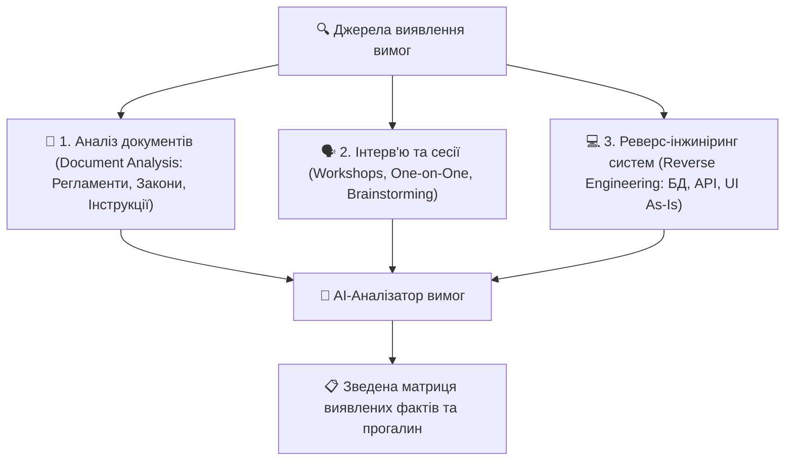

# Урок 125: Збір вимог (Requirements Elicitation) із документів, зустрічей та наявних систем

## 1. Техніки виявлення вимог (Elicitation Techniques)

Збір вимог (Elicitation) — це не пасивне записування слів клієнта під диктовку, а активне дослідження та розкопки реальних потреб через три основні джерела:

---

## 2. Методологія роботи з різними джерелами

| Джерело даних | Що шукаємо | Типові пастки |
| :--- | :--- | :--- |
| **Документи (Регламенти, закони)** | Юридичні обмеження, бізнес-правила, формати звітності | Документи часто застарілі й не відповідають реальній практиці бізнесу. |
| **Зустрічі та воркшопи** | Цілі, болі стейкхолдерів, конфлікти між відділами | Домінування однієї гучної людини (HiPPO — Highest Paid Person's Opinion). |
| **Наявні IT-системи (Legacy)** | Структура даних, приховані валідації, граничні випадки | Відсутність документації до коду, мертві невикористовувані функції. |

---

## 3. Використання AI для прискорення Elicitation

Генеративний AI трансформує рутинний збір вимог:
1. **Аналіз нормативних PDF на 100+ сторінок**: Швидкий витяг усіх обов'язкових бізнес-правил (Business Rules Extraction) з податкових кодексів чи корпоративних політик.
2. **Транскрибування та аналіз зустрічей**: AI витягує з годинного аудіозапису воркшопу всі обіцянки, відкриті питання (Open Questions) та зафіксовані вимоги.
3. **Реверс-інжиніринг SQL схем**: AI аналізує DDL-дамп старої бази даних і відновлює бізнес-сутність зв'язків та полів.
