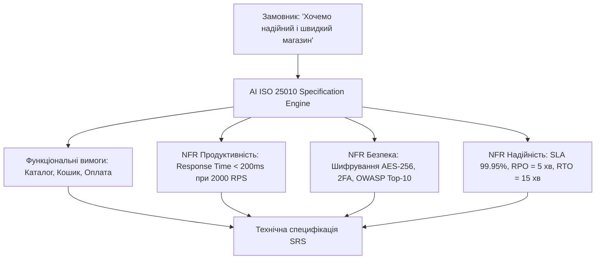
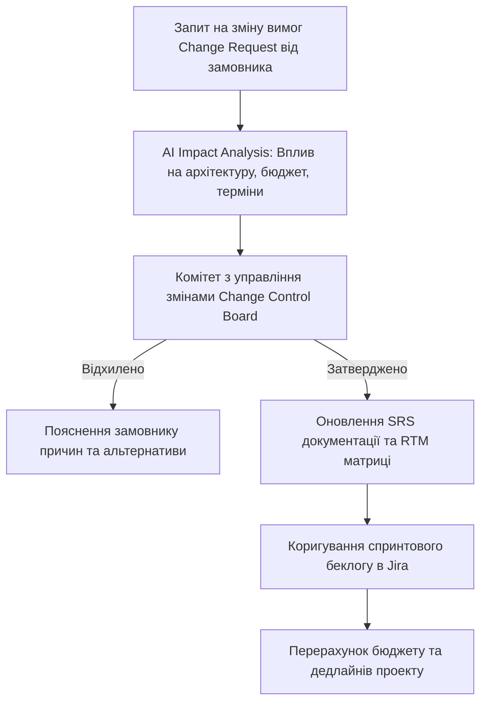

# Урок 125: Формулювання функціональних та нефункціональних вимог

## Вступ та теоретичний фундамент
Чітке розмежування та професійне формулювання функціональних (Functional Requirements — FR) та нефункціональних вимог (Non-Functional Requirements — NFR) — це головний критерій інженерної зрілості бізнес-аналітика. Якщо функціональні вимоги описують, *що* саме система повинна робити (бізнес-функції, розрахунки, сценарії), то нефункціональні вимоги визначають, *як* саме вона повинна це робити (продуктивність, безпека, масштабованість, надійність, доступність).

Найчастіша причина аварій масштабних систем — повне ігнорування NFR: система чудово проводить платіж (FR), але падає при одночасному навантаженні у 1000 користувачів або зберігає паролі без шифрування (NFR Failure).

Використання генеративного AI дозволяє:
1. **Трансформувати абстрактні побажання у вимірювані NFR метрики**: Перетворення фрази 'система має бути швидкою' на точну інженерну вимогу 'Latency p99 < 150ms при 5,000 RPS'.
2. **Застосовувати таксономію ISO/IEC 25010 (SQuaRE Architecture)**: Класифікація вимог за 8 вимірами якості програмного забезпечення.
3. **Автоматично генерувати матрицю архітектурних обмежень**: Створення вимог до SLA, RPO, RTO та відмовостійкості.
4. **Створювати чіткі критерії приймання (Acceptance Criteria & DoD)**: Формулювання вимог, які розробники можуть безпосередньо перетворити на автоматичні тести.

У цьому уроці ви опануєте інженерні стандарти опису FR/NFR за стандартом ISO 25010 та навчитеся використовувати AI для точної специфікації параметрів якості.

---

## 1. Архітектурні принципи та модель якості ПЗ за стандартом ISO/IEC 25010
Стандарт ISO 25010 визначає 8 фундаментальних характеристик якості системи:
1. **Functional Suitability (Функціональна відповідність)**: Повнота, коректність та доцільність функцій.
2. **Performance Efficiency (Продуктивність)**: Час відгуку, пропускна здатність, використання ресурсів CPU/RAM.
3. **Compatibility (Сумісність)**: Співіснування та взаємодія з іншими системами.
4. **Usability (Зручність використання)**: Простота навчання, доступність, захист від помилок користувача.
5. **Reliability (Надійність)**: Доступність (Availability 99.99%), відмовостійкість, відновлюваність.
6. **Security (Безпека)**: Конфіденційність, цілісність, автентичність, неспростовність дій.
7. **Maintainability (Підтримуваність)**: Модульність, повторне використання, тестованість.
8. **Portability (Мобільність)**: Адаптивність, простота встановлення та заміни компонентів.




---

## 2. Методологічний базис: Порівняння якісних та неякісних формулювань вимог
Порівняльний аналіз розмитих побажань та точних вимірюваних вимог.


| Категорія вимоги | Неприпустиме розмите формулювання | Еталонне вимірюване формулювання за ISO 25010 | Метод перевірки (Verification) |
| :--- | :--- | :--- | :--- |
| **Продуктивність (Performance)** | "Система повинна швидко завантажувати сторінку" | "Час повного відмальовування LCP повинен становити < 1.8 сек для 95% користувачів на 4G" | Google Lighthouse / Datadog RUM |
| **Надійність (Availability)** | "Сервери не повинні падати" | "Рівень доступності системи становить не менше 99.95% у режимі 24/7 (не більше 21.9 хв даунтайму на місяць)" | UptimeRobot / AWS CloudWatch |
| **Безпека (Security)** | "Дані клієнтів мають бути захищені" | "Всі паролі хешуються через Argon2id, конфіденційні дані шифруються в спокої за стандартом AES-GCM-256" | SAST сканування + Security Audit |
| **Масштабованість (Scalability)** | "Сайт повинен витримувати наплив людей" | "Система повинна автоматично масштабуватися з 2 до 20 подів у Kubernetes при досягненні CPU > 70%" | Навантажувальний тест Locust / k6 |

---

## 3. Практичний інженерний регламент: Промпт для генерації вичерпної матриці NFR
Професійний системний промпт для розробки повного списку нефункціональних вимог для FinTech проекту.


```markdown
# =====================================================================
# ПРОМПТ ДЛЯ AI: Генерація матриці нефункціональних вимог за ISO 25010
# =====================================================================

Ти — Principal Systems Architect та Senior Business Analyst.
Проект: "Платіжний шлюз для обробки банківських карток та криптоплатежів".

Сформуй вичерпну специфікацію нефункціональних вимог (NFR) за 6 категоріями:
1. **Performance & Scalability**: Точні метрики затримки (p50, p95, p99), піковий RPS, правила автоскейлінгу.
2. **Security & Compliance**: Стандарти PCI-DSS Level 1, захист від DDoS, маскування номерів карток, автентифікація через OAuth 2.1 / mTLS.
3. **Availability & Disaster Recovery**: Метрики SLA, RTO (Recovery Time Objective), RPO (Recovery Point Objective), правила георезервування.
4. **Data Integrity & Consistency**: Вимоги ACID для фінансових транзакцій, захист від подвійних списань (Idempotency).
5. **Observability & Logging**: Формат структурованих JSON логів, метрики Prometheus, розподілене трасування OpenTelemetry.
6. **Usability & Accessibility**: Відповідність стандарту WCAG 2.2 Level AA.
```

---

## 4. Поглиблений аналіз виробничих кейсів, крайових випадків та антипатернів
Аналіз реальних катастроф через відсутність чітких NFR.


### Кейс 1: Падіння квиткового сервісу через невраховані NFR масштабованості
- **Проблема**: Бізнес-аналітик описав функцію покупки квитків на концерт, але не вказав NFR пікового навантаження.
- **Наслідок**: У першу хвилину відкриття продажів 50,000 фанатів одночасно надіслали запити, база даних зазнала дедлоку, сервер впав на 4 години.
- **Виправлення**: Додавання обов'язкової NFR: "Система повинна витримувати чергу очікування (Virtual Waiting Room) з навантаженням до 100,000 одночасних сесій без деградації бази даних".

---

## 5. Покроковий операційний воркфлоу специфікації FR та NFR
Порядок дій аналітика при розробці вимог.


### Крок 1: Виділення функціонального ядра (Functional Core)
- Описати всі бізнес-сценарії у вигляді Functional Requirements.

### Крок 2: Генерація категорій NFR за стандартом ISO 25010
- Запустити AI для розрахунку числових метрик навантаження, безпеки та доступності.

### Крок 3: Узгодження NFR з архітекторами та DevOps
- Перевірити реалістичність вимог SLA та вартості хмарної інфраструктури.

### Крок 4: Внесення вимог до SRS документа та беклогу
- Оформити вимоги у форматі специфікації IEEE 830 / ISO 29148.

---

## 6. Стратегії контролю виконання нефункціональних вимог
1. **Automated Load Testing Gate**: Обов'язковий прогін навантажувальних тестів у CI/CD перед кожним релізом.
2. **Chaos Engineering Tests**: Штучне вимкнення серверів для підтвердження показників RTO/RPO.
3. **Security Compliance Scanning**: Автоматична перевірка конфігурацій за стандартами CIS Benchmarks.

---

## 7. Вичерпний чек-лист перевірки та критерії готовності (Definition of Done)
Перед здачею завдань та інтеграцією результатів у виробничу гілку переконайтеся у виконанні наступних критеріїв:

- [ ] **Всі функціональні вимоги чітко розмежовані з нефункціональними**
- [ ] **Всі NFR містять точні числові вимірювані показники (RPS, Latency ms, SLA %)**
- [ ] **Вимоги класифіковані за стандартом якості ISO/IEC 25010**
- [ ] **Визначено цільові показники аварійного відновлення (RTO та RPO)**
- [ ] **Описано вимоги інформаційної безпеки та стандарти шифрування**
- [ ] **Вимоги узгоджені з Solution Architect та DevOps інженерами**
- [ ] **Для кожної вимоги визначено метод її верифікації та автоматичного тестування**
- [ ] **Специфікація оформлена за міжнародним стандартом IEEE 830**

---

## 8. Підсумки, ключові інсайти та розширений глосарій термінів
Опанування цієї теми формує надійний фундамент для щоденної професійної роботи. Системний підхід, формалізовані інженерні стандарти та критичний контроль результатів AI забезпечують високу швидкість та бездоганну надійність кінцевого продукту.

### Глосарій ключових понять
| Термін | Визначення та контекст застосування |
| :--- | :--- |
| **Functional Requirement (FR)** | Вимога, що визначає конкретну функцію, дію, розрахунок або поведінку, яку повинна виконувати система. |
| **Non-Functional Requirement (NFR)** | Вимога, що визначає критерії якості, продуктивності, безпеки, доступності та підтримуваності системи. |
| **ISO/IEC 25010** | Міжнародний стандарт моделі якості програмного забезпечення та оцінки системної інженерії. |
| **SLA (Service Level Agreement)** | Угода про рівень послуг, що юридично фіксує гарантований відсоток часу безперебійної роботи системи. |
| **RTO (Recovery Time Objective)** | Максимально допустимий час, необхідний для повного відновлення працездатності системи після аварії. |
| **RPO (Recovery Point Objective)** | Максимально допустимий проміжок часу, за який можуть бути безповоротно втрачені дані внаслідок збою. |
| **Latency (p99)** | 99-й процентиль часу відгуку системи, що показує максимальну затримку для 99% усіх запитів користувачів. |
| **Load Testing** | Тестування системи під очікуваним піковим навантаженням для перевірки виконання вимог продуктивності. |
| **Idempotency** | Властивість системи гарантувати однаковий результат при багаторазовому повторному виконанні тієї самої операції. |
| **Argon2id** | Сучасний криптографічний алгоритм хешування паролів, переможець Password Hashing Competition, стійкий до атак на GPU. |

---

## 9. Поглиблений аналіз моделювання вимог, фінансового обґрунтування та управління змінами

### 9.1. Методологія розрахунку фінансової ефективності проекту (Business Case & ROI)
Справжній бізнес-аналітик мислить категоріями прибутку, окупності та оптимізації операційних витрат (OpEx / CapEx):
1. **Net Present Value (NPV)**: Чиста приведена вартість грошових потоків проекту з урахуванням дисконтування:
   $$\text{NPV} = \sum_{t=1}^{n} \frac{R_t}{(1 + i)^t} - \text{Initial Investment}$$
2. **Total Cost of Ownership (TCO)**: Повна вартість володіння системою на горизонті 3-5 років (розробка + хмарна інфраструктура + ліцензії + підтримка + навчання персоналу).
3. **Payback Period (Період окупності)**: Час, за який прибуток від впровадження автоматизації повністю покриває витрати на розробку.

### 9.2. Архітектура управління змінами вимог (Change Request Workflow)



### 9.3. Розширений практичний кейс: Побудова складного доменного дерева рішень (Decision Table)
- **Контекст**: Система автоматичного андеррайтингу для видачі іпотечних кредитів з 16 різними комбінаціями доходів, кредитної історії та застави.
- **Рішення з AI**: Побудова вичерпної таблиці рішень у форматі DMN (Decision Model and Notation), що виключила суперечності між правилами оцінки ризику та була безпосередньо інтегрована в рушій бізнес-правил Drools.

---

## 10. Питання для співбесіди та захист бізнес-архітектури (Lead Business Analyst Level)

1. **Як ви дієте в ситуації, коли два ключові стейкхолдери мають діаметрально протилежні вимоги до функціоналу?**
   *Еталонна відповідь*: Повернення до стратегічних цілей бізнесу з Vision & Scope документа. Проведення фасилітованого воркшопу з аналізом впливу обох варіантів на ключові KPI компанії, розрахунок RICE скорингу та економічної вартості кожної опції для прийняття рішення на основі цифр, а не авторитету.
2. **Як ефективно контролювати ризик розростання меж проекту (Scope Creep) під час активної фази розробки?**
   *Еталонна відповідь*: Впровадження формального процесу Change Request Management: будь-яка нова вимога проходить аналіз впливу на дедлайн і бюджет. Замовнику пропонується принцип 'Trade-off': якщо ми додаємо нову фічу X, ми повинні вилучити з поточного релізу функціонал Y аналогічної трудомісткості.
3. **Чим відрізняються бізнес-вимоги, вимоги користувачів та системні вимоги за стандартами BABOK?**
   *Еталонна відповідь*: Бізнес-вимоги описують високорівневі цілі організації (збільшити продажі на 25%). Вимоги користувачів (User Requirements) описують потреби конкретних людей для вирішення їхніх задач (можливість оплати в 1 клік). Системні/Функціональні вимоги описують конкретну поведінку ПЗ (ендпоінти, збереження в БД, шифрування), що реалізує потреби користувача.

---

## 11. Практичний регламент моделювання бізнес-архітектури та валідації вимог за BABOK

### 11.1. Моделювання бізнес-правил у нотації DMN (Decision Model and Notation)
Для складних доменів з багаторівневою логікою прийняття рішень (страхування, скоринг, податки) стандартом є моделювання таблиць DMN:
1. **Input Data**: Чітко визначені вхідні параметри (вік, дохід, тип застави).
2. **Decision Table Logic**: Матриця правил 'If-Then' з однозначним визначенням політики потрапляння (Unique, First, Collect).
3. **Separation of Concerns**: Відокремлення бізнес-правил від коду додатку, що дозволяє бізнес-користувачам оновлювати процентні ставки чи ліміти без залучення програмістів.

### 11.2. Матриця перевірки повноти вимог за критеріями BABOK
- **Unambiguous (Однозначність)**: Тільки одне тлумачення для будь-якого фахівця.
- **Complete (Повнота)**: Описано всі можливі вхідні дані, винятки та системні реакції.
- **Consistent (Послідовність)**: Відсутність протиріч з іншими вимогами проекту.
- **Correct (Коректність)**: Повна відповідність реальним бізнес-цілям замовника.
- **Feasible (Здійсненність)**: Можливість реалізації в межах виділеного бюджету, часу та технологій.
- **Traceable (Трасованість)**: Наявність унікального ID та зв'язку з бізнес-цілями BRD.
