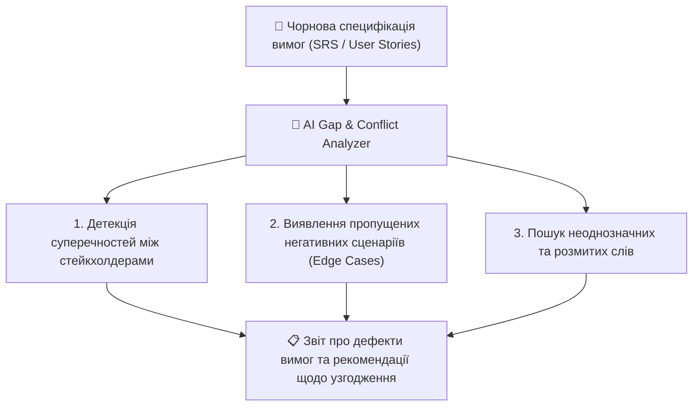

# Урок 126: Виявлення суперечностей і прогалин у вимогах

## 1. Ціна помилок та суперечностей на етапі вимог

За даними інженерних досліджень (NASA, IBM, Standish Group), вартість виправлення дефекту у вимогах зростає у геометричній прогресії:
- Виправлення на етапі аналізу: **1x** (декілька хвилин редагування тексту).
- Виправлення на етапі розробки: **10x** (переписування коду та тестів).
- Виправлення після релізу у продакшні: **100x–200x** (екстрені хотфікси, втрата репутації, компенсації клієнтам).

**Суперечливі вимоги (Conflicting Requirements)** та **прогалини (Requirements Gaps)** — головні вороги успішного проєкту.

---

## 2. Типологія дефектів специфікацій

| Тип дефекту | Опис проблеми | Приклад |
| :--- | :--- | :--- |
| **Прямий конфлікт (Direct Conflict)** | Дві вимоги суперечать одна одній за логікою | Маркетинг: «Реєстрація без пароля за 5 секунд» vs Безпека: «Обов'язкова складна 2FA авторизація». |
| **Прогалина в сценарії (Negative Gap)** | Описано лише успішний шлях (Happy Path), забуто збої | Описано оплату, але не вказано, що робити при збої зв'язку посеред транзакції. |
| **Неузгодженість даних (Data Inconsistency)** | Різні модулі очікують різні типи даних | Один сервіс передає дату у форматі `DD.MM.YYYY`, інший очікує ISO `YYYY-MM-DD`. |
| **Термінологічна плутанина (Polysemy)** | Одне слово має різне значення для різних відділів | Для продажів «Клієнт» — це той, хто зареєструвався; для бухгалтерії — той, хто вже сплатив. |

---

## 3. Використання AI як незалежного аудитора специфікацій

Сучасні мовні моделі є видатними логічними аудиторами:
- **Побудова Матриці сумісності вимог (Traceability & Consistency Matrix)**: AI зіставляє всі User Stories між собою та виявляє логічні глухі кути.
- **Генерація граничних випадків (Edge Case Extractor)**: AI автоматично ставить 10 підступних запитань типу «А що, якщо...?» для кожної описаної функції.
