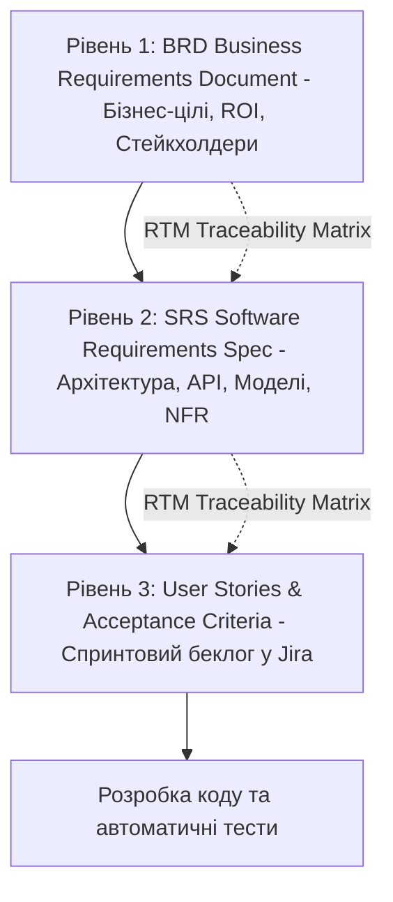
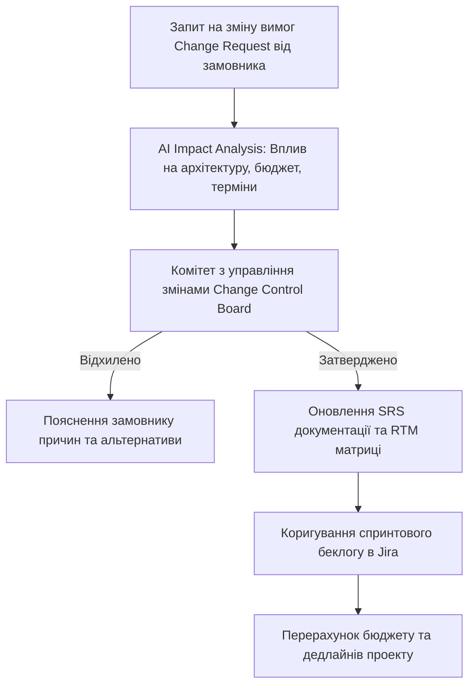

# Урок 126: Структурування бізнес-вимог у форматах BRD, SRS, User Stories

## Вступ та теоретичний фундамент
Документування та структурування вимог до програмного забезпечення вимагає застосування різних рівнів абстракції залежно від цільової аудиторії: від високорівневого бізнес-документа для інвесторів (Business Requirements Document — BRD) до суворої інженерної специфікації для архітекторів (Software Requirements Specification — SRS) та атомарних користувацьких історій (User Stories) для Agile-команди розробки.

Поширена помилка незрілих команд — змішування цих форматів, коли розробникам надають 100-сторінковий маркетинговий опис без технічних деталей або намагаються погодити з радою директорів JSON-схеми API.

Штучний інтелект стає ключовим інструментом трансляції вимог між різними форматами:
1. **Генерація Business Requirements Document (BRD за стандартом IIBA)**: Опис бізнес-цілей, аналізу ринку, фінансового обґрунтування (Business Case) та стейкхолдерів.
2. **Створення Software Requirements Specification (SRS за стандартом IEEE 830 / ISO 29148)**: Повна технічна деталізація інтерфейсів, схем даних, станів системи та контрактів.
3. **Декомпозиція епіків на User Stories за фреймворком INVEST**: Автоматична розбивка монолітних вимог на тижневі спринтові задачі.
4. **Побудова матриці трасованості (Requirements Traceability Matrix — RTM)**: Наскрізне відстеження зв'язку: Бізнес-ціль (BRD) -> Системна вимога (SRS) -> User Story -> Тест-кейс.

У цьому уроці ви опануєте інженерні стандарти складання BRD, SRS та User Stories за допомогою AI та навчитеся будувати безшовні мости комунікації між бізнесом та розробниками.

---

## 1. Архітектурні принципи та ієрархія артефактів вимог
Ієрархія документації вимог будується за трьома послідовними рівнями деталізації.




---

## 2. Методологічний базис: Порівняння форматів BRD, SRS та User Stories
Порівняльний аналіз головних документів вимог.


| Критерій порівняння | BRD (Business Requirements) | SRS (Software Requirements) | User Stories (Agile Backlog) |
| :--- | :--- | :--- | :--- |
| **Для кого призначений** | Замовники, інвестори, C-Level | Архітектори, Tech Leads, QA Leads | Програмісти, тестувальники, дизайнери |
| **Головне питання** | *Навіщо* ми це робимо і який профіт? | *Як саме* система повинна працювати? | *Що конкретно* потрібно закодити в цьому спринті? |
| **Міжнародний стандарт** | IIBA BABOK Standard | IEEE 830 / ISO/IEC/IEEE 29148 | Scrum Guide / INVEST Framework |
| **Рівень технічних деталей**| Мінімальний (бізнес-метрики, ризики) | Максимальний (схеми БД, API, NFR) | Атомарний (UI поведінка, Acceptance Criteria) |

---

## 3. Практичний інженерний регламент: Еталонний зразок SRS документа за стандартом IEEE 830
Приклад фрагмента технічної специфікації SRS, згенерованої AI для мікросервісу автентифікації.


```markdown
# Software Requirements Specification (SRS)
## Модуль: Двофакторна автентифікація (2FA Service)
**Стандарт: IEEE 830-1998 / ISO 29148**

---

### 1. Вступ (Introduction)
- **1.1. Призначення**: Цей документ визначає технічні вимоги до реалізації модуля 2FA на основі Time-based One-Time Password (TOTP, RFC 6238).
- **1.2. Межі системи**: Модуль взаємодіє з сервісом користувачів (UserService) та відправником SMS/Email (NotificationService).

---

### 2. Системні вимоги та контракти (System Requirements)
- **FR-2FA-01: Генерація секретного ключа**:
  - Система генерує Base32 секретний ключ довжиною 160 біт (20 байтів) за стандартом RFC 6238.
  - Генерується QR-код у форматі `otpauth://totp/Company:user@email?secret=...&issuer=Company`.
- **FR-2FA-02: Верифікація одноразового коду**:
  - Користувач вводить 6-значний числовий код.
  - Сервер перевіряє код з допустимим часовим вікном $\pm 1$ крок (Time step = 30 сек).
- **FR-2FA-03: Резервні коди відновлення (Backup Codes)**:
  - При активації генерується 8 одноразових 8-значних алфавітно-цифрових кодів, які зберігаються в БД у захешованому вигляді (Argon2id).

---

### 3. Нефункціональні вимоги (Non-Functional Requirements)
- **NFR-SEC-01: Захист від Brute-Force**:
  - Блокування перевірки коду на 15 хвилин після 5 послідовних невірних спроб (Rate Limit через Redis).
- **NFR-PERF-01: Час відгуку**:
  - Валідація токена не повинна перевищувати 50ms при навантаженні 2,000 RPS.
```

---

## 4. Поглиблений аналіз виробничих кейсів, крайових випадків та антипатернів
Аналіз типових проблем через неправильний вибір формату вимог.


### Кейс 1: Антипатерн "Розробка за 200-сторінковим BRD у чистому Agile"
- **Проблема**: Команді розробників передали масивний бізнес-документ без жодної декомпозиції на спринтові історії.
- **Наслідок**: Розробники потонули у читанні тексту, спринти зривалися, розуміння архітектури було різним у кожного програміста.
- **Виправлення**: Використання AI для автоматичної декомпозиції BRD -> SRS -> User Stories у форматі Jira Markdown.

---

## 5. Покроковий операційний воркфлоу підготовки документації
Регламент роботи бізнес-аналітика.


### Крок 1: Створення BRD на основі бізнес-інтерв'ю
- Оформити метрики ROI, бізнес-цілі та стратегію.

### Крок 2: Генерація технічної специфікації SRS за допомогою AI
- Розписати системні контракти, правила валідації та схеми даних.

### Крок 3: Декомпозиція на User Stories з Acceptance Criteria
- Сформувати готові до розробки тікети у форматі INVEST.

### Крок 4: Побудова матриці трасованості вимог (RTM)
- Пов'язати бізнес-вимоги з технічними завданнями.

---

## 6. Стратегії підвищення прозорості документації
1. **Single Source of Truth (SSOT)**: Збереження всієї документації у форматі Markdown у репозиторії Git (Docs-as-Code).
2. **Automated RTM Generation**: Автоматичне відстеження статусу реалізації кожної вимоги через інтеграцію Jira + GitHub.
3. **Change Control Protocol**: Обов'язкове версіонування та погодження будь-яких змін до SRS через Pull Requests.

---

## 7. Вичерпний чек-лист перевірки та критерії готовності (Definition of Done)
Перед здачею завдань та інтеграцією результатів у виробничу гілку переконайтеся у виконанні наступних критеріїв:

- [ ] **Створено чітко розмежовані артефакти: BRD (бізнес), SRS (архітектура), User Stories (спринт)**
- [ ] **SRS оформлено відповідно до стандарту IEEE 830 / ISO 29148**
- [ ] **Всі User Stories відповідають критеріям INVEST та містять чіткі критерії приймання**
- [ ] **Складено наскрізну матрицю трасованості вимог (Requirements Traceability Matrix)**
- [ ] **Описано правила безпеки, обмеження частоти запитів та обробку помилок**
- [ ] **Документація збережена у системі контролю версій (Docs-as-Code)**
- [ ] **Специфікація затверджена як бізнес-замовником, так і технічним лідом**
- [ ] **Беклог задач успішно імпортовано в систему управління проектами (Jira/Linear)**

---

## 8. Підсумки, ключові інсайти та розширений глосарій термінів
Опанування цієї теми формує надійний фундамент для щоденної професійної роботи. Системний підхід, формалізовані інженерні стандарти та критичний контроль результатів AI забезпечують високу швидкість та бездоганну надійність кінцевого продукту.

### Глосарій ключових понять
| Термін | Визначення та контекст застосування |
| :--- | :--- |
| **BRD (Business Requirements Document)** | Документ, що описує бізнес-проблему, цілі, очікувану вигоду та масштаб проекту для замовників. |
| **SRS (Software Requirements Specification)** | Повний технічний опис функціоналу, інтерфейсів, схем та характеристик якості програмного забезпечення. |
| **User Story** | Короткий опис функціональності з точки зору кінцевого користувача, що використовується в Agile-розробці. |
| **IEEE 830** | Міжнародний стандарт оформлення специфікацій вимог до програмного забезпечення. |
| **Traceability Matrix (RTM)** | Таблиця, що пов'язує вимоги між різними рівнями документації, задачами розробки та автотестами. |
| **INVEST Framework** | Критерії якості користувацьких історій (Independent, Negotiable, Valuable, Estimable, Small, Testable). |
| **Single Source of Truth (SSOT)** | Архітектурний принцип організації даних, при якому кожна вимога визначена рівно в одному місці. |
| **Acceptance Criteria (AC)** | Конкретні умови та правила, виконання яких доводить працездатність та прийнятність реалізованої задачі. |
| **TOTP (Time-based One-Time Password)** | Алгоритм генерації одноразових паролів на основі поточного часу за стандартом RFC 6238. |
| **Docs-as-Code** | Підхід до ведення технічної документації тими самими методами та інструментами, що й розробка коду. |

---

## 9. Поглиблений аналіз моделювання вимог, фінансового обґрунтування та управління змінами

### 9.1. Методологія розрахунку фінансової ефективності проекту (Business Case & ROI)
Справжній бізнес-аналітик мислить категоріями прибутку, окупності та оптимізації операційних витрат (OpEx / CapEx):
1. **Net Present Value (NPV)**: Чиста приведена вартість грошових потоків проекту з урахуванням дисконтування:
   $$\text{NPV} = \sum_{t=1}^{n} \frac{R_t}{(1 + i)^t} - \text{Initial Investment}$$
2. **Total Cost of Ownership (TCO)**: Повна вартість володіння системою на горизонті 3-5 років (розробка + хмарна інфраструктура + ліцензії + підтримка + навчання персоналу).
3. **Payback Period (Період окупності)**: Час, за який прибуток від впровадження автоматизації повністю покриває витрати на розробку.

### 9.2. Архітектура управління змінами вимог (Change Request Workflow)



### 9.3. Розширений практичний кейс: Побудова складного доменного дерева рішень (Decision Table)
- **Контекст**: Система автоматичного андеррайтингу для видачі іпотечних кредитів з 16 різними комбінаціями доходів, кредитної історії та застави.
- **Рішення з AI**: Побудова вичерпної таблиці рішень у форматі DMN (Decision Model and Notation), що виключила суперечності між правилами оцінки ризику та була безпосередньо інтегрована в рушій бізнес-правил Drools.

---

## 10. Питання для співбесіди та захист бізнес-архітектури (Lead Business Analyst Level)

1. **Як ви дієте в ситуації, коли два ключові стейкхолдери мають діаметрально протилежні вимоги до функціоналу?**
   *Еталонна відповідь*: Повернення до стратегічних цілей бізнесу з Vision & Scope документа. Проведення фасилітованого воркшопу з аналізом впливу обох варіантів на ключові KPI компанії, розрахунок RICE скорингу та економічної вартості кожної опції для прийняття рішення на основі цифр, а не авторитету.
2. **Як ефективно контролювати ризик розростання меж проекту (Scope Creep) під час активної фази розробки?**
   *Еталонна відповідь*: Впровадження формального процесу Change Request Management: будь-яка нова вимога проходить аналіз впливу на дедлайн і бюджет. Замовнику пропонується принцип 'Trade-off': якщо ми додаємо нову фічу X, ми повинні вилучити з поточного релізу функціонал Y аналогічної трудомісткості.
3. **Чим відрізняються бізнес-вимоги, вимоги користувачів та системні вимоги за стандартами BABOK?**
   *Еталонна відповідь*: Бізнес-вимоги описують високорівневі цілі організації (збільшити продажі на 25%). Вимоги користувачів (User Requirements) описують потреби конкретних людей для вирішення їхніх задач (можливість оплати в 1 клік). Системні/Функціональні вимоги описують конкретну поведінку ПЗ (ендпоінти, збереження в БД, шифрування), що реалізує потреби користувача.

---

## 11. Практичний регламент моделювання бізнес-архітектури та валідації вимог за BABOK

### 11.1. Моделювання бізнес-правил у нотації DMN (Decision Model and Notation)
Для складних доменів з багаторівневою логікою прийняття рішень (страхування, скоринг, податки) стандартом є моделювання таблиць DMN:
1. **Input Data**: Чітко визначені вхідні параметри (вік, дохід, тип застави).
2. **Decision Table Logic**: Матриця правил 'If-Then' з однозначним визначенням політики потрапляння (Unique, First, Collect).
3. **Separation of Concerns**: Відокремлення бізнес-правил від коду додатку, що дозволяє бізнес-користувачам оновлювати процентні ставки чи ліміти без залучення програмістів.

### 11.2. Матриця перевірки повноти вимог за критеріями BABOK
- **Unambiguous (Однозначність)**: Тільки одне тлумачення для будь-якого фахівця.
- **Complete (Повнота)**: Описано всі можливі вхідні дані, винятки та системні реакції.
- **Consistent (Послідовність)**: Відсутність протиріч з іншими вимогами проекту.
- **Correct (Коректність)**: Повна відповідність реальним бізнес-цілям замовника.
- **Feasible (Здійсненність)**: Можливість реалізації в межах виділеного бюджету, часу та технологій.
- **Traceable (Трасованість)**: Наявність унікального ID та зв'язку з бізнес-цілями BRD.
