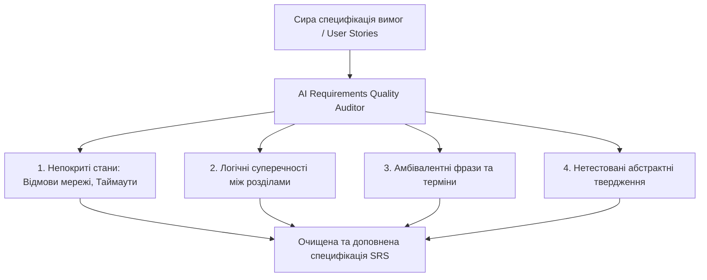
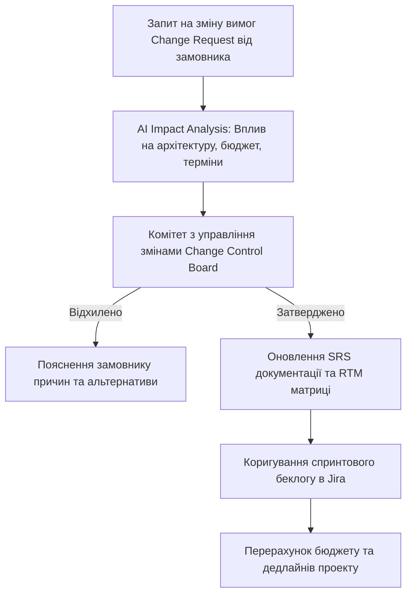

# Урок 127: Виявлення прогалин, суперечностей та неповних вимог

## Вступ та теоретичний фундамент
Аналіз якості та повноти технічних вимог (Requirements Quality Assurance & Ambiguity Auditing) — один із найефективніших методів економії бюджету в IT. За даними NASA та IBM Systems Sciences Institute, виправлення дефекту у вимогах на етапі аналізу коштує в 100 разів дешевше, ніж виправлення того самого дефекту після його релізу в продакшн.

Текстові специфікації природною мовою постійно страждають від трьох хронічних хвороб:
1. **Амбівалентність та розмитість (Ambiguity & Vague Terms)**: Використання слів 'швидко', 'зручно', 'інтуїтивно', 'в міру необхідності', які розробник і замовник трактують по-різному.
2. **Логічні суперечності (Logical Inconsistencies & Conflicts)**: Пункт 3 вимагає заборони видалення замовлень, а пункт 18 дозволяє видалення адміністратором без аудиту.
3. **Прогалини та сліпі зони (Requirements Gaps & Missing Edge Cases)**: Повна відсутність опису поведінки системи при розриві інтернет-з'єднання, відмові шлюзу оплати чи повторному кліку.

Штучний інтелект здійснює революцію в аудиті специфікацій, виконуючи роль суворого формального верифікатора логіки.

У цьому уроці ви опануєте алгоритми автоматизованого виявлення логічних дірок, прогалин та протиріч у технічних вимогах за допомогою спеціалізованих промптів.

---

## 1. Архітектурні принципи та класифікація дефектів у вимогах
Дефекти вимог класифікуються за чотирма основними категоріями:
- **Incompleteness (Неповнота)**: Відсутність опису поведінки системи для певних станів (наприклад, що робити, якщо користувач не відповів на SMS-код).
- **Inconsistency (Суперечливість)**: Наявність двох взаємовиключних тверджень у межах однієї специфікації.
- **Ambiguity (Неоднозначність)**: Можливість подвійного тлумачення фрази різними інженерами.
- **Untestability (Неможливість тестування)**: Вимоги, для яких неможливо побудувати об'єктивний бінарний тест (Pass/Fail).




---

## 2. Методологічний базис: Словник заборонених слів у бізнес-аналізі
Аналіз небезпечних фраз у специфікаціях та їх правильна інженерна заміна.


| Заборонена розмита фраза (Антипатерн) | Чому це викликає баги | Як переформулювати за інженерним стандартом |
| :--- | :--- | :--- |
| "Система повинна працювати максимально швидко" | Програміст вважає 2 сек нормою, замовник чекав 50ms | "Час відповіді API p95 < 200ms при навантаженні 1,000 RPS" |
| "Користувач може завантажити файл розумного розміру"| Завантаження 5GB відео покладе сервер | "Розмір файлу не повинен перевищувати 10MB; формати: PDF, PNG, JPG" |
| "Інтерфейс має бути інтуїтивно зрозумілим" | Суб'єктивна оцінка, яку неможливо протестувати | "90% користувачів успішно проходять реєстрацію з першої спроби без підказок" |
| "Дані повинні оновлюватися в міру необхідності"| Розробник зробить оновлення раз на добу | "Дані на екрані оновлюються через WebSocket у реальному часі (затримка < 500ms)" |

---

## 3. Практичний інженерний регламент: Промпт для глибокого стрес-аудиту вимог
Професійний системний промпт для виявлення прихованих прогалин та логічних конфліктів у специфікаціях.


```markdown
# =====================================================================
# ПРОМПТ ДЛЯ AI: Стрес-аудит специфікації, пошук логічних дірок та суперечностей
# =====================================================================

Ти — Principal Requirements Auditor та QA Architect.
Ось фрагмент специфікації модуля повернення коштів:
[ВСТАВИТИ ТЕКСТ СПЕЦИФІКАЦІЇ]

Виконай комплексний аналіз якості вимог за 4 напрямками:
1. **Ambiguity Flags**: Знайди всі розмиті слова ("швидко", "зручно", "належним чином") та запропонуй точні кількісні метрики.
2. **Missing Edge Cases (Прогалини)**: Які сценарії збоїв пропущені?
   - Що відбувається при таймауті банку?
   - Що робити при частковому поверненні?
   - Як поводитися при спробі повернення на заблоковану картку?
3. **Logical Contradictions**: Знайди взаємовиключні твердження між різними пунктами.
4. **Untestable Statements**: Виділи вимоги, які QA-інженер не зможе однозначно верифікувати тестом, та перепиши їх у форматі Gherkin (Given-When-Then).
```

---

## 4. Поглиблений аналіз виробничих кейсів, крайових випадків та антипатернів
Аналіз реальних фінансових втрат через прогалини у вимогах.


### Кейс 1: Пропущений стан скасування замовлення під час транзакції
- **Проблема**: Специфікація описувала успішну оплату та відмову банку, але не врахувала ситуацію, коли користувач натискає кнопку 'Скасувати' у момент, коли банк уже списав гроші, але ще не надіслав вебхук.
- **Наслідок**: Клієнт отримав повернення коштів, але товар все одно був відправлений зі складу (фінансові збитки $140,000 за місяць).
- **Виправлення**: Моделювання повного графа станів (State Machine) з обов'язковим врахуванням стану `PAYMENT_IN_FLIGHT`.

---

## 5. Покроковий операційний воркфлоу аудиту повноти вимог
Стандартна процедура верифікації вимог аналітиком.


### Крок 1: Побудова матриці кінцевих автоматів (State Transition Matrix)
- Перевірити всі можливі переходи між станами об'єкта.

### Крок 2: Запуск AI стрес-аудиту на амбівалентність
- Знайти всі неточні формулювання та замінити їх на числові критерії.

### Крок 3: Крос-перевірка суперечностей між модулями
- Зіставити вимоги безпеки, білінгу та інтерфейсу.

### Крок 4: Затвердження оновленої специфікації з техлідом
- Переконатися, що 100% крайових випадків мають чітку інженерну поведінку.

---

## 6. Стратегії автоматизації аудиту специфікацій
1. **Requirements Linter Integration**: Використання інструментів автоматичного аналізу прози для пошуку заборонених слів.
2. **State Machine Completeness Verification**: Математична перевірка повноти графів переходів ($N 	imes N$ матриця станів).
3. **Formal Specification Review Sessions**: Обов'язковий тристоронній огляд вимог (Three Amigos: Аналітик, Розробник, QA).

---

## 7. Вичерпний чек-лист перевірки та критерії готовності (Definition of Done)
Перед здачею завдань та інтеграцією результатів у виробничу гілку переконайтеся у виконанні наступних критеріїв:

- [ ] **Специфікація повністю очищена від заборонених розмитих слів ('швидко', 'зручно')**
- [ ] **Побудовано повну матрицю станів об'єкта (State Transition Matrix) без пропущених переходів**
- [ ] **Описано поведінку системи для всіх можливих збоїв мережі та таймаутів**
- [ ] **Ліквідовано всі внутрішні суперечності між різними розділами документа**
- [ ] **Всі вимоги сформульовані так, що для них можна створити однозначний автоматичний тест**
- [ ] **Проведено сесію огляду 'Three Amigos' за участю розробника та тестувальника**
- [ ] **Специфікація містить точні часові вікна, ліміти розмірів та формати даних**
- [ ] **Фінальний аудит якості вимог підтверджений Lead Business Analyst**

---

## 8. Підсумки, ключові інсайти та розширений глосарій термінів
Опанування цієї теми формує надійний фундамент для щоденної професійної роботи. Системний підхід, формалізовані інженерні стандарти та критичний контроль результатів AI забезпечують високу швидкість та бездоганну надійність кінцевого продукту.

### Глосарій ключових понять
| Термін | Визначення та контекст застосування |
| :--- | :--- |
| **Requirements Ambiguity** | Властивість формулювання вимоги допускати множинні суперечливі тлумачення різними читачами. |
| **State Transition Matrix** | Таблиця, що описує всі можливі стани системи та допустимі переходи між ними у відповідь на події. |
| **Three Amigos** | Agile-практика спільного обговорення та уточнення вимог трьома ключовими ролями: бізнес-аналітиком, розробником та тестувальником. |
| **Defect Prevention** | Інженерна практика виявлення та ліквідації помилок на етапі проектування вимог до написання коду. |
| **Edge Case (Крайовий випадок)** | Ситуація, що виникає на екстремальних межах робочих параметрів системи або при рідкісних збігах обставин. |
| **State Machine (Скінченний автомат)** | Математична та архітектурна модель системи, що може перебувати рівно в одному з фіксованих станів у певний момент часу. |
| **Non-Repudiation** | Властивість безпеки системи, що гарантує неможливість для користувача заперечити факт виконання ним певної дії. |
| **Webhook Timeout** | Ситуація, коли зовнішній сервер не відповідає на HTTP-сповіщення протягом встановленого ліміту часу. |
| **Payment in Flight** | Проміжний стан фінансової транзакції, коли запит відправлено у платіжний шлюз, але фінальна відповідь ще не отримана. |
| **Untestable Requirement** | Вимога, для якої неможливо сформулювати чіткий об'єктивний критерій успішного проходження перевірки. |

---

## 9. Поглиблений аналіз моделювання вимог, фінансового обґрунтування та управління змінами

### 9.1. Методологія розрахунку фінансової ефективності проекту (Business Case & ROI)
Справжній бізнес-аналітик мислить категоріями прибутку, окупності та оптимізації операційних витрат (OpEx / CapEx):
1. **Net Present Value (NPV)**: Чиста приведена вартість грошових потоків проекту з урахуванням дисконтування:
   $$\text{NPV} = \sum_{t=1}^{n} \frac{R_t}{(1 + i)^t} - \text{Initial Investment}$$
2. **Total Cost of Ownership (TCO)**: Повна вартість володіння системою на горизонті 3-5 років (розробка + хмарна інфраструктура + ліцензії + підтримка + навчання персоналу).
3. **Payback Period (Період окупності)**: Час, за який прибуток від впровадження автоматизації повністю покриває витрати на розробку.

### 9.2. Архітектура управління змінами вимог (Change Request Workflow)



### 9.3. Розширений практичний кейс: Побудова складного доменного дерева рішень (Decision Table)
- **Контекст**: Система автоматичного андеррайтингу для видачі іпотечних кредитів з 16 різними комбінаціями доходів, кредитної історії та застави.
- **Рішення з AI**: Побудова вичерпної таблиці рішень у форматі DMN (Decision Model and Notation), що виключила суперечності між правилами оцінки ризику та була безпосередньо інтегрована в рушій бізнес-правил Drools.

---

## 10. Питання для співбесіди та захист бізнес-архітектури (Lead Business Analyst Level)

1. **Як ви дієте в ситуації, коли два ключові стейкхолдери мають діаметрально протилежні вимоги до функціоналу?**
   *Еталонна відповідь*: Повернення до стратегічних цілей бізнесу з Vision & Scope документа. Проведення фасилітованого воркшопу з аналізом впливу обох варіантів на ключові KPI компанії, розрахунок RICE скорингу та економічної вартості кожної опції для прийняття рішення на основі цифр, а не авторитету.
2. **Як ефективно контролювати ризик розростання меж проекту (Scope Creep) під час активної фази розробки?**
   *Еталонна відповідь*: Впровадження формального процесу Change Request Management: будь-яка нова вимога проходить аналіз впливу на дедлайн і бюджет. Замовнику пропонується принцип 'Trade-off': якщо ми додаємо нову фічу X, ми повинні вилучити з поточного релізу функціонал Y аналогічної трудомісткості.
3. **Чим відрізняються бізнес-вимоги, вимоги користувачів та системні вимоги за стандартами BABOK?**
   *Еталонна відповідь*: Бізнес-вимоги описують високорівневі цілі організації (збільшити продажі на 25%). Вимоги користувачів (User Requirements) описують потреби конкретних людей для вирішення їхніх задач (можливість оплати в 1 клік). Системні/Функціональні вимоги описують конкретну поведінку ПЗ (ендпоінти, збереження в БД, шифрування), що реалізує потреби користувача.

---

## 11. Практичний регламент моделювання бізнес-архітектури та валідації вимог за BABOK

### 11.1. Моделювання бізнес-правил у нотації DMN (Decision Model and Notation)
Для складних доменів з багаторівневою логікою прийняття рішень (страхування, скоринг, податки) стандартом є моделювання таблиць DMN:
1. **Input Data**: Чітко визначені вхідні параметри (вік, дохід, тип застави).
2. **Decision Table Logic**: Матриця правил 'If-Then' з однозначним визначенням політики потрапляння (Unique, First, Collect).
3. **Separation of Concerns**: Відокремлення бізнес-правил від коду додатку, що дозволяє бізнес-користувачам оновлювати процентні ставки чи ліміти без залучення програмістів.

### 11.2. Матриця перевірки повноти вимог за критеріями BABOK
- **Unambiguous (Однозначність)**: Тільки одне тлумачення для будь-якого фахівця.
- **Complete (Повнота)**: Описано всі можливі вхідні дані, винятки та системні реакції.
- **Consistent (Послідовність)**: Відсутність протиріч з іншими вимогами проекту.
- **Correct (Коректність)**: Повна відповідність реальним бізнес-цілям замовника.
- **Feasible (Здійсненність)**: Можливість реалізації в межах виділеного бюджету, часу та технологій.
- **Traceable (Трасованість)**: Наявність унікального ID та зв'язку з бізнес-цілями BRD.
