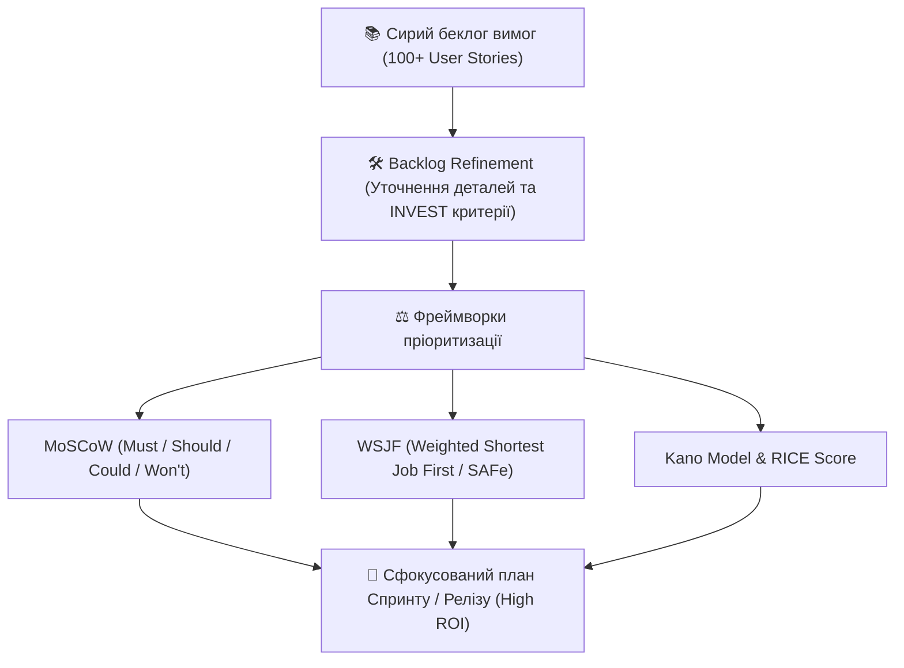

# Урок 127: Уточнення та пріоритизація вимог (Backlog Refinement & Prioritization)

## 1. Проблема обмежених ресурсів та нескінченних побажань

У будь-якому IT-проєкті кількість ідей та побажань стейкхолдерів завжди багаторазово перевищує можливості команди розробки та бюджет. Спроба реалізувати «все й одразу» призводить до зриву термінів, вигорання команди та випуску переускладненого продукту (Feature Bloat).

**Пріоритизація (Requirements Prioritization)** — це безперервний процес ранжування вимог за їхньою відносною бізнес-цінністю, ризиками, залежностями та витратами для формування оптимального скоупу кожного релізу (MVP / Incremental Releases).

---

## 2. Ключові фреймворки пріоритизації в індустрії

| Фреймворк | Головна формула / Логіка | Коли застосовувати |
| :--- | :--- | :--- |
| **WSJF (SAFe)** | $$WSJF = rac{Cost\ of\ Delay}{Job\ Size\ (Duration)}$$ | Великі корпоративні проєкти, Agile масштабування, складні залежності. |
| **MoSCoW** | Must Have, Should Have, Could Have, Won't Have | Швидке узгодження скоупу фіксованого релізу зі стейкхолдерами. |
| **RICE Score** | $$(Reach 	imes Impact 	imes Confidence) / Effort$$ | Продуктові команди, B2C та SaaS сервіси. |
| **Value vs Effort** | Матриця 2x2: Quick Wins, Major Projects, Fill-ins, Money Pits | Стратегічні воркшопи та експрес-оцінка ідей. |

---

## 3. Критерії якості User Story: INVEST Framework

Перед тим як брати історію в розробку, аналітик уточнює її за критеріями **INVEST** (Bill Wake):
- **I (Independent)**: Історія має бути максимально незалежною від інших історій.
- **N (Negotiable)**: Суть відкрита до обговорення деталей реалізації між бізнесом та інженерами.
- **V (Valuable)**: Несе чітку та зрозумілу цінність кінцевому користувачу або бізнесу.
- **E (Estimable)**: Команда розробки здатна оцінити її трудомісткість у Story Points / днях.
- **S (Small)**: Достатньо компактна, щоб бути завершеною протягом одного спринту (1–2 тижні).
- **T (Testable)**: Має чіткі критерії приймання (Acceptance Criteria), за якими її можна однозначно протестувати.
