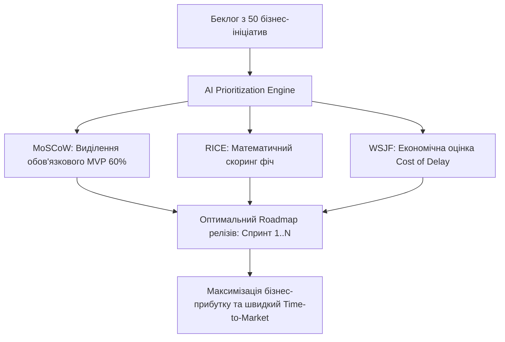
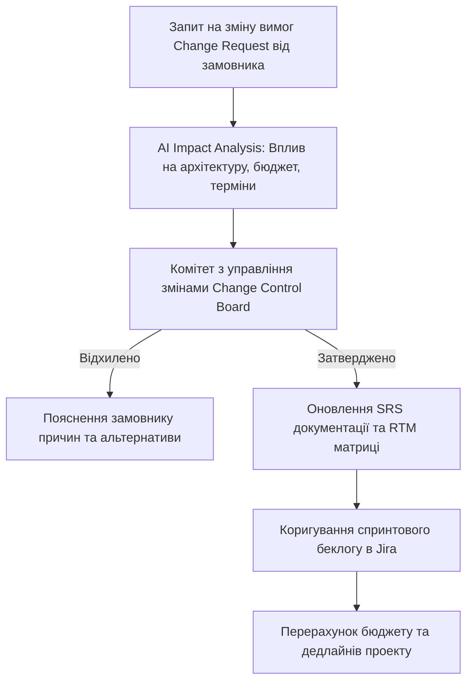

# Урок 128: Валідація та пріоритизація вимог (MoSCoW, RICE, WSJF)

## Вступ та теоретичний фундамент
У будь-якому програмному проєкті обсяг бажаних бізнес-фіч завжди перевищує доступні ресурси розробки та часові рамки релізу. Без системної, математично обґрунтованої пріоритизації вимог беклог перетворюється на хаотичний список 'хотєлок', де пріоритети визначаються суб'єктивною думкою найгучнішого менеджера (HiPPO Effect — Highest Paid Person's Opinion).

Професійний бізнес-аналітик повинен володіти трьома фундаментальними фреймворками пріоритизації:
1. **MoSCoW (Must, Should, Could, Won't)**: Класичний метод категоризації для фіксації рамок мінімально життєздатного продукту (MVP vs Scope Releases).
2. **RICE Scoring (Reach, Impact, Confidence, Effort)**: Математична оцінка для продуктових фіч на основі охоплення аудиторії та трудовитрат розробки.
3. **WSJF (Weighted Shortest Job First за методологією SAFe)**: Економічний фреймворк пріоритизації для масштабних Enterprise-систем на основі вартості затримки (Cost of Delay).

Штучний інтелект виступає об'єктивним аналітичним партнером, здатним розрахувати бали, зіставити метрики та запропонувати оптимальну послідовність релізів.

У цьому уроці ви опануєте інструменти розрахунку та автоматизації пріоритизації вимог за допомогою AI, навчитеся захищати пріоритети перед стейкхолдерами та керувати беклогом продукту.

---

## 1. Архітектурні принципи та математичні моделі фреймворків пріоритизації
Математичні формули розрахунку пріоритетів:
- **RICE Score**: $\text{RICE} = \frac{\text{Reach} \times \text{Impact} \times \text{Confidence}}{\text{Effort}}$
- **WSJF Score**: $\text{WSJF} = \frac{\text{Cost of Delay (CoD)}}{\text{Job Size (Duration)}}$, де $\text{CoD} = \text{User-Business Value} + \text{Time Criticality} + \text{Risk Reduction / Opportunity Enablement}$.




---

## 2. Методологічний базис: Порівняння фреймворків MoSCoW, RICE та WSJF
Порівняльний аналіз сфери застосування методів пріоритизації.


| Фреймворк | Вхідні параметри оцінки | Сфера найкращого застосування | Типова помилка використання |
| :--- | :--- | :--- | :--- |
| **MoSCoW** | Must (критично), Should (важливо), Could (бажано), Won't (не зараз) | Фіксація меж релізу MVP, жорсткі дедлайни | Позначення 90% вимог як 'Must have' |
| **RICE** | Кількість користувачів, сила впливу, впевненість, людино-місяці | Продуктові B2C/B2B стартапи, вибір фіч роадмапу | Завищення показника Confidence без реальних даних |
| **WSJF (SAFe)** | Вартість затримки (CoD) / Розмір та тривалість задачі | Масштабні Enterprise проекти з багатьма командами | Ігнорування Time Criticality сезонних факторів |
| **Kano Model** | Базові очікування, лінійні фічі, фактори захоплення | Дослідження задоволеності користувачів | Використання для оцінки внутрішніх інфраструктурних задач |

---

## 3. Практичний інженерний регламент: Промпт для розрахунку RICE та WSJF матриці
Професійний системний промпт для автоматичного розрахунку та ранжування беклогу з 10 задач.


```markdown
# =====================================================================
# ПРОМПТ ДЛЯ AI: Розрахунок RICE Scoring та WSJF пріоритизації беклогу
# =====================================================================

Ти — Principal Product Manager та Agile Coach.
Ось список із 6 фіч для розробки у необанку:
1. Автоматична розбивка чека в ресторані між друзями.
2. Інтеграція оплати Apple Pay / Google Pay.
3. Експорт виписки у формат PDF/CSV для податкової.
4. Кешбек 5% на категорію 'Кафе та ресторани'.
5. Темна тема інтерфейсу.
6. Біометричний вхід через FaceID.

Виконай комплексний аналіз:
1. **RICE Scoring Table**:
   - Reach (Охоплення на місяць: кількість людей).
   - Impact (Вплив: 3=масивний, 2=високий, 1=середній, 0.5=низький).
   - Confidence (Впевненість: 100%, 80%, 50%).
   - Effort (Трудовитрати: людино-місяці розробки 1..5).
   - Розрахуй RICE Score та відсортуй від лідера до аутсайдера.
2. **MoSCoW Categorization**: Розподіли фічі за категоріями (Must, Should, Could, Won't) для запуску MVP через 1 місяць.
3. **Обґрунтування для стейкхолдерів**: 3 аргументи, чому темна тема повинна бути відкладена на пізніші релізи.
```

---

## 4. Поглиблений аналіз виробничих кейсів, крайових випадків та антипатернів
Аналіз реальних випадків зриву термінів через неправильну пріоритизацію.


### Кейс 1: Антипатерн "Ефект HiPPO" (Highest Paid Person's Opinion)
- **Проблема**: Генеральний директор наполіг на розробці складної 3D-анімації монет у додатку (Effort = 4 місяці), відклавши інтеграцію Apple Pay.
- **Наслідок**: Конкуренти випустили Apple Pay раніше, відтік користувачів склав 30%.
- **Виправлення**: Захист роадмапу на основі математичного RICE скорингу.

---

## 5. Покроковий операційний воркфлоу пріоритизації вимог
Стандартна операційна процедура бізнес-аналітика.


### Крок 1: Збір оцінок трудовитрат (Effort Estimation)
- Отримати оцінки у Story Points від інженерної команди на Planning Poker.

### Крок 2: Оцінка бізнес-впливу та охоплення (Reach & Impact)
- Залучити продуктового маркетолога та аналітика даних.

### Крок 3: Розрахунок RICE та WSJF за допомогою AI
- Сформувати відсортовану матрицю беклогу.

### Крок 4: Затвердження меж релізу (MoSCoW Release Planning)
- Зафіксувати 60% задач як Must Have, 20% як Should Have, 20% як Could Have.

---

## 6. Стратегії оптимізації управління беклогом
1. **Cost of Delay Transparency**: Демонстрація фінансових втрат за кожен тиждень затримки релізу фічі.
2. **Backlog Refinement Cadence**: Регулярний перегляд пріоритетів кожні 2 тижні.
3. **Confidence Degradation Rule**: Зниження балу Confidence до 50% для будь-якої фічі, яка не підтверджена даними інтерв'ю чи аналітики.

---

## 7. Вичерпний чек-лист перевірки та критерії готовності (Definition of Done)
Перед здачею завдань та інтеграцією результатів у виробничу гілку переконайтеся у виконанні наступних критеріїв:

- [ ] **Кожна вимога в беклозі оцінена за математичним фреймворком (RICE або WSJF)**
- [ ] **Оцінки трудовитрат (Effort) надані інженерною командою розробки**
- [ ] **Категорія Must Have у MoSCoW не перевищує 60% загального обсягу робіт релізу**
- [ ] **Усунуто вплив суб'єктивних думок (HiPPO Effect) завдяки числовим метрикам**
- [ ] **Враховано сезонність та часову критичність (Time Criticality & Cost of Delay)**
- [ ] **Сформовано наочний Roadmap релізів на найближчі 3-6 місяців**
- [ ] **Пріоритети презентовані та узгоджені з усіма ключовими стейкхолдерами**
- [ ] **Беклог задач у Jira/Linear відсортовано відповідно до розрахованих балів**

---

## 8. Підсумки, ключові інсайти та розширений глосарій термінів
Опанування цієї теми формує надійний фундамент для щоденної професійної роботи. Системний підхід, формалізовані інженерні стандарти та критичний контроль результатів AI забезпечують високу швидкість та бездоганну надійність кінцевого продукту.

### Глосарій ключових понять
| Термін | Визначення та контекст застосування |
| :--- | :--- |
| **Requirements Prioritization** | Процес систематичного ранжування вимог та функцій за їхньою важливістю, цінністю та терміновістю. |
| **MoSCoW Method** | Техніка категоризації вимог на Must have (обов'язково), Should have (бажано), Could have (можливо), Won't have (не зараз). |
| **RICE Scoring** | Математична модель пріоритизації, що враховує Reach (охоплення), Impact (вплив), Confidence (впевненість) та Effort (зусилля). |
| **WSJF (Weighted Shortest Job First)** | Економічний алгоритм SAFe, що віддає пріоритет найкоротшим задачам з найвищою вартістю затримки. |
| **Cost of Delay (CoD)** | Фінансові або стратегічні втрати компанії внаслідок відкладення релізу певної функції на пізніший термін. |
| **HiPPO Effect** | Ситуація прийняття рішень на основі суб'єктивної думки найбільш високооплачуваного керівника замість аналізу даних. |
| **Planning Poker** | Гейміфікована техніка колективної оцінки складності та трудовитрат завдань в Agile за числами Фібоначчі. |
| **Kano Model** | Теорія розробки продуктів, що класифікує функції за їхнім впливом на рівень задоволеності та захоплення клієнтів. |
| **Time-to-Market (TTM)** | Час від початкової ідеї або формулювання вимоги до її фактичного релізу та доступності кінцевим користувачам. |
| **Story Points** | Відносна одиниця вимірювання зусиль, необхідних для повної реалізації користувацької історії в Agile. |

---

## 9. Поглиблений аналіз моделювання вимог, фінансового обґрунтування та управління змінами

### 9.1. Методологія розрахунку фінансової ефективності проекту (Business Case & ROI)
Справжній бізнес-аналітик мислить категоріями прибутку, окупності та оптимізації операційних витрат (OpEx / CapEx):
1. **Net Present Value (NPV)**: Чиста приведена вартість грошових потоків проекту з урахуванням дисконтування:
   $$\text{NPV} = \sum_{t=1}^{n} \frac{R_t}{(1 + i)^t} - \text{Initial Investment}$$
2. **Total Cost of Ownership (TCO)**: Повна вартість володіння системою на горизонті 3-5 років (розробка + хмарна інфраструктура + ліцензії + підтримка + навчання персоналу).
3. **Payback Period (Період окупності)**: Час, за який прибуток від впровадження автоматизації повністю покриває витрати на розробку.

### 9.2. Архітектура управління змінами вимог (Change Request Workflow)



### 9.3. Розширений практичний кейс: Побудова складного доменного дерева рішень (Decision Table)
- **Контекст**: Система автоматичного андеррайтингу для видачі іпотечних кредитів з 16 різними комбінаціями доходів, кредитної історії та застави.
- **Рішення з AI**: Побудова вичерпної таблиці рішень у форматі DMN (Decision Model and Notation), що виключила суперечності між правилами оцінки ризику та була безпосередньо інтегрована в рушій бізнес-правил Drools.

---

## 10. Питання для співбесіди та захист бізнес-архітектури (Lead Business Analyst Level)

1. **Як ви дієте в ситуації, коли два ключові стейкхолдери мають діаметрально протилежні вимоги до функціоналу?**
   *Еталонна відповідь*: Повернення до стратегічних цілей бізнесу з Vision & Scope документа. Проведення фасилітованого воркшопу з аналізом впливу обох варіантів на ключові KPI компанії, розрахунок RICE скорингу та економічної вартості кожної опції для прийняття рішення на основі цифр, а не авторитету.
2. **Як ефективно контролювати ризик розростання меж проекту (Scope Creep) під час активної фази розробки?**
   *Еталонна відповідь*: Впровадження формального процесу Change Request Management: будь-яка нова вимога проходить аналіз впливу на дедлайн і бюджет. Замовнику пропонується принцип 'Trade-off': якщо ми додаємо нову фічу X, ми повинні вилучити з поточного релізу функціонал Y аналогічної трудомісткості.
3. **Чим відрізняються бізнес-вимоги, вимоги користувачів та системні вимоги за стандартами BABOK?**
   *Еталонна відповідь*: Бізнес-вимоги описують високорівневі цілі організації (збільшити продажі на 25%). Вимоги користувачів (User Requirements) описують потреби конкретних людей для вирішення їхніх задач (можливість оплати в 1 клік). Системні/Функціональні вимоги описують конкретну поведінку ПЗ (ендпоінти, збереження в БД, шифрування), що реалізує потреби користувача.

---

## 11. Практичний регламент моделювання бізнес-архітектури та валідації вимог за BABOK

### 11.1. Моделювання бізнес-правил у нотації DMN (Decision Model and Notation)
Для складних доменів з багаторівневою логікою прийняття рішень (страхування, скоринг, податки) стандартом є моделювання таблиць DMN:
1. **Input Data**: Чітко визначені вхідні параметри (вік, дохід, тип застави).
2. **Decision Table Logic**: Матриця правил 'If-Then' з однозначним визначенням політики потрапляння (Unique, First, Collect).
3. **Separation of Concerns**: Відокремлення бізнес-правил від коду додатку, що дозволяє бізнес-користувачам оновлювати процентні ставки чи ліміти без залучення програмістів.

### 11.2. Матриця перевірки повноти вимог за критеріями BABOK
- **Unambiguous (Однозначність)**: Тільки одне тлумачення для будь-якого фахівця.
- **Complete (Повнота)**: Описано всі можливі вхідні дані, винятки та системні реакції.
- **Consistent (Послідовність)**: Відсутність протиріч з іншими вимогами проекту.
- **Correct (Коректність)**: Повна відповідність реальним бізнес-цілям замовника.
- **Feasible (Здійсненність)**: Можливість реалізації в межах виділеного бюджету, часу та технологій.
- **Traceable (Трасованість)**: Наявність унікального ID та зв'язку з бізнес-цілями BRD.
