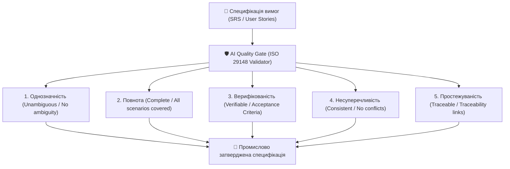

# Урок 128: Перевірка повноти та однозначності вимог за допомогою AI (ISO/IEC/IEEE 29148)

## 1. Міжнародний стандарт якості вимог ISO/IEC/IEEE 29148

Міжнародний стандарт **ISO/IEC/IEEE 29148 (Systems and software engineering — Life cycle processes — Requirements engineering)** визначає золотий набір критеріїв якості окремої вимоги та специфікації в цілому:

---

## 2. Ключові критерії якості за ISO 29148

| Критерій | Що означає | Приклад дефекту та виправлення |
| :--- | :--- | :--- |
| **Однозначність (Unambiguity)** | Вимога допускає лише одне єдине тлумачення всіма читачами | ❌ «Швидкий пошук» -> ✅ «Час повернення результатів пошуку не більше 300ms для бази з 1 млн товарів». |
| **Повнота (Completeness)** | Містить усі необхідні дані, обмеження та обробку винятків | ❌ «Користувач може змінити пошту» -> ✅ «Описано надсилання підтвердження на стару та нову пошту, термін дії посилання 15 хв». |
| **Верифікованість (Verifiability)** | Існує реальний вимірюваний спосіб перевірити виконання | ❌ «Зручний інтерфейс» -> ✅ «Показник успішності первинного проходження сценарію (Task Success Rate) >= 90%». |
| **Атомарність (Atomicity)** | Вимога містить одне неподільне твердження | ❌ «Система зберігає дані та відправляє звіт і оновлює статус» -> Розбити на 3 окремі атомарні вимоги. |

---

## 3. Побудова автоматизованого AI-пайплайну валідації вимог

Генеративні мовні моделі здатні виступати автоматичним **Quality Gate** для технічних завдань:
1. **Детектор слів невизначеності (Ambiguity Linter)**: Пошук заборонених евфемізмів (*приблизно, тощо, зручно, швидко, за можливості, оптимально*).
2. **Формалізація критеріїв приймання**: Автоматична трансформація тексту в синтаксис **Gherkin (Given-When-Then)**.
3. **Генерація матриці відповідності ISO 29148**: Комплексний звіт з оцінкою якості ТЗ у балах від 0 до 100%.
