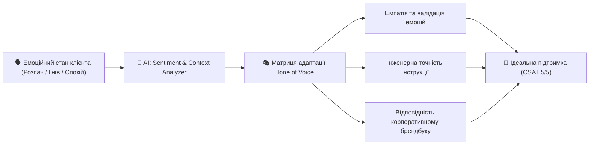

# Урок 118: Tone of voice у клієнтській підтримці нового покоління

## 1. Концепція Tone of Voice (ToV) у підтримці клієнтів

**Tone of Voice (Тональність голосу бренду)** — це єдиний, узгоджений стиль вербальної та письмової комунікації компанії з клієнтами, який транслює цінності бренду, створює відчуття безпеки, турботи та професіоналізму.

У клієнтській підтримці ToV не є статичним. Професійний саппорт-спеціаліст застосовує **динамічну адаптацію тональності (Adaptive Tone Spectrum)**:
- У спокійних консультаціях: дружній, відкритий, підтримуючий (Warm & Friendly).
- Під час технічних аварій (Outages / Data Loss): суворий, гранично точний, оперативний, без недоречних жартів та емодзі (Calm & Professional).
- З VIP або B2B клієнтами: діловий, респектабельний, лаконічний (Business Formal).

---

## 2. Ключові виміри Tone of Voice за класифікацією Nielsen Norman Group

1. **Смішний vs Серйозний (Funny vs Serious)**: чи доречний гумор у спілкуванні.
2. **Формальний vs Неформальний (Formal vs Casual)**: звернення на «Ви», сленг чи ділова лексика.
3. **Шанобливий vs Зухвалий (Respectful vs Irreverent)**: ступінь класичної поваги до клієнта.
4. **Захоплений vs Стриманий (Enthusiastic vs Matter-of-fact)**: рівень енергійності та емоційного піднесення.

---

## 3. Використання AI для контролю та адаптації Tone of Voice

Генеративні мовні моделі є ідеальним інструментом для вирівнювання комунікації команди підтримки:
- **Tone Transformer Prompts**: «Перепиши цю відповідь з роздратованого стилю у доброзичливий, але строгий корпоративний ToV за стандартами нашого банку».
- **Детекція пасивної агресії та токсичності**: AI сканує чернетки відповідей операторів перед відправкою, блокуючи фрази на кшталт «Як я вже вам писав раніше...» або «Вам варто було уважно читати договір».
